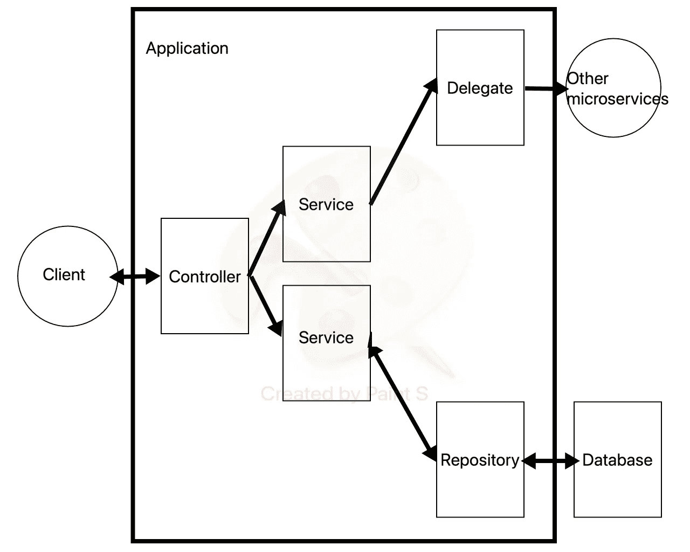

# 一个新手对软件工程架构的体验

> 原文：<https://medium.com/codex/a-newbies-experience-with-software-engineering-architecture-a5920b1dc105?source=collection_archive---------9----------------------->

[天一马](https://unsplash.com/@tma?utm_source=medium&utm_medium=referral)在 [Unsplash](https://unsplash.com?utm_source=medium&utm_medium=referral) 上拍照

# **简介**

大家好，我叫 Alex，我是澳大利亚科技行业的新手，过去十年一直从事酿造和蒸馏工作。

2021 年底，我完成了软件工程训练营，开始了我在科技领域的旅程。2022 年初，我开始读研究生工程师。我写这个博客的目的是作为一种日志，在这里我可以描绘出我的旅程和我正在学习的东西。

在本文中，我将讨论后端 Spring Boot REST(**Re**presentative**S**tate**T**transfer)应用程序的标准结构。

# **应用架构:组织你的代码。**

建筑是规划、设计和建造结构的过程和产物。

应用程序架构就是应用于程序、应用程序或软件系统创建的相同定义。随着应用程序的规模和复杂性的增长，需要考虑更多的因素:哪个代码，做什么，去哪里。

我在新兵训练营期间的项目从 1 层发展到 2 层，最终发展到 3 层，我有一个前端存储库、后端存储库和一个独立的数据库。

> 步入专业软件工程的世界，我学到的最重要的一课是从 3 层系统到 n 层系统和“微服务”的演变。

考虑应用程序架构时要记住的关键思想是*关注点分离。将一个计算机程序分成不同的部分，每个部分负责一个逻辑部分。这允许代码库保持整洁，这有助于允许应用程序缩放以及协助协作；允许许多工程师轻松地处理代码。*

说了这么多，让我们开始吧。

## **控制器类别**

第一类是控制器。这只是将传入的 HTTP 请求连接到应用程序中包含的业务逻辑。

控制者的行为方式类似于办公楼的看门人。一个人(代表一个 HTTP 请求)可以到达大楼并与门房交谈，门房会指引这个人到正确的楼层进行会面。

对于 JS 爱好者来说，在 Node.js/express.js 应用程序的上下文中，控制器被称为路由器。

重要的是要记住，控制器不对 HTTP 请求应用任何业务逻辑，它可能会在将数据传递给服务类之前将 JSON 解析为 Java 对象。

## **服务等级**

服务类负责业务逻辑，即应用程序所需的任何自定义逻辑。例如，一个电子商务应用程序可能具有与创建用户、生成订单和将完成的订单转发给发货相关的业务逻辑。

## **委托类**

根据建议，delegate 类与将任务委托给其他微服务有关。在我们的电子商务应用程序示例中，我们可以有许多服务，如/用户、/订单、/评论和/运输。

包含在/orders 服务中的委托类中的方法可以调用 forwardOrdersToShipping()，它将与/shipping 交互。该方法将与我们的运输服务交互，以确定产品应该从哪个仓库离开。

## **模特班**

模型类是我们的应用程序使用的数据结构的容器。在我们的电子商务应用程序中，我们可以有一个具有以下属性的用户模型:

该模型将包含模型所需的 getters 和 setters 的所有样板代码或注释，例如 getfirstName()或 setEmail()。

## 知识库或 ORM 类

repository 类充当应用程序和数据库之间的翻译器。存储库映射来自模型类的数据，并将其格式化为存储在数据库中所需的结构。存储库还可以具有对象关系映射代码，以允许在数据库中构建和运行查询。

## 数据库ˌ资料库

数据库负责我们数据的持久存储。目前，我们的应用程序拥有的所有数据都存储在内存中，这是短暂的。如果我们的应用程序崩溃或关闭，数据就会丢失。数据库以关系或非关系的方式存储我们的数据，并将响应来自 repository 类的查询，从数据库中提取数据。关系数据库以表格或列表的方式存储数据。这种服务的例子有 MySQL 或 PostgreSQL。MongoDB 是非关系数据库的一个例子，其中数据存储在文档中。

# 结论

这是使用 Spring Boot 框架的分层应用程序的基本结构。将应用程序划分为控制器、服务、模型、代理、存储库和数据库类，使得应用程序能够随着使用的扩展而保持有序(或者不！)并增强代码的可读性。

现实生活中的应用程序可能会更复杂，这取决于业务考虑。