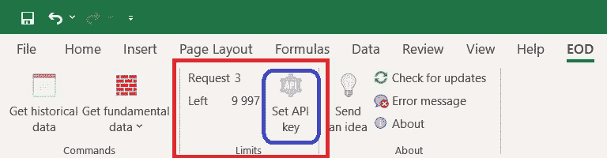
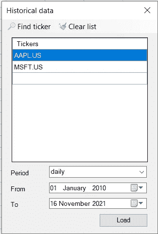
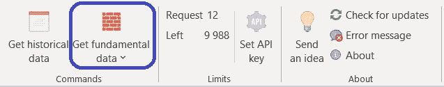

# 一个无代码的解决方案，让市场数据直接到您的 Excel 文件

> 原文：<https://medium.com/codex/a-no-code-solution-to-get-market-data-directly-to-your-excel-file-c545c3f0479e?source=collection_archive---------4----------------------->

## 在没有代码的时候，不要再让自己编程累了


本·怀特在 [Unsplash](https://unsplash.com?utm_source=medium&utm_medium=referral) 上的照片

```
**TABLE OF CONTENTS:****1.** [**Introduction**](#abb6)
**2\.** [**Getting market data directly to your Excel file:**](#ef27) **i)** [**Installing the Excel Add-In**](#1693) **ii)** [**API key registration**](#5fa7) **iii)** [**Extracting Historical or End-of-day stock data**](#ffef) **iv)** [**Extracting Fundamentals data**](#2e1f) **3\.** [**Closing Notes**](#e141)
```

当我开始学习 API 以及如何使用它来提取市场数据时，我可以说学习过程有点夸张，因为我很难掌握 API 相关的概念，更不用说，从头开始编写整个东西会增加更多痛苦。这不仅适用于 API，也适用于任何与编程相关的东西。

但正如大家所说，时代在变。目前，你没有必要为了创造你自己的东西而学习所有关于编程的东西，但只要基础知识就可以了，剩下的可以在所谓的“无代码工具”的帮助下完成。对我来说，这是一个革命性的想法，使其用户无需任何编码就能创建他们想要的项目。在无代码工具的帮助下，人们可以节省大量学习编码的时间。

我个人是这些无代码工具的超级粉丝，当我听到使用这些工具提取市场数据的想法时，我欣喜若狂。在本文中，我将介绍如何使用 EOD 历史数据的 Excel 加载项，只需点击几下鼠标即可提取历史数据和基础数据。事不宜迟，让我们进入文章吧！

> **注**:本文基于 [EOD 历史数据](https://eodhistoricaldata.com/?utm_source=medium&utm_medium=post&utm_campaign=a_no-code_solution_to_get_market_data_directly_to_your_excel_file)提供的 Excel 插件特性。因此，为了顺利地跟进即将到来的内容，请确保您拥有自己的帐户，因为它使您能够访问您的私有 API 密钥。您可以在 处使用 [**链接创建账户。此外，本文中介绍的特性可能不是免费的，但需要订阅。点击**](https://eodhistoricaldata.com/register?utm_source=medium&utm_medium=post&utm_campaign=a_no-code_solution_to_get_market_data_directly_to_your_excel_file) 查看所有套餐的价格，并选择最适合您的套餐。

# 将市场数据直接导入 Excel 文件

这个过程的第一步也是最重要的一步是安装 EOD 历史数据的 Excel 插件，用于历史市场数据和基本面数据。你所要做的就是点击[这里的](https://eodhistoricaldata.com/download/Setup/EODAddIn.exe?utm_source=medium&utm_medium=post&utm_campaign=a_no-code_solution_to_get_market_data_directly_to_your_excel_file)链接，安装就会自动开始。

成功安装插件后，您现在可以在 Excel 的左上角看到自定义的`EOD`功能区选项卡。现在，这个过程的下一步是注册您的 API 密钥，以便外接程序正常工作。要注册，前往`Limits`组并选择`Set API key`选项。



作者图片

选择该选项后，会弹出一个新窗口，要求您输入 API 密钥。输入您的 API 密钥后，您可以点击`Save`按钮进行注册。我们现在开始提取一些数据！

## 提取历史或当日收盘股票数据

要提取股票的历史数据，我们必须首先导航到`Commands`组下的`Get historical data`选项。选择它后，会弹出一个新的独立窗口，如下所示:



作者图片

观察上面显示的新窗口后，可以说它只是一个输入提取历史数据所需输入的界面。

第一个输入是`Tickers`，在这里我们应该输入我们想要提取数据的股票的符号。它可以是一只股票，也可以是多只股票，但要记住的重要一点是，报价机必须与交易所一起提及。如果这有点令人困惑，你可以选择`find ticker`选项来搜索股票。

第二个输入是`Period`，我们必须指定数据点之间的时间间隔。每日时间间隔是默认时间段，但也有其他选项可供选择，如每周和每月时间间隔。最后两个输入是`from`和`to`，我们必须分别输入历史数据的开始日期和结束日期。

填写完所有必要的输入后，我们只需点击`Load`按钮，瞧！您将获得您提到的股票的历史数据，以及一张漂亮的蜡烛图，帮助我们从数据中获取更多信息。当多个股票被指定为输入时，将自动创建不同的 Excel 表格，每个表格都有相应的股票数据。以下是最终结果的示例:


作者图片

## 提取基本面数据

访问基础数据的过程比访问历史数据相对简单。你所要做的只是前往`Commands`组上的`Get fundamental data`函数，在选择它之后，简单地指定你感兴趣的股票的符号来获取数据。



作者图片

几秒钟之内，输出将打印在您当前正在处理的 Excel 表格中，我决定不在图像中表示它，因为它非常大。

有些人更喜欢特定的项目或部分，而不是基本面数据带来的一切。这可以通过使用下拉菜单(如上图所示)轻松实现，下拉菜单允许我们选择我们特别感兴趣的项目。下拉列表包括每一个重要的方面，如一般信息，亮点，资产负债表，损益表，最后是收益。

# 结束语

在本文中，我们了解了如何使用 EOD 历史数据的 Excel 插件在几秒钟内无缝地提取股票的历史和基本面数据，几乎不需要任何代码。

Excel 插件还附带了一些预定义的函数，允许我们提取指定股票的收盘数据以及给定的起止日期。我们没有在这篇文章中讨论这些函数，但是看一下这些函数是值得的，因为它可以帮助我们节省很多时间。

请记住，这篇文章只是对无代码工具如何在许多行业进行变革并成为游戏规则改变者的小小一瞥。也可以看出这些工具是多么的高效，让我们可以可行地完成任何类型的任务，不管它有多复杂。更不用说，无代码时代才刚刚开始，所以现在不是我们审视它对高级用户是否有用的时候，而是选择加入并适应它的时候。

希望你今天学到了新的有用的东西。另外，如果您想了解有关 Excel 加载项的更多信息，可以参考其原始文档:[https://eodhistoricaldata . com/financial-APIs/Excel-VBA-API-downloader/](https://eodhistoricaldata.com/financial-apis/excel-vba-api-downloader?utm_source=medium&utm_medium=post&utm_campaign=a_no-code_solution_to_get_market_data_directly_to_your_excel_file)