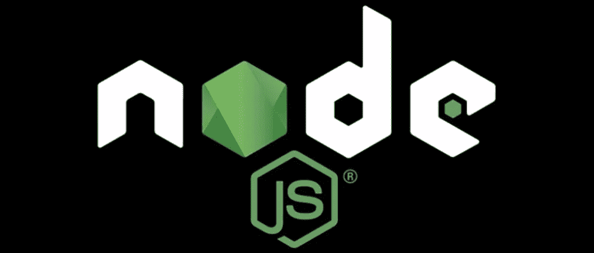
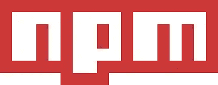
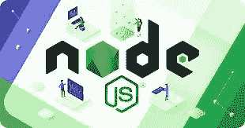

# 向 Node.js 致敬

> 原文：<https://medium.com/codex/a-nod-to-node-js-a0e39ee2bd3b?source=collection_archive---------17----------------------->

## *一瞥 Node.js 能做什么*

我想对 Node 做一个基本的概述，并向刚开始接触编程的人介绍一下它的功能。

就我个人而言，我最初是用 Ruby on Rails 运行后端和数据库，但现在我看到了它比 Rails 灵活得多。当然，您可能需要安装一些模块并编写一些代码，但是您不必坚持 Rails 特定的做事方式。最终，Node 的功能更加丰富。

# 那是什么呢？

*   一个 Javascript 运行时环境，包括执行用 Javascript 编写的程序所需的一切。
*   开源
*   跨平台
*   从最初的 Javascript 开发人员扩展到能够在独立机器上运行，而不仅仅是在浏览器上运行
*   在 V8 Javascript 运行时引擎上运行
*   使用事件驱动的非阻塞 I/O 模型，使其轻量级且高效

# NPM

Node.js 成功的另一个原因是 NPM，即节点包管理器。它是世界上最大的开源库生态系统！它包括一个托管 Javascript 包的在线存储库和一个发布和下载包的 CLI 工具。这些 Javascript 包是 CommonJS 格式的，并且包含 JSON 格式的元数据。

在这个时间点上，有超过 130 万个包可用！然而，其中一些可能是低质量的，甚至是恶意的。但是，他们依靠一个用户报告系统来删除那些不符合标准的，以及统计数据来帮助用户判断哪些是值得下载的。

# 我为什么要使用 Node？

关于为什么有人想使用 Node.js，有一个广泛的优势列表

*   高性能
*   减少应用程序加载时间
*   可量测性
*   缩短应用程序响应时间
*   多才多艺
*   社区支持
*   异步编程

此外，Node.js 还有一个独特的优势，为浏览器编写代码的前端开发人员现在可以在编写客户端代码的同时编写服务器端代码，而不必学习一门全新的语言。

# 结论

值得注意的是 Node.js 将允许你在任何浏览器上写 Javascript，包括 MacOS，Windows 和 Linux。从前端到后端的任何地方，包括中间件。

这就是为什么它是许多最流行的开发栈的一部分，如 MERN、MEVN 和 MEAN 栈。强烈推荐给开发者，从初学者到专家。沿着节点路开始可能需要一点研究，但它绝对是一个值得的目的地。

如果你喜欢这个内容，一定要看看我的其他博客，或者随时在我的 LinkedIn 上与我联系！

 [## Jamon Dixon -全栈开发者-熨斗学校| LinkedIn

### 全栈式 web 开发人员，对事物的工作原理充满好奇，并具有解决问题的能力。拥有强大的…

www.linkedin.com](https://www.linkedin.com/in/jamondixon/)