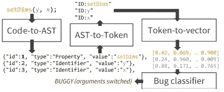
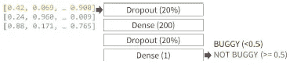
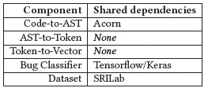
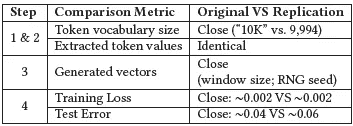

# 复制“深度 Bug:基于名称的 Bug 检测的学习方法”

> 原文：<https://medium.com/codex/a-partial-replication-of-deepbugs-a-learning-approach-to-name-based-bug-detection-1e35421a69e?source=collection_archive---------11----------------------->

艾莉娜·格鲁布尼亚克在 [Unsplash](https://unsplash.com?utm_source=medium&utm_medium=referral) 上的照片

这是发表在 ESEC/FSE 2021 [0]的 artifact track 上的研究论文“*‘深度 Bug:基于名称的 Bug 检测的学习方法’*”的摘要。这篇论文源于我在普渡大学的课程 *ECE 595:高级软件工程*中的一个课程项目。

# 原始文件

2018 年，Pradel & Sen 发表了一篇名为 *DeepBugs* 的论文，描述了一种软件缺陷检测工具[1]。

Pradel & Sen 的目标是当软件工程师以错误的顺序使用变量时出现的软件缺陷。例如，如果有一个函数*calcCylinderVolume(int radius，int height)* 被意外调用为*calcCylinderVolume(some height，some radius)*那么计算出来的体积就会不正确。

类型检查不能解决这个问题，因为参数具有相同的类型。然而，如果您能够对嵌入在变量名中的语义进行推理，您*就能够*发现这样的缺陷——例如，名为“someHeight”的变量可能存储高度信息，而名为“someRadius”的变量存储半径信息。

Pradel & Sen 假设*工程师通常为具有相似目的的变量使用相似的变量名*。(参见“最佳实践”建议[2]和“自然性假设”[3，4])。基于这一假设，对于这些交换参数的 bug，他们提出了以下检测算法:

DeepBugs 将源代码转换成抽象语法树(ASTs)，然后通过 Word2Vec 转换成语义编码向量。神经网络确定含义是否与使用上下文相匹配。这里有个开发者用 **setDims(y，x)** 为 **setDims(width，height)** 写了一个函数调用。Deep-Bugs 了解到 **x** 和 **width** 语义相似，y 和 height 也是如此，因此它预测参数被交换。

*   使用程序的 AST 识别函数调用。
*   提取用于每个函数调用的变量的名称。
*   通过训练 Word2Vec 模型[5]对“*相似变量名*的概念进行数值建模，与被调用的函数的名称上下文化(例如，“someHeight”和“someRadius”在调用函数“calcCylinderVolume”的上下文中的含义)。Word2Vec 模型学习通常作为第一个参数、第二个参数等等传递的变量名。
*   使用这个 Word2Vec 模型来识别某些变量名“不寻常”的用法，如由训练的 Word2Vec 模型计算的向量所定义的。

在计算出 Word2Vec 向量后，DeepBugs 算法使用一个小型神经网络作为基于名称的 bug 的分类器。

这些不寻常的用法可以解释为(1)糟糕的变量名的例子，或者(2)缺陷。当存在多个参数时，使用异常，并且如果参数被交换，使用将变得*正常*，那么我们可能会看到一个交换参数缺陷。

我估计大多数软件工程师自己都犯过这个错误。我当然有！

# 分身术

Pradel & Sen 的结果令人信服。然而，科学方法的一部分是*对外复制*的发现。我的团队已经开始这样做了。特别是，我们想看看我们是否可以使用相同的数据，但一个独立的实现，并获得相同的结果。

## 共享依赖项

我们确实在实现中共享了一些依赖:

相同的数据集，一些共享组件，没有共享代码。

Pradel & Sen 已经完成了决定使用何种神经网络架构的所有艰难工作。因此，我们的实现任务并不太复杂——让管道匹配才是最难的部分。

## 笔误

我们误读了他们的论文，使用了 200 个令牌的 Word2Vec 窗口大小，而不是 20 个令牌。哎呀。

## 但是，稳定的结果！

即使有这种数量级的错别字，他们的方法也是稳定的。

在来自 150k JavaScript 数据集的交换参数案例中，我们的 DeepBugs 复制成功地获得了与原作者的工作相似的性能。

## 部分复制

我们将我们的工作描述为*部分*复制，因为 Pradel & Sen 评估了他们在几种类型缺陷上的方法——我们只看了交换参数的那种。但是，我们仍然使用*复制*这个词，因为我们独立地获得了相同的主要结果。

## 反射

Pradel & Sen 在记录他们的工作方面做得非常好，足够仔细，以至于第三方——我的团队——可以复制它。他们漏掉的一件事是他们的 RNG 种子。有可能是更改的种子导致了轻微的性能差异，但是我怀疑我们的 Word2Vec 窗口大小错误才是真正的原因。

总的来说，我认为这是一个很好的研究生课程项目。该团队接触了软件工程工具中的一些最先进的技术，应用了他们在其他课程中学到的 ML 知识，完成了一次成功的科学复制，并发布了一个经过同行评审的工件。

# 更多信息

1.  此处神器可用[，包括源代码和](https://doi.org/10.5281/zenodo.5110820)[论文](https://github.com/PurdueDualityLab/deepbugs-jr/blob/develop/paper/Deepbugs_Replication_Paper_Abstract.pdf)。

# 参考

[0] ACM 定义:[https://www . ACM . org/publications/policies/artifact-review-and-badging-current](https://www.acm.org/publications/policies/artifact-review-and-badging-current)

[1] Pradel & Sen，2018 年。 [*Deepbugs:一种基于名字的 bug 检测学习方法*](https://dl.acm.org/doi/abs/10.1145/3276517) 。

[2]马丁，2009 年。 [*干净的代码:敏捷软件工艺手册*](https://www.oreilly.com/library/view/clean-code-a/9780136083238/) 。

[3]欣德尔等人，2016 年。 [*关于软件的自然性*](https://dl.acm.org/doi/pdf/10.1145/2902362) 。

[4]阿拉马尼斯等人，2018 年。 [*针对大代码和自然度的机器学习综述*](https://dl.acm.org/doi/pdf/10.1145/3212695) 。

[5] Mikolov 等人，2013 年。**向量空间中单词表征的高效估计。**