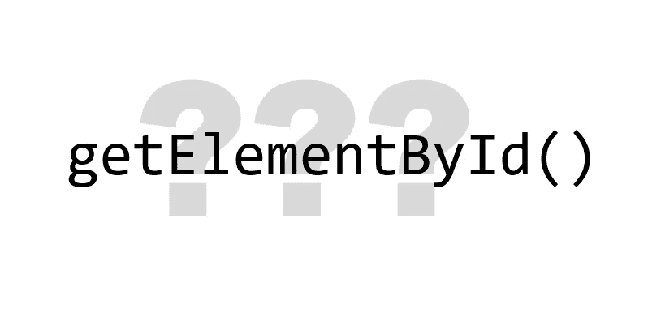

# 忘记 getElementById()，使用有意义的 Id

> 原文：<https://medium.com/codex/a-popular-dispensable-method-b04598b2e608?source=collection_archive---------3----------------------->

## getElementById()最大的作用是污染代码

似乎是必不可少的。它出现在体面的教程中，许多聪明人似乎都在使用它。但是为什么人们更喜欢它而不是它的替代品呢？

在这篇文章中，我通过比较它和它的两个替代品来寻找`getElementById()`的优势。我…