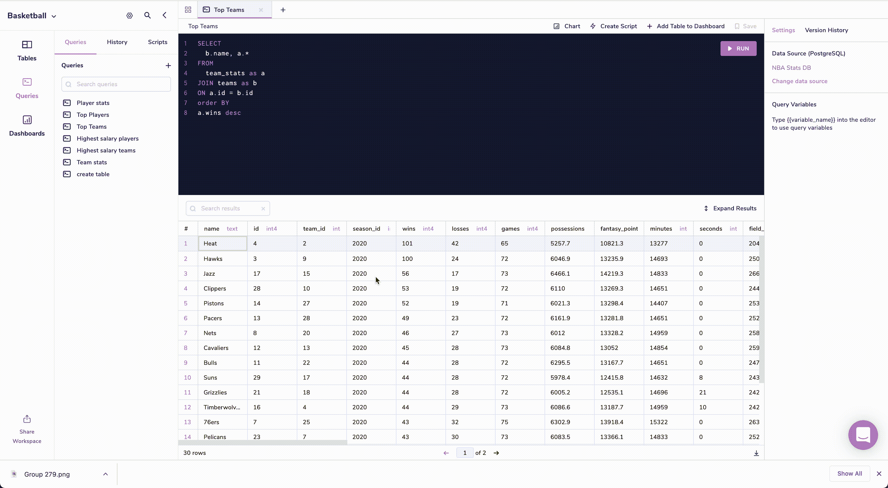
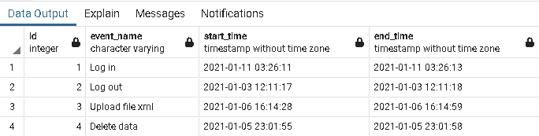
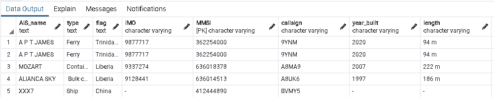
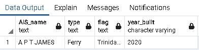

# Postgres 工具箱的强大补充:表继承

> 原文：<https://medium.com/codex/a-powerful-addition-to-your-postgres-toolbelt-table-inheritance-352a26afed1?source=collection_archive---------13----------------------->


通过使用表继承，节省数据检索和数据库管理的时间，这是一个鲜为人知但非常有用的特性。

在本文中，我将介绍 Postgres 中继承是如何工作的，并提供一些何时使用继承的例子。

按照本文中的示例，[尝试 Arctype 的免费 SQL 编辑器](https://blog.arctype.com/p/7a5ac2e5-a4ce-4f1d-8839-cdf1e258e369/www.arctype.com)来快速连接到 Postgres 数据库:



[今天试试 Arctype】](https://blog.arctype.com/inheritance-in-postgres/www.arctype.com)

## Postgres 中的表继承是什么？

继承是面向对象编程的主要原则之一。这是一个从另一个对象派生一个对象的过程，以便它们具有共享的属性。

PostgreSQL 中的继承允许您基于另一个表创建子表，并且子表将包括父表中的所有列。

让我们以一个用来存储不同类型房屋蓝图的数据库为例。

我们知道每个家庭都会有一些东西，比如:卧室、浴室和厨房。我们可以创建一个父表来存储这些共享属性。

现在，假设我们想要添加一个带天井的房子的蓝图。这个新蓝图和我们现有的一模一样，但有一个新房间。我们可以创建一个新的“子”表，让*继承*父表，而不是重新创建整个蓝图。

我们现在有了一个主父蓝图的副本，带有一个新的“天井”项目，而没有创建一个重复的蓝图。

## 为什么要用继承？

两个主要好处是:

1.  更高性能的查询
2.  更简单的数据库管理

**更多性能查询**

继承将数据分割成较小的表，这些表继承了父表的一些字段。这实际上是对数据进行了分区，提高了检索数据的速度。

假设您正在获取两个日期的数据。有一个名为`year_sales`的父表和包含每个月数据的继承表。

检索`2020-10-1`和`2020-10-15`之间所有销售额的命令将只扫描十月份的表。

继承的表也创建了更易于管理的索引。每个单独的表包含更少的数据，无论有没有索引都可以加快搜索速度。

**更简单的数据库管理**

未来的模式更改更容易，因为您只需对父表进行一次更改，然后将更改传播到每个继承的表。这节省了时间，减少了意外分歧的机会。

在不阻塞其他数据的情况下，也可以运行维护命令，如完全清空或对继承的表进行重新索引。

## 示例 1:使用继承按月存储表统计信息

表继承最流行的用例之一是按月存储信息。这有利于对数据进行分区，以加快查询速度。

我已经使用该解决方案为以下情况设计了架构:

**1。流程执行审计**

继承表可用于跟踪持续加载/卸载到系统中的数据、用户请求和计算过程，以及用于监控系统健康的其他重要信息。

**2。应用程序中关键模块的用户操作审计**

您可以创建一个审计系统来跟踪谁更改了系统中的数据，以及他们是在什么时候更改的。如果系统有很多用户，那么就有很多数据。因此，为了加速数据访问，使用表继承更有效。

让我们来看一个例子。

首先，创建模式“示例 1”:

```
CREATE SCHEMA example1
    AUTHORIZATION postgres;
```

然后创建一个父日志记录表:

```
CREATE TABLE example1.logging
(
    id integer NOT NULL GENERATED ALWAYS AS IDENTITY ( INCREMENT 1 START 1 MINVALUE 1 MAXVALUE 2147483647 CACHE 1 ),
    event_name character varying NOT NULL,
    start_time timestamp(6) without time zone NOT NULL,
    end_time timestamp(6) without time zone NOT NULL,
    CONSTRAINT february_log_pkey PRIMARY KEY (id, start_time, end_time)
)
TABLESPACE pg_default;
```

为特定的月份和年份创建子日志记录表，该表继承父表中的字段:

```
CREATE TABLE example1.january_log_2021
(
    CONSTRAINT start_time CHECK (start_time BETWEEN '2021-01-01' and '2021-01-31')
)
    INHERITS (example1.logging)
TABLESPACE pg_default;
```

该代码包含一个使用`CHECK`命令对“start_time”列的检查约束。这将日期和时间保持在一月以内。

填写 2021 年 1 月的测井表:

```
INSERT INTO example1.january_log_2021(id,
    event_name, start_time, end_time)
    VALUES 
           (1, 'Log in', '2021-01-11 03:26:11', '2021-01-11 03:26:13'),
           (2, 'Log out', '2021-01-03 12:11:17', '2021-01-03 12:11:18'),
           (3, 'Upload file xml', '2021-01-06 16:14:28', '2021-01-06 16:14:59'),
           (4, 'Delete data', '2021-01-05 23:01:55', '2021-01-05 23:01:58');
```

我们可以使用`SELECT`命令检查数据是否成功插入:

```
SELECT * FROM example1.january_log_2021;
```



每个子表中的数据也会自动添加到父表中。

## 示例 2:使用继承来跟踪船只的移动

我使用继承的另一个例子是基于地理位置存储关于船只及其运动的信息。

每艘船都有共同和独特的价值。由于这个特性，我决定使用继承来设计模式，并基于父表为每艘船创建一个单独的表。

使用继承模型给我们带来了以下好处:

1.  当应用程序构建船只运动的地图时，它只需引用单个船只的表，从而提高了报告构建和监控的速度。
2.  为某些船舶类型添加新的特定字段不需要更改所有表格。
3.  我们可以使用一个请求检索所有船只的基线数据。

我们是这样做的。

首先创建一个名为“test”的新模式:

```
CREATE SCHEMA test
    AUTHORIZATION postgres;
```

创建船舶数据库:

```
CREATE TABLE test.ship
(
    AIS_name text NOT NULL,
    type text NOT NULL,
    flag text NOT NULL,
    IMO character varying NOT NULL,
    MMSI character varying NOT NULL,
    callsign character varying NOT NULL,
    year_built character varying NOT NULL,
    length character varying NOT NULL,
    width character varying NOT NULL,
    draught character varying NOT NULL,
    speed character varying NOT NULL,
    AIS_class character varying NOT NULL,
    cargo character varying,
    CONSTRAINT ship_pkey PRIMARY KEY (MMSI)
)

TABLESPACE pg_default;
```

创建表“sail_ship”，它是表“ship”的子表:

```
CREATE TABLE test.sail_ship
(
    -- Inherited from table test.ship: AIS_name text NOT NULL,
    -- Inherited from table test.ship: type text NOT NULL,
    -- Inherited from table test.ship: flag text NOT NULL,
    -- Inherited from table test.ship: IMO character varying NOT NULL,
    -- Inherited from table test.ship: MMSI character varying NOT NULL,
    -- Inherited from table test.ship: callsign character varying NOT NULL,
    -- Inherited from table test.ship: year_built character varying NOT NULL,
    -- Inherited from table test.ship: length character varying NOT NULL,
    -- Inherited from table test.ship: width character varying NOT NULL,
    -- Inherited from table test.ship: draught character varying NOT NULL,
    -- Inherited from table test.ship: speed character varying NOT NULL,
    -- Inherited from table test.ship: AIS_class character varying NOT NULL,
    -- Inherited from table test.ship: cargo character varying,
    id_sail integer NOT NULL,
    course text NOT NULL,
    navigation_status text NOT NULL,
    CONSTRAINT sail_ship_pkey PRIMARY KEY (id_sail)
)
    INHERITS (test.ship)
TABLESPACE pg_default;
```

现在填写表格“帆船”:

```
INSERT INTO test.sail_ship(AIS_name, type, flag, IMO, MMSI, callsign, year_built, length, width, draught, speed, AIS_class, cargo, id_sail, course, navigation_status)
    VALUES ('A P T JAMES', 'Ferry', 'Trinidad and Tobado', '9877717', '362254000', '9YNM', '2020', '94 m', '26 m', '2.9 m/', '13.1 kn/20.2 kn', '-', '-', 1, '-', '-'),
           ('MOZART', 'Container ship', 'Liberia', '9337274', '636018378', 'A8MA9', '2007', '222 m', '30 m', '10.4 m /', '12.9 kn / 23.6 kn', '-', 'Containers', 2, '-', '-'),
           ('ALIANCA SKY', ' Bulk carrier', 'Liberia', '9128441', '636014513', 'A8UK6', '1997', '186 m', '30 m', '8.8 m /', '10.2 kn / 17.2 kn', '-', 'Agricultural Commodities', 3, '-', '-'),
           ('XXX7', 'Ship', 'China', '-', '412444890', 'BVMY5', '-', '-', '-', '-/', '60.5 kn / 66.1 kn', '-', '-', 4, '-', '-');
```

表“sail_ship”继承了其父表“ship”的所有列。

让我们也向父表添加一些数据，看看会发生什么:

```
INSERT INTO test.ship(AIS_name, type, flag, IMO, MMSI, callsign, year_built, length, width, draught, speed, AIS_class, cargo)
    VALUES ('A P T JAMES', 'Ferry', 'Trinidad and Tobado', '9877717', '362254000', '9YNM', '2020', '94 m', '26 m', '2.9 m/', '13.1 kn/20.2 kn', '-', '-');
```



正如您在图中看到的，字段已经被添加，但是主键是重复的，所以它不再是唯一的

这是 Postgres 中关于继承的警告之一。添加到子表时没有发现错误，即使它违反了唯一主键。

通过使用`ONLY`操作符从“ship”表中检索数据，我们可以从子表中删除这些重复项。

这里，`ONLY`关键字表示查询应该只应用于“ship”表，而不是继承层次结构中 ship 下面的表。

```
SELECT AIS_name, type, flag, year_built FROM ONLY test.ship;
```



## PostgreSQL 继承需要注意的注意事项

1.  不能将带有`ALTER TABLE`命令的`RENAME`应用到子表；
2.  主键和外键的唯一性不会被继承。继承机制不能在继承层次结构中跨表自动分发来自插入或复制命令的数据。INSERT 只在指定的表中插入，不在其他表中插入；
3.  用户必须对父表和子表都有访问权限；
4.  必须手动删除列。如果使用`DROP COLUMN`命令对父表进行级联删除的情况下，它不能影响子表。

## 结论

在本文中，我们讨论了:

*   Postgres 中的继承是如何工作的
*   为什么应该在应用程序中使用继承
*   两个在实际应用中如何使用继承的例子

如果您正在寻找一个能让数据库工作更加简单的 SQL 编辑器，[现在就免费试用 Arctype】:](https://blog.arctype.com/p/7a5ac2e5-a4ce-4f1d-8839-cdf1e258e369/www.arctype.com)


[今天试试 Arctype】](https://blog.arctype.com/inheritance-in-postgres/www.arctype.com)