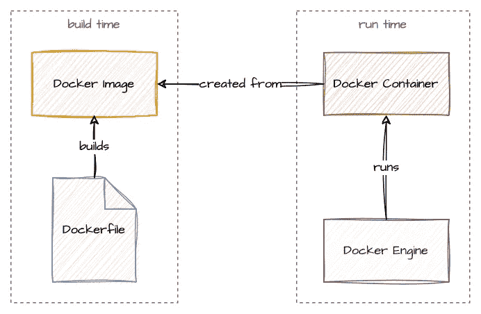

# 用 Docker 封装 C++应用程序的实用指南

> 原文：<https://medium.com/codex/a-practical-guide-to-containerize-your-c-application-with-docker-50abb197f6d4?source=collection_archive---------0----------------------->


照片由 [Lionello DelPiccolo](https://unsplash.com/es/@liodp?utm_source=unsplash&utm_medium=referral&utm_content=creditCopyText) 在 [Unsplash](https://unsplash.com/photos/Dv65oNf9UI4?utm_source=unsplash&utm_medium=referral&utm_content=creditCopyText) 上拍摄

如果您有希望作为 Docker 容器部署的 C++代码，本指南将帮助您编写第一个 Docker 文件，并构建和运行您的 C++应用程序。

这篇博客文章主要针对 C++开发人员，他们没有太多的 Docker 经验，但是想开始通过容器部署他们的应用程序。如果您已经知道一些概念，请随意跳到下一节。

# 今天的例子:simplehttpserver

在这个练习中，我重复使用了一个来自精彩的 [Boost 的例子。野兽](https://www.boost.org/doc/libs/1_81_0/libs/beast/doc/html/index.html)库。这个例子是一个异步 HTTP 服务器，它从本地目录提供静态文件。服务器由一个单独的`main.cpp`文件和我写的相应的`CMakeLists.txt`文件组成。

Beast library 的[网站](https://www.boost.org/doc/libs/1_81_0/libs/beast/doc/html/beast/examples.html#beast.examples.servers)上有几个例子，我用过相当简单的 [http_server_async.cpp](https://www.boost.org/doc/libs/1_81_0/libs/beast/example/http/server/async/http_server_async.cpp) 。也许将来我会转而使用 C++20 的协程——它们确实能提高性能。asio(Beast 库基于它)可以说更容易编写和阅读。

该代码使用 Boost 的异步 IO 处理来服务每个 HTTP 请求。simplehttpserver 提供命令行参数来配置主机、端口、文档根和使用的线程数量。

```
Allowed command line options:
  --help                      produce help message
  --host arg (=0.0.0.0)       host address to bind to
  --port arg (=8080)          port to expose to
  --doc_root arg (=/var/www/) root directory to serve
  --threads arg (=1)          number of threads to use
```

# 最快的码头工人游戏攻略

如果你还不知道 Docker，让我快速地向你介绍最重要的概念。最需要记住的是:Docker 不是虚拟机。Docker 是一种封装应用程序并隔离运行这些应用程序的进程的机制。

> 虚拟机是关于隔离硬件的，Docker 是关于隔离进程的。

Docker 世界有两个中心实体:*图片*和*容器*。从所谓的*Docker 文件*中创建 *Docker 映像*。该文件描述了构建映像的命令。从这个图像中可以创建一个 *Docker 容器*:它们是图像的实际运行实例。 *Docker 引擎*负责实例化和运行容器。



Docker 构建和运行时

对于这篇博文中的例子，还有一些不重要的概念。不过，我想提一下它们，以防你想进一步调查。

*   Docker 卷是一种在容器间共享 Docker 管理的文件的机制。您可以通过所谓的*绑定挂载*将这些卷映射到一个容器中。
*   *Docker 网络*允许您指定虚拟 Docker 网络。进出容器的网络流量通过 Docker 代理进行路由。这允许不同容器之间不同的网络设置。
*   Docker Compose 是一个从单个`docker-compose.yml`文件构建和运行几个不同容器的特性。您可以指定 docker 容器的确切图像、容器名称、网络、卷等等。例如，如果您想运行 MySQL 容器和自定义 REST API 服务容器以及 REDIS 容器进行缓存，那么您可以使用 Docker compose 进行设置。

# 安装 Docker 引擎

在开始之前，您需要安装 [Docker](https://www.docker.com/) 。Docker 网站推荐使用 Docker desktop，但并不要求运行我们的示例。说到 Docker 容器的构建、运行和其他一切，我更喜欢命令行而不是 GUI 应用程序。

然而，在 MacOS 上，我发现只为引擎安装 Docker Desktop 更容易。如果你仍然想只安装引擎而不安装桌面应用程序，请遵循这些针对带有 WSL 的 [MacOS](https://unix.stackexchange.com/questions/667940/how-to-install-docker-engine-in-macos-without-docker-desktop) 或 [Windows 的优秀教程。](https://www.paulsblog.dev/how-to-install-docker-without-docker-desktop-on-windows/)

以下命令将 Docker 引擎安装在以`apt`作为包管理器的 Linux 发行版上:

```
sudo apt-get install docker-ce docker-ce-cli containerd.io docker-compose-plugin
```

在[官方文档](https://docs.docker.com/engine/install/)中找到更多关于安装 Docker 引擎的信息，包括添加正确的库和故障排除。

# 编写 Dockerfile 文件

最初的项目结构是一个简单的 C++项目，只有一个源代码目录和一个 CMake 文件。该目录包含前面提到的`main.cpp`文件。CMake 文件通过链接所需的 *Beast* 和 *Threads* 库来构建项目。

```
src/
CMakeLists.txt
```

要开始容器化，请在项目目录中创建一个新的 docker 文件:

```
touch Dockerfile
```

这个 Docker 文件将包含构建 Docker 映像所需的所有命令。Dockerfile 文件中最重要的命令如下:

*   `FROM`从现有的 Docker 映像创建新的阶段
*   `RUN`在镜像中执行一个 Linux 命令
*   `COPY`将本地文件系统中的文件或文件夹复制到映像中
*   当图像实例化为容器时，执行`CMD`或`ENTRYPOINT`

同样，记住映像(构建时)和容器(运行时)之间的区别也很重要。命令`FROM`、`RUN`和`COPY`在构建时执行。命令`CMD`或`ENTRYPOINT`在运行时执行。

我们为我们的图像使用了[多阶段构建](https://docs.docker.com/build/building/multi-stage/)。如果在容器中构建应用程序，多阶段构建是最佳实践。我们计划有一个*构建*阶段，在此阶段，我们安装构建工具和依赖项，将所需的源文件复制到映像中，并运行 CMake 配置和构建来构建应用程序二进制文件。在构建最终映像的第二阶段，我们将安装运行时依赖项并创建一个运行时用户。在此之后，我们只需将构建好的二进制文件复制到最终映像中，并定义启动 simplehttpserver 的入口点。


Docker 多阶段构建

# 构建阶段

`FROM`命令指定要构建的图像。在这种情况下，我们使用的是小*阿尔卑斯山*的图像。最佳实践是指定映像的确切版本(在本例中为 3.17.0)。下面的关键字`AS`指定了阶段的名称，在我们的例子中是 *build* 。

```
FROM alpine:3.17.0 AS build
```

下一个命令安装构建 simplehttpserver 应用程序所需的依赖项。最好也指定版本号。这确保了可重复的构建。

```
RUN apk update && \
    apk add --no-cache \
        build-base=0.5-r3 \
        cmake=3.24.3-r0 \
        boost1.80-dev=1.80.0-r3
```

我们使用`WORKDIR`命令切换到一个用于构建应用程序的目录(如果还不存在的话会创建这个目录，所以您不需要事先运行`mkdir`)。然后，我们将源文件夹和 CMake 文件复制到这个目录中。我更喜欢明确说明要复制的文件夹或单个文件，以确保不会意外复制其他内容。

```
WORKDIR /simplehttpserver

COPY src/ ./src/
COPY CMakeLists.txt .
```

在复制步骤之后，我们再次使用`WORKDIR`命令创建并切换到*构建*目录。这里只是执行 CMake 和构建应用程序的简单问题。请注意，parallel 参数是可选的，最好作为`ARG`传递给 docker file——但这超出了本文的范围。比如 GitHub runners，据我所知有两个可用线程。在我的本地机器上，我使用了所有八个可用的线程。

```
WORKDIR /simplehttpserver/build

RUN cmake -DCMAKE_BUILD_TYPE=Release .. && \
    cmake --build . --parallel 8
```

# 最终图像

对于最后的图像，我们再次用另一个`FROM`声明来声明这个阶段。我们也使用同样的 *alpine* 图像作为基础，就像我们在构建阶段所做的一样。

```
FROM alpine:3.17.0
```

我们正在安装运行时库——在我们的例子中是 Boost 的程序选项，我们用它来扫描命令行参数。此外还有 libstdc++库，它不是所使用的 alpine base 映像的一部分。我们不需要使用的 Beast 库，因为它只是头文件，并且已经在我们构建的二进制文件中。

```
RUN apk update && \
    apk add --no-cache \
    libstdc++=12.2.1_git20220924-r4 \
    boost1.80-program_options=1.80.0-r3
```

作为下一步和最佳实践，我们将创建一个名为 *shs* 的用户来运行我们的 simplehttpserver 应用程序。否则，应用程序将作为 root 用户运行(在容器内部)。

```
RUN addgroup -S shs && adduser -S shs -G shs
USER shs
```

之后，我们将构建的 simplehttpserver 二进制文件从构建阶段复制到我们的最终映像。`--chown`选项指定所有权，而`--from`选项指定从哪里复制的阶段的名称。

```
COPY --chown=shs:shs --from=build \
    ./simplehttpserver/build/src/simplehttpserver \
    ./app/
```

最后一个命令是从这个映像实例化容器时在运行时执行的起点。这也允许传递任何命令行参数。

```
ENTRYPOINT [ "./app/simplehttpserver" ]
```

你可以在我的 [GitHub repo](https://github.com/mostsignificant/simplehttpserver/blob/main/Dockerfile) 中找到完整的 Dockerfile 文件。

# 建立码头工人形象

Docker 映像可以通过在项目目录中执行以下命令来构建。选项`-t`用于根据模式`<repository>/<name>:<tag>`指定存储库、名称和可选的图像标签。如果在冒号后面没有声明标签，Docker 将使用标签 *latest* 。以下命令构建图像*most significant/simple http server:latest*，稍后可以使用它来指定实例化容器。

```
docker build . -t mostsignificant/simplehttpserver
```

在构建过程中，您可以看到正在构建的不同阶段和层。docker 文件中的每个命令都会添加一个新层。因此，重要的是要有一个多阶段的构建，其中只包含已构建的二进制文件和运行时依赖项。构建完成后，运行以下命令列出所有本地映像及其信息。

```
docker image ls
```

```
REPOSITORY                        TAG     IMAGE ID      CREATED      SIZE
mostsignificant/simplehttpserver  latest  afb9c03f8849  2 hours ago  14.4MB
```

14.4 MB 对于这个图像来说是一个合理的大小——如果您使用 *debian:bullseye-slim* 作为这个图像的基础，那么最终的大小将会是 104 MB。缩小图像的尺寸可能是一项艰巨的任务，但有一些工具可以支持这项任务，例如 [dive](https://github.com/wagoodman/dive) 可以帮助检查图像的不同层。请注意，在构建过程中添加到早期图层中的文件可以在后期图层中删除，但原始数据仍保留在生成的图像中。因此，您可以:

*   使用多阶段构建，仅将早期阶段所需的文件复制到最终映像中
*   或者使用远程存储库进行安装，而不是将安装包复制到映像中
*   或者下载，解压，安装和删除软件包在一个单一的`RUN`命令

# 将 Docker 映像作为容器运行

以下命令运行映像并实例化一个容器:

```
docker run \
  --mount type=bind,source="$(pwd)",target=/var/www \
  -p 8080:8080 \
  -d \
  mostsignificant/simplehttpserver:latest
```

我们使用以下命令行参数:

*   `--mount`将本地路径挂载到容器中的路径:我们将当前路径映射到`/var/www`目录，从而使 simplehttpserver 应用程序能够通过 HTTP 服务于当前目录中的所有文件
*   `-p`将容器内部的一个端口映射到主机:simplehttpserver 的默认端口 *8080* 映射到同一个主机端口，但是您可以使用任何其他可用的端口
*   `-d`以分离模式启动容器

还可以检查正在运行的码头集装箱:

```
docker ps
```

```
CONTAINER ID   IMAGE                                   
635e4dafcdb6   mostsignificant/simplehttpserver:latest
COMMAND                  CREATED         STATUS 
"./app/simplehttpser…"   3 seconds ago   Up 2 seconds
PORTS                    NAMES
0.0.0.0:8080->8080/tcp   serene_torvalds
```

如果没有另外指定的话，容器名是随机生成的——在我们的例子中是 *serene_torvalds* (我认为让 Linus 保持平静的心情总是好的)。您可以使用容器 id(哈希)或名称来访问它，例如:

*   `docker stop 635e4dafcdb6`停止容器(及其进程)
*   `docker rm 635e4dafcdb6`移除停止的容器(但不是图像！)
*   `docker inspect 635e4dafcdb6`获取关于容器的更多信息

# 发布 Docker 图像

为了发布你的 docker 图片，你需要先在 [Docker Hub](https://hub.docker.com/) 创建一个账户。请注意，您的帐户名需要是您之前使用的存储库名(或者您只是重命名图像)。在我的例子中，我的账户名是*最重要的*，因此我相应地给图片命名为:*最重要的/:*。

创建帐户后，您必须通过以下命令登录 Docker Hub 并提供凭据:

```
docker login
```

登录后，可以将图像推送到 Docker Hub。

```
docker push mostsignificant/simplehttpserver:latest
```

仅此而已。现在任何人都可以下载并运行你的 Docker 镜像。


码头枢纽

# 后续步骤

现在，您得到了应用程序运行时的第一个 Docker 映像。一如既往，有一些 TLC 步骤来改善你的形象和周围的一切。以下是一些建议:

*   **构建管道**:您可以将 Docker 构建和推送步骤集成到您的构建管道中。如果你正在使用 GitHub Actions，有一个很好的文档[告诉你如何去做:或者到 GitHub 自己的库 GitHub Packages 或者 Docker Hub。](https://docs.github.com/en/actions/publishing-packages/publishing-docker-images)
*   **测试**:您也可以在构建阶段包含一个测试步骤(例如通过 *CTest* )。只要以这样一种方式包含测试，即使测试失败，Docker 映像构建也不会失败——这样您就可以将您的测试结果文件[从映像](https://stackoverflow.com/a/51186557)中复制出来，并将其传递到您的构建管道。则如果先前的测试失败，构建管道可以阻止图像的发布。
*   **林挺**:您可以使用类似 [hadolint](https://hadolint.github.io/hadolint/) 的 Docker linter 来检查您的 Docker 文件中常见的最佳实践违规。
*   **文档**:使用[标签](https://docs.docker.com/engine/reference/builder/#label)来改进 Docker 文件的文档，并在 Docker Hub 上添加一个关于你的图片的自述文件。
*   **。dockerignore** :增加一个[。dockerignore 文件](https://docs.docker.com/engine/reference/builder/#dockerignore-file)到您的项目目录，以防止 docker 构建将不需要的文件或文件夹复制到您的映像中(并且一般要小心使用`COPY`命令)

# 结论

我希望这篇小教程能帮助任何不熟悉 Docker 的 C++开发人员开始容器化他们的应用程序。完整的例子可以在我的 [GitHub repo](https://github.com/mostsignificant/simplehttpserver) 和我的 [Docker Hub repo](https://hub.docker.com/repository/docker/mostsignificant/simplehttpserver) 上找到。关于 Docker 世界还有很多东西需要学习，官方的[文档](https://docs.docker.com/)和[参考文献](https://docs.docker.com/reference/)是一个很好的开始。

继续编码，继续创造！新年快乐