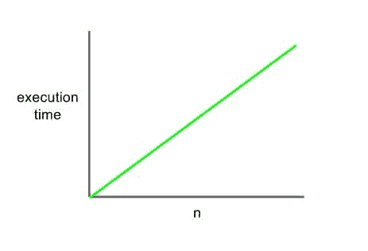

# 大 O 符号和时间复杂性的实用介绍

> 原文：<https://medium.com/codex/a-pragmatic-introduction-to-big-o-notation-and-time-complexity-8f2ea8a4248c?source=collection_archive---------24----------------------->


众所周知，软件无处不在，从你阅读本文的任何设备，到你头顶 35000 英尺高的飞机，甚至是帮助无数人生存的起搏器和呼吸机。从医学到工程学到天文学，计算机科学几乎影响了所有其他领域。事实上，我们几乎每天都在与软件进行交互，这加强了编写优秀高效代码的需要。

大 O 符号是计算机科学中的一个主要概念，是迄今为止测量时间复杂性最常用的方法，即算法完全执行所需的时间与其输入大小的比值。大 O 不一定测量算法运行的实际时间，因为这通常取决于许多变量，包括它在什么计算机上运行，以及有多少其他标签打开，等等。大 O 衡量执行一个算法所需的时间如何随着输入的增长而增长。

# 线性复杂度:O(n)



O(n)表示的线性复杂度本质上就是它听起来的样子。输入的大小和执行时间成线性关系。这意味着随着输入的增长，执行时间也相应地直线增长，如上所示。你们可能还记得高中代数中的线性关系，用函数 y = mx + b 表示，线性复杂度本质上是一样的。形象化线性时间的一个简单类比是给植物浇水。在我们的场景中，植物是输入 n，每棵植物浇水需要 3 秒钟，每增加一棵新植物，浇水的时间(执行函数的时间)将线性增加。

说到效率，线性时间是非常可预测的，并且可以用于较小的数据集，但是对于较大的数据集，线性时间可能非常低效。

让我们看一个 python 函数中线性复杂度的例子，这个函数简单地遍历数组中的每一项:

```
a = [1,2,3,4,5]def iterate_over_array:
 for i in a:
  print(i)
```

这是一个简单的函数，遍历数组中的每一项。像这样的函数可以用来查找数组中的特定值。虽然它对像这样的小数据集工作得很好，但一旦数据集开始达到数千个甚至更多，线性复杂度就会变得非常低效。

# 恒定时间复杂度:O(1)

尽管恒定时间复杂度是所有复杂度中最基本的，但我选择不从它开始，因为在这种情况下，运行函数所需的时间不会随着输入的大小而改变，因此命名为恒定时间。这就是为什么恒定时间的图形总是看起来像一条狭窄的水平线，无论 n 的值是多少，执行时间总是保持不变:


许多函数以恒定的时间运行:从简单的“Hello World”程序到获取列表第一项的函数:

```
a = [1,2,3,4,5]def get_first_item():
  print("the first element is: " + str(a[0]))
```

不管列表 a 是一个项目还是一百个项目，获取数组的第一个项目都要花费相同的时间。

# **二次时间复杂度:O(n )**

对于指数时间复杂度(不要与指数时间复杂度混淆:O(2^n)，执行时间与输入大小的平方成比例增长。例如，如果投入从 3 增长到 4，增长率将从 3 变为 4，也就是从 9 变为 16。增长率的增量只随着投入的增加而增加。二次时间复杂度的图形如下所示:


由于二次时间的指数性质，它通常不是大多数问题的有效解决方案，应该只作为最后的手段使用。

运行二次时间的算法的一个例子是这样嵌套的 for 循环:

```
for x in range(5):
    for y in range(5):
        print x, y
```

这是二次时间，因为我们每次遍历“x”中的一个元素，都会遍历“b”中的每个元素，所以这将是 5*5 步，等于 25 步，如果我们将 n 增加到 6，则类似地，它将变成 6*6=36 步，以指数方式增长。

# 对数时间复杂度:O(log n)

对于那些不熟悉对数或者从高中开始就被对数困扰的人来说(我也是)，这个问题可能看起来很可怕，但是对于大 O，我们需要知道的是，随着输入大小变大，时间会减少。这种复杂性的执行时间与输入大小的对数成正比:


对于许多任务和大型数据集，对数时间通常效率极高，甚至比线性搜索更好。许多搜索算法依赖于这种复杂性来有效地在大型数据集中移动。一个这样的例子是二分搜索法算法。由于其对数时间复杂性，该算法在许多情况下比线性搜索更优。该算法通过重复将间隔减半来搜索某个值，直到找到该值，这意味着每次迭代后花费的时间减半，呈指数下降。唯一的警告是，在应用二分搜索法之前，列表必须首先按大小排序。python 中的实现如下所示:

```
def binary_search(list, value):
 left_index = 0
 right_index = len(list) - 1while left_index <= right_index:
  mid_index = (left_index + right_index) / 2
  if list[mid_index] == value:
   print("found the value: ", list[mid_index])
   return list[mid_index]
  if list[mid_index] < value:
   left_index = mid_index + 1
  elif list[mid_index] > value:
   right_index = mid_index - 1
```

我们首先将左索引设置为数组中的第一个元素，右索引设置为数组中的最后一个元素，中间的索引是……中间的元素。然后我们根据中间的元素是小于还是大于实际值来调整左边或右边的元素，但是中间的元素是实际值，我们马上就取这个值。通过调整元素，我们每次都将数组减半，使数据集更小，从而更容易、更快地遍历。

在本文中，我们讨论了四种复杂性:线性、常数、二次和对数。虽然还有很多，但这些都是一些最常见和最有用的复杂情况，需要熟悉。读完这篇文章后，你将准备更深入地研究时间复杂性，并弄清楚你自己的算法和程序的复杂性。