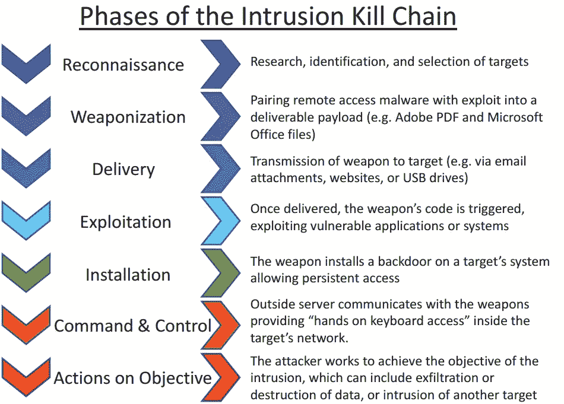

# 对过去的预测，利用威胁情报和杀戮链对一切事物的追溯

> 原文：<https://medium.com/codex/a-prediction-of-the-past-retro-hunt-for-everything-utilising-threat-intelligence-and-the-kill-830ccfc1c07e?source=collection_archive---------8----------------------->

ZeroDays 和下一件大事似乎是现代安全态势的驱动力，但我们永远不要忘记，当下一件大事众所周知时，您可能已经经历了一次测试攻击。复古狩猎是一种被低估的小艺术，它已经发生了。

我是复古狩猎的粉丝已经有一段时间了，基本上是因为我试图在我以前的公司申请自动复古狩猎的专利，现在我在我的新公司有了这些工具，是时候再次解决这个话题了。

Ecole polytechnique，CC BY-SA 2.0<[https://creativecommons.org/licenses/by-sa/2.0](https://creativecommons.org/licenses/by-sa/2.0)>，通过维基共享

当你在维基百科上搜索 retro hunt 时，你会看到这个定义

***网络威胁狩猎*** *是一种主动的网络防御活动。它是“主动和反复搜索网络以检测和隔离规避现有安全解决方案的高级威胁的过程。”*[*【1】*](https://en.wikipedia.org/wiki/Cyber_threat_hunting#cite_note-1)*这与传统的威胁管理措施相反，如* [*防火墙*](https://en.wikipedia.org/wiki/Firewall_(computing))*[*入侵检测系统*](https://en.wikipedia.org/wiki/Intrusion_detection_system) *(IDS)、恶意软件* [*沙箱(计算机安全)*](https://en.wikipedia.org/wiki/Sandbox_(computer_security)) *和* [*SIEM*](https://en.wikipedia.org/wiki/Security_information_and_event_management) (来源: [*维基百科*](https://en.wikipedia.org/wiki/Cyber_threat_hunting) *)**

*换句话说，复古狩猎实际上意味着你需要所有的指标，这可能是我所说的传统指标，如 IP 地址、域名和哈希，以及你从米特 ATT 和 CK 知道的较新的技术、策略和程序。你开始在你的环境中寻找这些迹象。有些事情你要记住*

***从威胁情报开始***

* [## 让我们来谈谈:威胁情报循环

### “让我们谈谈”是我计划了一段时间的一个系列，它将涵盖一些很老的话题，但我发现自己…

cybernotdienst.de](https://cybernotdienst.de/lets-talk-about-threat-intelligence-cycle-2e71d99f4b25) 

我已经单独写了一篇关于威胁情报的文章。您应该确保您收到的指标或报告已经在您独特的环境中进行了分析。威胁情报应该标记要狩猎的指标，这样你可以节省时间让猎人决定狩猎什么，并专注于如何狩猎。
您总是希望确保指标丰富，使其适用于您的环境，例如

*   散列总是很棒，但是它们需要你有包含这些散列的数据日志。在所有数据中搜索散列是没有意义的，但是没有散列被存储。
*   IP 地址可能是最容易找到的，因为代理、防火墙、dns 日志甚至 web 服务器日志都是事件的重要来源。但是，请确保您首先分析了 ip。我们已经看到威胁报告，其中包括内容交付网络的 ip，您可能会发现许多这些 ip，但没有任何其他指示，这些发现是没有意义的。
*   在漏洞空间，您有包括 CVE 的报告(常见漏洞和暴露… *我实际上认为它代表枚举，无论如何*)，但报告可能会谈到非常高级别的系统版本，如 Windows 11，因此您需要确保您使用受影响的完整版本号来丰富这些指标，否则，调查结果将毫无意义

**让我们去打猎(什么，哪里，如何)**

狩猎的最大挑战是寻找什么，在哪里寻找，以及如何去做。威胁情报部门应该已经注意到是什么了，所以我们继续关注地点和方式。

也许你很幸运(*或者偏执狂或者幸运偏执狂*)，所有事件数据都存储在一个大数据仓库中，你的 SIEM、你的数据湖、你的数据湖之家或者类似的地方。这很好，因为您可以提出一些包含指标及其相互关系的查询。

美国参议院商业、科学和交通委员会，公共领域，通过维基共享

始终牢记杀戮链(*或米特里·ATT&CK，我不久前就停止在那上面与人战斗了*)，你会期望在“安装”阶段的事件之前找到符合“交付”阶段的事件。简单吧？有了它，您可以缩小查询范围，并根据完整的报告对它们进行定制，而不是根据您需要在之后粘合在一起的单个事件。

像往常一样，有很多工具，我会诚实地告诉你，你输入工具的数据比工具本身更重要。大多数工具都基于某种查询语言。以 Palo Alto Networks [XDR](https://www.paloaltonetworks.com/cortex/cortex-xdr) 和 C [ortex Data Lake](https://www.paloaltonetworks.com/cortex/cortex-data-lake) 为例，使用 XQL，您可以查看时间框架，并用 and 和 OR 组合语句，将指标组合到一个搜索中。

***作为现场说明，请(请、请、请)，或者是好听的，我明白，但是如果把所有指标都用上或者结果什么意思都没有。在某处应该至少有一个 AND 语句。**** 

*如果你不知道你想如何存储你的数据，我也推荐阅读我的一个朋友的博客文章，Richard de Vries 告诉你应该如何存储你的(安全)数据*

* [## 保持，温暖或寒冷-您在哪里存储哪些事件数据？

### 事实:平均来说，一个对手在被发现之前已经在里面呆了 180 多天了。

tales-from-a-security-professional.com](https://tales-from-a-security-professional.com/hold-warm-or-cold-where-do-you-store-which-event-data-4769399434d1)* 

***最后让我们假设你想自动运行这个***

*自动与手动的方法肯定会给我们带来一些不利，并打破“您至少需要一个 and”的想法，因为我们不能让机器决定哪些指标应该组合以及何时组合。*

*这些是您想要执行的步骤*

*   *对于自动追溯搜索的标记指示器，您也可以简单地依赖判决和时间，所以让我们说*“判决:恶意和时间:{ today }”*作为一个 XSOAR TIM 样式的查询*
*   *此外，由于查询和工具可能会有所不同，您希望使用类似于“ *type:FileHash AND …* ”的指示器类型来扩展查询*
*   *有了这个，你最终应该有不同的指标列表，你可以馈入不同的存储(Cortex XDR，SIEM，Data Lake 等)*
*   *寻找任何发现并报告*

*这就是你需要做的所有事情，让你的复古狩猎之旅有一个最低起点*

*今天就到这里吧👏如果你喜欢这个职位，并且一如既往地喜欢，那就对彼此都很好*