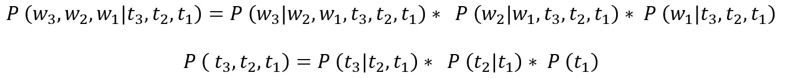

# 一种基于概率的词性标注方法

> 原文：<https://medium.com/codex/a-probabilistic-approach-to-pos-tagging-hmm-a557f963e159?source=collection_archive---------3----------------------->

照片由[阿尔方斯·莫拉莱斯](https://unsplash.com/photos/YLSwjSy7stw?utm_source=unsplash&utm_medium=referral&utm_content=creditShareLink)在 [Unsplash](https://unsplash.com/s/photos/book) 拍摄

**简介**

在早期学校的某个时候，当我们学习语法时，我们开始知道单词可以分成不同的类别，像名词、动词、形容词等等。这些类别有助于我们理解一个单词在句子中扮演的角色。**P**art**o**f**S**peech 或 **POS** tagging 就是将这些类别(或标签)分配给单词的过程。词性标注是自然语言处理(NLP)的基本构件之一，因为它是其他 NLP 过程的先决条件。

我们经常遇到的一些词类标记有单数名词(NN)、代词(PRP)、形容词(JJ)、动词(VB)等。而作为人类，我们可以看着一个句子，凭经验直观地将词性标签与单词联系起来。然而，如何训练一个算法来实现这个看似简单的任务呢？在解决词性标注问题的各种方法中，我们将在本文中研究一种基于隐马尔可夫模型(HMM)的概率方法。

关键问题是将一系列 *t* 标签分配给一系列 *n* 字。听起来很简单！！假设我们有三个单词，分别是 w₁、w₂、w₃，还有一组六个标签，分别是 t₁、t₂ …..t₆.我们需要给这三个单词分配任何一个标签。

但是，有一个问题。每个单词可以有 6 个标签中的任何一个。这意味着有 6×6×6 个可能的序列(6)，我们需要找出哪个是正确的标签序列。概括地说，我们可以说，如果我们有 *t* 个标签要分配给 n 个单词，就有 t^n 的可能性。在这些序列中，我们需要选择最可能的标签序列。

我们很快意识到，对于一个大文档来说，这可能会很快失去控制。在我们继续之前，让我们绕道，建立一些数学积木。

**马尔可夫过程**

我们从一个非常简单的例子开始。假设它们是一系列事件——x₁、x₂、x₃——以离散的时间步长发生——t₁、t₂、t₃.这一系列事件首先发生的概率有多大？如果我们想一想，我们会问以下问题:

给定下列概率，P(x₃、x₂、x₁是什么？

1.  x₁在 t₁，即 P(x₁的概率)
2.  x₂在 t₂的概率，给定 x₁发生在 t₁，即 P(x₂ | x₁)，
3.  概率 x₃在 t₃，鉴于 x₁，x₂发生在 t₁，t₂.形式上这是 P(x₃ | x₂，x₁)

我们可以将此改写为:

等式。1 连锁法则

Eqn.1 就是著名的概率的 ***链式法则*** 。此规则模拟 2 个或更多事件的联合概率。你可以在这里找到更多关于[的信息。](https://en.wikipedia.org/wiki/Chain_rule_(probability)#:~:text=In%20probability%20theory%2C%20the%20chain,variables%20using%20only%20conditional%20probabilities.)

像这样的一个序列随机过程，如果具有马尔可夫性，就称之为马尔可夫过程。这意味着，给定一个连续随机过程的当前状态，我们不能通过收集更多关于过去的知识来获得任何关于未来的额外信息。数学上我们可以这样写:

等式。2 马尔可夫性质

这意味着， *n* 处的状态仅取决于 *n-1* 处的先前状态。这对等式有什么影响？1 ?假设我们有一个马尔可夫过程，我们可以将等式 1 改写为:

等式。3 马尔可夫性在链式法则中的应用

这也被称为***1-马尔科夫*** 过程。如果一个状态依赖于过去的 *k* 个状态，那么它将是一个**k 马尔可夫 过程。**

**条件概率和贝叶法则**

条件概率给我们一个事件 B 的概率，给定 A 已经发生，表示为 P(B|A)。要计算 P(B|A)，我们需要求出 P(A，B)给定的 A 和 B 的联合概率，以及 P(A)给定的 A 的边际概率。

等式。4 给定 A，B 的条件概率

我们可以使用等式 1 中的链式法则来展开分子。这样我们就得到了方程。5.这意味着，在实验的所有结果中，方程 5 给出了事件 B 发生频率的比率，假设我们只限于 A 发生的那些观察结果。

等式。5 贝叶法则

我们可以把这个公式推广到两个以上的变量。我们可能会问，给定观测值 A，B，一个结果是 C 的概率是多少，数学上，我们会把这个写成 P(C|A，B)。

等式。6 贝叶法则适用于 3 个变量。

关于方程的一个重要观察。5 是，如果事件 A 和事件 B 相互独立呢。在这种情况下，P(B|A)=P(B)，如果你认为这是非常明显的。在等式中。6、若 C 是 A 的**独立**，则 Eqn。6 简化为类似的等式。5 用于事件 C 和 b。

**结合链式法则和贝叶法则**

我们可以用一个更复杂的事件链，将链式法则应用于一个看起来可怕的条件概率。假设 B₁,B₂,B₃发生了，A₁,A₂,A₃发生的概率是多少。我们怎么用贝叶法则来写这个呢？考虑下面的表达式。

等式。7 贝叶法则适用于更多的赛事。

我们简单地将贝叶法则用于 LHS。但是，RHS 看起来还是有点复杂，尤其是分子。首先，我们取分子中的第二个操作数，应用链式法则得到:

等式。8 链式法则应用于等式分子中的第二个操作数。七

将链式法则应用于第一个操作数，我们得到:

等式。9 链式法则应用于等式分子中的第一个操作数。七

如果你想知道，为什么我们不扩大分母，坚持住。我们很快就会看到，我们不需要！！

**最可能的标签序列**

将我们的注意力转向词性标注，我们现在正式宣布我们的问题陈述。对于单词序列 w₁、w₂、w₃，我们打算找出最可能的标签序列。为了简单起见，让我们假设我们只有 3 个标签 t₁，t₂，t₃.如果这三个标签是，DT，VB 和 NN，那么在这三个标签的所有可能组合中，我们需要计算最可能的一个。我们注意到这是从这六种可能性中选择一种的问题。

3 个标签的所有可能标签序列

让我们选择一个这样的序列 t₁-t₂-t₃(即 DT-VB-NN)。我们可以用数学方法将其写成下面的等式 10。这只是这个标签序列的概率。注意，对于剩余的序列，将有五个以上这样的等式。然而，对于那些序列之一，P 将是最高:

等式 10 给定单词序列，标签序列的概率。

此时，我们注意到这与等式 7 相似。让我们简化等式分子中的两个操作数。10 使用链式法则，就像我们在方程中做的那样。8 和 9。

等式。11 将链式法则应用于等式中分子的操作数。10

现在，我们做两个非常重要的假设，这是我们下一步计算的基础。

*   一个词的概率只取决于那个位置的标签。意义，它独立于前面的标签或相邻的词。
*   当前标签仅依赖于前一个标签。因此，假设标签序列具有如等式 2 所示的马尔可夫属性。2.这被称为**二元模型**假设。

> 如果我们假设当前标签依赖于前两个标签，那么这将是一个**三元模型**假设。一般来说，如果当前标签依赖于当前单词和前面的 n-1 个标签，我们就有一个 n-gram 标签问题。
> 
> 对于本文，我们考虑 n=2。因此，我们有一个二元或二元标记问题。

将这两个假设应用于方程。11，我们得到简化得多的操作数。

等式。12 简化方程式中的分子。10

术语 P(wᵢ|tᵢ)被称为 ***发射概率*** 即一个词 wᵢ的概率，给定的标签是 tᵢ.术语 P(tᵢ|tᵢ₋₁)被称为 ***转移概率*** ，即标签 T1 出现的概率，假定前一个标签是 tᵢ₋₁.

现在，我们把注意力放在等式的分母上。10.当我们替换不同的标签序列时，我们注意到单词的序列保持不变。只有分子会改变。因此，出于所有实际目的，当我们试图找到最可能的标签序列时，我们只需要找到最大化方程中分子的那个。10.因此，我们用比例符号代替等式 10 中的等号。

等式。13 标签序列 t1、t2、t3 的概率

我们可以进一步分解最大化问题，通过询问，什么样的标签选择将最大化括号中的术语。为了保持一致，我们注意到 P(t₁)实际上是指 P(t₁|Start)，意思是“假设我们在句子的开头，标记 t₁的概率是多少？”。

为了计算出最大化 Eqn 的三个标签的顺序。13(记住，有 6 种可能的序列)，我们需要计算 Eqn。13，并选择产生最高概率的一个。形式上，这意味着寻找最大化 Eqn 的“3”标签的“1”序列。13.它是这样写的:

等式。14 最可能的标签序列，最大化方程。13.

因此，如果我们有 n 个单词的序列，寻找 n 个标签的序列，我们简单地用“n”替换索引“3”:

等式。15 参考:语音和信号处理— Jurafsky 和 Martin

因此，我们将问题简化为寻找句子中每个单词的发射和**转移概率**的序列乘积**。**

**隐马尔可夫模型**

请注意某个位置的标签的两个具体特征。它**在其当前位置发出**一个字，并且**将**转换到下一个位置的标签。作为观察者，我们只能按顺序看到单词，但是标签是**隐藏**。这些是一个**隐马尔可夫模型**或 **HMM** 的特征。

在这里详细解释 HMMs 超出了本文的范围，所以我们将简单地讨论一下。

> 在 HMM 中，有一个马尔可夫过程 T (t₁、t₂、t₃)which 对观察者来说是**隐藏的**，(本例中的标签)。然而，随着过程从一个状态过渡到下一个状态，它**以文字的形式发出**某些观察 W ( w₁、w₂、w₃)。HMM 的目标是通过观察 w 来学习 T。

图 1 隐马尔可夫模型(参考号:[维基百科](https://en.wikipedia.org/wiki/Hidden_Markov_model#:~:text=Hidden%20Markov%20Model%20(HMM)%20is,whose%20behavior%20%22depends%22%20on%20.)

t₁的隐藏过程 t 可以以概率 p₁₂.转移到 t₂它也可以用 ***跃迁*** 概率 p₁₁.跃迁回自身在这一步，t₁可以分别以 ***发射*** 概率 e₁₁,e₁₂和 e₁₃发射 w₁、w₂和 w₃。在 t₃没有进一步过渡的可能，因为这是该进程的最后一步。对于我们的问题陈述，我们不需要更深入地研究 hmm。

所有源于隐藏态的发射概率的总和必须是 1。类似地，所有源自隐藏状态的转移概率也必须加到 1。

**一个例子**

我们已经做好了所有的数学基础。现在让我们举一个例句“长城”。凭直觉，我们知道，最好的标签序列是 DT-JJ-NN，但我们能确定第一个标签是 DT，然后是 JJ 和 NN 吗？首先，我们被问及什么样标签选择将使 P( t₁|"the").)最大化既然我们知道，p(t₁|"the“)*∝*p(“t₁)p(t₁|start”)，让我们来回答下面的问题。

*   最有可能的开始标签是什么？是 NN，JJ 还是 DT？
*   如果我们有最可能的开始标记，最可能发出的单词是什么？

这与问以下哪个概率最高是一样的:

*   P(DT | " the ")∧P(" the " | DT)* P(DT | Start)
*   P(NN | " the ")∝P(" the " | NN)* P(NN | Start)
*   P(JJ | " the ")∝P(" the " | JJ)* P(JJ | Start)

现在让我们假设，不知何故，我们已经设法找出了下列跃迁和发射概率:

图 2 第一个标签的跃迁和发射概率

我们可以清楚地看到，选择 DT 作为“the”的标签最大化了 P(t₁|"the").

既然我们已经找到了作为 DT 的第一个标签，我们问 t₂的什么选择将最大化 P(t₂|"great)？现在，我们知道我们必须为 t₂选择一个标签，最大化 P("great"|t₂)*P(t₂|t₁=DT).我们寻找三个发射和跃迁概率，注意到如果我们选择 P(JJ|DT)*P(“大”| JJ)，P(t₂|"great”)最大。

图 3 第二个标签的跃迁和发射概率

请注意，我们并不是一次性寻找完整的标签序列。相反，我们从一个单词到下一个单词依次寻找下一个标签。实际上，我们是在一个 ***维特比算法中遍历一个 ***格子图*** 。*** 解码 hmm 是一种常见的选择

图 4 寻找最佳序列的格子图。

我们将单词和所有可能的标签分成三列。维特比算法计算格子图中的最佳路径，使得对于所选择的标签，发射和转移概率的乘积最大。

**实施**

为了得到一个未标记句子的标记序列，我们必须有所有标记转换和所有单词发射的转换和发射概率。我们可以从带标签的文档中构建它们，并使用它来构建我们的维特比解码器。让我们开始编码吧！！(访问我的 GitHub 页面访问[整个笔记本](https://github.com/Arindam75/HMM-Tagger/blob/main/Viterbi_HMM_POS_Tagger.ipynb))。

一个好的起点是寻找一个带标签的语料库。NLTK 库有丰富的资源，这些资源已经被标记，可以用来构建一个解码器。NLTK 的书有一章专门介绍了这个图书馆提供的所有词汇资源。

下面的代码片段加载了一组华尔街日报，作为一个 POS 标记句子的列表。

文肯先生是荷兰出版集团爱思唯尔公司的董事长。”显示为如下元组列表。每个元组都有单词及其标签。

> *('先生'，'名词')，('文肯'，'名词')，('是'，'动词')，('主席'，'名词')，(' of '，' ADP ')，('爱思唯尔'，'名词'，(' N.V . '，'名词')，('，'，'.')、(' the '、' DET ')、('荷兰语'、'名词')、('出版'、'动词')、('集团'、'名词')、('.', '.')]*

我们进一步研究训练/测试集，找出以下特征。

*   训练-测试分离留给我们 3718 个训练和 196 个测试句子。
*   标记的训练词的数量是 95440，标记的测试词的数量是 5236。
*   词汇长度为 11017，有 12 个独特的标签。

我们定义了两个效用函数，帮助我们计算以下内容:

*   给定一个单词和标签，返回一个元组的次数，这个单词从标签中发出的次数和标签出现的总次数。
*   给定两个标签 t₁和 t₂，返回一个数组，其中包含 t₁后面跟着 t₁的次数以及 t₁出现的总次数。

数据帧 **tag_df** 给出了任何标签 t₁(column 和 t₂(row).之间的所有转换可能性例如，名词后跟动词的概率是 0.146889(第 1 列第 5 行)。

理论上，我们也可以建立一个排放概率矩阵。然而，我们需要两个嵌套循环来访问 vocab 中的所有单词和所有标签。对于 11017 个词汇表和 12 个标签，这意味着超过 100K 次迭代。有更好的方法来处理。注意，我们只需要计算我们将在测试集中遇到的那些单词的 P(w|t)。因此，当我们遍历测试集中的单词时，我们可以即时计算 P(w|t)。

Viterbi 函数获取一系列单词并预测一系列标签。

现在，我们可以遍历测试集中的每个句子，去掉标签，并将结果单词列表发送给 Viterbi 函数。该函数执行以下操作。

*   对于句子中的每个单词 w，计算每个标签的 P(w|ti)∗P(tᵢ|tᵢ-₁。我们使用训练集来计算这些概率。
*   选择最大乘积的索引并使用它指向**标签**列表来预测单词 w 的标签。
*   预测标签存储在列表 **tag_seq** 中。这是用来获取前一个标签，除非我们是一个句子的开始。
*   如果，我们是一个句子的开头，前面的标签是“.”(开始标签)。
*   该函数返回一个元组列表，每个元组包含单词和预测的标签。
*   如果我们在词汇表中找不到一个单词，我们只需使用具有最大转移概率的标签。

最后，我们有一个列表 pred_set，它是测试集的预测版本。

当我们比较预测标签和真实标签时，我们得到以下结果。

**结论**

我们基于 HMM 建立了一个简单的概率二元词性标注器。我们可以通过对未知单词(即，测试集中不在训练集中的单词)使用最常见的标记来进一步提高标记器的性能。然而，同样的方法也可以用来为命名实体识别建立模型。然而，我们将在另一篇文章中解决这个问题。

敬请关注，享受学习的乐趣！！

***参考文献***

[*用 Python 进行自然语言处理*](https://www.nltk.org/book/) *: Bird、Klein 和 Loper*

[*语音和语言处理*](https://web.stanford.edu/~jurafsky/slp3/) *:茹拉夫斯基和马丁*