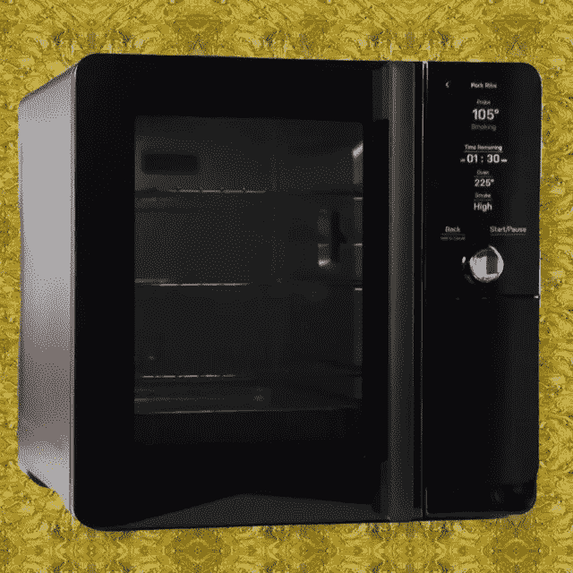

# 一个有前途的室内颗粒吸烟者？

> 原文：<https://medium.com/codex/a-promising-indoor-pellet-smoker-38e9bbb9b2d4?source=collection_archive---------16----------------------->

## 你是说我们可以在室内熏制食物吗？

雅顿室内吸烟者(JC 媒体)

今天所有的流行都是关于把吸烟带到家里，这不像过去吸烟和腌制在保存食物中发挥作用。今天，这一过程主要用于改善或增加我们日常享受的食物的新层面。在过去的几年里，在种类和数量上有了爆炸性的增长…