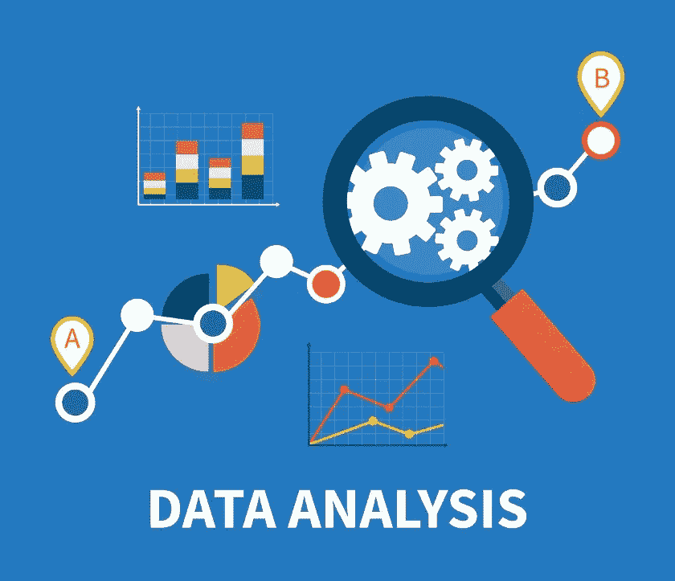

# 快速清晰地解释什么是数据分析。

> 原文：<https://medium.com/codex/a-quick-and-clear-explanation-of-what-is-data-analysis-a061cc6a1b18?source=collection_archive---------14----------------------->

## 解释的数据分析类型

[来自](https://www.techrepublic.com/article/why-your-data-analysis-may-be-doomed-from-the-start/)

描述数据、模块化数据结构、压缩数据表示、借助图像、表格和图表进行说明、评估统计倾向和概率数据以得出有意义的结论的统计和逻辑技术称为数据分析。

这些分析程序使我们能够从数据中剔除其他数据产生的不必要的东西，从而引发潜在的推论。数据的生成是一个连续的过程。确保数据完整性是数据分析的重要组成部分之一。

使用数据分析的例子有很多，从运输、风险和欺诈检测、医疗保健到网络搜索，不一而足。

正如我们已经注意到的，随着疫情冠状病毒的爆发，医院面临着应对治疗许多患者的压力的挑战，考虑数据分析允许在这种情况下监控机器和数据的使用，以实现效率的提高。

**为了进行数据分析，以下是必要的:**

*   必要的分析技能
*   数据收集方法的适当实施。
*   确定统计显著性
*   确保数据、数据源和数据分析方法的可靠性和有效性。
*   说明分析的范围

# 数据分析方法

# 1.定性分析

这种方法回答了诸如“为什么”、“什么”或“如何”等问题量化技术，如态度量表、标准结果等。这些类型的分析通常是文本和叙述的形式，可能包括音频和视频表示。

# 2.定量分析

一般来说，这种分析是用数字来衡量的。这里的数据以测量尺度的形式呈现，并扩展到更多的统计操作。

# 3.文本分析

这是一种分析文本以提取机器可读事实的技术。它旨在从非结构化内容中创建结构化数据。该过程包括将大量非结构化文件分割成易于阅读的文件，并解释数据。它也被称为文本挖掘。

人类语言的不确定性是文本分析的最大挑战。例如，人类知道“**千载难逢**”指的是习语，并向我们传达“**做一些很少做的事情**”，但如果这个文本被输入到没有背景知识的计算机，那么它会在语言上产生，有时不知道这个习语的人可能也很难理解它。

# 4.统计分析

统计学涉及数据收集、解释和验证。统计分析是一种执行多种统计操作来量化数据的技术。定量数据包括描述性数据，如调查和观察数据。它也被称为描述性分析。它包括各种执行统计数据分析的工具，例如 SAS(统计分析系统)、SPSS(社会科学统计软件包)和 Stat soft 等等

# 5.诊断分析

诊断分析是在统计分析之后执行的步骤，以提供更深入的分析来回答问题。它也被称为**根本原因分析**，因为它包括数据发现、挖掘、下钻和钻取等过程。

诊断分析的功能分为三类**识别异常、深入分析(发现)和确定因果关系。**

# 6.预测分析

**预测分析**使用历史数据，并将其输入机器学习模型，以发现关键模式和趋势。这个模型应用于当前数据，预测接下来会发生什么。许多组织更喜欢它，因为它提供了各种优势，如数据的数量和类型、更快更便宜的计算机、易于使用的软件、更严格的经济条件以及竞争差异化的需要。

以下是预测分析**欺诈检测、优化营销活动、改善运营和降低风险的常见用途。**

# 7.规定性分析

规定性分析建议你继续下一步行动，并概述可能达到的潜在影响。生成建议的说明性分析需要一个特定的和独特的算法明确的方向，来自那些利用分析技术的人。

*大家敬请期待！为了把我的故事发到你的邮箱里，请订阅我的时事通讯。*

*感谢您的阅读！不要忘记给你的掌声，分享你的回答，并与朋友分享！*