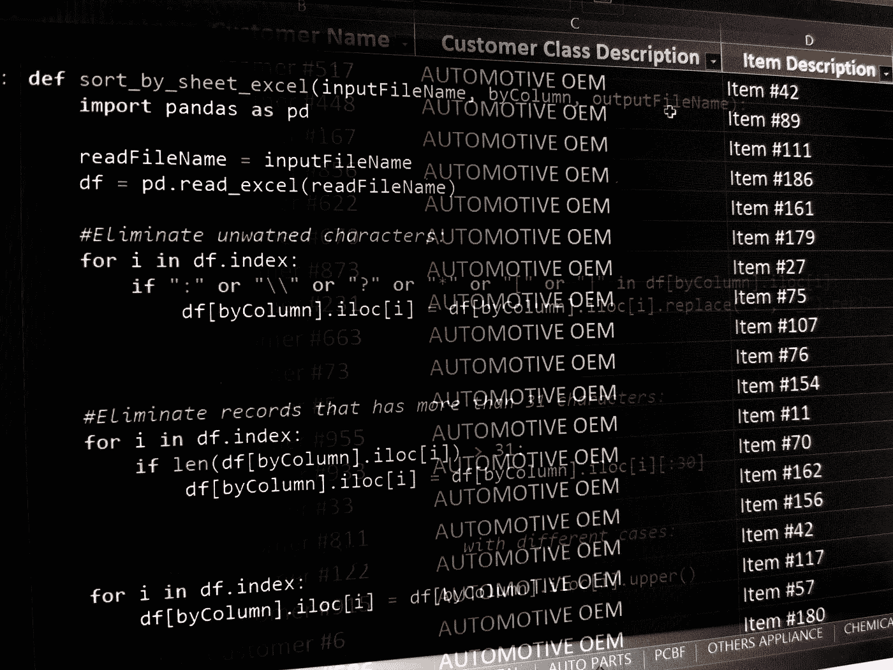
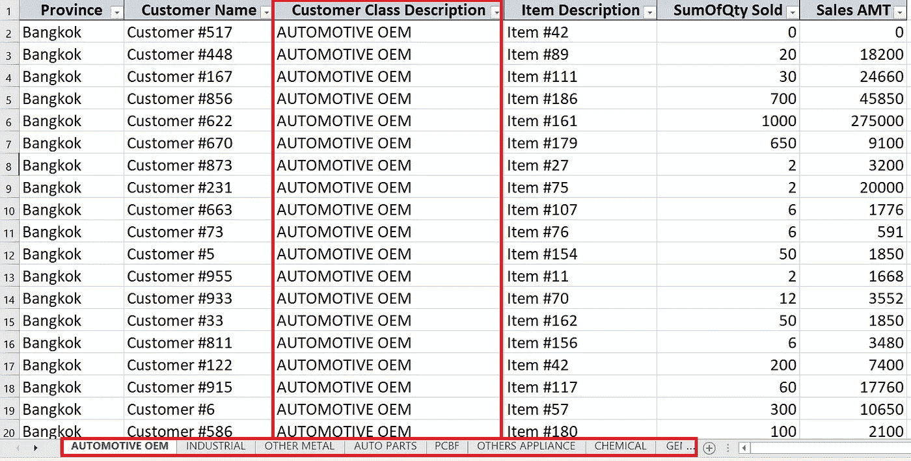
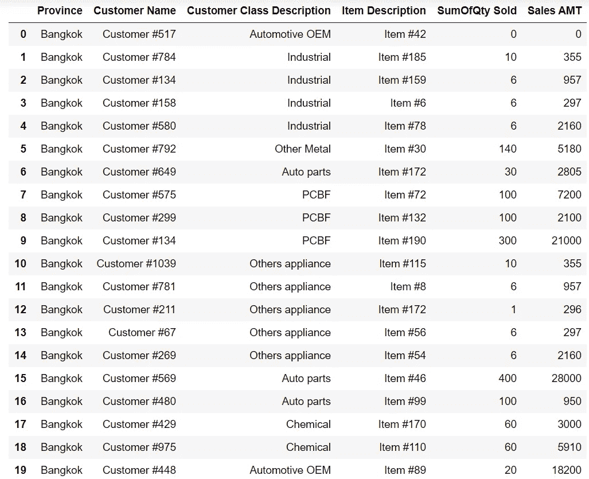
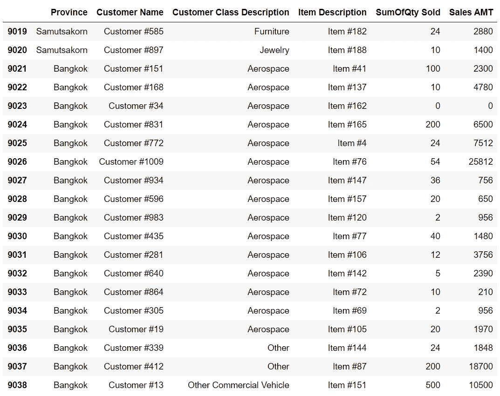
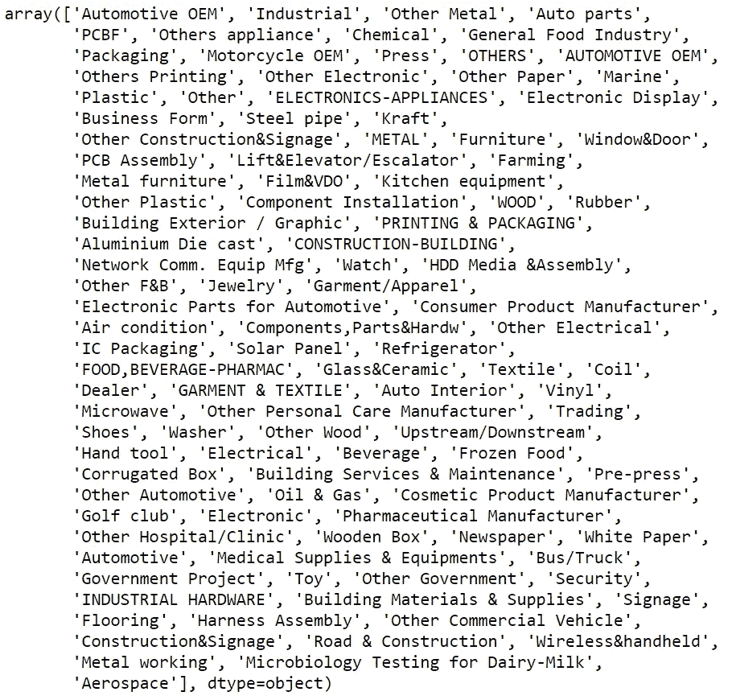
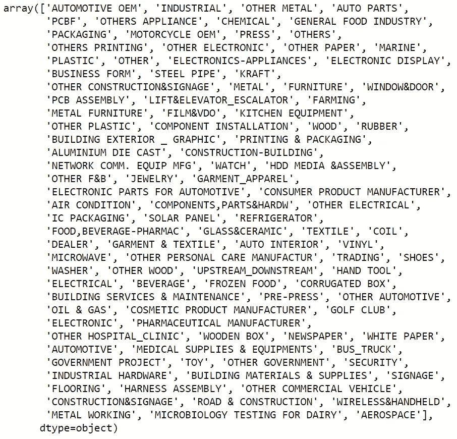
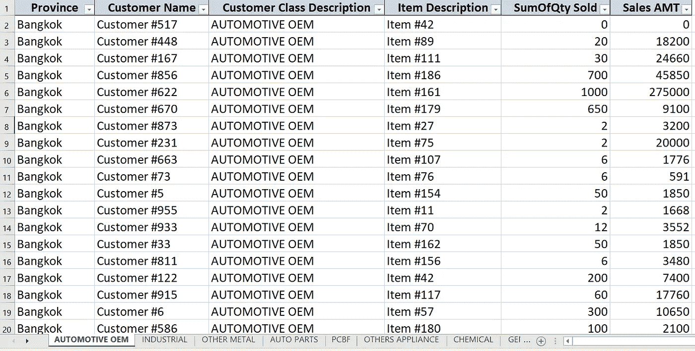

# 用 Python 重新组织 Excel 数据的一种快速且干净的方法

> 原文：<https://medium.com/codex/a-quick-and-hopefully-clean-way-to-filter-and-separate-data-into-worksheets-in-a-single-excel-e22e982ef70b?source=collection_archive---------2----------------------->

## [法典](http://medium.com/codex)

## 使用 Python 在单个工作簿中将 Excel 数据过滤和分离到不同工作表的实践指南



使用 Python 代码将 Excel 数据过滤到一个 Excel 工作簿中的多个工作表中—作者照片

# 紧急请求！

最近，我收到一个朋友的紧急请求，要我帮她处理一个 Excel 文件。她需要将数据分离到不同的表中，并将所有内容保存在一个 excel 工作簿中。每个表的数据将来自原始文件，根据特定列中的每个唯一元素进行过滤。因此，每个工作表名称将来自该列中的每个唯一项。



我的朋友需要根据名为“**客户类别描述**”的列中的唯一项目，将数据分离到不同的工作表中所有内容都必须保存在一个工作簿中。

我朋友的要求听起来很简单。但是，我不是 Excel 专家。在明确告诉她不要对我期望过高之后，我继续在谷歌上搜索解决方案(我想她可能已经这样做了。)

> 高度定制的问题需要高度灵活的解决方案。
> 
> —作者

我用 [VBA 代码](https://en.wikipedia.org/wiki/Visual_Basic_for_Applications)的几行找到了一个解决方案。我立即测试了它，从表面上看，它令人满意。我用 VBA 代码处理了给定的 Excel 文件，并在她要求的同一天早上把修改后的文件交给了她。

当天晚上，我决定做一个比早上更精确的人，并检查了由此产生的结果。xltm 文件(启用宏的 Excel 文件)。我发现有一些没有名字和数据的空白表格。我立即联系了我的朋友，带着她所有的友好和感激，她承认她也发现了这个问题，但不愿意向我寻求另一种帮助。

作为一名 Python 实践者和数据科学学徒，我把通过纠正这些错误来彻底满足她的需求作为我的责任，希望她的老板还没有因为给了他一个有缺陷的 Excel 工作簿而责骂她。

这次没有 VBA，我决心用 [Python](https://www.python.org/) 解决问题。我会告诉你怎么做。

***注意事项 I:*** *在本文中，出于演示的目的，我修改了原始数据，以保护姓名在原始 Excel 文件中的客户的隐私。然而，修改后的文件的数据结构和整洁度仍然是原始的。*

***预告二:*** *本文基于*[***Python 3 . 9 . 1***](https://www.python.org/downloads/release/python-391/)***，***[***Jupyter 笔记本 6 . 1 . 6***](https://en.wikipedia.org/wiki/Project_Jupyter)**和* [***微软 365 的 Excel***](https://en.wikipedia.org/wiki/Microsoft_Excel#Excel_2019,_Office_365_and_subsequent_(v16.0))*

# *动手部分*

*为了跟进，你可以在这里下载这个项目中使用的模拟数据集:[https://github.com/pkx8326/python-excel-splitsheets](https://github.com/pkx8326/python-excel-splitsheets)*

## *数据探索*

*如果我们要在 Python 中处理任何表格数据，Pandas 是一个必备的库。在将数据复制到运行 Python 会话的同一个文件夹中之后，我们可以导入 **pandas** 库，并使用它在下面的代码中导入我们的 excel 数据:*

```
*import pandas as pddf = pd.read_excel("mockupData.xlsx")*
```

*我显式地将数据命名为“ **mockupData.xlsx** ”，并确保我切断并屏蔽了所有将链接到我朋友的公司的真实客户的纽带。我分配了一个名为“ **df** 的数据帧来包含来自 **mockupData.xlsx** 的数据。*

*让我们用下面的代码来研究这些数据:*

```
*df.info()<class 'pandas.core.frame.DataFrame'>
RangeIndex: 9039 entries, 0 to 9038
Data columns (total 6 columns):
 #   Column                      Non-Null Count  Dtype 
---  ------                      --------------  ----- 
 0   Province                    9039 non-null   object
 1   Customer Name               9039 non-null   object
 2   Customer Class Description  9039 non-null   object
 3   Item Description            9039 non-null   object
 4   SumOfQty Sold               9039 non-null   int64 
 5   Sales AMT                   9039 non-null   object
dtypes: int64(1), object(5)
memory usage: 423.8+ KB*
```

*表格数据包含 9039 行和 6 列。我的朋友需要使用一个列作为过滤器来将数据分成单独的工作表，这个列叫做“客户类描述”*

*让我们进一步研究一下这些数据:*

```
*df.head(20)*
```

**

***df.head(20)** 结果—作者照片*

*唱片的结局怎么样？*

```
*df.tail(20)*
```

**

***df.tail(20)** 的结果——作者照片*

*我们现在可以看到目标列包含混合的字符串类别。我们将在即将创建的 Excel 文件中使用这些类别作为唯一的工作表名称。我们还将根据每个工作表中的每个类别过滤数据。*

*让我们看看目标列中所有独特类别的列表:*

```
*df[“Customer Class Description”].unique()*
```

**

***df[“客户类描述”]的结果。唯一()** —作者照片*

*在那一栏中有“许多”独特的项目。多少？*

```
*df["Customer Class Description"].nunique()>>>107*
```

*总共有 107 个独特的项目，我们似乎也有一些特殊的字符，如“ **&** ”或“ **/** ”在一些项目中。*

*不仅是那些特殊字符，在扫描列表(数组)后，人们可能会发现有些项目名称相同，但字符大小写不同，例如“**汽车 OEM** ”和“**汽车 OEM** ”，并且有些项目包含相当长的字符串。*

*因为我们将根据这些项目来命名工作表，所以当我们保存新的 Excel 文件时，上述任何观察特征都可能导致问题。*

***Excel 工作表命名** [**规则**](https://support.microsoft.com/en-ie/office/rename-a-worksheet-3f1f7148-ee83-404d-8ef0-9ff99fbad1f9) **:***

*   *工作表必须有名称(名称选项卡不能为空。)*
*   *同一工作簿中的每个工作表都必须有唯一的名称。*
*   *名称不能超过 31 个字符。*
*   *“禁止”字符是/ \？* : [ ]*

*上面的列表也是我们的 Python 代码从目标列中管理和提取唯一元素的规则，并将它们用作新 Excel 文件中工作表的名称。*

## *数据准备*

*我们应该关注的唯一一列是名为“客户类别描述”的列我们将使用该列作为筛选器，将数据划分到工作表中，以该列中每个唯一的项目命名它们，所有这些都在一个新的工作簿中。我们不会创建数据帧的副本；我们将直接修改我们感兴趣的栏目中的项目。*

***将“禁止”字符替换为“_”:**根据工作表命名规则，看起来“&是可以的，但是其他的“禁止”字符还是需要替换。我们将用“_”替换它们*

*因为在我们关注的列中有许多独特的项目，对于彻底的手工挑选来说太多了，如果 Python 在该列的任何项目中找到任何禁止的字符，我们将用下面的代码告诉 Python 用“_”替换它们:*

```
*for i in df.index:
    if ":" or "\\" or "?" or "*" or "[" or "]" in df["Customer Class Description"].iloc[i]:
        df["Customer Class Description"].iloc[i] = df["Customer Class Description"].iloc[i].replace(":", "_").replace("\\", "_").replace("/", "_").replace("?", "_").replace("*", "_").replace("[", "_").replace("]", "_")*
```

*在 df.index 中用“ **for i:，**”我们告诉 Python 迭代索引为 I 的列中的每一项。Python 用**知道这一点。iloc[i]** 段。*

*为了方便起见，我们还利用 Python 将方法链接在一起的能力。在这里，我们链上**。replace()** string 方法将每个列项中的所有禁用字符替换为“_”。*

***截断字符串长度超过 31 个字符的项目:**现在，需要考虑的另一点是，工作表的名称不能超过 31 个字符。我们可以用下面的代码快速解决这个问题:*

```
*for i in df.index:
    if len(df["Customer Class Description"].iloc[i]) > 31:
        df["Customer Class Description"].iloc[i] = df["Customer Class Description"].iloc[i][:31]*
```

*上面代码末尾的 **[:30]** 段明确地告诉 Python 选择当前项的第一个字符到第 30 个字符的字符串，并丢弃其余的。总共，我们将有 31 个字符在每个项目中(从第 0 到第 30 个字符。)*

***消除具有不同字符大小写的重复项目名称:**这是最棘手的部分，但有一个非常简单的解决方案。*

*从该列唯一项目的整个列表(数组)中，我们可以初步看到至少有“**汽车 OEM** ”和“**汽车 OEM** ”到目前为止，我们还不知道是否还有其他如“**汽车代工**”(均为小写字母)或极端情况如“**汽车代工】**(有交替格)或****automotiveoem****(不带任何空格。)而不仅仅是 ***这个*** 项；其他项目有平等的权利有自己的变化。*****

*****假设我们可以安全地忘记“*极端情况*”，我们可以“正常化”所有项目，在这种情况下，通过将它们全部变成大写或小写。我选择用下面的代码使它们都是大写的:*****

```
*****for i in df.index:
    df["Customer Class Description"].iloc[i] = df["Customer Class Description"].iloc[i].upper()*****
```

*****现在，每个项目只有一种变化。在 ***汽车代工****的情况下我们只有“**汽车代工**”******

******在完成列大写中的所有项目后，我们现在应该有 106 个唯一项目，假设只有“**Automotive OEM”**是唯一的重复项目。让我们用下面的代码来验证这个假设:******

```
******df["Customer Class Description"].nunique()>>>106******
```

******我们有钱了！让我们快速浏览一下我们列中修改后的项目列表(数组):******

```
******df["Customer Class Description"].unique()******
```

************

********df[“客户类描述”]的新结果。唯一()** —作者照片******

******好像栏里所有项目都是大写的，这里那里都有“_”，原来是“禁”字的地方。******

## ******保存新的 Excel 文件******

******现在可以安全地将该列用作新 Excel 工作簿的筛选器了。要继续，我们必须根据筛选列中的每个唯一项目筛选数据，并将它们作为单独的工作表保存在新的 excel 工作簿中。我们可以用下面的代码完成这项任务:******

```
******writer = pd.ExcelWriter("Sorted_by_Sheets.xlsx")for i in df["Customer Class Description"].unique()
    df[df["Customer Class Description"].str.contains(i)].to_excel(writer, sheet_name = i, index = False)writer.save()******
```

******名为“ **Sorted_by_Sheets.xlsx** 的结果文件将包含以下数据结构和表格(更多表格隐藏在视图之外):******

************

******最终结果是一个 **Excel** 工作簿，根据“**客户类别描述**”列中的每个唯一项目，每个工作表中的数据都是独立的——作者照片******

# ********整理好一切********

******我们可以将上述所有步骤合并成一个功能。确保原始数据文件位于运行 Python 的同一文件夹中后，可以使用以下函数:******

```
******def sort_by_sheet_excel(inputFileName, byColumn, outputFileName):
    import pandas as pd

    readFileName = inputFileName
    df = pd.read_excel(readFileName)

    #Eliminate unwatned characters:
    for i in df.index:
        if ":" or "\\" or "?" or "*" or "[" or "]" in df[byColumn].iloc[i]:
            df[byColumn].iloc[i] = df[byColumn].iloc[i].replace(":", "_").replace("\\", "_").replace("/", "_").replace("?", "_").replace("*", "_").replace("[", "_").replace("]", "_")

    #Eliminate records that has more than 31 characters:
    for i in df.index:
        if len(df[byColumn].iloc[i]) > 31:
            df[byColumn].iloc[i] = df[byColumn].iloc[i][:30]

    #Eliminate same record names but with different cases:
    for i in df.index:
        df[byColumn].iloc[i] = df[byColumn].iloc[i].upper()#Write to excel file:
    writer = pd.ExcelWriter(outputFileName)

    for i in df[byColumn].unique():
        df[df[byColumn].str.contains(i)].to_excel(writer, sheet_name = i, index = False)writer.save()

    newFile = pd.ExcelFile(outputFileName)
    print("An excel file named {} is created with {} unique sheets.".format(outputFileName, len(newFile.sheet_names)))******
```

******使用 **sort_by_sheet_excel** ，您可以给出原始文件名、感兴趣的列的名称以及预期的输出文件名，一切都准备好了！******

```
******sort_by_sheet_excel("mockupData.xlsx", "Customer Class Description", "sorted_by_sheets_1.xlsx")>>>An excel file named sorted_by_sheets_1.xlsx is created with 106 unique sheets.******
```

******检查结果后。xlsx 文件中，我没有发现“空白表”,就像我使用通过谷歌搜索找到的 VBA 代码得到的结果一样。为 Python 欢呼三声！******

# ******结论******

******我已经向您展示了我们可以使用 Python 编码将过滤后的数据分离到单个 Excel 工作簿中的表中。在我的情况下。xlsx 文件不像我用 VBA 编码得到的文件那样错误百出。然而，本文并不是说 Python 比 VBA 好。高度定制的问题需要高度灵活的解决方案。无论是 VBA 还是 Python，编码都是正确的选择。这一切都取决于你知道你可以做得更好。******

******既然这里一直在说 Excel，你有没有想过 Excel 和 SQL 有什么区别？查看本文了解更多信息。******

******下次见，编码快乐！******