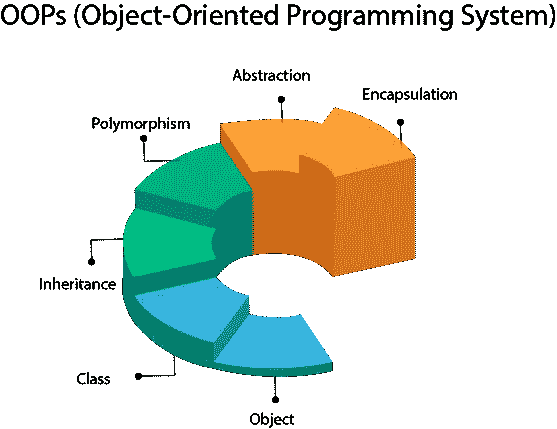

# Python 中 OOPs 概念的快速指南

> 原文：<https://medium.com/codex/a-quick-guide-on-oops-concept-in-python-3ee6c40cf673?source=collection_archive---------6----------------------->



概观

互联网上有很多关于这个主题的文章，我已经尽力以快速指南的形式概括了 OOPs 的概念

**什么是哎呀？**

**面向对象编程** (OOP)是一种基于“对象”概念的编程范式，其中可能包含数据，以字段的形式，通常称为属性；和程序形式的代码，通常称为方法。

例如，一个人是一个具有某些属性的物体，如身高、性别、年龄等。它还具有某些方法，如移动、交谈等。

**哎呀的积木**

*   目标
*   班级
*   遗产
*   多态性
*   抽象
*   包装

**什么是对象？**

对象是具有状态和行为的实体。它可以是任何现实世界中的物体，如鼠标、键盘、椅子、桌子、笔等。

Python 中的一切都是对象，几乎一切都有属性和方法。所有函数都有一个内置属性 __doc__，它返回函数源代码中定义的 docstring

当我们定义一个**类**时，只有对象的描述或蓝图被创建。在我们创建**对象**之前**没有内存分配**。

**什么是阶级？**

一个类是那个对象的蓝图。

我们可以把一个类想象成一个房子的草图(原型)。它包含了所有关于地板、门、窗等的细节。根据这些描述，我们建造房子。房子是客体。

因为许多房子可以从一个房子的蓝图中建造出来，所以我们可以从一个类中创建许多对象。一个对象也被称为一个类的实例，创建这个对象的过程被称为**实例化**。

在 Python 中定义一个类和对象

就像 Python 中的函数定义以 **def** 关键字开始一样，类定义以 **class** 关键字开始。

例如:

```
class employee:
    age = 30
    designation = Manager def greet(self):
        print('Hello')
```

我们看到类对象可以用来访问不同的属性。

它还可以用于**创建**该类的新对象实例(实例化)。创建**对象**的过程类似于**函数调用**。

```
emp_obj = employee()
```

这将创建一个名为 emp_obj 的新对象实例。我们可以使用对象名前缀来访问对象的属性。
**属性**可能是数据或者方法。对象的**方法**是该类对应的函数。
也就是说，既然 employee.greet 是一个函数对象(类的属性)，那么 employee.greet 就会是一个方法对象。

**“自我”一词**

self 用来表示类的**实例**。
使用这个关键字，你可以**访问**python 中类的**属性**和**方法**。它将属性与给定的参数绑定在一起。
**self** 也用于引用类内的**变量**字段。让我们举个例子，看看它是如何工作的:

```
class Office:

# name made in constructor
   def __init__(self, US):
       self.location = US

   def office_location(self):
       return self.location
```

**继承**

[继承](https://www.geeksforgeeks.org/inheritance-in-python/)是一个类**继承另一个类的**属性**和**方法**的过程。
继承了**属性**和**方法**的类称为父类。从**父**类继承属性的类是**子**类。**

**基本语法:**

```
class parent:
    statements

class child(parent):
    statements
```

在继承的子类中，可以使用 [**super()**](https://www.geeksforgeeks.org/python-super/) 函数引用父类。super 函数返回超类的一个临时对象，允许访问它的子类的所有方法。

**继承的类型**

1.  单一继承
    单一继承使派生类能够**从单一父类**继承属性和行为。它允许派生类继承基类的属性和行为，从而实现代码的可重用性，并为现有代码添加新功能。
2.  多重继承
    一个**类**可以从 Python 中的多个基类**派生**，类似于 C++。这叫做多重继承。
    在多重继承中，所有基类的特性都被继承到派生类中。多重继承的语法类似于单继承。
3.  多级继承
    我们也可以从**派生类**中**继承**。这被称为多级继承。在 Python 中可以是任意深度。
    在多级继承中，基类和派生类的特征被继承到新的派生类中。
4.  分层继承
    当**从一个**单库**中创建多个派生类**时，这种类型的继承称为分层继承。在这个程序中，我们有一个父类(基类)和两个子类(派生类)。
5.  混合继承
    **由多种类型的继承**组成的继承称为混合继承

**多态性**

多态性是指**多种形式**。在 python 中，我们可以找到采用多种形式的同一个操作符或函数。
这也有助于创建具有相同名称的类方法的不同类。这有助于**重用**大量代码并降低代码复杂度。
[**多态性**](https://www.geeksforgeeks.org/polymorphism-in-python/) 也与遗传有关，我们将在下面的一些例子中看到。

```
class Square:
    side = 5     
    def area_sq(self):
        return self.side * self.sideclass Triangle:
    base = 5
    height = 2
    def area_tri(self):
        return 0.5 * self.base * self.heightsq = Square()
tri = Triangle()
print("Area of square: ", sq.area_sq())
print("Area of triangle: ", tri.area_tri())Output:
Area of square: 25 
Area of triangle: 5.0
```

**抽象**

Python 中的抽象是对用户隐藏应用程序的真正实现，只强调它的使用的过程。例如，假设你买了一个新的电子产品。除了这个小工具，您还会得到一个用户指南，指导如何使用这个应用程序，但是这个用户指南没有关于这个小工具内部工作的信息。

通过 Python 中的抽象过程，程序员可以隐藏一个应用的所有**无关数据/进程**，以便**降低** **复杂性**和**提高效率**。

在 Python 中，[抽象](https://www.geeksforgeeks.org/abstract-classes-in-python/)可以通过在我们的程序中使用**抽象类**和方法来实现。

抽象方法不包含任何实现。相反，所有的实现都可以在继承抽象类的子类**的方法中定义。
一个**抽象类**通过从‘ABC’模块导入一个名为‘ABC’的类并继承‘ABC’类来创建。
下面是创建抽象类的语法。**

```
**Syntax**
from abc import ABC
Class ClassName(ABC):
```

**封装**

**Python 中的封装**是**将**的变量和方法包装成一个实体的过程。在编程中，一个类是一个例子，它将所有定义在**中的变量和方法封装在**中。

在 Python 中，[封装](https://www.geeksforgeeks.org/encapsulation-in-python/)可以通过将类的数据成员声明为私有或受保护来实现。在 Python 中，' **Private** 和' **Protected** '被称为**访问修饰符**，因为它们修改类中定义的变量或方法的访问

示例:

```
class Computer:def __init__(self):
        self.__maxprice = 900def sell(self):
        print("Selling Price: {}".format(self.__maxprice))def setMaxPrice(self, price):
        self.__maxprice = pricec = Computer()
c.sell()# change the price
c.__maxprice = 1000
c.sell()# using setter function
c.setMaxPrice(1000)
c.sell()Output:
Selling Price: 900
Selling Price: 900
Selling Price: 1000
```

在上面的程序中，我们定义了一个计算机类。

我们用`__init__()`的方法存储了`Computer`的最高售价。我们试图修改价格。但是，我们不能改变它，因为 Python 将 __maxprice 视为私有属性。

如图所示，要改变这个值，我们必须使用一个 setter 函数，即`setMaxPrice()`，它将价格作为一个参数。

**结论:**

*   面向对象编程使程序既容易理解又高效。
*   因为类是可共享的，所以代码可以重用。
*   通过数据抽象，数据是安全的。
*   多态性允许不同的对象使用相同的接口，因此程序员可以编写高效的代码。

**参考文献**

1.  [https://www . programiz . com/python-programming/object-oriented-programming](https://www.programiz.com/python-programming/object-oriented-programming)
2.  [https://www . geeks forgeeks . org/object-oriented-programming-in-python-set-1-class-and-its-members/](https://www.geeksforgeeks.org/object-oriented-programming-in-python-set-1-class-and-its-members/)
3.  [https://www . analyticsvidhya . com/blog/2020/09/面向对象编程/](https://www.analyticsvidhya.com/blog/2020/09/object-oriented-programming/)
4.  [https://towards data science . com/2-must-know-OOP-concepts-in-python-48d 643 a 7385](https://towardsdatascience.com/2-must-know-oop-concepts-in-python-48d643a7385)
5.  [https://www . data camp . com/community/tutorials/python-OOP-tutorial](https://www.datacamp.com/community/tutorials/python-oop-tutorial)
6.  [https://www.youtube.com/watch?v=ZDa-Z5JzLYM](https://www.youtube.com/watch?v=ZDa-Z5JzLYM)