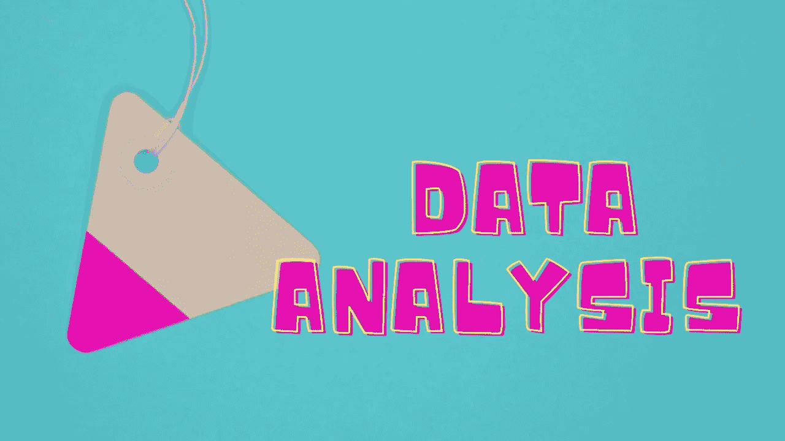
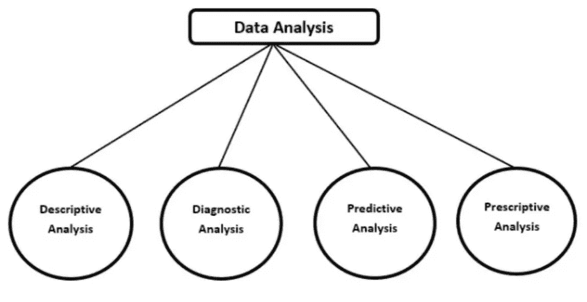
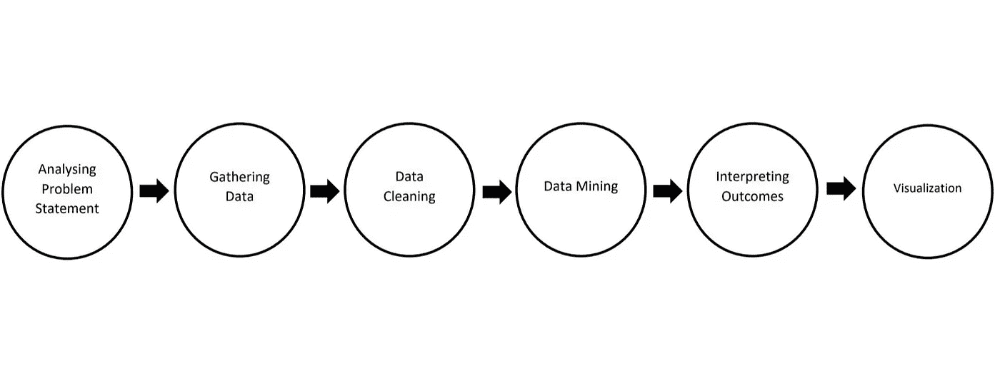

# 数据分析快速指南

> 原文：<https://medium.com/codex/a-quick-guide-to-data-analysis-87bdb124dc0e?source=collection_archive---------25----------------------->

## 药典

数据是储存在计算机中的信息。它可以是文本文件、图像、视频、音频、软件程序、社交媒体帖子或其他类型的数据。在使用这些数据得出结论之前，最重要的是分析这些数据并使其适合于做出预测。

> 数据分析

它是数据经过各种过程的旅程，如收集、清理、分析和挖掘。它包括解释结果和与用户交流发现。

> 数据分析的类型

*   描述性分析——为找到“发生了什么？”这个问题的答案而进行的分析。它考虑过去的见解。
*   诊断分析——它基本上提供了“为什么会发生”这个问题的答案。它考虑描述性分析的结果，并深入到根本，找到最终输出的原因。
*   预测分析——这样做是为了回答“接下来会发生什么？”。它通常使用诊断分析的趋势来预测未来的结果。
*   规定性分析——它告诉我们“对此应该做些什么？”。它分析过去事件的洞察力，并生成不同项目的可能性。

> 数据分析过程

> 步骤 1:分析问题陈述

该流程是后续步骤的基础步骤。在这一阶段，将决定测量什么以及如何测量。它包括对问题的理解和结果应该是怎样的。它包括为期望的输出定义用例。

> 步骤 2:收集数据

它包括识别所需的数据，通常是分析所需的数据类型。此时，用户选择从哪里访问数据的源。各种数据源是数据仓库、数据库、数据湖、数据集市、大数据存储。

> 步骤 3:数据清理

现在数据可供用户使用，下一步是清理数据。它包括修复不规则性，处理缺失值、空值、不完整数据和异常值，以便进行更准确的分析。这可以通过各种技术工具来实现，如 Excel Power Query、电子表格、Python 等，每种工具都有自己的应用程序集。

> 步骤 4:数据挖掘

这一步包括从处理过的数据中提取知识。它包括各种技术，如模式识别、统计分析等，以识别数据中的模式、相关性、变化和趋势。通常使用各种软件工具完成，包括电子表格、R 语言、Python、SPSS。

> 步骤 5:解释结果

这包括对结果和环境或限制的解释，在这种情况下，对于给定的用例，分析可能不成立。它包括评估上述分析是否能抵御反对意见。

> 第六步:视觉化

这是数据分析的最后也是最重要的一步。可视化的结果，以便最终用户可以很容易地理解的见解是同样重要的数据预处理。结果通过图形、图表和地图等视觉元素传达。有各种可视化库，如 Matplotlib、Seaborn、Plotly 等等。

> 结论

处理原始数据并将其转换为有用的见解是数据分析的全部内容。该数据管道对于得出结果以及基于预处理数据做出未来预测是必不可少的。它有利于实时预测和监控各种活动。它有助于通过减少导致优化的错误来消除风险。

> 参考

*   [https://www . coursera . org/learn/introduction-to-data-analytics](https://www.coursera.org/learn/introduction-to-data-analytics/home/welcome)
*   https://en.wikipedia.org/wiki/Data_analysis