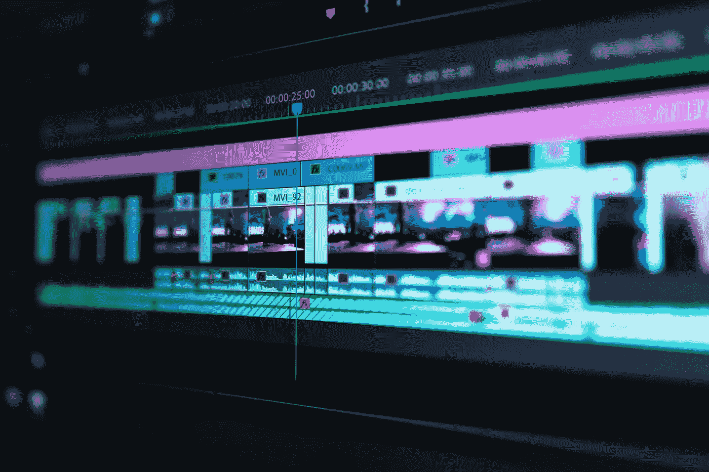

# FFmpeg 快速指南

> 原文：<https://medium.com/codex/a-quick-guide-to-ffmpeg-bed33bc0bc03?source=collection_archive---------3----------------------->

在 [Unsplash](https://unsplash.com/) 上由 [peter_s](https://unsplash.com/@peter_s) 拍摄的照片

FFmpeg 是一个强大的库和工具集合，允许你处理媒体文件。您可以使用它在不同格式之间转换视频文件，使用不同的编解码器重新编码视频文件，从视频文件中提取图像帧，等等。

# 装置

[FFmpeg 可以在多个平台上使用](https://ffmpeg.org/download.html)，包括 Windows、macOS 和各种 Linux 发行版。