# 将游戏推向市场——向谷歌 Play 商店发布游戏的快速指南

> 原文：<https://medium.com/codex/a-quick-guide-to-publish-a-game-to-the-google-play-store-8d503e6aec1d?source=collection_archive---------12----------------------->

在这篇文章中，我将向你展示如何将你的游戏发布到谷歌 Play 商店。

第一步是去 [Google Play 控制台](https://play.google.com/console/about/)注册一个开发者账户。填写注册表格并“点击账户并支付”，您将被收取一次性 25 美元的注册费。

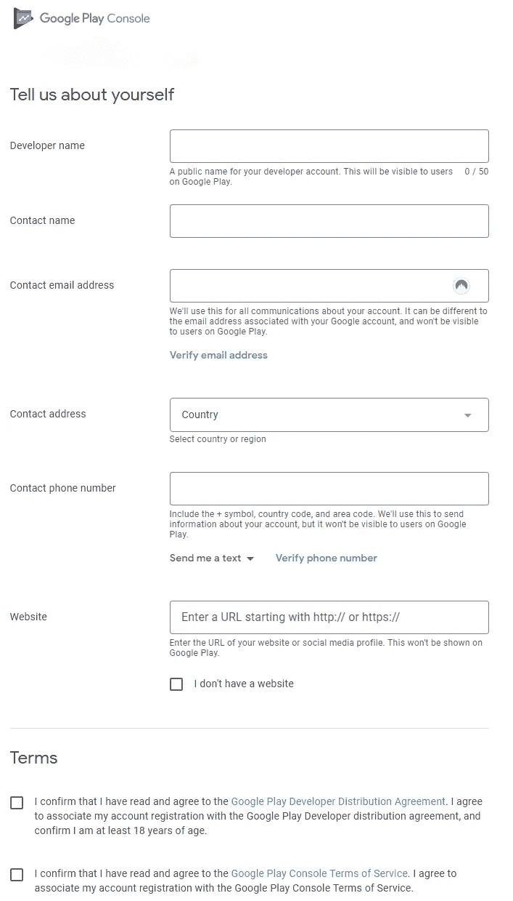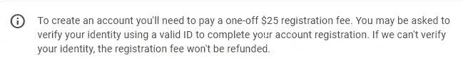

现在我们可以为商店准备游戏了。

在 Unity 中，您需要进入“编辑”>“项目设置”>“播放器”，填写公司名称、产品名称、版本和默认图标信息。

下一步是设置密钥库(这是一个安全层，Google 使用它来验证您是否有权限发布/编辑这个应用程序)。这在播放器设置中的发布设置下。

创建新的密钥库并将其保存在安全的地方。接下来，我们需要保存一个别名，所以也要填写该信息。您将看到一个确认窗口。

现在，在“其他设置”选项卡中，我们需要更改一些设置才能成功上传到 google。向下滚动到“配置”部分，检查你的“目标 API 级别”,在这篇文章发表时，它至少需要“Android 11.0 (API 级别 30)”。

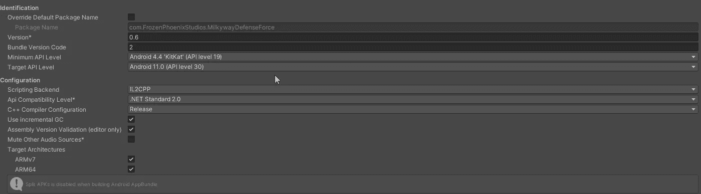

**解决 SDK 问题**

如果你没有这个选项，你需要[下载 android studio](https://developer.android.com/studio) 。

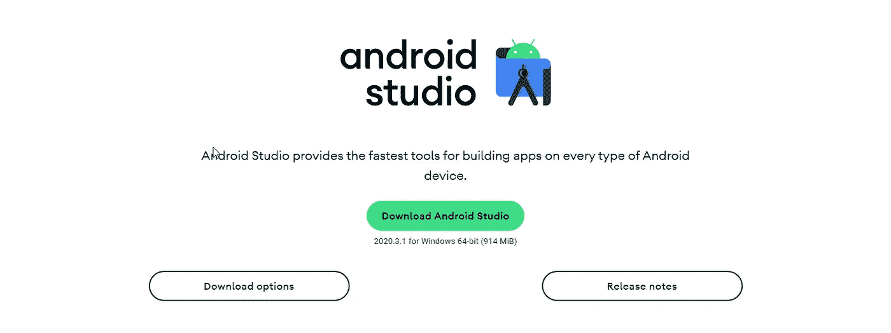

一旦你下载了 android studio，你需要打开应用程序，然后进入“工具”>“打开 SDK 管理器”。

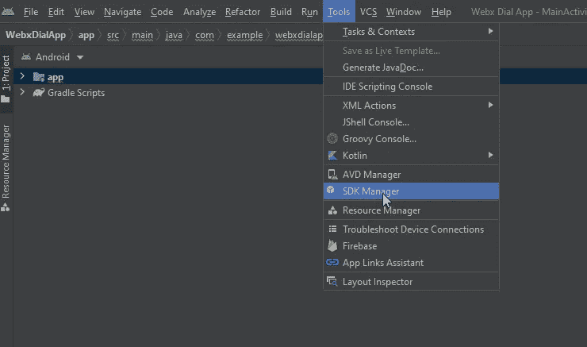

从这里你可以标记你想要下载的 android SDK 版本，然后点击应用按钮下载它们。您将看到一个确认窗口来确认您的下载。

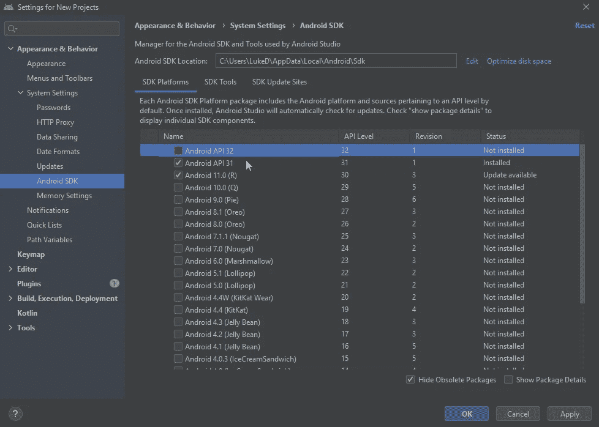

现在你已经下载了它们，点击完成按钮，然后复制“Android SDK 位置路径”并粘贴到你的浏览器中，这将打开 SDK 文件的位置。暂时把这扇窗户放到一边。

我们将把文件夹粘贴到 Unity 存储其 SDK 的位置。要在 Unity 中找到这个位置，请单击“编辑”>“首选项”>“外部工具”，在 SDK 下，您会看到一个按钮“复制路径”。单击此按钮并将其粘贴到另一个浏览器窗口中。

这将打开一个如下所示的页面。打开“平台”文件夹，然后将 android SDK 文件夹从另一个窗口复制到这个窗口。

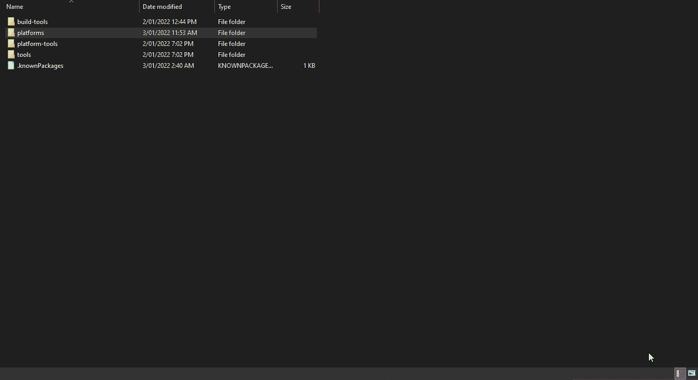

我们现在可以更改最终设置来准备您的应用程序。再次打开播放器设置，向下滚动到“其他设置”。确保你有谷歌要求的[最低目标 API(目前 API 等级 30)](https://developer.android.com/google/play/requirements/target-sdk) 。接下来，将您的脚本后端从 mono 更改为 IL2CPP，这允许我们选中 ARMv7 和 ARM64 复选框，这允许我们构建 32 位和 64 位架构。

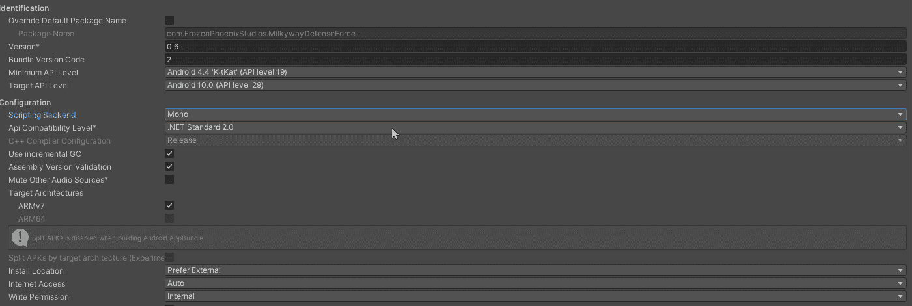

接下来，创建一个构建，方法是转到“文件”>“构建设置”，然后单击“构建”。确保选择“构建应用捆绑包(Google Play)”—这将生成一个. aab 文件上传到商店。

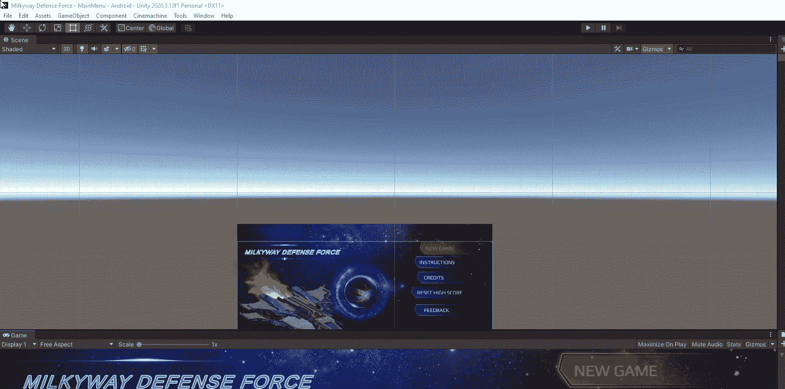

我们现在可以导航回到 google play 控制台，然后单击“创建应用程序”按钮。

你将会得到一张表格来填写你的应用程序。大部分都是不言自明的。

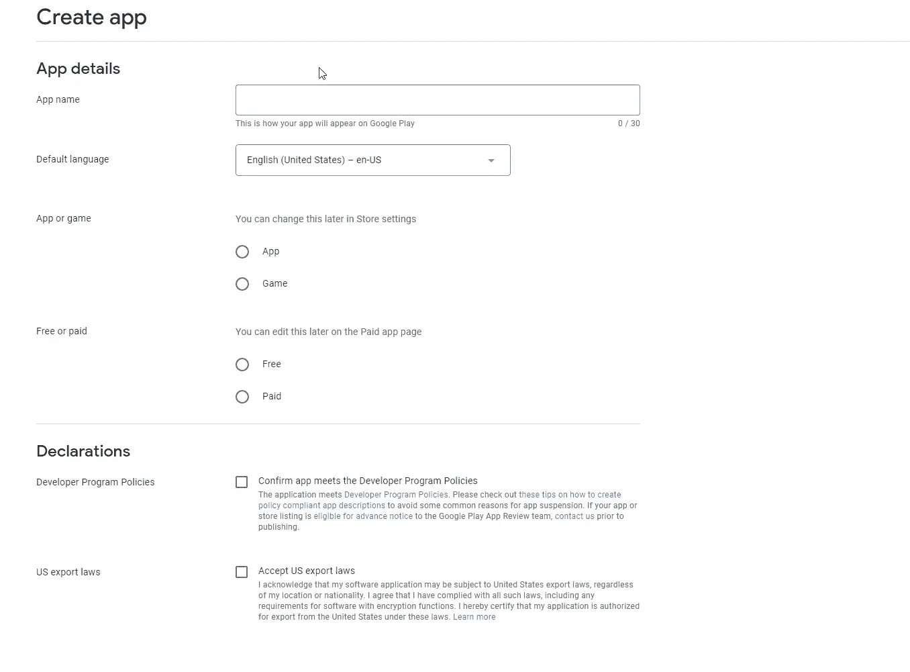

这将打开另一个页面，让您输入关于您的应用程序的信息，再次根据需要填写信息。

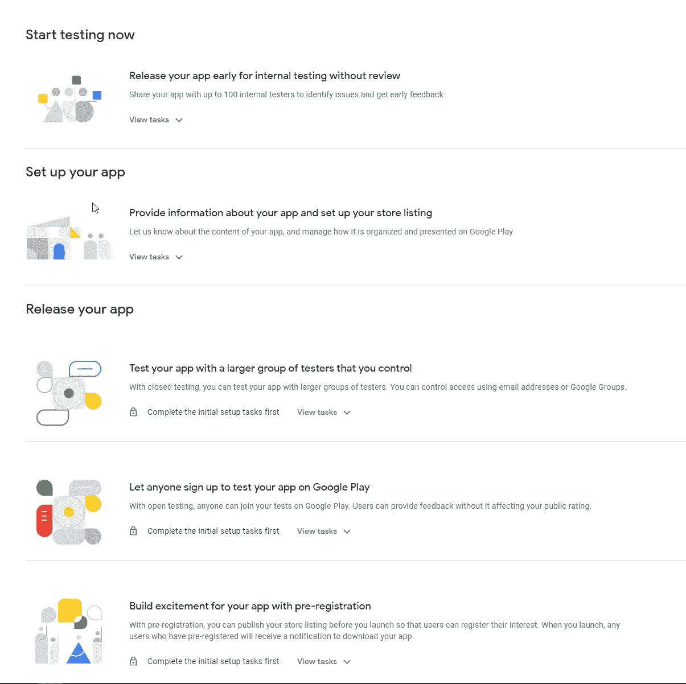

按照提示操作后，谷歌会将你的应用程序置于审核状态。对于第一次开发，这可能需要长达一周的时间才能获得批准。此过程完成且您的应用上传后，您将收到一封电子邮件。

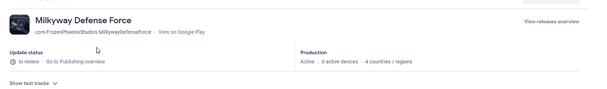

目前就这些。