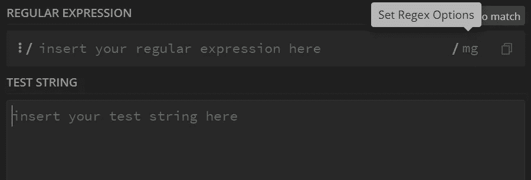
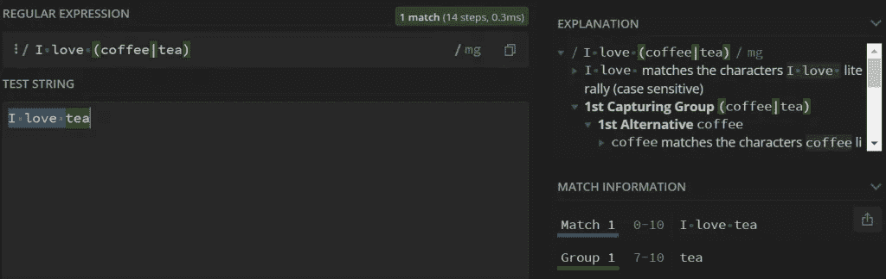

# 正则表达式快速指南

> 原文：<https://medium.com/codex/a-quick-guide-to-regular-expressions-79aafbce27a1?source=collection_archive---------8----------------------->

**正则表达式**存在于几乎所有的编程语言(Python、PHP、Javascript…)，以及 Linux 命令(grep、sed…)和许多其他高级语言和应用程序中。

那么，为什么它们会如此广泛地存在呢？它们到底是用来做什么的？我们自己如何开始使用它们呢？


在我们继续讨论这些问题之前，我将首先从房间里的大象开始，回答你应该思考的第一个问题。

# 什么是正则表达式？

一个**正则表达式**(或**正则表达式**)是一个指定搜索模式的字符串。它通常用于在执行“查找”和/或“替换”操作时匹配文本。

我知道这个定义可能会令人困惑，这使得正则表达式一开始很难理解。但是不要担心，随着本文的深入，您将很快掌握它们的用途，在本文中，我们将学习如何读写正则表达式，从简单而简短的例子开始，到更高级的模式。

# 为什么要使用正则表达式？

您可能以前在搜索查询中使用过通配符。比如搜索 **的时候。html* ，可以检索所有以*结尾的文件。html* 。

正则表达式的工作方式与此类似，只不过它们功能更强大，允许更高级的文本过滤选项。

当学习新概念时，例子比单纯的定义更有效。所以，给你。这两个例子应该能帮助你更好地理解我们为什么使用正则表达式。

*   示例 1:验证电子邮件地址

```
\b[a-zA-Z0-9_.+-]+@[a-zA-Z0-9.-]+\.[a-zA-Z]{2,}\b
```

*   示例 2:验证电话号码

```
^\+?([0-9]{1,3})?\s?\(?[0-9]{3}\)?[-\s.]?[0-9]{3}[-\s.]?[0-9]{4,6}$
```

*   示例 3:验证 IP 地址

```
\b[0-9]{1,3}\.[0-9]{1,3}\.[0-9]{1,3}\.[0-9]{1,3}\b
```

我已经能看出你眼中的困惑。但是，嘿，放心，这不是中国的。事实上，我敢说在这篇文章结束时，你将能够阅读并理解这些表达的意思。

正如您所看到的，通过使用上面的例子，我们可以检查某个字符串是电子邮件地址、电话号码还是 IP 地址。这些不是你唯一可以验证的东西。一旦你学会了如何写正则表达式，你将能够检查几乎任何类型的字符串。

*如果您想自己验证上面的例子，或者我们将在本文的其余部分看到的正则表达式模式(我鼓励您这样做)，那么您可以在*[*regex 101*](https://regex101.com/)*上这样做。这是一个有用的网站，它提供了一个交互式的正则表达式调试器，在这里你可以根据输入字符串测试你自己的正则表达式模式。*

# 正则表达式怎么写？

既然您已经亲眼目睹了正则表达式的能力，那么是时候开始学习正则表达式的艺术了。

所以，没有任何延误，你的训练现在开始。

## 文字字符

您可以编写的最基本的正则表达式就是使用您想要查找的文本字符串。

例如，使用`discovery`作为字符串:`*I made a discovery today*`的正则表达式模式将匹配单词 discovery 的彩色出现。

单词`discovery`在这个例子中只出现一次。如果这个单词出现了不止一次，那么根据使用 regex 的选项，它可能只匹配第一次出现的文字字符串。

定义这些选项(有时也称为标志)的方式因您使用的应用程序或编程语言而异，因为并非所有的 Regex 实现都是相同的。如果你只是使用 Regex101 来测试你的模式，那么你可以点击“mg”字符来设置你的 Regex 选项，如下图所示。



您可能希望设置的最重要的标志是 global(返回所有匹配项，而不仅仅是第一个)和 insensitive(执行不区分大小写的匹配)。即不区分大写和小写字母)。

标志已经足够了，让我们回到正则表达式模式。

## 字符类别

字符类用于匹配多个给定字符中的一个。要指定一个，您应该将字符括在方括号`[]`中。

例如，使用表达式`[gst]old`将与词语`gold`、`sold`以及`told`匹配。但是，不会和`gstold`搭配。

还可以在字符类中使用连字符来指定范围。例如，`[a-z]`将匹配`a`和`z`之间的所有字符(即所有小写字母)。您也可以使用`[0-9]`只匹配数字。

为了让事情变得更加有趣，您可以在一个字符类中组合所有这些范围:`[a-zA-Z0-9._-]`。该类将匹配所有小写和大写字母、数字以及点号`.`、下划线`_`和连字符`-`。

如果您觉得键入所有这些范围很累，那么您可以使用人们经常使用的速记类。您可以使用`\d`代替`[0-9]`来匹配一个数字，或者使用`\w`代替`[a-zA-Z0-9_]`来匹配一个单词字符(所有字母、数字，加上下划线字符)。

现在，尽管这些类在匹配各种类型的字符时非常强大和灵活，但它们仍然受到限制，一次只能匹配一个字符。就它们自己而言，类无法匹配整个单词。这就是量词发挥作用的地方。

## 量词

量词指定一个特定的字符或一个类在一个字符串中连续出现多少次，然后才能匹配它。

有三种主要的特殊字符可以用作量词，它们是:

*   如果前面的元素连续出现零次或多次，星号`*`提供一个匹配。
*   如果前一个元素连续出现一次或多次，则加号`+`匹配。
*   并且如果前一个元素出现 0 次或 1 次，则问号`?`匹配。

以下是一些让事情更清楚的例子:

*   `No+`将与“否”、“否”、“否”、“否”匹配...(你可以看到我要去的地方，我不需要永远继续下去)。
*   `computers?`将与“computer”和“computers”匹配(零次或一次出现字符“s”)。
*   `0*[0-9]?`将与 0 到 9 之间的任何数字匹配，无论是写成单个数字(0，1，...9)，或者以一个或多个零开始(例如 01, 0005, 003).

您还可以使用花括号`{}`来指定希望前一个元素匹配的确切次数。

和往常一样，几个例子将展示使用花括号作为量词的三种主要方式:

*   `[0-9]{5}`将匹配任何 5 位数的数字。
*   `a{1,3}nd`将与`and`、`aand`以及`aaand`匹配(即出现次数在 1 到 3 之间)。
*   并且`[a-zA-Z0-9]{8,}`将匹配任何 8 个或更多字符的字符串(当要求用户选择长度至少为 8 个字符的密码时，这可用于验证密码)。

## 组

您可以在一组字符周围使用括号来创建一个组。如果你在它后面添加一个量词，那么它将适用于整个组，而不仅仅是最后一个字符或类。

例如，`(ha){2,}`将与`haha`、`hahaha`、...(任何有笑声的时候)。

您也可以将组与交替使用。这相当于`or`操作符。

例如，`I love (coffee|tea)`将与`I love coffee`和`I love tea`匹配。

您也可以使用括号来创建捕获组。每次在表达式中使用括号时，都会创建一个捕获组。您可以将它视为一个变量，它将保存括号之间匹配的文本字符串。

回到我们之前的例子:`I love (coffee|tea)`，我们有一组括号，这意味着我们只有一个组(组 1)。如果我们对字符串运行这个正则表达式模式:`I love tea`，那么组 1 将包含字符串`tea`。

检索捕获组中包含的值取决于使用 regex 的编程语言或应用程序。但是，如果您只使用 Regex101 进行测试，那么您仍然可以在右侧的“匹配信息块”中看到它们的内容，如下图所示:



这个示例只有一个捕获组，但是您可以拥有任意多个。

## 圆点

regex 中的点`.`有特殊含义。它匹配所有字符(除了换行符)。

正则表达式模式`c.ffee`将与`coffee`、`caffee`、`c8ffee`、`c-ffee`匹配...

经常和量词(`+`，`*`，...).

正则表达式模式`.*`将匹配作为其输入给出的任何字符串。就其本身而言，它没有任何作用。然而，当与其他 regex 元素结合使用时，它可以用来填充模式中我们不知道匹配它的字符串将包含什么的任何部分。

例如，正则表达式模式`c.*s`，将匹配由`c`和`s`分隔的任何内容。

## 锚

锚点允许您根据字符串中的位置进行匹配。

使用最多的锚点有:`^`匹配字符串的开头(或者一行，如果输入字符串是多行的话)，以及`$`匹配字符串(或者行)的结尾。

正则表达式模式`^C`将匹配任何以字母`C`开头的字符串(或行)。它会与字符串`Computer Stuffs`匹配，但不会与`Doing Computer Stuffs`匹配。这是因为后者以字符`D`开始，而不是`C`。

类似地，`s$`将匹配任何以字母`s`结尾的字符串(或行)。它将匹配输入字符串:`Computers`，但不匹配`Computer`。

另一个有用的锚点是:`\b`，用来指定一个单词边界。因此，如果您使用 regex 模式`\bcomputer\b`，那么它将匹配字符串:`I own a computer`，但不匹配`I own computers`。这是因为，在后者中，在字符串`computer`之后有一个`s`字符，而不是单词边界。

## 转义元字符

正如我们在前面几节中看到的，许多字符在 regex 字符串中使用时有特殊的含义。这些是:`.+?*[](){}...`。

现在，如果我们想匹配字符串输入中的一个字符呢？

例如，如果我们想匹配一个以字符`+`开头的电话号码，该怎么办？如果我们使用 regex 字符串`+[0-9]{15}`，那么这会产生一个错误。这是因为我们使用了`+`符号，而没有量词所适用的前置元素。

为了绕过这一点，并强制将这些元字符解释为文字字符，我们可以在它们前面使用`\`。因此，在我们的例子中，应该使用的字符串是`\+[0-9]{15}`。

*注意，上面的正则表达式模式过于简单。它将无法匹配包含连字符的电话号码。对于这个例子，它被简化为只匹配以* `*+*` *开头的电话号码，后面是 15 位数字。如果您想要一个更准确的电话号码验证正则表达式，可以看看本文前面提供的例子。*

# 结论

我们已经到了本文的结尾，现在您应该能够编写自己的正则表达式模式来满足您的需求。我邀请您回到本文开头提供的例子，尝试并理解它们为什么有效

如果您想进一步挑战自己，也可以尝试编写正则表达式来验证日期、信用卡号和检查密码的复杂性。这些应该够你忙一阵子了。

*原载于 2021 年 9 月 26 日*[*【https://patchthenet.com】*](https://patchthenet.com/articles/a-quick-guide-to-regular-expressions/)*。*