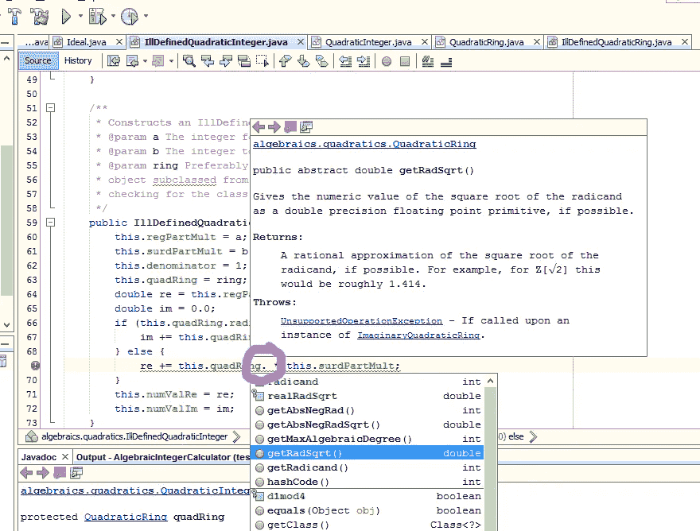

# Javadoc 的快速入门

> 原文：<https://medium.com/codex/a-quick-little-primer-on-javadoc-d04e3bd98c46?source=collection_archive---------3----------------------->

## [法典](http://medium.com/codex)

为您的库或 API 编写文档可能是一件令人头疼的事情。也许你对 API 做了一个改变，你推迟了打开你正在写文档的单独的文件。然后你从来没有更新，接下来你知道，人们使用你的 API 感到困惑。

不一定要那样。使用像 Javadoc for Java 这样的工具，您可以编写…