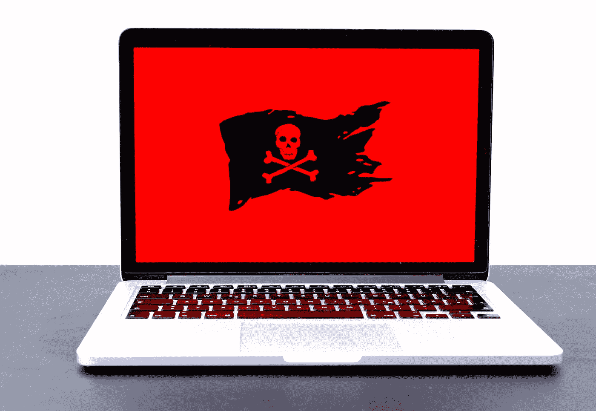

# 一个勒索软件攻击暴露了 50 万芝加哥学生的个人信息

> 原文：<https://medium.com/codex/a-ransomware-attack-exposes-the-personal-information-of-500-000-chicago-students-9125ebdea219?source=collection_archive---------20----------------------->

## 继 12 月对其供应商 Battelle for Kids 进行勒索攻击后，芝加哥公立学校经历了一次巨大的数据泄露，暴露了近 50 万名儿童和 6 万名员工的数据

迈克尔·盖格在 [Unsplash](https://unsplash.com?utm_source=medium&utm_medium=referral) 上的照片