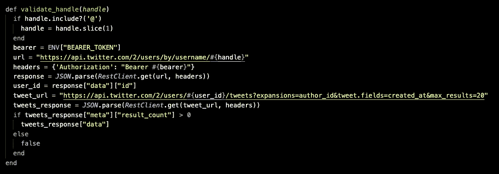

# 基于 Twitter API 构建的 React 单页面应用程序

> 原文：<https://medium.com/codex/a-react-single-page-application-built-on-the-twitter-api-ea9518beab09?source=collection_archive---------4----------------------->

本帖涵盖的技能、语言和软件包:

*   反应
*   Redux
*   反应路由器
*   Redux Thunk
*   Twitter API
*   Ruby on Rails API
*   网络云


FlockWords:一个带有 Ruby on Rails 后端的 React 单页应用程序。

本文中的代码示例:

*   React 容器组件设计模式
*   有状态与无状态 React 组件
*   Rails API 作为 Twitter API 数据检索和处理的代理服务器
*   构建 React 单页面应用程序

这个项目的目标是使用 React 创建一个用户界面，用于可视化分析多达四个 Twitter feeds，作为一个动态创建的 wordcloud。为了实现这一目标，必须完成三个主要步骤:

1.  访问 Twitter API
2.  在 Rails 服务器中操作和存储数据
3.  在 React 前端显示处理后的数据

# 访问 Twitter API

Twitter 要求用户拥有一个开发者账户来访问它的 API。现有的 Twitter 账户可以用来注册一个开发者账户。Twitter 要求用户回答几个关于他们是什么类型的开发人员的问题(学生、专业人员等)。)以及他们需要什么类型的发展账户。我选择了专业开发人员和标准(非商业)帐户。一旦开发人员帐户就位并且凭证得到验证，就必须指定一个应用程序，以便 Twitter 可以发布 API 密钥、秘密和不记名令牌。

Twitter 最近发布了他们的 v2 API，以及一个名为 Projects 的新开发工具。为了使用 v2 端点，开发人员必须创建项目，其中可以包含单个应用程序。推文上限和其他端点限制适用于项目级别。要了解更多关于 Twitter 开发者空间的项目和应用，请查看[文档](https://developer.twitter.com/en/docs/apps/overview)。

为简单起见，该应用程序所在的项目也被称为 FlockWords(这个想法是由一小群 Twitter 用户创建的 wordcloud)。从开发者仪表板，用户可以访问他们的项目/应用程序，还可以检查所有端点的推文限制的接近度。


Twitter API 文档使得访问变得相当容易，只要开发人员已经熟悉 API 的用法。对于这个项目，我使用 gem rest-client 从 Ruby on Rails 服务器进行 API 调用。我更喜欢从 React 前端进行调用，因为它速度快得多，并且将处理能力的责任放在了客户端，但是 React 没有隐藏 API 键或其他敏感信息的真正方法。

> React 没有真正的方法来隐藏 API 键或其他敏感信息。

尽管秘密和密钥可以隐藏在一个. env 文件中，并远离 GitHub，但是当 React 应用程序运行时，环境文件仍然嵌入到客户端中。这首先会使使用. env 的安全性失效。因此，在这种情况下，Rails 服务器实质上是调用 Twitter API 的代理。Rails 服务器并不是保护敏感信息安全的完美解决方案，但它比客户端方法更安全。

# 构建 Rails 服务器

Rails 服务器是使用 API 标志生成的。我以前在这里写过这个过程[。对于这个项目，在生成 API 构建之后，使用以下通用模式搭建了 Feed 和 Tweet(以在 API 构建下生成路由、迁移、模型和控制器):](https://hanreitz.medium.com/building-a-javascript-single-page-application-with-rails-api-a8e5945128a9#61fe)

```
terminal $ rails g scaffold Tweet content:string twitter_id:string
```

无需添加表列字段即可使用 Scaffold 仍然会生成所有相关的文件，但是迁移应该在运行之前用列名进行更新。

除了由 scaffolding Feed 和 Tweet 创建的样板代码之外，这个应用程序示例需要连接到 Twitter API，并使用存储在. env 文件中的秘密信息获取数据。为了在轨道上做到这一点:

*   将“gem dotenv”添加到 gem 文件中
*   运行捆绑包安装
*   补充。env 到。Git 在运行任何新的 Git 推送之前忽略文件
*   创造。Rails 服务器根目录中的 env

约定是将秘密信息添加到。Ruby 常量样式的 env 文件(全部大写):

```
API_KEY = uHoHnOwThEyKnOw1234
API_KEY_SECRET = I'vegotasecretasecretsecret
BEARER_TOKEN = AAAAAAAAAAAAwhydoTwitterbearertokensscream?
```

通过使用 ENV["API_KEY"]等任何需要值的地方，可以在应用程序的其余部分访问这些信息。

这个项目中的 Rails 服务器在接收到前端用户输入的 Twitter 句柄时，发起对 Twitter API 的调用。尽管 v2 API 有一个端点，可以根据用户名检索用户的推文，但在撰写本文时，该端点还没有运行。因此，使用自定义函数，首先通过用户名端点对用户的调用来验证句柄:

```
https://api.twitter.com/2/users/by/username/:username
```

如果句柄返回有效，那么同一个定制函数将使用第一次调用返回的 user_id 进行第二次调用，以检索现在已验证的 Twitter 用户的 Tweets:

```
https://api.twitter.com/2/users/:user_id/tweets
```

我使用了 Twitter API 提供的一些[扩展](https://developer.twitter.com/en/docs/twitter-api/tweets/timelines/api-reference/get-users-by-username-username-tweets)来将 author_id 和 created_at 字段添加到数据中，同时将 Tweets 的数量从 10 条增加到 20 条。从那里，FeedsController#create 调用定制函数，创建 Feed 对象及其相关 Tweets。当用户删除一个 feed 时，后端也会删除它和相关的 Tweets。



RestClient 调用 Twitter API 的自定义句柄验证函数。

Rails 服务器完成的另一项关键工作是将 Tweet 字符串处理成数据，以备 ReactWordcloud 在前端使用。为此，我使用了一个自定义方法 TweetsController#get_data，以及它自己的路由。前端使用自定义的“/data”路由调用服务器，提供的响应是一个包含 Tweets 中所有单词(除了常见的单词，如“The”)及其各自计数的对象。ReactWordcloud 能够直接使用这个对象进行渲染。


TweetsController#get_data 方法，排除列表和过滤的单词因大小而被截断。

> 注意:最初，我在 React 中编写了 Tweet 数据处理，但是 spec 要求在前端进行最少的数据处理，所以我将它移回了 Rails 服务器。如果完全由我决定，我会将这种数据处理移回 React，因为它的速度比 Rails 快。

# 在 React 中显示数据

前端实现了两个关键目标:它允许用户输入 Twitter 句柄，然后显示这些 Twitter 句柄的 feed 和 wordcloud 贡献。为了创建我的前端应用程序，我使用了 [create-react-app](https://reactjs.org/docs/create-a-new-react-app.html#create-react-app) 。

```
terminal $ npx create-react-app flock-words-client
```

使用 create-react-app 意味着不必手动配置 Webpack 和 Babel，以及其他东西(如 ESLint)，这意味着从没有代码快速转移到一个工作的 react 应用程序。关于 create-react-app 的一些优点，请查看 [Create React App 开发页面](https://create-react-app.dev/)。当然，将所有东西都设置为某个默认标准也会给一些开发人员带来问题。关于为什么不使用 create-react-app 的对比，请看这篇[文章](https://dev.to/nikhilkumaran/don-t-use-create-react-app-how-you-can-set-up-your-own-reactjs-boilerplate-43l0)。

在创建了 React 前端之后，我构建了容器组件结构。应用主页有三个容器组件:FeedsContainer、TweetsContainer 和 WordcloudContainer。只有这三个组件是有状态的，连接到 Redux 并将必要的数据作为 props 向下传递给它们各自的组件。


TweetsContainer，React 中容器组件的一个例子。

在上面显示的 tweetsContainer 示例中，Tweet 组件是用 key 和 Tweet 的属性呈现的。在 tweet 组件中，这些道具用于呈现每条 Tweet 的文本。


Tweet，React 中功能组件的一个例子。

无状态的功能组件本质上比连接的容器组件更短、更清晰。应用程序的大部分由这些简短、清晰、模块化的组件组成。甚至出现在每个提要上方的删除按钮也是功能组件，从它们的父级 FeedsContainer 传递 deleteFeed 属性。结果是一个清晰的“命令链”,其中容器组件管理数据并将数据传递给下属的功能组件。Redux 将任何组件连接到状态的能力允许容器组件出现在站点结构中的任何地方，甚至在其他功能组件的“下面”。恰当的例子是:TweetsContainer 组件实际上是由 functional Feed 组件呈现的。


由无状态组件呈现的有状态组件。

在这个单页应用程序中“隐藏”的另一个关键技术过程是 react-router-dom 中的 React 浏览器。这允许用户像浏览多页站点一样浏览单页应用程序。为了使用 BrowserRouter，我使用 yarn 添加 react-router-dom，然后在 App.js 中导入 BrowserRouter 和 Route。

```
import Header from './components/Header'
import Navbar from './components/Navbar'
import { BrowserRouter as Router, Route } from 'react-router-dom'
import Homepage from './components/Homepage'
import DataContainer from './containers/DataContainer'
import AboutPage from './components/AboutPage'function App() {
  const info = console.log(process.env)
  return (
    <div className="App">
      {info}
      <Header />
      <Router>
        <div>
          <Navbar />
          <Route exact path='/' component={Homepage} /> 
          <Route exact path='/data' component={DataContainer} />
          <Route exact path='/about' component={AboutPage} />
        </div>
      </Router>
    </div>
  );
}export default App;
```

我将路由定义为精确的路径，以确保当用户导航到这些路由时，只显示指定组件的内容。我希望导航条显示在每一页上，所以我把它放在所有没有指定路径的单独路线的上面。为了创建有效的导航栏链接，我在我的 Navbar 组件中定义了一个带有名称和路径的对象数组，然后在组件中将该数组的映射呈现为 NavLinks:

```
import React from 'react'
import { NavLink } from 'react-router-dom'const navbarItems = [
  {
    name: 'Home',
    route: '/'
  },
  {
   name: 'Data',
   route: '/data'
  },
  {
    name: 'About',
    route: '/about'
  }
]const Navbar = () => {
  return (
    <div className='navbar-container'>
      {navbarItems.map(item => <NavLink to={item.route} className='navbar-item'>{item.name}</NavLink>)}
    </div>
  )
}export default Navbar
```

例如，考虑这里显示的'/data '路由。在上面的 App.js 代码中，数据路由指向正在呈现的 DataContainer 组件。DataContainer 使用 getData 动作创建器在组件挂载后访问 Rails 服务器，并获取页面显示所需的数据。

```
export const getData = () => {
  return (dispatch) => {
    dispatch({ type: 'LOADING_DATA' })
    fetch('[http://localhost:3000/data'](http://localhost:3000/data'))
    .then(resp => resp.json())
    .then(data => dispatch({
      type: 'ADD_DATA',
      data: data
    }))
  }
}
```

一旦承诺完成，reducer 就会根据链接到 fetch 请求的最终“then”中调度的动作将数据添加到状态中。然后，DataContainer 组件可以呈现在所有提要中使用了五次或更多次的单词表。所有这些操作只需要在调用 ReactDOM.render 的文件(在本例中是 index.js)中导入一次 Redux 和 React-Redux 库。

```
import React from 'react';
import ReactDOM from 'react-dom';
import './index.css';
import App from './App';
import { Provider } from 'react-redux'
import { createStore, applyMiddleware } from 'redux';
import thunk from 'redux-thunk'
import rootReducer from './reducers/rootReducer'const store = createStore(rootReducer, applyMiddleware(thunk))ReactDOM.render(
  <Provider store={store}>
    <App />
  </Provider>,
  document.getElementById('root')
);
```

在这个概述中，演示了从 Twitter API 到 Rails 代理服务器，再到 React 前端的 Twitter 数据可视化分析应用程序的完整开发。应该清楚的是，虽然这个项目需要努力和创造力，但即使是那些刚刚开始使用 Rails 或 React 的人，如果他们使用这里描述的工具，也可以编写类似的东西。允许的预配置，尤其是 Rails scaffolding 和 create-react-app 允许的预配置，让开发人员可以快速启动并运行，并继续处理代码中比配置更有趣的问题。

如果你想了解更多或者运行这个应用，点击这里查看 Rails 服务器[，点击这里](https://github.com/hanreitz/flock-words-api)查看 React 前端[。](https://github.com/hanreitz/flock-words-api)