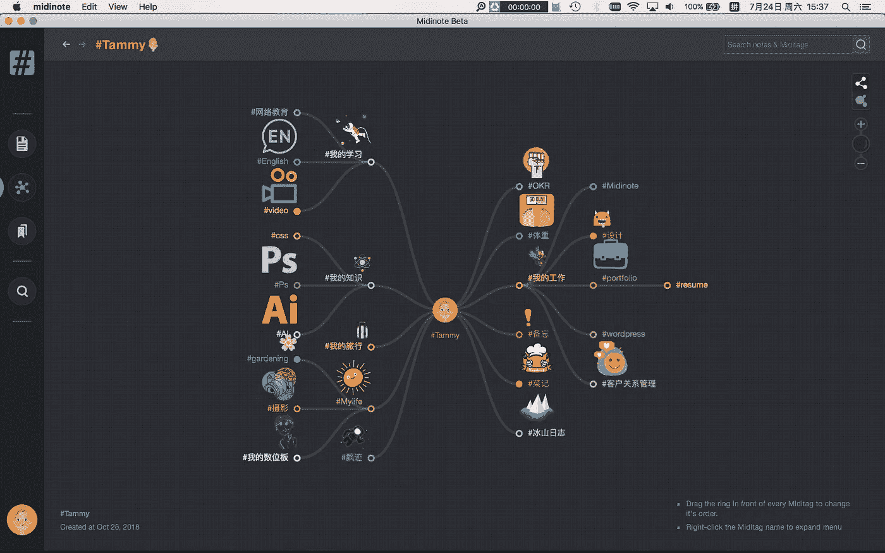
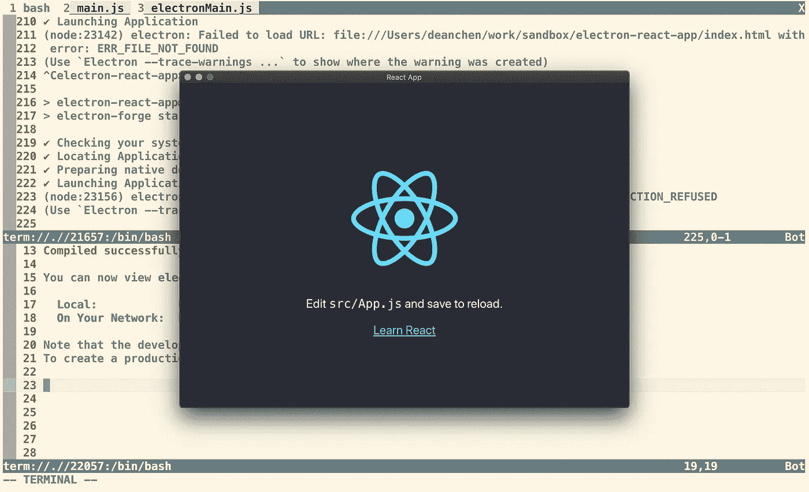
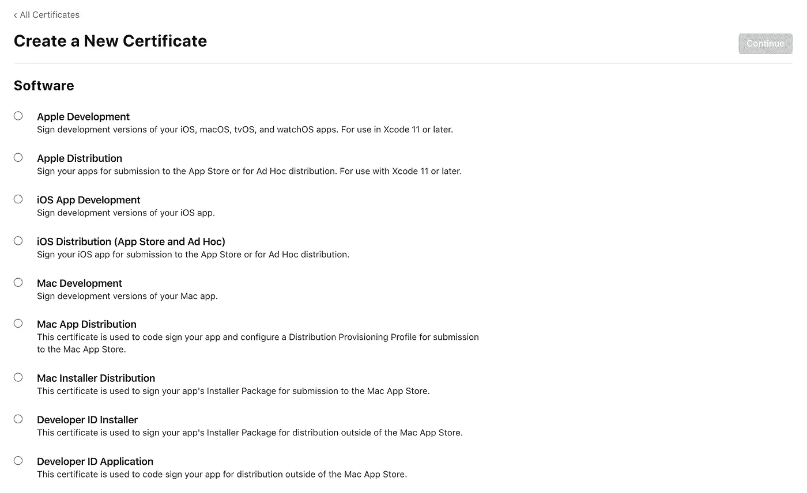
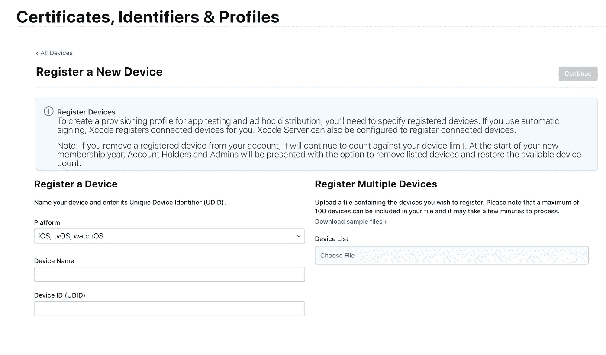

# 一个构建电子应用的真实例子:从零开始到发布，以及所有这些问题

> 原文：<https://medium.com/codex/a-real-example-of-building-electron-app-from-scratch-to-release-and-all-those-gotchas-36511d1e6eaa?source=collection_archive---------1----------------------->

我不是一个阅读和编写图书馆教程的爱好者，我更喜欢阅读官方文档，我认为这是学习东西的最好方式，而不是阅读一些二手教程。但是当我试图构建自己的产品时:由 React 编写并由[电子](https://electronjs.org/)包装的 [Midinote](http://www.midinote.me) 。我读了几乎所有的官方文件，但仍然很难把事情做好，官方文件似乎没有很好地组织起来，特别是对于它使用的一些子模块，如[Forge](https://www.electronforge.io/)——打包和发布电子应用程序的库——看起来像是在做一个益智游戏。事情不应该是这样的，它只是一个工具，对人来说应该越简单越好，我们需要用有限的精力去处理编程中真正辛苦的工作，对吧？

使用 electronic 构建应用程序很难的另一个原因是，它涉及到应用程序规范的一些概念和在不同平台(如 macOS、Windows、App Store)上发布应用程序的工作流程，以及对应用程序结构的一些基本理解。

所以我决定写这篇文章，它将涵盖从开发一个电子应用程序到如何发布它的整个工作流程，以及我遇到的所有麻烦。我还将沿途解释一些基本概念或结构，让您知道它是如何工作的。

我只能讲 macOS 的部分，因为我还没有在 Windows 上开发应用的经验，等我在 Windows 上开发的时候我会写这部分。

首先，这是我在 macOS 上运行的真实应用，Midinote，一个笔记应用:



运行在 macOS 上的 Midinote

而且为了简单起见，我还创建了一个示例 repo 进行演示，代码在这里:[https://github . com/dadiorchen/sandbox/tree/master/electronic-react-app](https://github.com/dadiorchen/sandbox/tree/master/electron-react-app)

# 向现有项目添加电子

在这个真实的案例中，我首先创建了一个 React 应用程序，现在我考虑用电子包装它，并将其发布到自己的网站或应用程序商店。因此，我们需要将电子和包工具 Forge 导入到现有的 React 应用程序中。

首先，让我们假设已经创建了 React 应用程序，(查看 React [网站](https://reactjs.org/docs/create-a-new-react-app.html#create-react-app)了解如何操作)，现在安装电子锻造:

```
npm install --save-dev [@electron](http://twitter.com/electron)-forge/cli
```

和

```
npx electron-forge import
```

关于`npx`检查一下[这里](https://github.com/npm/npx)。

这个命令将添加电子核心，电子锻造到项目中。

上面的命令会自动修改你的`package.json`，有些不是你想要的，它会覆盖命令`npm start`来执行 forge instant of React，把它改回来，`package.json`中的`script`部分的最终形式会是这样的:

```
"scripts": {
    "start": "react-scripts start",
    "build": "react-scripts build",
    "test": "react-scripts test",
    "eject": "react-scripts eject", "start-forge": "electron-forge start",
    "package": "electron-forge package",
    "make": "electron-forge make"
  },
```

在这一点上，仍然缺少一些东西，我们需要设置电子应用程序的入口点。

添加一行到`package.json`，在根对象下:

```
"main": "./main.js",
```

然后在项目的根目录下添加文件`main.js`:

```
// main.js// Modules to control application life and create native browser window
const { app, BrowserWindow } = require('electron')
const path = require('path')function createWindow () {
  // Create the browser window.
  const mainWindow = new BrowserWindow({
    width: 800,
    height: 600,
  })// and load the index.html of the app.
  if(ENV === "dev"){
    //for dev
    mainWindow.loadURL('[http://localhost:3000/'](http://localhost:3000/'));
  }else if(ENV === "prod" || ENV === "production"){
    //for prod
    //win.loadFile('build/index.html')const url = require('url').format({
      protocol: 'file',
      slashes: true,
      pathname: require('path').join(__dirname, 'build/index.html')
    })
    mainWindow.loadURL(url)
  }else{
    throw new Error("wrong env");
  }// Open the DevTools.
  // mainWindow.webContents.openDevTools()
}// This method will be called when Electron has finished
// initialization and is ready to create browser windows.
// Some APIs can only be used after this event occurs.
app.whenReady().then(() => {
  createWindow()app.on('activate', function () {
    // On macOS it's common to re-create a window in the app when the
    // dock icon is clicked and there are no other windows open.
    if (BrowserWindow.getAllWindows().length === 0) createWindow()
  })
})// Quit when all windows are closed, except on macOS. There, it's common
// for applications and their menu bar to stay active until the user quits
// explicitly with Cmd + Q.
app.on('window-all-closed', function () {
  if (process.platform !== 'darwin') app.quit()
})// In this file you can include the rest of your app's specific main process
// code. You can also put them in separate files and require them here.
```

对于上面的文件，我从 Electron 的[教程](https://www.electronjs.org/docs/tutorial/quick-start)中复制了代码，但做了一些调整以适应我们的情况。

现在，您可以运行这些命令来运行电子版应用程序:

```
npm start
npm run start-forge
```

您将看到类似这样的内容:



电子包裹的反应应用程序

对此有一些解释:

*   电子核心是包装 web 应用程序并在桌面应用程序中运行的真正材料。
*   电子锻造是自由包装，发布应用程序。

电子锻造公司将在引擎盖下使用/安装这些库:

*   对 lib 进行电子公证，以处理苹果公证流程，这是你想创建一个 app 时苹果需要的。
*   电子打包库将应用程序打包成操作系统要求的格式。
*   电子-OS x-sign lib 处理代码签名过程，如果你要发布 app，这是苹果需要的。

# 构建应用程序

现在，我们可以将该项目构建成一个可以在 macOS 上运行的应用程序。

首先，构建 React:

```
npm run build
```

制造电子:

```
npm run make
```

现在你会发现一个名为`out`的新文件夹出现了。找到构建的应用程序，在我的例子中，它被命名为:`electron-react-app`，双击运行它。

# 打包并签名应用程序

以上步骤只是让你尝试构建应用程序的一种方式，实际上，用这种方式构建的应用程序是不完整的，你不能用它在 OSs 上分发/发布你的软件。完整的步骤如下:

在 macOS 平台上发布 app 有两种方式:

1.  应用商店
2.  你自己的网站。

App Store 是发布你的应用程序的地方，人们可以在 macOS 上的 App Store 应用程序中找到它，并下载它。从我的理解来说，App Store 更严格。还有，如果你对你的应用程序收费，你需要按照一定的比例向苹果付费。

发布到自己的网站更自由，你自己做支付方式，所以苹果对你的 app 不收钱。

因为我的应用程序将做一些相当繁重的本地操作，如安装本地数据库，我担心如果我将它发布到应用程序商店，我会因违反苹果的一些规则而被卡住，所以我选择了后者，所以我将在本文中只涵盖这一部分，我可能会写另一个博客来涵盖当我体验它时发布到应用程序商店的工作流程。

而要发布 app，你需要两步或者说 3 步，首先你需要打包 app，这样做的一个前提是你的 app 必须通过苹果要求的所谓公证步骤。然后，你需要签署你的代码。这两者(公证和签名)都需要连接到 Apple 的云服务，并需要使用您的 Apple 开发者帐户进行设置，这意味着您需要注册 Apple 开发者会员并为设置创建一些东西，我将在以下步骤中介绍这一点:

首先，将下面的设置放在`package.json`的根对象下:

```
"config": {
    "forge": {
      "packagerConfig": {
        "osxSign": {
          "identity": "[your apple identity]",
          "hardened-runtime": true,
          "entitlements": "entitlements.plist",
          "entitlements-inherit": "entitlements.plist",
          "signature-flags": "library"
        },
        "osxNotarize": {
          "appleId": "[[](mailto:237769247@qq.com)your app ID]",
          "appleIdPassword": "[your apple ID password"
        }
      },
      "makers": [
        {
          "name": "[@electron](http://twitter.com/electron)-forge/maker-squirrel",
          "config": {
            "name": "electron_react_app"
          }
        },
        {
          "name": "[@electron](http://twitter.com/electron)-forge/maker-zip",
          "platforms": [
            "darwin"
          ]
        },
        {
          "name": "[@electron](http://twitter.com/electron)-forge/maker-dmg",
          "config": {
            "background": "./assets/b1-right.png",
            "format": "ULFO"
          }
        } ]
    }
```

在项目根文件夹下添加一个名为`entitlements.plist`的文件，内容如下:

```
<?xml version="1.0" encoding="UTF-8"?>
<!DOCTYPE plist PUBLIC "-//Apple//DTD PLIST 1.0//EN" "[http://www.apple.com/DTDs/PropertyList-1.0.dtd](http://www.apple.com/DTDs/PropertyList-1.0.dtd)">
<plist version="1.0">
  <dict>
    <key>com.apple.security.cs.allow-jit</key>
    <true/>
    <key>com.apple.security.cs.allow-unsigned-executable-memory</key>
    <true/>
    <key>com.apple.security.cs.debugger</key>
    <true/>
  </dict>
</plist>
```

让我解释一下:

*   关于 Forge 的`make` 是如何工作的

当您运行命令`npm run make`时，forge 会从`package.json`的 config → forge → packageConfig 中读取 config，`osxNotarize`用于 Apple 公证，`oxsSign`用于 Apple 代码签名，还有其他可用的设置项，实际上 Forge 会使用这些设置来调用底层库，如`electron-notarize` `electron-osx-sign` `electron-packager`，这样您就可以分别从它们的存储库中找到所有可用的设置。规则是，Forge 会将所有直接在`packageConfig`下的设置项发送给`electron-packager`命令(Forge 通过直接调用它们的命令来使用，将设置作为选项传递给命令)，Forge 会将`oxsSign`下的设置发送给`electron-osx-sign`的命令，将`oxsNotarize`下的设置发送给`electron-notarize`。

*   关于如何设置 oxsNotarize 部分:

请检查苹果公司的这份[文件](https://support.apple.com/en-us/HT204397)。

*   关于如何设置 oxsSign

请检查电子版的[文件](https://www.electronjs.org/docs/tutorial/mac-app-store-submission-guide)。

当你试图签署代码时，苹果要求你自己在苹果开发者控制台申请证书，根据你要分发的方式，主要有两种不同类型的证书，正如我所说的，应用商店和你自己的网站。选择证书的页面如下所示:



生成证书后，你需要下载并安装到你的 Mac 上，另一种方法是使用苹果的 Xcode。

请查看上面的文档，了解更多细节，你会明白你应该选择哪个选项。

*   关于`entitlement.plist`文件

这个文件是苹果需要的，苹果用它来定义这个应用程序的一些方面，比如这个应用程序将使用什么样的 OS 资源。

*   关于设备寄存器

要完成整个过程，您还需要在 Apple 开发者控制台上注册您的设备:



*   关于`makers`

上面配置中的最后一部分是`makers`，这是一个特性，或者说，一些 Forge 支持的流程步骤。将会发生的是，在打包应用程序后，Forge 将对打包的应用程序做一些额外的工作。

1.  压缩包，在上面的例子中，`@electron-forge/maker-zip`会将 app 压缩到`.zip`文件。
2.  为 macOS 建立一个可安装文件，主要是我们用一个扩展名为`.dmg`的安装文件来安装一个软件，`[@electron](http://twitter.com/electron)-forge/maker-dmg`的设置使得这种情况发生。您还可以通过设置`config-->background`在安装程序 UI 上设置背景图像

也可以只给你的用户 app 文件夹(`.app`文件夹)而不是`.dmg`文件来直接使用 app，但是在某些场景下不好，有一些限制。例如，我的应用程序无法通过这样做得到更新，因为 macOS 禁止你写/替换你的原始应用程序文件以让它得到更新，除非它在应用程序文件夹中，`.dmg`将为你解决这个问题。

注意，您需要手动安装`.dmg` maker 的库:

```
npm install --save [@electron](http://twitter.com/electron)-forge/maker-dmg
```

*   结束

通常，当您运行`npm run make`时:

1.  `npm run make`
2.  Forge 将使用适当的工具来做事:
3.  使用 appleId 凭据将您的应用程序上传到 Apple 的服务进行公证。
4.  尝试使用在苹果开发者控制台中创建的`identity`来签署代码。
5.  为应用程序创建包后，将其压缩到`.zip`并构建一个`.dmg`作为应用程序安装程序。
6.  完成后，在您的`out`文件夹中查看结果。

现在你的应用已经可以发布了。

# 发布应用程序

要使用自维护网站发布应用程序，很简单，你只需要将`.dmg`或`.zip`文件放到你网站的下载文件夹或类似`s3`的文件服务中，让人们下载。

在我的例子中，我使用 Github 的发布功能来发布新版本，因为我需要自动更新功能来升级应用程序。我使用的库:[https://github.com/electron/update.electronjs.org](https://github.com/electron/update.electronjs.org)

# 一些陷阱和提示

列举一些我遇到的问题，希望有帮助。

*   当你遇到问题时，日志总是帮助你解决问题的最好方法。

对于一个电子 app，以及打包、发布的过程，有一些不同种类的日志:

1.  安慰

传统的`console.log()`在你运行 app 的时候是看不见的。所以你需要这个:[电子日志](https://github.com/megahertz/electron-log)输出日志，默认情况下，它的日志会输出到`~/Library/Logs/{app name}/{process type}.log`

2.`squirrel`的日志

[Squirrel](https://github.com/Squirrel/Squirrel.Mac) 是 Electron 用来更新 app 的一个 lib。日志将输出到`~/Library/Caches/{app name}.ShipIt`

3.浏览器

使用 Chrome 的 devtool 检查浏览器中运行的代码的日志输出。

*   只读缓存文件问题

我在打包 app 的时候遇到了一个问题，在打包的 app 中，React build 文件夹下，也就是 React build 命令输出的文件夹下，在`node-module/.cache`文件夹下(默认情况下电子会打包整个 app 文件夹)，有一个只读文件生成，会导致一个 app 的更新失败。最后我找到的是这个模块:terser-webpack-plugin 生成的只读文件，我对此的解决方案是在打包 app 之前，在 React building 之后，插入一个命令(`rm`)来清理`.cache`文件夹。

*   虚拟机有所帮助

如果你在自己的 Mac 上做所有这些事情，安装一个虚拟机并尝试在虚拟机上安装和运行你的应用程序是一个好主意，它隔离环境，避免意外结果并保持你的主机操作系统干净，应用程序将安装在你的`applications`文件夹中，并将各种文件，如缓存，本地数据库文件存储到你的 macOS 的系统文件夹中。我使用了`VirtualBox`来完成这项工作，它非常简洁。

*   避免我正在做的方式

实际上，就导入 forge 的方式而言，我所做的不是一个好的实践，事情是，我使用 React，并且我将 Forge 导入到 React 所在的同一个文件夹中，这是有问题的:

1.  默认情况下，锻造厂会打包整个项目，这在某种程度上是不必要的，也是有风险的。像我上面提到的案例，缓存文件问题。
2.  这样，电子应用程序(main.js 和其他非浏览器部分)和反应应用程序(浏览器部分)使用相同的`package.json`和相同的依赖定义。这是有问题的，可能会导致库冲突。

因此，我将重新组织这个项目，以隔离应用程序源和包工具源，也许可以在未来与您分享新的知识。

# 结论

与使用 Xcode 这样的原始工具相比，使用 Electron 构建应用程序有一些障碍，我所做的远非完美，我所写的并没有涵盖所有这些细节，但我希望这篇文章可以为您提供整个任务的清晰路径，以避免在配置的丛林中迷失方向。

如有建议，请在下方评论。