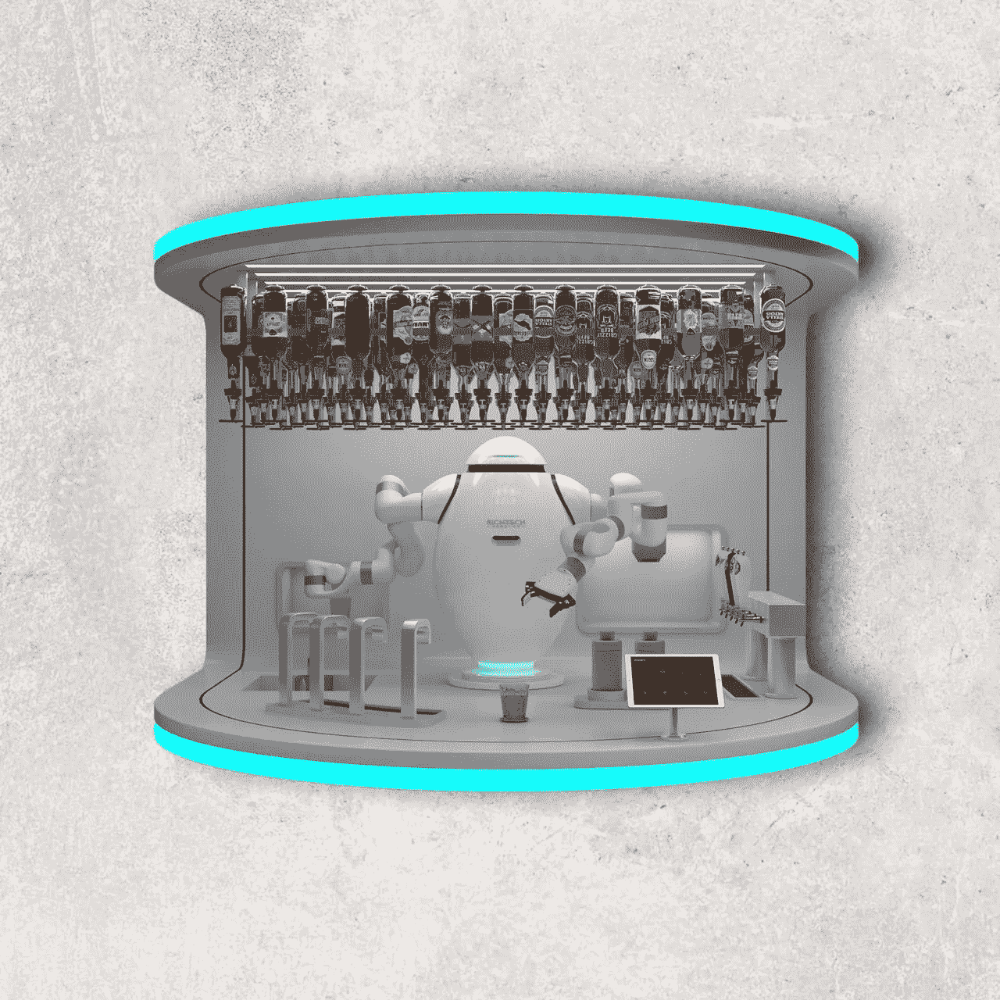

# 机器人酒保？(离得不远)

> 原文：<https://medium.com/codex/a-robotic-bartender-its-not-so-far-off-16572a24c921?source=collection_archive---------13----------------------->

## 未来就是现在！

[亚当(媒体由 Richtech 机器人公司制作)](https://static.wixstatic.com/media/01efb6_4fae4c0457264b1a8b59f7e4cec714af~mv2.png/v1/fill/w_2466,h_1270,al_c,q_95,usm_0.66_1.00_0.01,enc_auto/01efb6_4fae4c0457264b1a8b59f7e4cec714af~mv2.png)

我在以前的一篇文章中提到过通过成为调酒师在家享受昂贵的鸡尾酒。这需要一个装置，你在里面放上酒，按几个按钮，就能调制出完美的鸡尾酒。