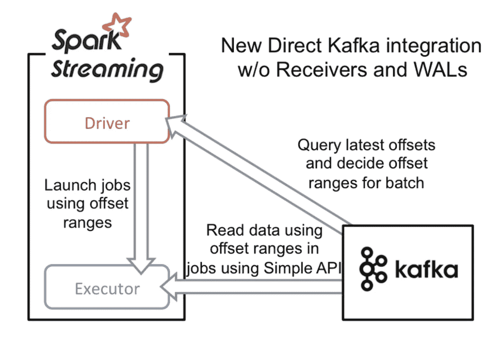
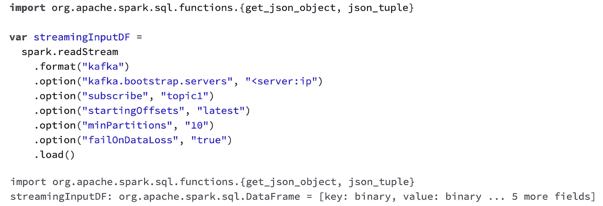
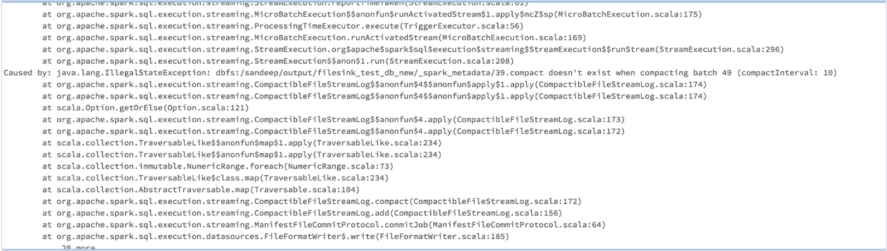
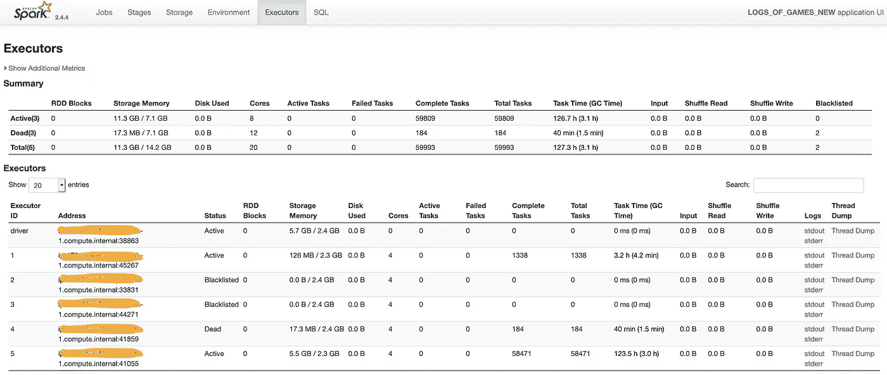

# 关于解决 Spark 流文件接收器问题的简短叙述

> 原文：<https://medium.com/codex/a-short-narrative-on-solving-spark-streaming-file-sink-problem-674f7367ae98?source=collection_archive---------18----------------------->

在工作中，我的团队一直在为批处理和流数据摄取编写大量数据管道，并在企业数据湖 S3 中维护 ETL 数据，用于各种即席分析和罐装报告。对于一家拥有数百万用户的领先游戏公司来说，我们的游戏服务器在用户在线游戏时会持续生成大量游戏事件(~ 10k/秒)，这些日志需要保存在数据湖中，以用于各种使用情形，如产品运营、CX 仪表盘、欺诈模型、游戏统计、异常检测、报告实体查找等。

设置管道的一个快速方法是使用从卡夫卡消费者那里读取的 Spark 结构化流(因为我们已经在使用 Spark ),并在 S3 上演。我们就是这样做的，在从 kafka 读取/解析数据时，我们在日期字段上创建一个分区，并在 S3 上保存为拼花格式。

火花直流

定义一个火花卡夫卡消费者

虽然这是针对特定用例(以及少数其他用例)启动并运行的，但随着这些管道被推向生产，我们很快就遇到了问题。其中一个问题是 spark 结构化流将元数据信息保存在 S3 的一个文件夹中，并在 HDFS 保存一份相同的副本，以维护偏移和模式相关信息。此元数据文件夹是 Spark SS 在运行的流作业不断更新文件夹时维护状态的方式。如果正在运行的作业出现中断，会导致状态失衡，这意味着正在运行的作业出错并停止。

使用元数据检查点时需要注意的一些事项是:

*检查点无法经受 Spark 版本升级*

在升级 Spark 版本时，您需要手动删除您的检查点。

*代码升级之间需要清除检查点*

如果您的代码库发生变化，您的检查点就会失效。

*如果作业运行之间的输出路径发生变化，检查点将无法继续运行*

点击阅读关于流文件接收器问题[的已知问题](https://kb.databricks.com/streaming/file-sink-streaming.html?_ga=2.69328528.189140751.1620891486-2088291463.1616493133)

该问题的典型错误日志

恢复作业最合理的方法是删除两个文件夹(S3 和 HDFS)并重新提交作业，但这样会破坏恰好一次的语义，因为数据是从 kafka 队列中重新读取的。这个问题有两个原因:

1.  如果起始偏移标志设置为最早，则复制写入的数据
2.  如果“起始偏移量”标志设置为“最新”，则作业未运行时会有数据丢失。

因此，为了有效地维护恰好一次的处理，我们要么需要备份元数据文件夹，要么使用 DB 来保存数据。对于我们的使用情形来说，在一个数据库上维护每天近 10 亿条记录似乎有些大材小用，因此我们尝试为元数据文件夹备份解决方案，但没有成功。

状态管理(也称为检查点)在这里是至关重要的，因为如果不知道最后读取的是哪个偏移量，我们就无法确定记录之前是否已经被处理过。并且由于流式管道遭受偶然的中断(由于基础设施问题、源的变化、模式演变等。)默认机制经常崩溃，缺点是如上所述的重复或数据丢失。

因为我们的主要要求是在保持整个管道容错的同时保持低延迟处理——这就是 lambda 架构设计派上用场的地方，我们将来自 Kafka 的数据同时馈送到批处理层(以特定间隔)和速度(流)层。然后，这些数据在服务层合并批处理和速度视图。

更多关于数据处理流水线中的 lambda 架构[这里](http://lambda-architecture.net/)。

这种设计的简单性使我们能够在 speed layer 中断的情况下返回到 batch layer 视图，并协调该小时的数据。

通过这种方法，我们能够确保整个数据管道是容错的，并可以扩展到复杂的流 ETL 用例，包括窗口和事件水印计算。

另外，我们将所有旧的流 API (Spark Dstream)管道转移到了新的 Spark API(结构化流),并将其内存占用减少了 10 倍。

我们的 spark 流作业 UI 的快照