# 商务人士对神经网络的简单解释

> 原文：<https://medium.com/codex/a-simple-explanation-of-neural-networks-for-business-people-202a3474721a?source=collection_archive---------17----------------------->

**简介**

诺贝尔奖获得者理查德·费曼说:“当我们说话不用行话时，我们就不会躲在我们不知道的知识后面。大话和浮夸的商业用语让我们无法抓住要点，也无法向他人传授知识。”

掌握人工智能神经网络的基本原理将有助于商业世界中的许多角色。然而，人工智能文章通常需要对高等数学有合理的理解，并且总是从比较神经网络和大脑的工作方式开始。本文将具体解释前馈神经网络，但不使用任何一种。

如果你以前学过人工智能，我相信你已经看到了下图。它代表了一个小型、简单、完全连接、前馈、深度神经网络。完全连接意味着每个圆都连接到下一层中的每个圆。

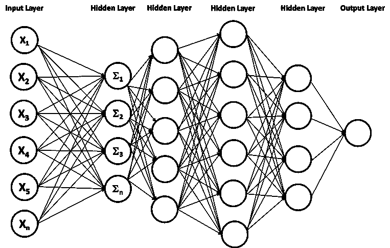

一种简单的前馈神经网络

*注意——这么小的网络不太可能。同样的结果可以从更简单的机器学习形式中得出。*

但是这个网络到底是做什么的？很简单，它产生用于分离或分组数据的线、平面或形状的数学函数。就是这样。这是神经网络的功能。诚然，典型的神经网络创建的形状是多维的，除了最聪明的人之外，不可能对所有人进行概念化。

此示例显示了一个包含两个事物的图，一个是紫色的，另一个是绿色的，还有一条线将它们分成不同的组。

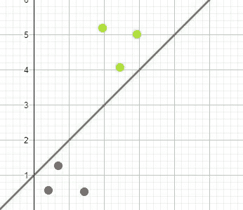

当神经网络被训练时，它在概念上学习该线的数学函数。一旦网络模型已经“学习”了线的数学函数，用户就可以输入关于事物的信息，例如坐标。系统将输出分类；这些坐标在线的右边；因此，它们代表第一件事。

神经网络在输入(特征)和输出(标签)之间建立联系。假设我试图仅从特征上区分橙子和香蕉。输入可能是对象的颜色，输出是标签香蕉或橙色，两者都是数字形式。

网络学习分隔数据(这是一只猫，这是一只狗)或拟合数据(我预测这栋房子的价格是 10 万美元)的线条或形状的数学函数。神经网络对数字执行乘法、加法和变换，数百万次，每次都改变其初始猜测以提高模型的准确性。

模型训练过程的目标是找出哪些数字(称为权重和偏差)导致网络输出与我们告诉它的答案之间的差异最小。

通过向模型显示大量数据关系的示例来训练模型。训练数据由答案和与该答案相关的输入特征组成。在下面的训练数据示例中，有两个标签(汽车、摩托车)和三个特征(身高、体长、体重)。

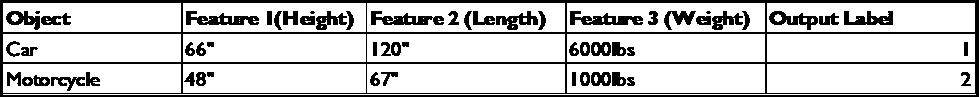

培训用数据

注意——这里的选择功能很差，会导致一个有缺陷的人工智能模型。

**它是如何工作的？**

简介中的神经网络图可能看起来很复杂，但它只是一些较小的构建块的集合，如下所示:

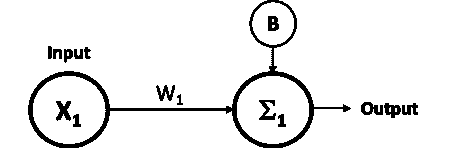

单个输入特征由 X1 表示。重量由 W1 表示。奇怪的“E”形是输入值乘以权重的结果。B 是一个称为偏差的附加值，它被加到前面的总和上。被称为加权和的结果来自以下数学函数，

**加权和=X1*W1+B**

这是每一个神经网络的核心功能。

*注意——在作为输出传递之前，加权和使用激活函数进行转换。激活功能将一个数字变为另一个数字。为了简单起见，我跳过了如何以及为什么需要激活函数的细节。*

如果我们改变前面图表中的字母并更仔细地检查，您会发现这是一条直线的函数，即加权和= X1*W1+B 与Y=MX+C 相同，其中 M 是直线的斜率，C 是 Y 轴的斜率截距。单个神经元代表一个线性函数。

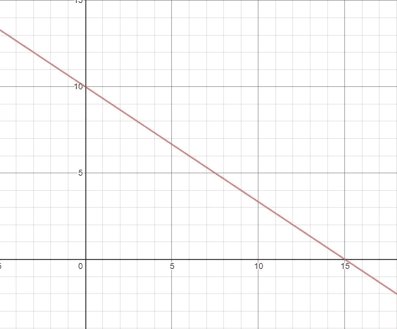

线性函数

现在，看看这个扩展的神经网络

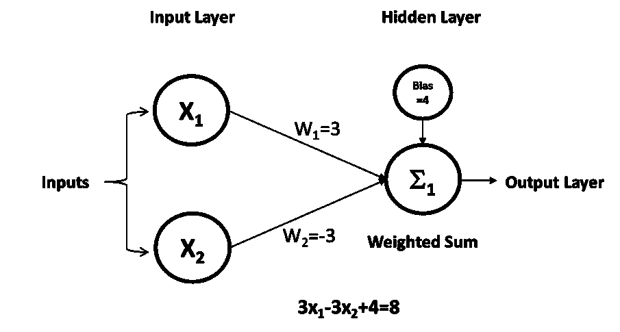

两个输入

它接受两个输入，而不是一个，如果您单独检查每个输入，您会看到结果函数是

加权和=X1*W1+X2*W2+B

我们再次改变字母，最终得到 Ax+By=C，即“标准形式”的线性函数。

**我们的线性函数有什么帮助？**

如果第一个物体代表一个弹球，第二个物体代表一个保龄球，那么区分的方法可能是比较两个特征，物体的直径和重量。保龄球比弹珠更大更重。在使用神经网络执行分类任务之前，我们需要训练模型。

**模特培训**

*以下培训描述应被视为概念性的。它会让你对神经网络的工作有一种直觉。如果使用所描述的过程来训练网络，这将导致所需计算资源的指数增长。*

我们的训练数据将使用两个可以描述保龄球和弹珠的特征，即直径和质量(我使用质量而不是重量，以消除与称为重量的网络参数混淆的可能性)。我们天真地认为，直径和质量之间的关系有一个数学函数。这可能是真的，但前提是两者所用的材料类型完全相同。

使用“W”(权重)和“B”(偏差)的随机值填充函数加权和=X1*W1+X2*W2+B。在我们的例子中，我们有两个权重；每个都可以有不同的值。这产生了对分割线的第一个猜测。我们通过获取第一个物体的两个输入特征(直径(X1)和质量(X2 ))来计算加权和，并将它们插入带有随机权重和偏差的函数中。我们来补一些数据。

W1=2，W2=3，偏差=4，对象一，直径= 7，质量=2.5

加权和= (7*2)+(2.5*3)+4，加权和= 25.5

给定数学，我们知道如果对象一的特征被绘制在二维图形中，则该点必须位于由函数加权和=X1*W1+X2*W2+B 创建的线上。这是完美的；我们已经导出了通过我们点的直线的函数。事实上，任何一组参数都会对单个点做同样的事情。当我们看第二个物体的特征时会发生什么

物体二，直径=0.5，质量=0.1

显然，如果我们像以前一样使用相同的参数将这些插入到我们的函数中，结果将会不同。得到的加权和= 5.3，不出所料，第二个图不在直线上。假设这两个特征集代表一个保龄球和一个弹球，训练目标是学习一个从这两个点等距经过的线函数，从而分离这两个对象类。这是通过调整权重和偏置参数直到消除任何误差来实现的。

这里，我们用紫色绘制了三个不同大小的弹珠，用绿色绘制了三个不同大小的保龄球。X 轴表示对象的直径(输入特征)。Y 轴是已知质量。当将这些点与计算出的线进行比较时，我们看到所有点都位于同一侧。

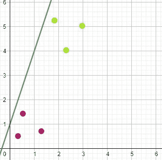

糟糕的开端

这是一个糟糕但可预见的开始。为了提高精度，或者更准确地说，减少模型误差，我们必须计算误差值。有很多方法可以做到这一点。理解是如何做到的并不重要，但它可以像测量每个点到直线的距离一样简单。

位于线错误一侧的图将具有较高的误差值，并且其距离将增加误差值。在计算误差(称为损失函数)后，一个称为梯度下降的过程确定线应该移动多少以减少模型误差以及在什么方向上移动。它以微小的步伐做到这一点。计算新行的函数。

在每一次训练运行之后，重新计算误差，并且继续进行调整，直到不能实现更多的改进。

工作模型现在允许网络预测任何未来物品的标签。换句话说，如果我输入一个物体的直径和质量，神经网络可以通过使用训练好的函数并计算我们新的未标记数据的绘图位于直线的哪一边，将该物体分类为大理石或保龄球。

显然，这种模式很糟糕。我可以输入一个轮胎的直径和质量，模型会预测它是一个保龄球。该模型从未被训练来对轮胎进行分类。这就是所谓的狭义人工智能。更准确的说，它甚至不是一个狭义的 AI。这里描述的神经网络永远不会被用来解决现实世界的问题。

在典型的应用中，数据不像我们的例子那样清晰。对于复杂数据，将错误率降至零是不可能的。此外，以尽可能低的误差为目标并不总是成本有效的。训练一个神经网络所需的能量资源、时间和金钱是相当可观的，并且将达到收益递减的点。

**多输入多层次**

事实是，将保龄球和弹珠分开的简单例子是无稽之谈。用于简单逻辑回归的神经网络没有实用价值。神经网络在更复杂的数据集上发挥了自己的作用。

回想一下神经网络的第一张简图。有许多输入值和许多附加图层。这是他们的工作。

对于 3 个特征输入，网络不再计算线来分离数据；它计算一个平面来分隔在三维空间中绘制的项目。

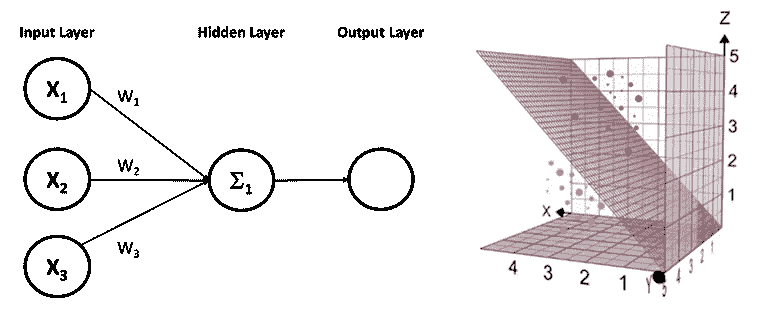

三个输入，三个维度

如果数据不能被单一平面分离，我们可以在隐藏层中添加第二个神经元，并创建第二个平面。我们简单地执行相同的功能两次，但每次都使用独立的权重和偏差值。

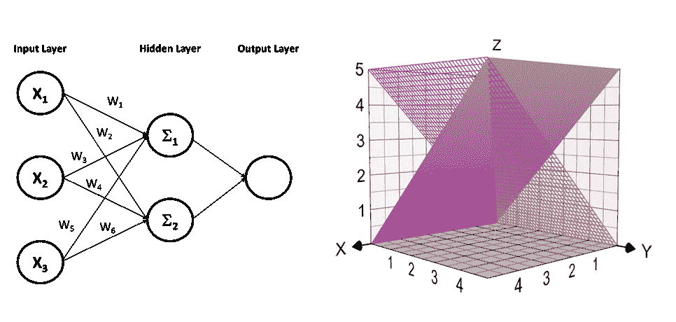

多个平面

神经网络可以近似任何数学运算，使它们能够将最复杂的数据分成组。在这个例子中，有五种不同类别的数据，

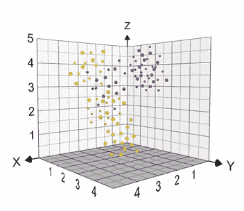

多个数据类别

很难确定需要多少个平面才能有效地将数据组从绘图中分离出来。然而，如果是三个平面，则需要隐藏层中的 3 个节点。如果是四个平面，则隐藏层中有四个节点，依此类推。

通过向隐藏层添加神经元，不仅可以创建更多的平面，而且三维功能可能实现的形状也令人难以置信。十有八九，平坦的平面不适合前面的例子。虽然仍然很简单，但是平面可以被转换以解决更复杂的挑战。

Z=X⁴-Y 函数在边缘折叠平面。

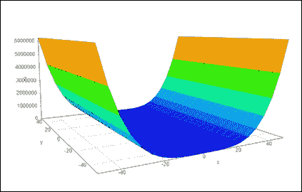

而这个函数增加了平面的复杂度。

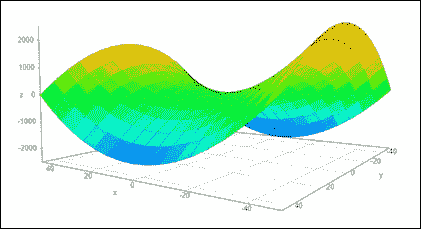

这个挠头器怎么样？

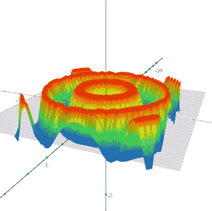

最后，

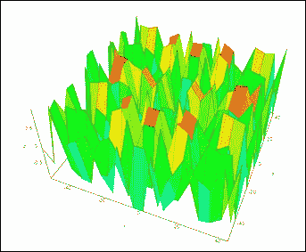

所示示例中的所有函数仅需要三个输入特征和隐藏层中的多个节点。但是，您不能使用本文中描述的线性构建块来创建非线性形状。这就是前面提到的激活函数的应用发挥作用的地方。激活函数的工作将不得不等待另一篇文章，但很简单，它们增加了神经网络的非线性。虽然我不能展示多维图形，但这是一个可以用神经网络近似的数学函数的例子:

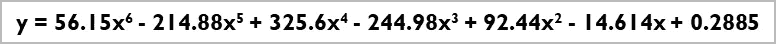

尽管看起来很复杂，但它代表了这条简单的曲线:

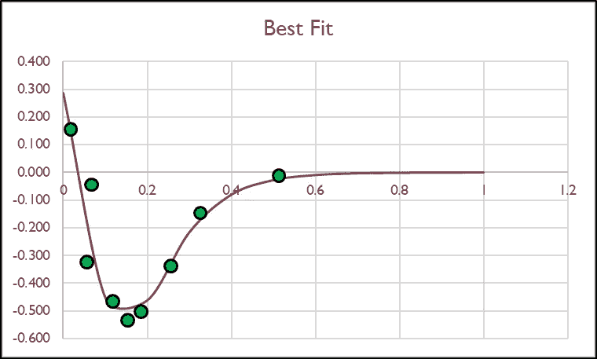

**神经网络的力量**

所示的示例函数可能看起来复杂，但是对于神经网络来说，它们并不复杂。这些情节仍然只是三维的。想象一个四维物体；对我们大多数人来说，我们不能。一个神经网络可以轻松处理四维；这是一个简单的数学过程。现在考虑一个具有数千甚至数百万个输入要素和隐藏图层的模型。

这就是神经网络的力量；它接受大量复杂的数据并发现有价值的模式。据报道，最新的变压器模型(将其视为更复杂的神经网络形式)已经使用数千亿个特征和超过 1.6 万亿个参数(简单来说，就是网络中的权重和偏差)进行了训练。无论模型有多大，从根本上说，它们都做同样的事情，通过创建复杂的形状来分离数据。