# Python 中 EDA 的简单指南

> 原文：<https://medium.com/codex/a-simple-guide-to-eda-in-python-a0dd906c1b0e?source=collection_archive---------0----------------------->


戈兰·艾沃斯在 [Unsplash](https://unsplash.com?utm_source=medium&utm_medium=referral) 上的照片

众所周知，Airbnb 已经改变了整个酒店行业，其商业性质已经使全球大量人口受益。随着当前疫情的进行，探索 Airbnb 的历史数据并分析其在疫情接管全球之前的表现将是一个有趣的话题。

在整篇文章中，我将基于纽约 Airbnb 房源进行一个简单的 EDA。

# 为什么是纽约？

纽约是 Airbnb 房源最多的城市之一，作为一座不夜城，纽约被认为是生活成本最高的城市之一；从住房，食品，和任何其他金融指标。分析纽约 Airbnb 的数据可以让我们了解当前疫情对纽约住宿业的直接影响。

# **关于 EDA**

以防万一，如果你是数据科学的新手，EDA 是一个过程，它允许我们在进一步深入之前获得数据的鸟瞰图，例如为 NLP 或 ML 实施统计技术。这个过程通常包括数据可视化，我们可以看到每个数据点之间的趋势和相关性。

EDA 中的一些步骤包括但不限于:

1.  对整个数据进行规划，了解数据的样子，这样我们就知道我们在处理什么样的数据
2.  决定哪些变量对分析有用。提取它们，丢弃那些对分析没有任何用处的
3.  检查并清除列中的格式，如日期和包含文本的列，因为有时这些列的格式不一致，包含非英语单词和许多其他单词
4.  如果您的数据包含价格和其他数字列信息，请确保它们被记录为 float64 或 int64。如果没有，请更改列的数据类型。这将防止在进行分析时可能出现的错误。
5.  检测每一列中的空值，并决定如何处理这些空值—用平均值、众数、中值或其他适当的值删除或填充它们。所有这些都取决于我们正在处理的数据集和分析的目的。在删除具有空值的列之前，我们可能想问一些问题，例如，我们有足够的样本供我们的模型依赖吗？与整个数据集相比，缺失值的百分比是多少？

# 范围

在本文中，将涉及的一些问题包括但不限于:

1.  列表价格如何随时间变化？是什么导致了他们的改变？
2.  主持人在确定挂牌价格时会考虑哪些因素？
3.  在 Airbnb 的所有功能中，哪些功能的相关性最强？
4.  纽约的 Airbnb 房产分布是什么样子的？
5.  哪个街区有最多的超级住户？他们有更高的平均价格吗？

# 1.加载数据

我将在 Jupyter 笔记本上使用 Python 进行此分析。对于本文，我将使用我清理过的“列表”数据集，它可以在这里找到[并直接进入可视化和分析。](https://github.com/fistz24/Airbnb-Analysis)

## 1.1 导入库

```
import sys
import pandas as pd
import numpy as np
import os
import io
import matplotlib.pyplot as plt
import matplotlib.colors
import plotly_express as px
import plotly.graph_objects as go
import urllib
import seaborn as sns
from collections import Counter
import cufflinks as cf
cf.go_offline()
cf.set_config_file(offline=False, world_readable=True)
```

## 1.2 加载数据集

对于这个分析，我将使用来自 insideairbnb.com 的“日历”和“列表”数据。

```
ny =pd.read_csv(“/airbnb_data_analysis/cleaned_airbnb_listings.csv”)
cal=pd.read_csv(“/airbnb_data_analysis/data/calendar.csv”)
**ny.head()**
```

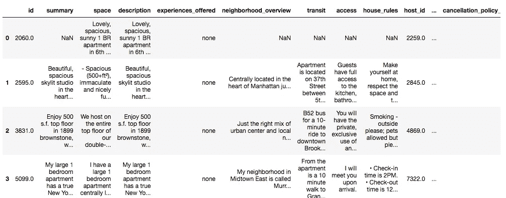

表 1。纽约“列表”的前 4 行

## 1.3 设置可视化样式

因为我们将制作大量的可视化效果，所以最好预先设置好样式。

```
#COLOR LIRABRIESAIR_GREEN = ‘#808000’
AIR_VIOLET = ‘#EE82EE’
AIR_ORANGE= ‘#FF4500’
AIR_BLUE = ‘0000FF’#setting the size for visualizationssns.set(rc={‘figure.figsize’:(10,8)},font=’sans-serif’,font_scale=1,color_codes=True)
```

# 2.数据探索

## 2.1 探索价格

人们在预订 Airbnb 房源时，最不可或缺的考虑因素之一就是价格。在得出列表价格之前，有许多考虑因素，在这里，我们将了解 Airbnb 列表价格的影响因素。

首先，我们将可视化纽约所有商品的价格分布。我通过将标价分为三类来形象化它；0 美元至 250 美元、250 美元至 500 美元以及 500 美元以上。

```
#divide prices in ny_3 into several categories#price bucket intervals
intervals = [0,250,500,1000]
category = []#set the colors for the visualization
colors = [AIR_VIOLET, AIR_GREEN, AIR_ORANGE]for i in range(0, len(intervals) -1):
 category.append(ny[(ny[‘price’] > intervals[i]) & (ny[‘price’] < intervals[i+1])])fig = plt.figure(figsize=(16,16))
ax = fig.add_subplot(212)

for i in range(0, len(category)):
 ax.scatter(category[i][‘longitude’],category[i][‘latitude’], s=3, c=colors[i])

#Add Legendslabels = []for i in range(0,len(intervals) — 1):
 if i == len(intervals)-2:
 labels.append(‘\${}+’.format(intervals[i]))
 else:
 labels.append(“\${}-\${}”.format(intervals[i], intervals[i+1]))

#Add Titles and Labels
ax.set_title(‘New York City — Airbnb Listings Prices’)
ax.set_xlabel(‘Longitude’)
ax.set_ylabel(‘Latitude’)
ax.legend(labels=labels)
```

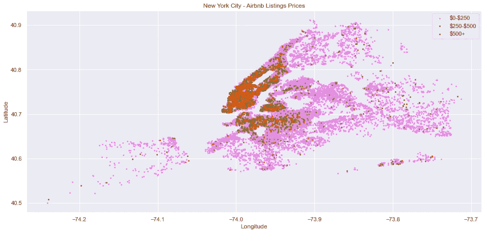

图一。纽约 Airbnb 房源的价格分布

从图 1 中，我们可以看到最贵的房源集中在曼哈顿和布鲁克林。显然，更便宜的房源位于郊区和市中心以外。不过，这些地区确实有一些价格超过 500 美元的房源。

接下来，我们要计算每种房产类型的平均价格，然后将它们绘制成图表。

```
avg_price_property = ny.groupby('property_type').price.mean()
avg_price_property = avg_price_property.reset_index()
avg_price_property = avg_price_property.rename(columns= {'price':'average price'})#plot the chart of avg_price_propertyfig3 = px.bar(avg_price_property, x=’property_type’,y=’average price’,color =’average price’,color_continuous_scale=’Tealgrn’)
fig3.show()
```


图二。按物业类型划分的平均价格

从图 2 中，我们可以看到最昂贵的资产类型是“精品酒店”，其价格远远高于均值和标准差。首先，在决定是否从数据框中删除精品酒店列表之前，最好先看看有多少列表被记录为“精品酒店”。

```
#check to see how many boutique hotels are recorded in the listings
ny['property_type'].value_counts()
```

共有 455 个精品酒店列表，使“精品酒店”成为列表数量最多的第七大酒店类型。将它们从数据框中移除会使进一步的分析不准确。我决定将它们保留在数据框中。

## 2.2 房源和价格

```
#turn ‘date’ into datetimecal[‘date’] = pd.to_datetime(cal[‘date’])#plot listings availability
grouped_cal = cal.groupby(‘date’)[‘available’].sum()
grouped_cal.iplot(kind=’scatter’, title = ‘Listings Availability’)
```

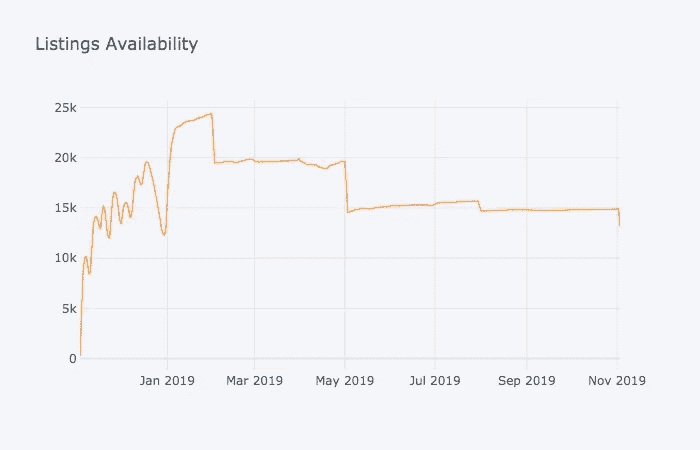

图 3

上面的图 3 反映了特定日期的可用列表数量，根据我的假设，它告诉我们关于需求的信息。

正如所见，在 12 月中旬和 12 月底之间，房源供应急剧下降，我推断这可能是由于假期季节的到来。虽然我们无法从上面的图 3 中清楚地看到 2019 年 1 月之前的房源可用性(如果你运行代码，你可以看到它，因为它是一个交互式图表)，但可用房源的数量比 2019 年 11 月的同比增长了 30%。这反映了住宿需求的减少，这可能是疫情出现的结果。为了捍卫这一论点，我们需要分析同一时间段内的价格趋势。

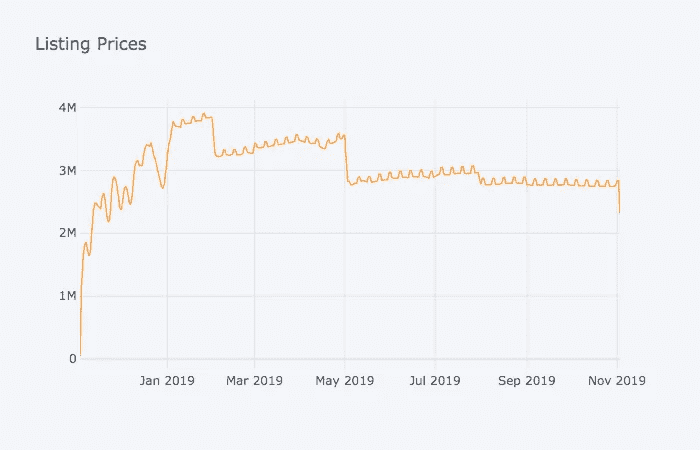

图 4

图 4 推断出与之前的“列表可用性”图表相似的趋势

## 2.3 探索价格和其他变量之间的相关性

```
#show correlations amongst numeric variables
numeric = [‘beds’,’bedrooms’,’cleaning_fee’,’accommodates’,’extra_people’,’price’]
sub_df = ny[numeric]corr = sub_df.corr()
cmap= sns.cm.rocket_r
ax = sns.heatmap(corr, annot=True, center=0, cmap=cmap, linecolor=’white’)
```

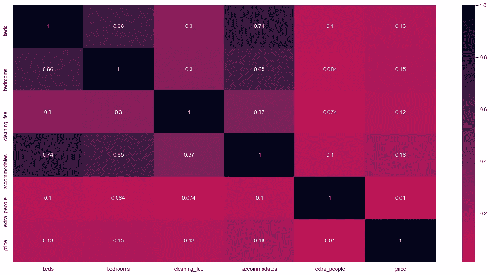

图 5。数字变量的热图

床位和价格之间以及住宿和价格之间存在适度的相关性。另一方面，cleaning_fee 和 accommodates 之间也有很强的相关性，表明主机可能会对容纳更多人的列表收费。

## 2.4 探索房源和社区

我们将按社区对列表数量进行分组，以查看总体分布情况。

```
#group neighbourhood by # of listingsneigh_listings = ny.groupby(‘neighbourhood_cleansed’).id.count()
neigh_listings = neigh_listings.reset_index()
neigh_listings = neigh_listings.rename(columns={‘id’:’Number of Listings’})
neigh_listings = neigh_listings.sort_values([‘Number of Listings’])#Plot average prices for each neighbourhoodneigh_avg_price = ny.groupby(‘neighbourhood_cleansed’).price.mean()
merged = pd.merge(neigh_avg_price, neigh_listings, on=’neighbourhood_cleansed’)
merged = merged.rename(columns={‘price’:’average price’})fig2 = px.bar(merged, x=’neighbourhood_cleansed’,y=’Number of Listings’,color =’average price’,color_continuous_scale=’Tealgrn’)
fig2.show()
```

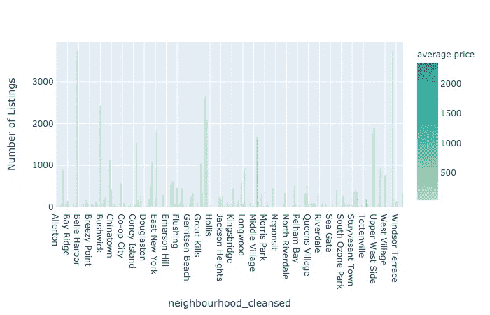

图 6。按街区分列的上市数量

图 6 显示了列表数量最高的 5 个街区是:贝德福德-斯图文森、威廉斯堡、哈莱姆区、布什维克和上西区。

从这里开始，我们可能想知道“列表数量”是否会影响列表价格。在上面的图 4 中，右边的颜色条显示了每个街区的平均价格。五个最昂贵的社区分别是伍德罗(2350 美元)、曼哈顿海滩(927 美元)、沃兹沃思堡(800 美元)、王子湾(507 美元)和中城(484 美元)。

这一发现引发了一些问题，比如，这些社区里有什么样的房产？他们有几间卧室？我们将通过合并之前创建的“合并”数据框和“ny”数据框中的一些列来找出答案。

```
host_pro = ny[[‘property_type’,’bedrooms’,’neighbourhood_cleansed’]].merge(merged[[‘neighbourhood_cleansed’,’average price’,’Number of Listings’]],on=’neighbourhood_cleansed’,how=’left’)
host_pro.**sort_values**(by=[‘average price’], ascending=False).head(15)
```

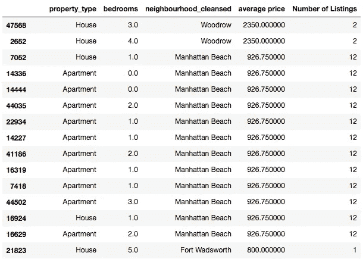

表 2

表 2 清楚地显示，最昂贵的房源主要位于住宅区，大多数房源都有 0 卧室和 1 卧室。

# 2.5 探索超级主机

Airbnb 提供了一个名为“Superhost”的计划，该计划基于 Airbnb 网站，为东道主提供了大量好处，如更高的知名度、收入潜力和独家奖励。主持人真的在乎节目吗？成为超级主持人如何影响挂牌价格？

我们首先用布尔值“host_is_superhost”对“neighbourhood _ cleansed”进行分组

```
neigh_host = ny.groupby(by=’neighbourhood_cleansed’).host_is_superhost.value_counts().sort_index()
```

输出如下图 7 所示，它看起来确实很乱，无法可视化和分析。大多数人通常在清理数据集时通过创建哑变量将‘t’和‘f’转化为数值(0 和 1)，但我觉得不这样做更方便，至少在这种情况下。

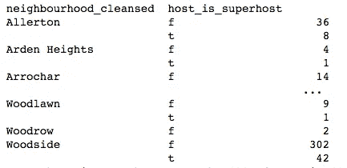

图 7

因为我想知道主持人是否认真对待“超主机”节目，我决定了解一下按社区分类的“超主机率”的百分比。

```
neighs= ny.groupby(by=[‘neighbourhood_cleansed’,’host_is_superhost’])
neighs = neighs.count()neighs['total'] = neighs.t + neighs.f#Calculate superhost percentage and add it to the 'neighs' table
neighs['superhost rate'] = (neighs.t/neighs.total)*100
sorted_neighs = neighs.sort_values(by=['superhost rate'], ascending=False)
sorted_neighs.reset_index().head(20)
```

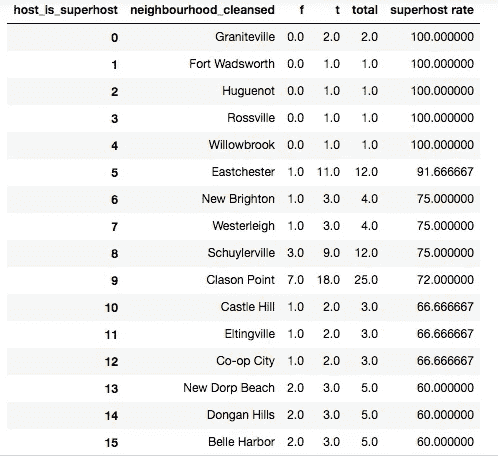

表 3

正如我们从表 3 中看到的，大多数平均价格最高的社区(如上所述)，在“超级房东”方面甚至没有进入前 15 名(除了曼哈顿海滩)。这引发了另一个问题，那些街区的排名是什么？

```
high_neighs =[‘Midtown’,”Prince’s Bay”,’Woodrow’,’Fort Wadsworth’]
sorted_neighs.loc[sorted_neighs[‘neighbourhood_cleansed’].isin(high_neighs)]
```

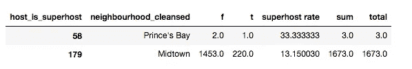

表 4

表 4 只显示了 Prince's bay 和 Midtown，因为其他邻域包含空值。位于曼哈顿中部的 Midtown 是最受欢迎的社区之一，排名第 179 位，只有 220 家房源进入 superhost。这可能是由于该酒店的地理位置，在该地区预订房源的人可能是在酒店外度过一天的游客，他们不会定期与主人联系。

知道了所有这些，为了了解我们正在处理的数据，我们想知道超高房价最高的那些房源的房产类型。

```
#find out the property type of **'neighs'** with the highest superhost ratesub_pro = ['property_type','neighbourhood_cleansed','longitude','latitude']
pro_host_rate = ny[['property_type','neighbourhood_cleansed','bedrooms','room_type','price','longitude','latitude']].merge(sorted_neighs[['neighbourhood_cleansed','superhost rate']],on='neighbourhood_cleansed',how='left')
pro_host_rate.sort_values(by=['superhost rate'], ascending=False).head(100)pro_host_rate = ny[[‘property_type’,’neighbourhood_cleansed’,’bedrooms’,’room_type’,’price’,’longitude’,’latitude’]].merge(sorted_neighs[[‘neighbourhood_cleansed’,’superhost rate’]],on=’neighbourhood_cleansed’,how=’left’)
pro_host_rate.sort_values(by=[‘superhost rate’], ascending=False).head(100)
```

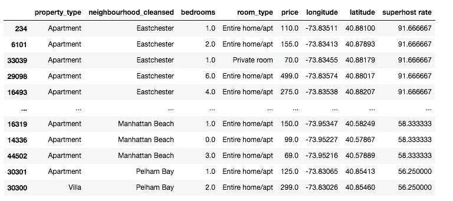

表 5

超高入住率最高的物业位于住宅区，其中大部分是公寓，平均有 2 间卧室，房型为“全屋/公寓”。这可能会引发这样一种观点，即那些预订房产的人是家庭和/或那些比那些在市中心预订房源的人更频繁地与主人联系的人。

有了这些信息，我们可能想要绘制超主机分布图。这一次，我将使用一个 mapbox，它直接将纽约地图添加到我们的代码中。

要使用 mapbox，我们只需在 [mapbox](http://mapbox.com) 上创建一个帐户并创建一个令牌。

为了使地图可读性更好，从而不那么拥挤，我将只显示超高命中率超过 30%的列表。

```
#show only rows with superhost rate more than 30%
above_30 = pro_host_rate[‘superhost rate’]>30
up_30 = pro_host_rate[above_30]#connect mapbox token with our map
mapbox_access_token = ‘pk.eyJ1IjoiZmlzdHoyNCIsImEiOiJja2J4YWxsZWkwZzl4MnBsamlhZzYzZG9lIn0.WcjiR65gcN4GubMtTjUwmw.mapbox_token’px.set_mapbox_access_token(mapbox_access_token)#map the superhost rate
fig6 = px.scatter_mapbox(pro_host_rate,lat=”latitude”,lon=”longitude”,color=”superhost rate”,zoom=3,mapbox_style=’open-street-map’,color_continuous_scale=’BuPu’)
fig6.show()
```

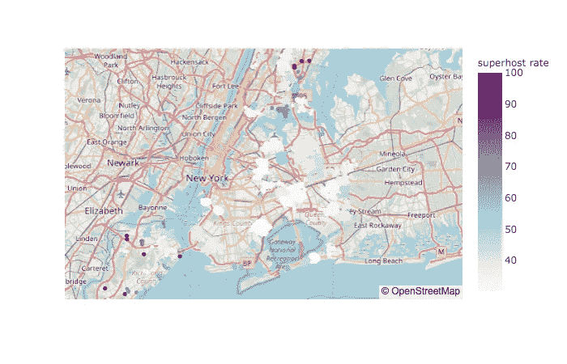

图 8

**评价**

一个简单的 EDA 使我们能够获得关于 Airbnb 功能相关性、财产分布、价格趋势和许多其他不可或缺的方面的各种见解。

从分析中，我们可以看到价格是由大量的因素决定的，但最相关的因素是位置、床位、卧室和住宿。

这种分析还有助于我们发现可能隐藏的事实和误导性的假设。例如，在没有分析的情况下，人们可能会认为超级主持人意味着能够收取更高的费用，并让客户的思想更加“可见”，但这些假设不一定是真的。鉴于该市有成千上万的房源，主办方需要在价格上进行竞争。

由于大多数预订发生在市中心，超主机率较低，超主机仍需与标准主机竞争以赢得更多客户。客户喜欢的另一个特性是便利设施，但我将在下一篇文章中通过应用方差分析和预测模型对此进行更深入的探讨。