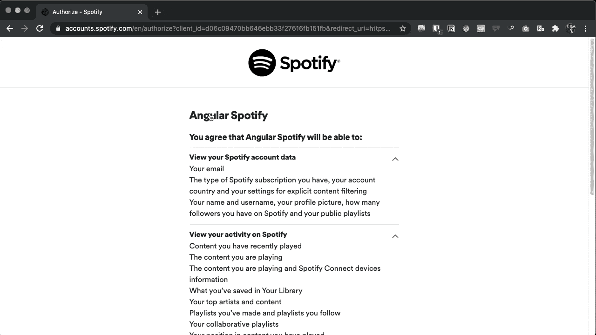

# 使用 Angular 11、Nx workspace、ngrx、TailwindCSS 和 ng-zorro 构建的简单 Spotify 客户端

> 原文：<https://medium.com/codex/a-simple-spotify-client-built-with-angular-11-nx-workspace-ngrx-tailwindcss-and-ng-zorro-c169daf68c19?source=collection_archive---------12----------------------->

# 源代码

 [## trunk 18/angular-Spotify

### 一个简单的 Spotify 客户端，内置 Angular 11、Nx workspace、ngrx、TailwindCSS 和 ng-zorro。查看现场直播…

github.com](https://github.com/trungk18/angular-spotify) 

如果你喜欢我的作品，请随意:

*   ⭐ [这个仓库](https://github.com/trungk18/angular-spotify)。而且我们会幸福的在一起:)
*   [关于 Angular Spotify 的推特](https://twitter.com/intent/tweet?url=https://github.com/trungk18/angular-spotify&text=A%20cool%20Spotify%20client%20made%20with%20Angular%2011,%20Nx%20workspace,%20ngrx,%20TailwindCSS%20and%20ng-zorro&hashtags=angularspotify,angular,nx,ngrx,ngzorro,typescript)
*   给我一杯[咖啡](https://www.buymeacoffee.com/tuantrungvo)

非常感谢你的来访和支持！

# 工作应用

查看实时应用->[https://spotify.trungk18.com](https://spotify.trungk18.com/)

Web Playback SDK 需要 Spotify premium 才能播放音乐。如果你使用免费帐户，你仍然可以浏览应用程序，但它无法播放音乐。很抱歉🤣



# 这是给谁的🤷‍♀️

我还记得 windows 上的 Window Media Player 在你开始播放音乐时有可视化效果，我想在听 Spotify 时有同样的体验。这就是我开始这个项目的原因。

我发现没有太多的资源来构建一个合适的真实世界规模的应用程序，这就是我分享的重点。为此，我做了一个[吉拉克隆应用](https://jira.trungk18.com/)作为第一个。 [Nx workspace](https://nx.dev/) 越来越受到 Angular 社区的关注，但人们总是对如何架构和设置一个 Nx 项目感到困惑。我希望 Angular Spotify 能给你更多的见解，尽管这是我使用 Nx 的第一个项目🤣

你知道我是[角越南](https://twitter.com/ngvnofficial)的版主之一。最近也开始[棱角新加坡](https://twitter.com/angularsg)。这件作品是我的另一个长期计划，将角的知识带给更多的人。我希望在新加坡和越南倡导和发展 Angular 开发者社区:)

# 技术堆栈


*   [角度 11](https://angular.io/)
*   [Nx 工作空间](https://nx.dev/)
*   [ngneat](https://github.com/ngneat) 包包括:`ngneat/svg-icon`和`ngneat/until-destroy`
*   [ngrx](https://ngrx.io/) 和[ngrx/组件库](https://ngrx.io/guide/component-store)
*   [ng-zorro](https://ng.ant.design/docs/introduce/en) UI 组件:`tooltip`、`modal`、`slider`、`switch`等等。
*   尾巴风
*   用于部署的网络连接

我为`AuthStore`和`UIStore`试验了 ngrx/组件库。这可能不是最佳实践，我将很快重构它。仅供参考🤣

# 高层设计

参见我关于 NestJS 和 Angular 的 [Nx 工作空间结构的原始笔记](https://gist.github.com/trungk18/7ef8766cafc05bc8fd87be22de6c5b12)

# 原则

所有组件如下:

*   OnPush 更改检测和异步管道:所有组件都使用可观察和异步管道来呈现数据，而不需要任何手动订阅。只有一些地方调用 subscribe 来调度一个动作，我将与我的朋友 [@nartc](https://github.com/nartc) 进行一次重构实时流会话，以使用组件存储来实现一个完全无订阅的应用程序。
*   树摇动组件的 SCAMs(单组件角度模块),意味着每个组件都有各自的模块。例如，RegisterComponent 将有一个对应的 RegisterModule。例如，我们不会将 RegisterComponent 声明为 AuthModule 的一部分。
*   大多数情况下，所有内容都将保留在`libs`文件夹中。新模块、新型号、新配置、新组件等...在 libs 中。库应该基于现有的应用程序被分离到不同的目录中。我们不会将它们放在应用程序文件夹中。例如在一个角形中，包含了`main.ts`、`app.component.ts`和`app.module.ts`

# 结构

我按照朋友 [@nartc](https://github.com/nartc) 推荐的结构。下面是应用程序结构的简化版本。

```
.
└── root
    ├── apps
    │   └── angular-spotify
    └── libs
        └── web (dir)
            ├── shell (dir)
            │   ├── feature (angular:lib) - for configure any forRoot modules
            │   └── ui
            │       └── layout (angular:lib)
            ├── playlist (dir)
            │   ├── data-access (angular:lib, service, state management)
            │   ├── features
            │   │   ├── list (angular:lib PlaylistsComponent)
            │   │   └── detail (angular:lib PlaylistDetailComopnent)
            │   └── ui (dir)
            │       └── playlist-track (angular:lib, SCAM for Component)
            ├── visualizer (dir)
            │   ├── data-access (angular:lib)
            │   └── feature
            ├── home (dir)
            │   ├── data-access (angular:lib)
            │   ├── feature (angular:lib)
            │   └── ui (dir)
            │       ├── featured-playlists (angular:lib, SCAM for Component)
            │       ├── greeting (angular:lib, SCAM for Component)
            │       └── recent-played (angular:lib, SCAM for Component)
            └── shared (dir)
                ├── app-config (injection token for environment)
                ├── data-access (angular:lib, API call, Service or State management to share across the Client app)
                ├── ui (dir)
                ├── pipes (dir)
                ├── directives (dir)
                └── utils (angular:lib, usually shared Guards, Interceptors, Validators...)
```

# 认证流程

我认为 Spotify 只推荐客户端应用，不涉及密钥。颁发的访问令牌是短期的，并且当它们到期时没有刷新令牌来延长它们。

查看 [Spotify 授权指南](https://developer.spotify.com/documentation/general/guides/authorization-guide/)

*   打开 Angular Spotify 后，它会将你重定向到 Spotify 以访问你的数据。Angular Spotify 仅将数据纯粹用于在用户界面上显示。我们不会将您的信息存储在任何其他地方。
*   Angular Spotify 仅将访问令牌保存在浏览器内存中，甚至没有将其存储到浏览器本地存储中。如果你在浏览器上进行硬刷新，它会要求 Spotify 提供新的访问令牌。一个访问令牌仅在一小时内有效。
*   有了令牌后，我将尝试用一个新的播放器连接到 Web Playback SDK—`Angular Spotify Web Player`


# 依赖图

Nx 提供了一个开箱即用的[依赖图](https://nx.dev/latest/angular/structure/dependency-graph)。要在您的浏览器上查看它，请克隆我的存储库并运行:

```
npm run dep-graph
```

简化的图表如下所示。它为你的 mono repo 提供了有见地的信息，在多个项目相互依赖时尤其有用。


# Nx 计算缓存

配置 Nx 云大大缩短了部署时间。

Nx Cloud 与 Nx 配对，使您能够更快地构建和测试代码，速度可提高 10 倍。即使是刚接触 Nx 的团队也可以连接到 Nx Cloud，立即开始节省时间。访问 [Nx Cloud](https://nx.app/) 了解更多信息。


# 功能和路线图

为了激励自己按时完成工作，我设定了暂定的最后期限。否则，将永远无法完成:)

# 1.0 —简单的 Spotify 客户端

> *2021 年 3 月 1 日至 28 日*

*   Nx workspace 的成熟、可扩展且易于理解的结构
*   使用 Spotify SDK 播放音乐
*   加载最多 50 个保存的播放列表和每个播放列表的前 100 首歌曲。
*   酷炫的视觉效果

# 现场直播

让我们一起努力吧！

我安排了几个直播会议，向你们展示我如何继续开发 Angular Spotify。关注[我的推特](https://twitter.com/tuantrungvo)获取最新更新。查看预定事件。

*   #1: [利用 Nx workspace 构建您的 Angular 应用](https://www.youtube.com/watch?v=9njo6MZWBN0)| 2021 年 4 月 3 日周六上午 10 点
*   #2: [建立相册列表和详细页面](https://www.youtube.com/watch?v=vEIxjcrXcDc)| 2021 年 4 月 10 日星期六，上午 10 点
*   #3: [建立艺术家列表和详细页面](https://www.youtube.com/watch?v=8P3pB40JF2w)| 2021 年 4 月 17 日星期六，上午 10 点
*   #4: [建立曲目列表页面](https://youtu.be/Oj4yomnxfj4)| 2021 年 4 月 24 日星期六，上午 10 点

我还会和 [@nartc](https://github.com/nartc) 一起对棱角分明的越南办公时间做一些重构。更多细节即将发布。

# 时间花费

这是一个兼职项目，我只在工作时间之外花时间去做。我最初计划在两周内完成这个项目，但前两个周末并不太有成效，可能是因为农历新年的节日气氛:)但一旦乐高积木凑在一起，我就感觉到了节奏，我知道它必须在三月底完成。

我无法从 waka time 获得全职报告，因为它只显示了最近两周的情况。🤣

我在这个项目上花了大约 50 个小时，几乎和我制作第一版《jira.trungk18.com》的时间一样多。

可视化工具是最令人兴奋的功能，我决定开始这个项目，因为单个组件。


# 无障碍♿

并非所有组件都正确定义了 [aria 属性](https://developer.mozilla.org/en-US/docs/Web/Accessibility/ARIA)、视觉焦点指示器等。

# 设置开发环境🛠

*   `git clone [https://github.com/trungk18/angular-spotify.git](https://github.com/trungk18/angular-spotify.git)`
*   `cd angular-spotify`
*   `npm start`用于启动 Angular web 应用
*   应用程序应在`[http://localhost:4200/](http://localhost:4200/)`运行

# 单元/集成测试🧪

我跳过了这个项目的测试。

# 和睦相处

Web Playback SDK 提供了对 Chrome、Firefox、Edge、IE 11 abd 以上的支持，运行在 Mac/Windows/Linux 上。

它不支持 Android 或 iOS 上的 Safari 或任何移动浏览器

查看[支持的浏览器的完整列表](https://developer.spotify.com/documentation/web-playback-sdk/#supported-browsers)

# 作者:钟沃✍️

*   一位经验丰富的前端工程师，在创造体验驱动的产品方面有七年的热情。我精通 Angular、React 和 TypeScript 开发。
*   个人博客:[https://trungk18.com/](https://trungk18.com/)
*   打招呼:trungk18 [et] gmail [dot] com

# 贡献的

如果你有什么想法，就[开一期](https://github.com/trungk18/angular-spotify/issues/new)告诉我你的想法。

如果你想贡献，请叉库，并作出你喜欢的变化。[拉请求](https://github.com/trungk18/angular-spotify/compare)热烈欢迎。

# 学分和参考

特别感谢我的朋友 [@nartc](https://github.com/nartc) ，他早早的帮我复习了代码。

*   [@koel/koel](https://github1s.com/koel/core/blob/master/js/utils/visualizer.ts) :一个由 [@phanan](https://twitter.com/notphanan) 制作的很酷的播放器，我通过额外的定制重用了这个 repo 中的可视化器代码
*   [beeman/component-store-playground](https://github.com/beeman/component-store-playground):一个使用 Nx 和 ngrx/component-store 的好例子，我从这个报告中引用了项目结构

# 许可证

请随意在您的项目中使用我的代码。请引用此存储库。

[麻省理工学院](https://opensource.org/licenses/MIT)