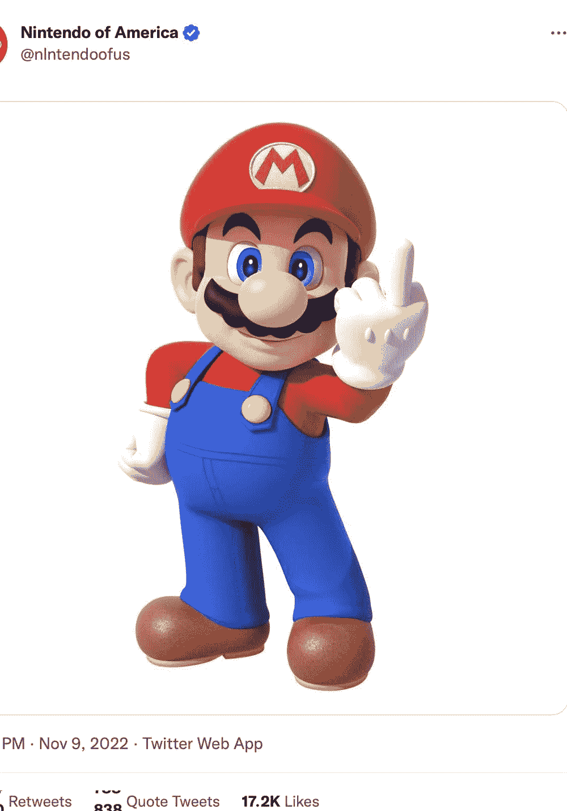
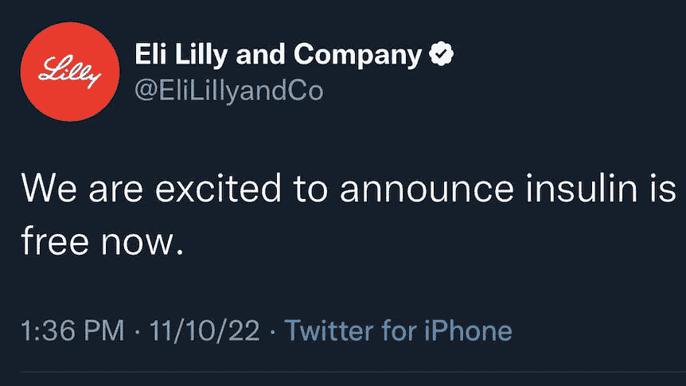
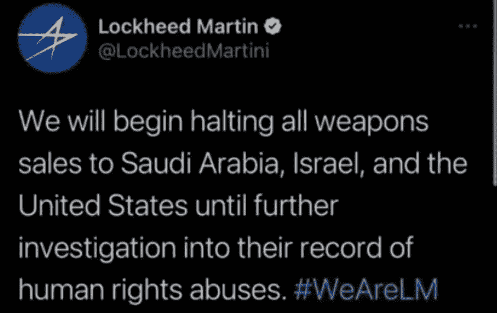

# 一条来自钓鱼者的微博…

> 原文：<https://medium.com/codex/a-single-tweet-from-a-troller-bf79217e003?source=collection_archive---------8----------------------->

## 我们经常忘记，如果别人有奉献精神，他们会如何影响你…

今天我将谈论发生在 Twitter 上的一件大事，这件事可能会影响到埃隆·马斯克，导致他暂停他给出的无用功能。

亚历山大·沙托夫在 [Unsplash](https://unsplash.com?utm_source=medium&utm_medium=referral) 上拍摄的照片

如果你去看看我以前的一篇文章，我解释了为什么埃隆·马斯克决定让 Twitter 验证成为付费订阅是一个糟糕的决定，你会看到有些人甚至为埃隆·马斯克辩护，说埃隆·马斯克是超人，他有一个我们都不知道的计划，因此，我应该闭嘴…好了…我们开始吧…

他做出的决定导致 Twitter 中 23%的额外成功诈骗(当然，这里的统计数据并不准确)。对于那些远离这条新闻的人来说，你现在可以从 Twitter 上购买验证标记，这对作为一个在线社区的世界造成的损害是不可原谅的。

> 这个决定遭到了如此强烈的反对，以至于 Elon 不得不暂停验证订阅的事情(在我写这篇文章的时候)

## 任天堂的声誉

这证明，你不必是一个超人，也能知道埃隆做出的决定是一堆废话。

网上某个身份完全未知也永远无法得知的随机家伙，创建了一个任天堂美国的假账号，买了验证标志，发了这条推文。这是马里奥(任天堂的家伙)展示他宝贵的手指。

这导致任天堂在市场图中的价值略有下降，并暂时流失了一些值得信赖的朋友(其他公司)。当然，这是短期的事情，当公司意识到这是假的时，一切都会恢复正常，所以这对公司只是暂时有害。但是下一个就不一样了。

## 礼来公司

它是美国和许多其他国家的一家主要健康药品生产公司，众所周知，它将胰岛素等产品的价格保持在非常高的水平，以至于许多人认为这是一个骗局。我个人不认为这是骗局，但我能看到他们是如何赚到比他们应得的更多的钱。

就像任天堂一样，另一个人进来，创建了一个该公司的假账户，并在推特上说胰岛素药物现在将是免费的。我的意思是…这对于一些人来说似乎是显而易见的，为什么这不会发生，因此应该被忽略。但事实并非如此。礼来公司的股票市场从令人印象深刻的阶段下跌到不到之前的 3%,仅仅是因为其他人试图攻击这些公司。你认为这就结束了吗？不

## 洛克希德·马丁公司

对于那些不知道的人来说，洛克希德·马丁公司是一家非常受欢迎的武器制造公司。老实说，直到这件事发生之前，我都不知道这家公司。

和其他两个人一样，一个人用假账号发了这个微博。

这导致他们的股票在一天之内下跌了 5%,而且看起来不会很快上涨。当然，这些账户被公司认为是假的，但人们不这样认为。事实上，人们要么认为这是一个试图降低股价的虚假账户，要么认为这是一个合法账户，两者都会导致股价下跌。

# 结束的

我只是不想拖这么久，但我个人认为 Twitter 已经度过了它最好的时光。现在都是下游了，埃隆只是对它没什么好处。我只是想要旧的 Twitter，那里仍然充满了负面的东西，但没有对这只蓝鸟发生了什么感到困惑。

关注我的社交，考虑我的 [Patreon](http://patreon.com/fadingeek) ，我将在下一期与你见面。

**你真棒:)**

> 法丁吉克