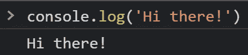
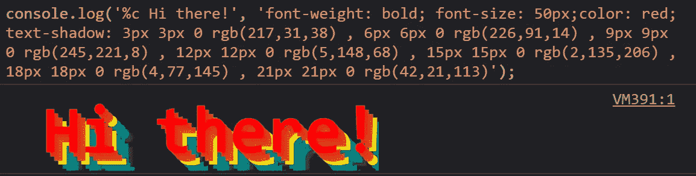
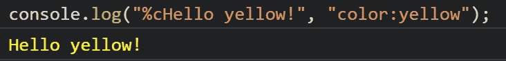
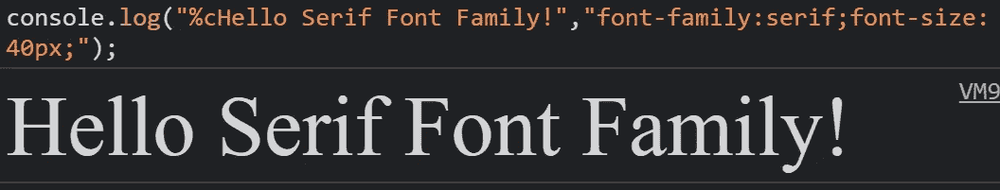
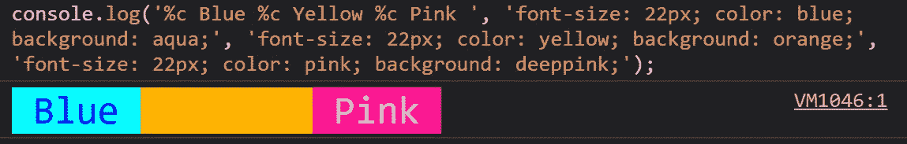
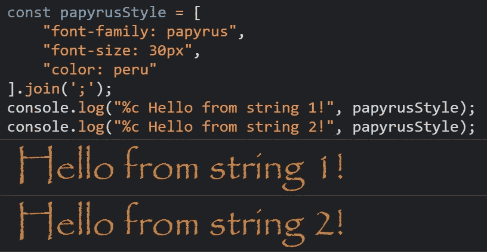

# OMBD#22:一个时髦的技巧:如何设计你的 console.log()消息

> 原文：<https://medium.com/codex/a-snazzy-trick-how-to-style-your-console-log-messages-2b23ac281b31?source=collection_archive---------18----------------------->

## [抄本](http://medium.com/codex)

## 关于在浏览器控制台中应用 CSS 来记录消息的快速指南(带有示例)。

欢迎来到第 22 期的**O**ne**M**inute**B**etter**D**developer，在这里，通过阅读简短的知识，每次一分钟，你将成为一名更成功的软件开发人员。

## [⏮️](https://itnext.io/master-git-diff-with-these-not-so-known-commands-9fecfa3006d0) [🔛](https://jportella93.medium.com/one-minute-to-become-a-better-developer-ombd-5b1a1d37468e) [⏭️](https://levelup.gitconnected.com/time-traveling-in-git-meet-git-reflog-ff216419e564)

我的好友洛尔·尼古拉斯的作品

## 问题是

我们的控制台消息没有抓住用户的注意力。

基本的 console.log 消息。

我们如何让它们更吸引人？

## 一个解决方案

通过在`console.log`的第一个参数中包含一个`%c`，并传递一些 CSS 声明作为第二个参数，我们可以在浏览器的控制台上设置消息的样式。

风格化的控制台日志消息！🌈

## 这里有一些想法

在浏览器的控制台中更改颜色。

在浏览器控制台中更改字体系列和字体大小。

对同一字符串应用多种样式。

重用 console.log 样式。

许多网站使用这种技巧来吸引好奇的开发人员的注意，或者防止非技术用户在控制台上运行代码。其中包括脸书、Pinterest 和 Gmail。

感谢阅读！保重，乔恩·波特拉。

## 如果你喜欢这个故事，你可能也会喜欢

 [## 1 分钟成为更好的开发人员(#2)

### 欢迎来到这个新系列的第 2 期，在这里，通过阅读以下短文，您将成为一名更成功的开发人员…

jportella93.medium.com](https://jportella93.medium.com/1-minute-to-become-a-better-developer-2-5db2e35a7c4a)  [## 1 分钟成为更好的开发人员(#6)

### 欢迎阅读本系列的第 6 期，通过阅读简短的知识，你将成为一名更成功的开发人员…

jportella93.medium.com](https://jportella93.medium.com/1-minute-to-become-a-better-developer-6-a732cf1e6670) 

## [⏮️](https://itnext.io/master-git-diff-with-these-not-so-known-commands-9fecfa3006d0) [🔛](https://jportella93.medium.com/one-minute-to-become-a-better-developer-ombd-5b1a1d37468e) [⏭️](https://levelup.gitconnected.com/time-traveling-in-git-meet-git-reflog-ff216419e564)