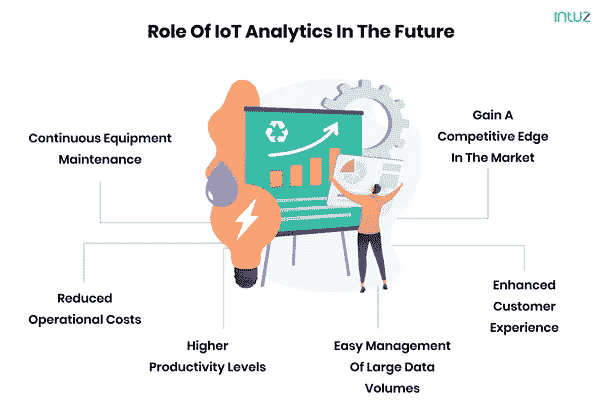
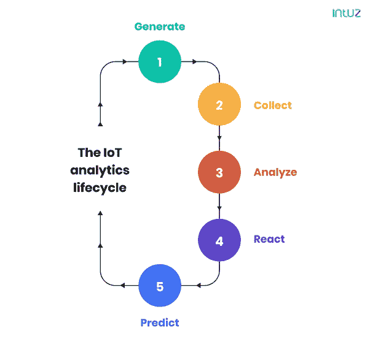

# 先睹为快物联网分析及其未来的作用

> 原文：<https://medium.com/codex/a-sneak-peek-into-iot-analytics-and-its-role-in-the-future-6bac663514db?source=collection_archive---------10----------------------->

自从我们迎来物联网(IoT)时代以来，人、设备、传感器和企业都在云上连接起来，实现了相互之间的交互。公司使用各种基于物联网的应用为客户提供价值。

这是可能的，因为物联网生态系统内交换了大量的原始数据。然而，企业发现价值的不是原始数据，而是所收集信息的简单直观表示，即数据分析。

数据分析是指如何将原始数据转化为有意义的信息，以帮助用户获得有价值的见解，从而做出商业决策。

**什么是物联网分析？**

这是指应用数据分析工具和技术从物联网设备收集的海量数据中挖掘价值的过程。物联网分析带来的最大好处如下:

*   新市场的可扩展性和增长
*   更快地解决问题并防止重复问题
*   实时库存监控，实现顺畅的供应链管理
*   提高流程透明度，加快决策速度

**物联网分析在未来的角色**

许多物联网设备、系统和服务器都连接到互联网，通过传感器定期共享数据。但是这个数据没有经过任何分析是没有价值的。然而，借助物联网分析，企业可以优化各个层面的运营，改善决策并提高收入。本节探讨物联网分析为公司带来难以置信的价值的领域:

**1。连续设备维护**

传感器和物联网数据分析的合并有助于制造商通过测量振动、温度、油位、电压等各种参数来确定系统或设备何时需要维护。

智能设备可以通知操作人员潜在的故障和交付时间表，从而确保制造过程不会受到故障机器的影响。这也为制造商节省了大量的维护费用。

[据 PwC](https://www.pwc.be/en/documents/20180926-pdm40-beyond-the-hype-report.pdf) 称，在制造领域利用预测性维护可将正常运行时间提高 9%,将成本降低 12%,从而将质量风险降低 14%。

**2。通过自动化和更智能的资源利用降低运营成本**

通过物联网应用和分析的协同工作，企业可以自动控制以前手动跟踪的流程。例如，它让制造商全面了解每个阶段发生的事情。

这有助于产品的顺利生产和交付，因为物联网分析可以提前识别瓶颈，并降低人为错误的风险。例如，通用汽车公司(General Motors)利用物联网传感器跟踪湿度，以优化喷漆。

当喷漆条件不利时，传感器会通知利益相关者，并分享另一个湿度水平更合适的地方的详细信息，从而减少停工时间和重新喷漆的需要。

**3。工人生产率水平提高**

一些企业在其设施中部署智能传感器，以收集员工参与度、绩效评级和其他工作相关活动的数据。然后，这些数据被用于改善日常运营，使员工能够更有效地利用他们的时间和精力。

[人力分析软件提供商 Humanyze](https://humanyze.com/) 开发了一个系统，该系统使用带有传感器的智能员工徽章来捕捉 100 多个数据点，以衡量员工的生产力。这些徽章测量人们如何互动，他们的语调是什么样的，以及他们听了多少。

随着时间的推移，Humanyze 发现，让所有员工一起吃午餐，而不是让他们集体休息一会儿，以便有人随时可以接电话，这对公司来说更有成效，因为他们看到生产率提高了 23%，工作压力水平降低了 19%。

然而，在企业计划转型为智能办公室之前，必须征得员工的同意。不幸的是， [55%](https://www.accenture.com/_acnmedia/Thought-Leadership-Assets/PDF/Accenture-WF-Decoding-Organizational-DNA.pdf) 的公司没有这样做。

**4。轻松管理大量数据**

物联网应用利用大量数据集集群，这些数据集可以是结构化的，也可以是非结构化的。企业需要管理数据并对其进行分析，以提取相关模式。

如果没有应用正确的工具和技术，这通常会变得很麻烦。借助物联网分析，企业可以更轻松地利用合适的数据分析和物联网解决方案高效分析收集的数据。

**5。增强的客户体验**

无论是医疗保健中心还是零售店，每个企业都需要创造更加个性化的客户体验。毕竟，这是一个高度个性化的时代。

好消息是，物联网应用揭示了大量关于消费者行为和偏好的信息，可以对这些信息进行彻底研究，以预测购买模式的趋势和变化。

例如，当消费者进入服装店时，物联网系统可以引导他们找到他们在网上挑选的牛仔裤。它还可以给他们发送一张限时优惠券，以便他们当天在店内购买。

此外，连锁餐厅、零售商和消费品制造商可以使用物联网数据进行有针对性的营销和促销。这种程度的个性化对双方都是可行的。消费者获得更多价值，企业可以吸引相关客户并推动更高的销售额。

同样，在医疗保健领域，医院可以使用实时物联网数据分析来管理增加的患者流量，并提高总体运营效率。

在物联网应用中应用数据分析可以让企业获得关于消费者偏好和选择的知识。这使他们能够开发目标受众真正需要和期望的服务和产品。缩小差距反过来会提高企业的收入和利润。大家都赢了！

**6。获得市场竞争优势**

在物联网投资中使用数据分析将推动企业提供更好的服务，并提供脱颖而出的能力。他们可以从市场上的许多物联网应用程序开发人员那里获得帮助。

**物联网分析生命周期**

这通常包括五个阶段，即:生成、收集、分析、反应和预测。在大多数情况下，企业没有完全完成生命周期，并在生成和收集阶段之间停滞不前。

即使是引领数字化转型的公司也止步于分析阶段。识别在生命周期中不断进步的 apt 技术是物联网项目成功的关键:

**1。生成**

任何物联网应用的第一步都是生成数据。例如，对于智能建筑，它可以是关于办公室温度、空气质量、房间占用率和运动的数据。

**2。收集**

数据一旦生成，就被收集到中央银行或数据仓库中，所有利益相关者都可以访问。对于大多数没有管理大量数据基础架构经验的企业来说，部署存储库通常是一项挑战。

**3。分析**

只有在数据存储之后，才能对其进行分析。虽然生成和收集数据有一些价值，但这是为企业获取 ROI 的阶段。在这里，历史物联网数据通常在仪表板上可视化。

**4。反应**

当一个企业达到这个阶段时，它可以期望看到显著的价值被添加到组织中。这个阶段是根据检索、存储和分析的数据为公司做出实时决策。

**5。预测**

这是识别可能导致潜在失败的预测指标的阶段，以便企业可以在问题发生之前找到补救措施。

**物联网分析的局限性**

由于物联网数据主要来源于原始格式的传感器，因此由业务利益相关方自行分析数据。此外，如何将数据集呈现给用户也取决于利益相关方。

在[物联网应用开发流程](https://www.intuz.com/iot-product-development-guide)中存在一些特定的障碍，这些障碍也会阻碍高效的物联网分析。不可预见的成本和生产延迟是解决软件方面问题的物联网解决方案的主要障碍。

**交给你了**

数据分析不再是一个时髦的词汇，而是物联网生态系统的重要组成部分。它为做出更明智的商业决策提供了必要的知识，并能指出需要尽早解决的问题领域。随着物联网的发展，对高级数据分析工具的需求也将增加。