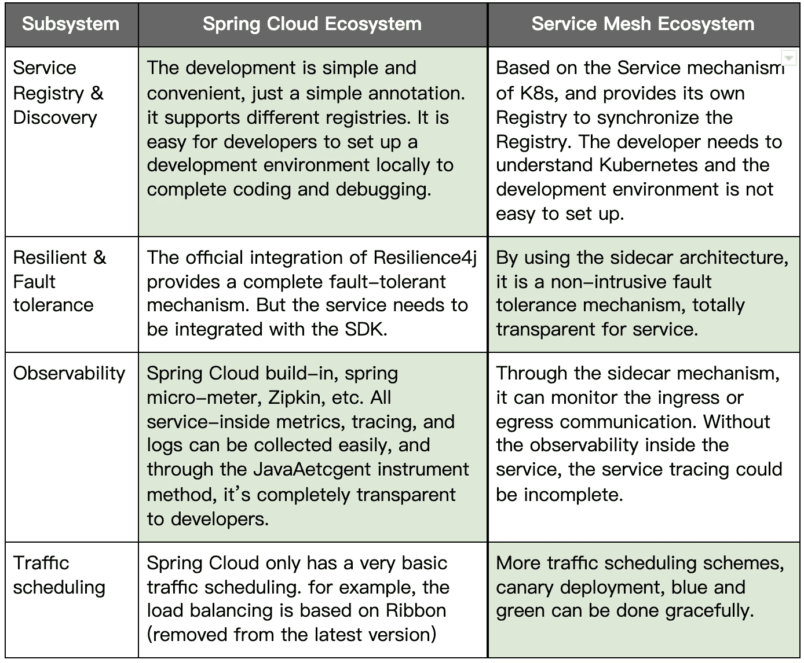
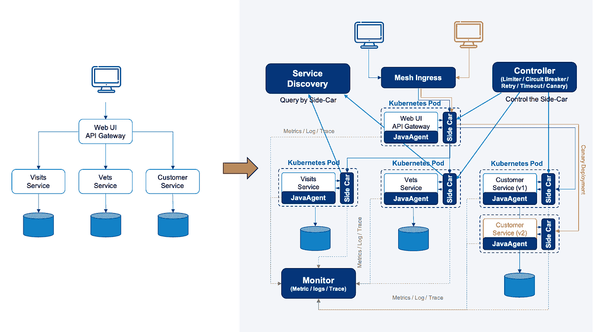
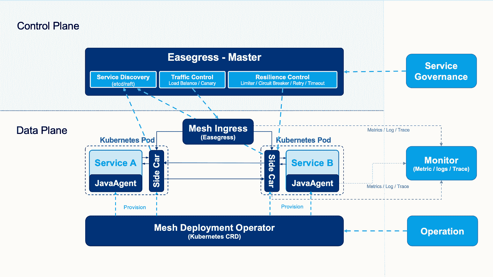
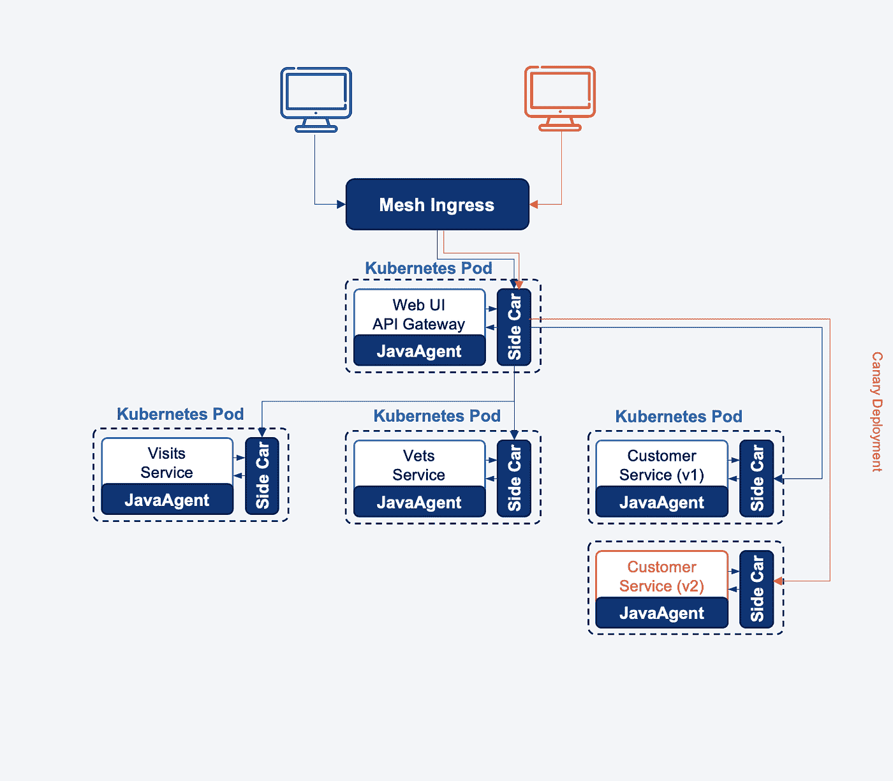
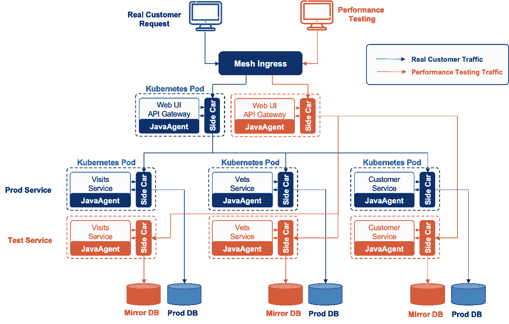

# Spring 云兼容服务网格

> 原文：<https://medium.com/codex/a-spring-cloud-compatible-service-mesh-6ce58c571012?source=collection_archive---------3----------------------->

# 背景

目前，市场上的服务网格技术大多用于解决微服务系统架构下的服务管理和治理问题，主要包括以下子系统:

**交通调度系统**

*   **服务注册和发现系统**
*   **流量路由**，A/B 测试，蓝绿色部署，金丝雀部署(全路径流量着色和标记)
*   **东西交通边车。**流量劫持，如 [Istio](https://istio.io/) ，非流量劫持，阿里巴巴开源 [MOSN](https://mosn.io/docs/concept/traffic-hijack/)
*   **服务实例负载均衡**(轮询/加权轮询/一致哈希/随机等。)

**弹性&容错系统**

*   **限速**。限制传入请求的速率。
*   **断路器**。当一个系统陷入严重困境时，快速失败比让客户等待更好。
*   **重试**。许多故障都是暂时的，经过短暂的延迟后可能会自行纠正。
*   **超时控制。超过一定的等待间隔，成功的结果是不可能的。**
*   **健康检查**。确定服务是否正常。
*   **缓存**。某些比例的请求可能是相似的。

**观察系统**

*   **分布式跟踪**。比如 Zipkin，Jaeger，OpenTracing 等。
*   **流量指标**。例如服务等待时间/错误率/请求总数/请求错误代码分布
*   **日志**。例如访问日志、错误日志、系统日志等。

**安全系统**

*   **认证**。例如 mTLS，访问服务的特权
*   **授权**。确定该服务是否有权访问其他服务
*   **加密**。服务间通信加密

# 问题

目前，市场上的服务网格大多基于 Kubernetes 解决方案。此外，它提供了一个非侵入性的跨语言级别的解决方案。我们认为目前市场上的解决方案存在以下问题:

*   **缺乏完整的服务内部观察能力**。从服务级别的角度来看。不仅收集应用程序指标(如吞吐量、延迟、错误率等)，还需要了解服务如何访问数据库、缓存、消息队列等。此外，它还包含相应的跟踪日志。所有的指标和日志必须相互关联。
*   **金丝雀的部署太简单、太天真，不实际。**真正的 canary 部署应该能够基于由特定标签标记的特定用户来执行。金丝雀流量不仅需要从北到南，还需要从东到西传递给整个服务。
*   【Java 社区的迁移问题。尤其是 Spring Cloud 与基于 Kubernetes 的服务网格有着完全不同的架构。要迁移它，它必须放弃 spring 云解决方案，如服务注册中心&发现、配置管理、弹性&容错等等。然而，Spring Cloud 比当前的服务网格更成熟，也更有企业精神。
*   **复杂的开发环境**。与 spring 云开发相比，当前的服务网格与 Kubernetes 紧密耦合，因此，如果开发人员需要调试/测试他们的代码，他们需要一个 Kubernetes 环境。
*   **基于“iptables”的流量劫持不是一个有效的解决方案**。IPTABLE 有效率问题，会消耗太多内核资源。并且很难维护和排除故障。

# 比较

显然，Spring Cloud 和 Service Mesh 各有优缺点。如果我们能够将它们结合起来，允许用户利用这两种解决方案的能力，我们就可以拥有最大的能力。

下表是 Spring 云和 Service Mesh 的对比。

从上表的对比中，我们就能明白其中的利弊。然而，工程是我们每天都要面对的一种权衡。这种比较可能是不公平的，因为 Service Mesh 需要解决一个跨语言、跨平台的解决方案，但是 Spring Cloud 只是一个基于 Java 的应用级解决方案。

换句话说，Service Mesh 的通用性要在它的一些能力上妥协，Spring Cloud 的专业性可以在它自己的领域里专攻。

我们认为可能会有一个解决方案，人们不需要做出非黑即白的决定，尤其是在 Spring Cloud 和基于 Kubernetes 的服务网格之间的困境。

此外，Java 和 Spring 是如此强大和成熟，以至于许多企业在他们的关键业务中广泛深入地使用 Java，例如金融、电子商务、电信、制造、零售等等。Java 社区拥有最流行和最大的生态系统，我们认为服务网格应该与之兼容。

因此，我们决定开发一种新型的服务网格，它可以由 Kubernetes 编排，但可以与 Spring Cloud 完全兼容。换句话说，spring 云应用可以无成本地平滑迁移到服务网格。

# 易网

[EaseMesh](https://github.com/megaease/easemesh) 是一个兼容 Spring Cloud 生态系统的服务网格。它使用 [Easegress](https://github.com/megaease/easegress) (参考[下一代服务网关](https://megaease.medium.com/the-next-generation-service-gateway-7cf4bd50c9bd))作为边站和流量网关，使用 [EaseAgnet](https://github.com/megaease/easeagent) 作为服务内部监控的 JavaAgent。

Sidecar 和 JavaAgent 都是非侵入性技术，换句话说，Ease Mesh 可以在不修改一行源代码的情况下将 Spring Cloud 应用程序迁移到 service mesh，并且整个架构已经被赋予了全功能的服务治理、弹性设计和完整的可观察性。

下图显示了一个示例。

来源:[https://github . com/mega ease/ease mesh/blob/main/imgs/topology-migration . png](https://github.com/megaease/easemesh/blob/main/imgs/topology-migration.png)

在左侧，图表显示了“ [Spring Cloud PetClinic](https://github.com/spring-petclinic/spring-petclinic-cloud) ”微服务示例。这是 Spring Cloud 系列，包括 Spring Cloud Gateway、Spring Cloud 断路器、Spring Cloud Config、Spring Cloud Sleuth、Resilience4j、Micrometer 和 Spring Cloud 网飞技术堆栈中的 Eureka 服务发现。

通过使用 Eash Mesh 的 Kubernetes CRD(自定义资源定义)，只需几个命令行，整个 Spring 云应用程序就迁移到了服务网格。

服务发现、配置管理、流量调度、弹性和容错边盘、全栈监控(指标、日志、跟踪)和全栈 canary 部署都已完成。(上图的右边部分显示了架构)

现在，让我们浏览一下细节:

**自动组装 sidecar 和 JavaAgent。**通过使用 Kubernetes CRD，很容易透明地将 sidecar 和 JavaAgent 安装到 Java 应用程序中。

**Eash Mesh 使用 Easegress 进行服务治理**。Easegress 带来了以下主要特性。

*   **应用级服务发现**——完全兼容 Java 的服务注册和发现——Eureka、Console、Nacos 等。
*   **筏共识。Easegress 有一个内置的 Raft 协议，主节点将是服务注册和发现，从节点将是 sidecar。**
*   **弹性设计**。Easegress 从 Java 移植了[resilience 4j](https://github . com/resilience 4j/resilience 4j)到 Go，所以，它带来了那些容错功能——比如断路器、限速器、重试等等。
*   **交通编排**。Easegress 可以着色南北和东西交通，并同步整个集群。这可以进行集群范围的 canary 部署。

**智能流量劫持**。与其他服务网格使用“iptables”劫持流量不同，Ease Mesh 只是将服务发现端点重新配置/劫持到 sidecar，并且 Ease Mesh 将 sidecar IP 地址(127.0.0.1)作为远程服务返回。sidecar 负责真正的服务发现和远程通信。这种解决方案不会带来任何网络复杂性。

下图显示了该架构

来源:[https://github . com/mega ease/ease mesh/blob/main/imgs/architecture . png](https://github.com/megaease/easemesh/blob/main/imgs/architecture.png)

更多细节，请参考 GitHub repo—[https://github.com/megaease/easemesh](https://github.com/megaease/easemesh)，它在 Apache 2.0 许可下。

借助 Spring Cloud 和 Kubernetes 的优势，使用成熟的企业级架构管理、编排和监控 Java 应用程序是零成本的。

除此之外，我们还可以提供许多先进的企业解决方案。

# 金丝雀部署

第一件事是金丝雀部署，金丝雀部署是一项技术，我们可以限制新版本的功能只能由某些用户看到，这可以降低风险。要做好金丝雀发布，我们需要以下特性:

*   **用户标签:**一种定义用户标签的机制，用于识别用户是否是金丝雀。好标签必须使用用户端数据，如用户代理、Cookie、用户令牌、位置等。
*   **服务版本发现**:我们需要管理服务版本，并了解哪个版本适用于 canary 用户。
*   **流量调度**:网关可以检查用户，并将请求路由到正确的服务实例。

有了 EaseMesh，我们可以轻松地完成这一点，而无需任何代码更改。您可以查看这个演示文档，了解如何做到这一点。[https://github.com/megaease/easemesh#72-canary-deployment](https://github.com/megaease/easemesh#72-canary-deployment)

来源:[https://github . com/mega ease/ease mesh/blob/main/imgs/canary-deployment . png](https://github.com/megaease/easemesh/blob/main/imgs/canary-deployment.png)

# 生产性能测试

第二件事是在产品上运行性能测试。

在微服务架构中，建立一个与生产环境相同的完整环境来对整个站点进行性能测试的成本很高。因此，如果我们能够在生产中运行性能测试，那将是非常棒的。

然而，在生产上运行性能测试可能会非常具有挑战性，这就需要我们解决以下问题。

*   **不会冲击真正的客户**。性能测试会消耗大量资源，会对我们的客户产生很大影响。
*   **测试数据可以轻松清理**。性能测试会带来大量的数据，这些数据需要被清理。

使用 EaseMesh，我们可以做以下事情。

*   为所有服务部署影子服务。
*   镜像所有的中间件，比如数据库、队列、缓存系统。
*   使用 JavaAgent 或 Sidecar 劫持到镜像中间件的流量。
*   将性能测试流量调度到影子服务。

下图显示了 EaseMesh 如何实现这一点。

我们可以看到以下作品对 EaseMesh 有所帮助:

*   首先，我们可以克隆这些服务所依赖的所有中间件(数据库、队列、缓存等)，我们称之为“影子中间件”
*   其次，EashMesh 为所有的服务部署测试服务，我们称之为“影子服务”。
*   然后，EaseMesh 将影子服务的中间件访问重定向到“影子中间件”
*   然后，EaseMesh 将测试流量调度到影子服务和影子中间件。
*   最后，我们可以安全轻松地移除所有的“影子服务”和“影子中间件”。

无需修改任何源代码，EaseMesh 为生产环境下的性能测试带来了完美的解决方案，而且方便、简单、安全。

此外，我们可以用 Ease Mesh 做越来越多这样的事情，我们期待着您对这个新服务 Mesh 的建议或关注，甚至帮助我们把它做得更好。请随时在我们的 Github—[https://github.com/megaease/easemesh](https://github.com/megaease/easemesh)中提出问题或贡献代码