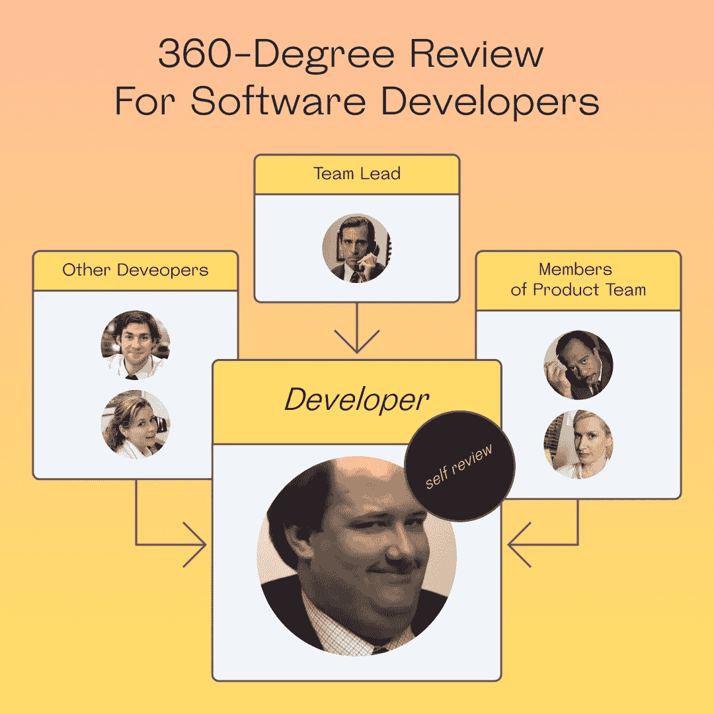
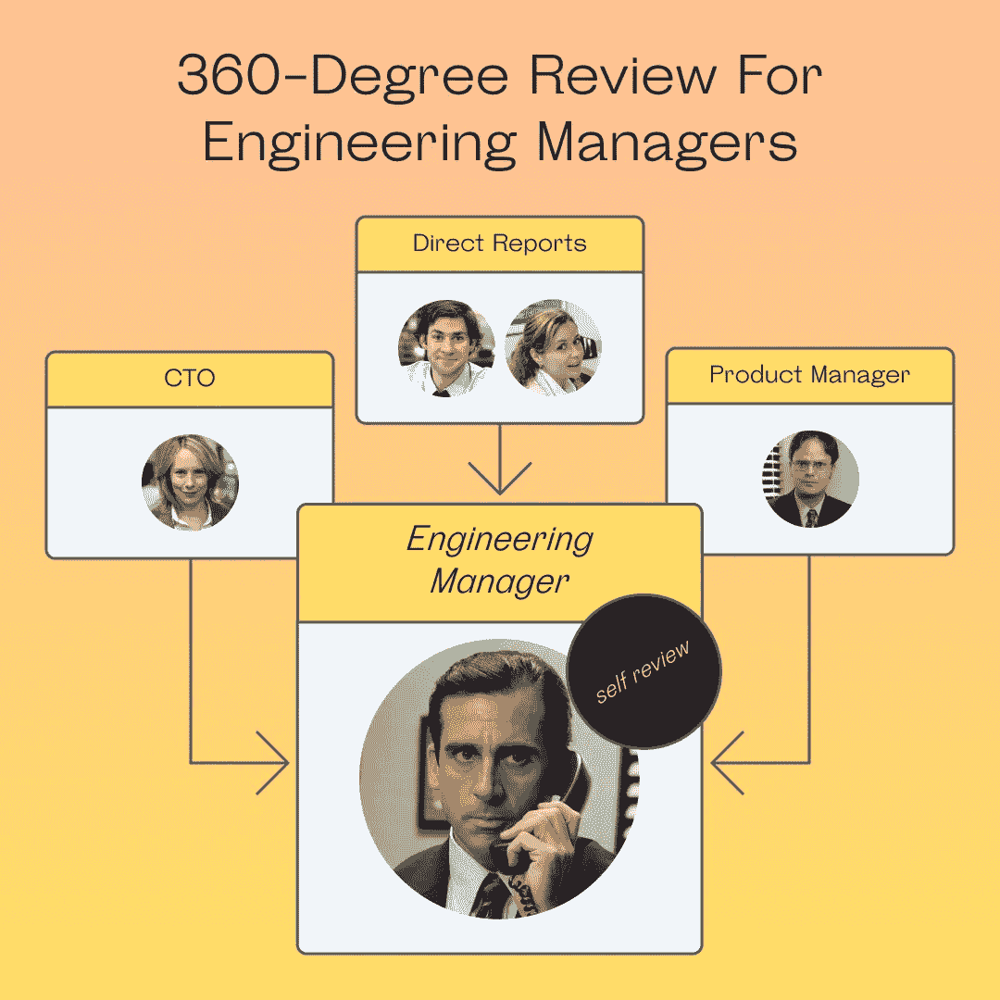
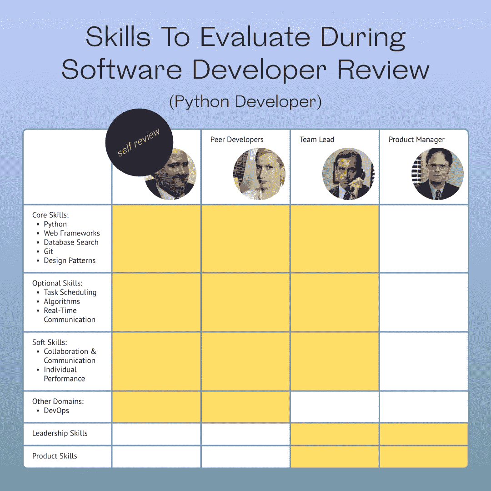
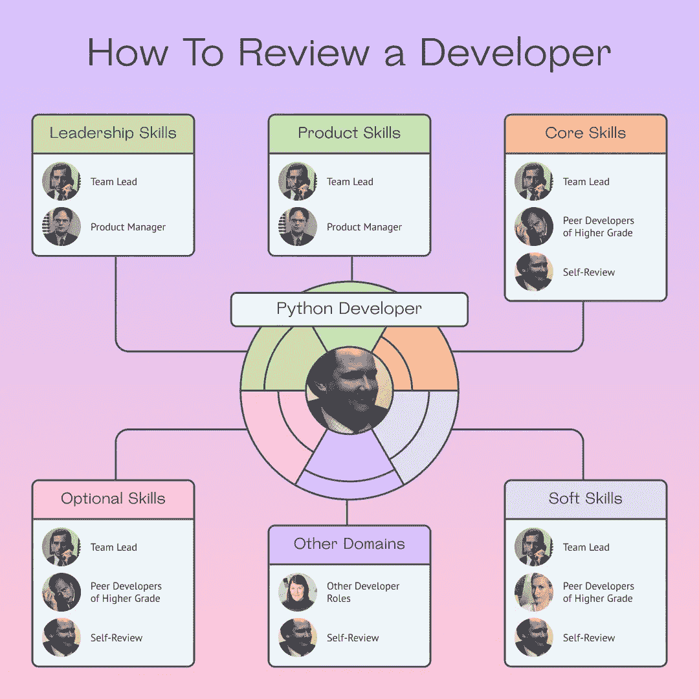
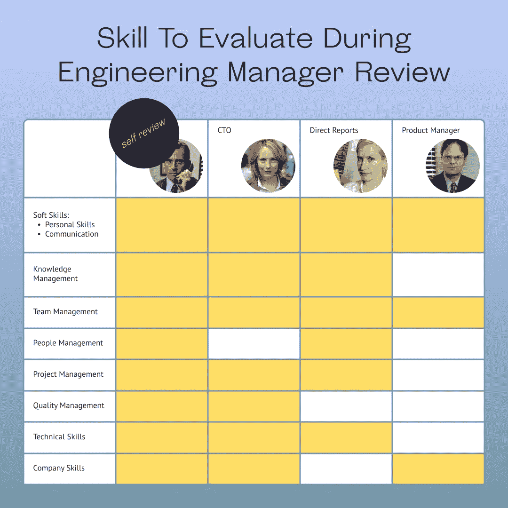
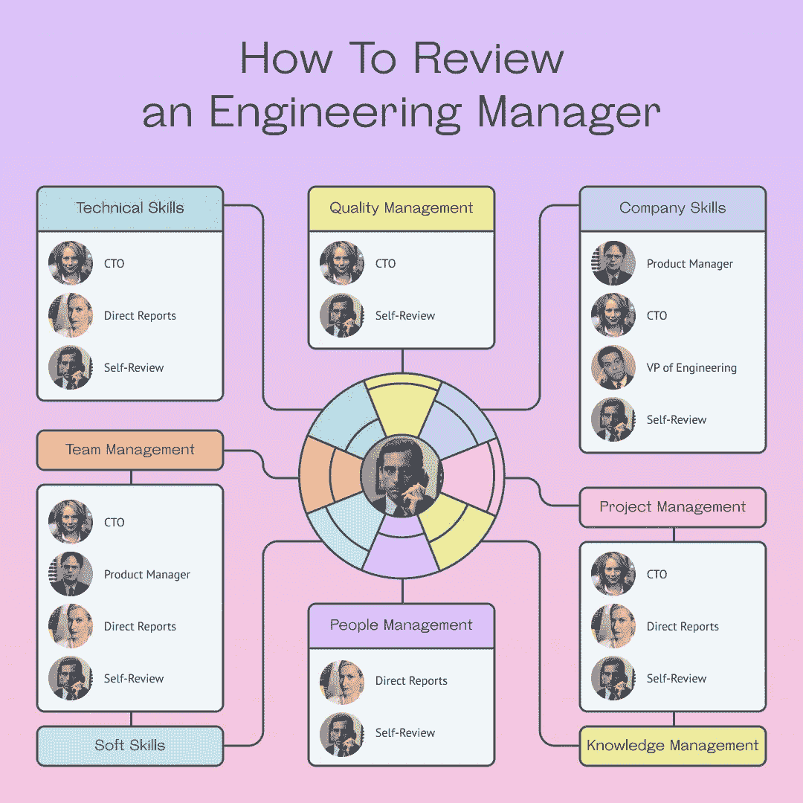
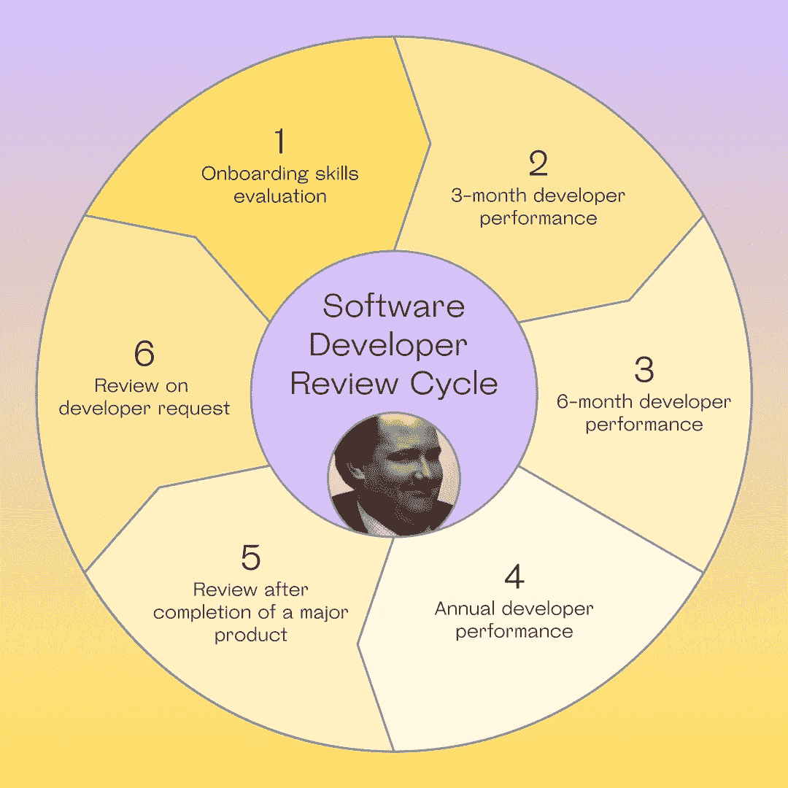

# 软件工程性能评审分步指南[技能矩阵模板]

> 原文：<https://medium.com/codex/a-step-by-step-guide-to-software-engineering-performance-review-skill-matrix-templates-78404956b9b5?source=collection_archive---------5----------------------->

## 借助现成的技能矩阵，举行简单有效的软件开发人员评审。审核者列表、要审核的技能、行动计划—可在我们的指南中找到。

对任何科技公司来说，无论是初创公司还是开发机构，最重要的资产是他们的知识型员工。在您的公司可能正在经历的任何数字化转型的背景下，这一点尤其如此。随着公司重塑其运营方式并向客户提供价值，人力资源的质量变得至关重要。

在这样的环境中，洞察您的团队的当前状态并识别可能的技能差距的最佳工具是高效的、健壮的和可伸缩的软件工程性能评审。软件工程师甚至工程经理——事实上，您的所有员工——都需要频繁的绩效评估。

以下是为贵公司建立绩效考核结构的详细分步指南。

# 为什么科技公司要举行开发者绩效考核？

定期的软件开发人员绩效评审可以帮助解决您的团队可能面临的许多严重问题，例如:

*   开发团队表现不佳(错过最后期限和低价值产品)
*   开发人员精疲力竭的迹象，以及低水平的工作满意度
*   高离职率、缺乏发展机会和技能培训
*   缺乏反馈文化，团队和部门之间沟通不畅

通过进行定期的绩效评估，你可以获得无价的洞察力，包括团队的整体绩效，以及每个成员的进步、优势和劣势。这些评审应该是双向的——定期的反馈会议也是团队领导为他们的开发人员提供指导和方向的机会。当然，经理和团队领导也应该接受他们的报告和同事以及上层管理人员的审查。

实现一个连贯的、整体的性能评审程序需要花费一些时间和精力，尤其是在评审软件工程师和开发人员的时候。那些从事代码工作的人需要技能矩阵分析，这对于经理来说可能很难驾驭。但是一旦实施了这样的系统，你的团队将会呈指数级增长。

> 通过电子邮件获取关于如何为技术团队进行高效绩效评估的免费电子书。

# 谁应该写绩效评估？

既然你已经确信你的团队需要一个全新的绩效评估程序，那么是时候问一个重要的问题了:谁来做评估？这是团队的努力。最好的方法是进行 360 度的评估。是的，这可能需要一段时间，并且需要全公司的参与和协作，但是这一切都是值得的。

如果你已经注意到你的团队的表现在下滑，找到问题根源的唯一方法是检查整个指挥链，深入了解每个员工的表现，听取经理和开发人员对事件的描述。

## 开发者评论

在评审开发人员时，主要目标是评估他们的硬技能，重点是可能的技能差距。这将是他们日常表现和产品质量的最佳指标。如果缺少某个开发人员，绩效评估将帮助您构建路线图，让他们跟上进度并提高他们的技能。

同时，你需要评估每个员工与团队其他成员的融合程度，他们的职业目标是什么，以及他们如何看待自己在公司的未来。

面向软件开发人员的 360 度审查

为了获得所有这些重要的见解，你需要尽可能多的数据。这就是为什么每个开发人员和软件工程师都需要被审查的原因:

*   由经理负责
*   由产品团队负责
*   部门的其他人
*   自行检查(自我检查)

## 工程经理(团队领导)审查

同样的想法也适用于经理和团队领导。虽然硬技能和对工具的熟练程度对工程经理来说并不重要，但了解他们在团队和公司中的表现却非常重要。

对工程经理进行 360 度全面评估

这就是为什么需要对经理和团队领导进行评估:

*   通过他们的直接下属
*   由首席技术官
*   由产品经理(产品团队)负责
*   自行检查(自我检查)

# 你在绩效评估中评估什么？(技能矩阵模板)

## 如何评审一个开发者

以下是对 Python 软件开发人员的 360 度绩效评估。记住，你需要尽可能多的数据和不同的视角。这意味着您需要团队其他成员的一些投入，以便确定每个开发人员在他们的:

*   核心技能:Python，Web 框架，数据库搜索，Git，设计模式
*   可选技能:任务调度、算法、实时交流
*   其他域:DevOps
*   领导技能
*   软技能:协作与沟通、个人表现
*   产品技能

开发人员技能矩阵

该技能矩阵将帮助您对评审员的角色以及您向他们提出的问题进行战略规划。

开发者评论

> 使用 Vectorly 为 50 多个技术角色提供的现成[技能矩阵模板](https://www.vectorly.team/templates?utm_source=medium_partners&utm_campaign=codex#skill-matrix)，进行您自己的开发人员绩效评估。

## 如何考核一个工程经理

在评估工程经理的表现时，同样的原则也适用。你需要从尽可能多的来源收集见解，这意味着既要去找上层管理人员，也要去找领导的直接下属。工程经理的技能矩阵如下:

*   小组管理
*   公司技能
*   质量管理
*   人员管理
*   技术
*   项目管理
*   知识管理
*   软技能:个人技能、沟通

工程经理技能矩阵

根据评审员的角色，这张图表将帮助您了解工程经理的评审内容。

工程经理审核

> 在 Vectorly 的技能库[中找到工程经理评审的技能矩阵模板](https://www.vectorly.team/templates?utm_source=medium_partners&utm_campaign=codex#skill-matrix)。

# 您应该多久举行一次开发人员绩效评审？

在你弄清楚“是什么”之后，就到了“什么时候”的时候了——你如何安排你的绩效评估是非常重要的，尤其是考虑到软件开发人员的生命周期。

这个生命周期应该是你的主要参考点，因为它提供了一个很好的基线，并方便地提醒你保持定期审查。这也许是安排你的评估的最重要的事情——它们需要保持规律，并且符合你的员工熟悉的时间表。

但是，你也必须考虑到每个员工的需求、目标和进步。这意味着，当你觉得一个开发人员需要反馈时，你有时需要积极主动地发起一个评审。同样，你需要对员工的评估请求持开放态度。

为了确保正确的平衡，请考虑以下评估频率。您应该多久举行一次软件开发人员评审:

*   入职技能评估审核
*   3 个月绩效评估
*   6 个月绩效评估
*   年度绩效评估
*   主要产品完成后的评审
*   审查开发商的请求

软件开发者评审周期

# 审查后

你发起的每个绩效评估都需要有一个具体的目标。在着手做事情的时候，请记住这一点，并试着用心对待这些评论。

评估完成后，您需要整理您的发现，并使其具有可操作性。

在这个阶段，你可以将数据转化为洞察力，将观点转化为行动，将愿望转化为目标。最重要的是，你必须跟踪和比较每个员工在一段时间内的表现，以及整个团队的总体状态。

每个案例都会有所不同，但在分析您的绩效评估结果时，请尽量记住以下普遍目标:

1.  确定你的团队的优势和劣势
2.  为每个团队成员制定发展计划
3.  决定晋升和奖励
4.  将个人成长计划与团队技能相结合

> 获取免费电子书，了解如何管理技术团队的发展和提高生产力。

## 关键想法

*   定期的高质量绩效评估是你洞察团队当前状态的主要工具。
*   这样的绩效评估可以帮助解决您的团队可能面临的许多问题，以免它们发展成为严重的问题。
*   进行这些评估的最佳方式是进行 360 度全面评估。绩效评估应该是一项团队工作。
*   软件开发人员和管理人员需要不同的方法，但是方法和逻辑应该是相同的。
*   将您的评估计划建立在软件开发人员生命周期的基础上，但是首先要考虑每个员工的独特情况。
*   带着清晰的目标，用心对待这些评论，组织你的发现。
*   跟踪你的团队的历史表现，并强调进展。

## 想要开始为您的开发团队实施 360 度审查吗？

为 50 多个技术角色使用现成的[技能矩阵模板](https://www.vectorly.team/templates?utm_source=medium_partners&utm_campaign=codex#skill-matrix)，让团队中的每个人都了解他们的发展领域。