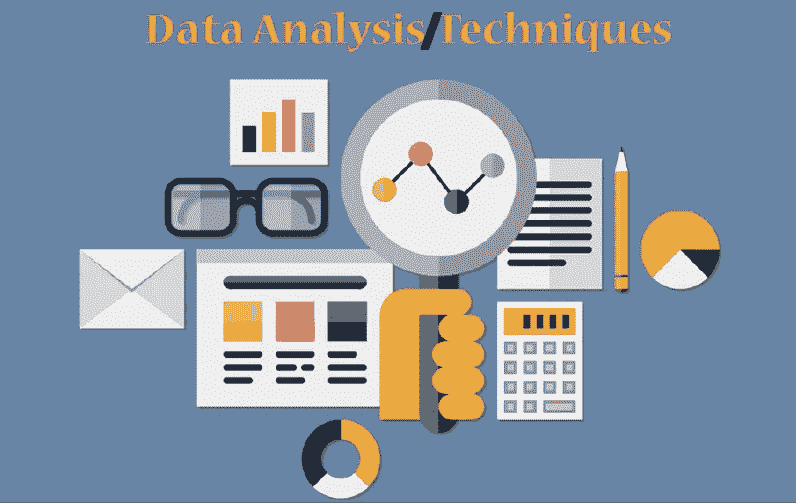

# 数据分析及其技术的一步一步的过程。

> 原文：<https://medium.com/codex/a-step-by-step-process-of-data-analysis-and-its-techniques-6f9c4fac68e9?source=collection_archive---------18----------------------->

一旦你开始收集数据进行分析，你会被大量的信息所淹没，从而做出明确的决定。有如此多的数据需要处理，您需要识别相关数据以进行分析，从而得出准确的结论并做出明智的决策。以下简单的步骤将帮助您识别和整理用于分析的数据。

***那么，没有任何进一步的到期让我们开始吧！！！***

# 1.定义你的范围

*   定义简单明了的简短问题。你最终需要的答案一定会帮助你做出决定。
*   定义测量参数。
*   定义你想要考虑的参数和你愿意协商的参数。
*   定义您的测量单位。ex——时间、货币、工资等等。

# 2.数据收集

*   根据您的参数收集数据。
*   从数据库、网站和许多其他来源收集数据。这些数据可能不是结构化的或统一的，这就需要我们进行下一步。
*   如果你想要一些免费的数据集，请查看下面的文章。

【5.medium.com】可以得到数据集的地方停止

# 3.数据处理

*   组织你的数据，如果有的话，添加旁注。
*   交叉检查可靠来源的数据。
*   根据您之前定义的度量标准转换数据。
*   绑定无关数据。

我希望现在你已经收集了你的数据。

# 4.数据分析

*   执行排序、绘图和识别相关性。
*   当您操作和组织数据时，有时您需要从头遍历您的步骤，在那里您可能需要修改您的问题并重新组织您的数据。
*   使用不同的工具进行数据分析。

# 5.推断和解释结果

*   分析你最初问题的结果。
*   分析做出决策的所有参数。
*   分析执行决策的阻碍因素。
*   选择数据可视化技术来更好地传达信息。

一旦你有了一个推论，永远记住它只是一个理论。现实生活中的场景有时会干扰你的结果。在数据分析过程中，有几个相关的术语用于标识过程的不同阶段。

# 1.数据挖掘

这个过程包括在数据样本中寻找模式的方法。

# 2.数据建模

这是指组织如何组织和管理其数据。

数据分析有不同的技术，你想使用的技术只取决于数据的类型和收集的数据量。每一个都侧重于采用新数据、挖掘见解和深入信息以将事实和数字转化为决策参数的策略。因此，不同的数据分析技术可以分类如下:

# 1.基于数学和统计学的技术

*   **描述性分析**:描述性分析采用历史数据、关键性能指标，并根据选定的基准描述性能。
*   **离差分析**:这种技术允许数据分析师定义因素的可变性。
*   **回归分析**:这种技术通过对因变量和一个或多个自变量之间的关系进行建模来工作。
*   因素分析:这项技术有助于确定一组变量之间是否存在任何关系。
*   **判别分析**:是数据挖掘中的一种分类技术。
*   **时间序列分析**:在这种方法中，测量值在时间上被遍历，这为我们提供了一组被称为时间序列的有组织的数据。

# 2.基于人工智能和机器学习的技术

*   **人工神经网络:**这是一种神经网络，是一种受生物启发的编程范例，它呈现了一种用于处理信息的大脑隐喻。
*   **决策树**:顾名思义，是一个树形模型，表示一个回归模型。
*   **进化编程**:这种技术使用进化算法将不同类型的数据分析结合起来。
*   **模糊逻辑**:是一种基于概率的技术。

# 3.基于可视化和图形的技术

*   柱形图、条形图:这些图表用于表示类别之间的数字差异。
*   **折线图**:该图用于表示连续时间间隔内的数据变化。
*   **饼状图**:用来表示不同分类的比例。最好是一系列数据。
*   **漏斗图**:此图表示各阶段的比例，表示各模块的大小。
*   **文字云图:**是文字数据的可视化表示。
*   甘特图:它显示了与要求相比，活动的实际时间和进度。
*   **散点图**:以点的形式显示变量在直角坐标系中的分布。
*   **气泡图**:它是散点图的变体。这里，除了 x 和 y 坐标，气泡的面积代表第三个值。
*   **量规:**是物化图的一种。这是一种表示区间观测值的合适技术。
*   **框架图**:以倒树形结构的形式直观的表示一个层次。
*   **矩形树形图**:这种技术用于表示层次关系，但处于同一级别。
*   **热图**:表示一个地理区域内每个点的权重。这里的颜色代表密度。

大家敬请关注！！为了把我的故事发到你的邮箱里，请**订阅我的时事通讯。**

感谢您的阅读！不要忘记给你的掌声，分享你的回答，并与朋友分享！