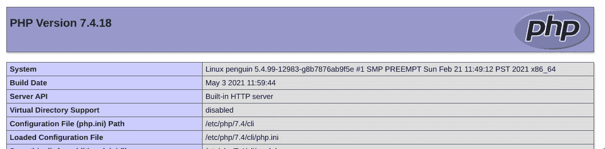
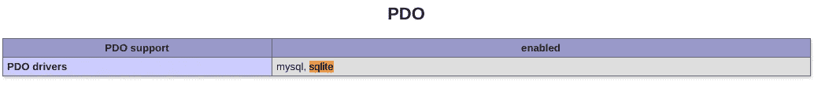

# 开始编码的超级简单的 PHP 教程——第 3 部分——通过 PDO 使用数据库

> 原文：<https://medium.com/codex/a-super-simple-php-tutorial-for-beginning-to-code-part-3-working-with-databases-via-pdo-e32e0b929dfe?source=collection_archive---------3----------------------->


简·安东宁·科拉尔在 [Unsplash](https://unsplash.com/s/photos/database?utm_source=unsplash&utm_medium=referral&utm_content=creditCopyText) 上拍摄的照片

# 第 3 部分的目的

*   理解关系数据库的基础，并能够使用 PHP 将它们集成到基于 web 的应用程序中。
*   了解 PHP 扩展以及如何在您的 web 应用程序中使用他人的代码。

# 先决条件

*   [本系列的第 1 部分](https://johncoonrod.medium.com/a-super-simple-php-tutorial-for-beginning-to-code-part-1-db703d22d227)——PHP 基础知识
*   本系列的第 2 部分 — PHP 页面间通信
*   一个**需要**来处理数据。数据库从来都不容易使用。我试图创建一个尽可能简单的介绍，但是——如果你不需要数据库——就不要麻烦了！
*   数据库背后的基本概念——这里有一个很棒的 [5 分钟 YouTube 教程](https://www.youtube.com/watch?v=wR0jg0eQsZA)(你只需要前 3 分钟)。
*   SQL 的基本概念——结构化查询语言——这里是世界上最可爱的关于 SQL 的 4 分钟 YouTube 教程
*   什么不是先决条件——要开始安装 PHP，您不需要安装 apache 这样的 web 服务器或 MySQL 这样的数据库服务器。我们已经看到了如何使用 PHP 内置的 web 服务器。在这里，您将使用其内置的 SQLite 数据库例程。

# 基本概念

*   **PDO — PHP 数据对象**。SQL 是一种相当标准化的语言，被许多不同的实现所使用:MySQL、Postgress、Microsoft SQLServer、Oracle 等等。PHP 拥有 PDO，而不必为每一个都重写代码。虽然我们不打算深入研究面向对象编码的复杂性，但是我们可以在过程化编码中安全地使用 PDO，而不会有太多麻烦。
*   **PHPINFO。你安装的 PHP 可能有也可能没有内置 PDO。你怎么会知道？您需要一个简单的单行页面 phpinfo.php 如下:**

```
<?php phpinfo(); ?>
```



来自 phpinfo 的一个很长的页面的标题



标题显示安装了哪些数据库驱动程序

*   **PHP 扩展:**你会注意到上面已经安装了 sqlite。如果没有，您需要为您的 php 版本安装 sqlite 扩展。例如，当我安装 php7.4 时它不存在，所以在 linux 中我需要:

```
sudo apt install php7.4-sqlite3
```

*   (对于 windows，这里的指令是[这里是](https://www.php.net/manual/en/install.pecl.windows.php)。)我还发现，当我第一次尝试运行 phpliteadmin(如下所述)时，我也需要 mbstring 扩展。一旦安装了这些，它们就保持安装状态。

```
sudo apt install php7.4-mbstring
```

*   **一个管理页面。**在构建复杂的多页面 web 应用程序时，您不需要自己构建管理员页面。幸运的是，你可以简单地下载一个并链接到它(一旦你移动到一个公共服务器，就会有适当的保护)。对于 SQLite，您可以下载一个页面 [phpLiteAdmin](https://www.phpliteadmin.org/) ，它允许您创建或删除数据库和表格，插入、编辑或删除记录，并测试查询。它还可以导入和导出与电子表格程序兼容的 CSV 文件。
*   **主键:**数据库中的记录由字段中的值访问，通常由主键访问，主键通常是(但不是必须的)自动递增的整数，通常命名为 id。您不必输入该字段，数据库会为您创建。
*   大型数据库表通常有一个或多个索引，允许数据库找到你的记录，而不必读取整个文件。例如，如果您有一个百万人的表，您可能希望根据他们的姓氏或邮政编码创建一个索引。在 SQLite 中使用小表的情况下，没有理由创建索引，除非您真的想了解它们。
*   **查询:**查询是从数据库获取数据的语句，如教程中所示。通常是“从<表>【where 子句】中选择<字段>”的形式。例如，在 test1 的 people 表中，您可以执行下面的查询。还有 SQL 语句对数据库做所有其他的事情:创建、删除、删除、插入更新，你可以在这里找到。

```
select first_name,last_name from people where name='Brown' 
```

# 终于！构建数据库 PHP web 应用程序！

*   **项目文件夹:**你的 app 会由一堆小文件组成，请为它们创建一个文件夹。如果您还没有使用像 VSCode 这样可以处理文件夹文件的编辑器，这可能是一个转换的好时机！我已经把所有这些文件的副本放到了我的 github 库，所以你可以从 https://github.com/jcoonrod/demo1 下载或者“克隆”它们
*   **错误报告:** PHP 通常不会在浏览器中显示错误。在生产环境中，您真的不希望用户看到这些消息——它们出现在服务器上。但是当你开发一个数据库应用程序时，你实际上会想要看到它们。我已将它们添加到下一部分。
*   **D.R.Y .(不要重复自己):**我们将创建一堆具有相同标题的相似页面，所以 header.php 将保存共同的行，然后我们可以在其他页面中包括它，包括一个超级简单的菜单，超级精简的 CSS 和在[谷歌的灯塔测试](https://web.dev/measure/)中获得 100%分数所必需的标题(这是我总是喜欢做的事情，如果我可以的话)。)你会在那里看到一个 svg 图标——SVG 图形是一个有趣的学习工具。我最喜欢的学习网络知识的地方

```
<!DOCTYPE html>
<html lang='en'>
<head><title>My App</title>
<link rel="icon" type="image/svg+xml" href="/favicon.svg">
<meta name="viewport" content="width=device-width, initial-scale=1">
<meta name = "Description" content = "My first database app">
<style> * {font-family:sans-serif;}
nav, th {color:white; background-color:navy;padding:5px;}
nav a {color:white; font-weight:bold; text-decoration:none;}
nav a:hover {background-color:green;}
</style>
</head>
<body>
<nav>
<a href="/">Home</a> |
<a href="/people.php">People</a> |
<a href="/products.php">Products</a> |
<a href="/phpinfo.php">PHPInfo</a> |
<a href="/phpliteadmin.php" target="_blank">Admin</a>
</nav>
```

*   **将 PHP 连接到数据库:**这是一个简单的例子，它连接到数据库，并将客户的名字复制到一个表中。您将在包含“- >”的表达式中看到您的第一份 OOP 代码像 PDO 这样的对象有一堆函数，你可以用“objectname- > function”来引用它们“new”命令创建一个新的 PDO 对象，我们将其命名为$db，指向我们的数据库文件。query 命令创建一个我们称之为$stmt 的语句对象，它的 fetch 函数以常规数组的形式一次返回一个$行。坦白说，这些是我唯一用过的东西。

```
<?php require_once("header.php"); ?>
<h1>People in Test1</h1>
<?php
$db=new PDO("sqlite:test1.db");
if(!$db) Die("Failed to connect");$stmt=$db->query("select first_name,last_name from customers order by 2");
if(!$stmt) die(print_r($db->errorInfo(),true));
?>
<table>
<tr><th>First Name</th><th>Last Name</th></tr>
<?php 
while($row=$stmt->fetch()) 
  echo("<tr><td>".$row[0]."</td><td>".$row[1]."</td></tr>");
?>
</table>
</body>
</html>
```

# 问题集

*   将类似的查询语言添加到按价格列出订购产品的 products.php 页面中。
*   创建一个新表“采购”,该表将客户与产品关联起来(提示——4 个整数字段和一个，id，customer_id，product_id，purchase_date)。对于后者，在 https://www.sqlite.org/datatype3.html[学习 Unix 时间](https://www.sqlite.org/datatype3.html)
*   向菜单中添加一个新页面——purchase.php，该页面选择一个客户和一个产品，并向采购表中插入一条新记录。

# 何去何从！

*   一旦您熟悉了这一点，您就可以轻松地将所学应用到使用 MySQL 或其他专业级数据库的“真实世界”系统中。
*   如果你开始在云中构建应用程序(如谷歌或 AWS)，多页面应用程序通常会将每个 URL 发送到 index.php，在那里你需要拉入 URI($ URL = $ _ SERVER[' REQUEST _ URI '])并[解析 i](https://www.php.net/manual/en/function.parse-url.php) t，然后“require_once”相关文件。
*   使用 PHP 的一个好处是，你遇到的任何问题都已经被别人解决了，你可以简单地用谷歌搜索并根据你的需要进行修改。很多人会提到所有需要“Composer”包管理器的包，并学习关于类和名称空间的知识。我通常避免这些([见我的文章](https://johncoonrod.medium.com/top-10-reasons-we-should-stop-using-frameworks-5d23139be728))。如果您必须通过 composer 包含一个包，您可能仍然不需要了解太多关于类或名称空间的知识。