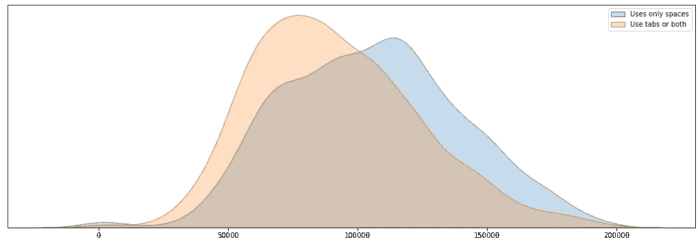

# 招聘软件工程师时的一个令人惊讶的因素

> 原文：<https://medium.com/codex/a-surprising-factor-when-recruiting-software-engineers-492b15b8b254?source=collection_archive---------3----------------------->

## 最重要的指标并不总是有意义

拉格斯技术人员在 [Unsplash](https://unsplash.com?utm_source=medium&utm_medium=referral) 上拍摄的照片

优秀的软件工程师对大多数现代公司来说至关重要，但许多招聘人员无法判断程序员是否掌握了这门手艺。

我快速分析了 2017 年的堆栈溢出调查，以找到指示编程技能的隐藏模式。我发现了一个，不是你想的那样。

# 假设和数据准备

在我们开始之前，我需要告诉你我的准备工作。

## 工资与技能的相关性

很明显，调查中没有问题问你在编写代码方面有多好。在我看来，最能表明你技能水平的问题是你赚多少钱。

所以，做我的分析，我假设你的工资越高，你就越优秀。不是防弹假设，可能是某种正相关。

## 过滤数据

为了确保数据的一致性，我只调查了在美国全职工作的人。

此外，我删除了前 1%和后 1%，以避免离群值。

## 我还剩下什么

我现在有 3398 名收入在 3 万美元至 18 万美元之间的受访者，分布看起来几乎像高斯分布。

我们来看分析。

# 这是我的发现

我决定看看两组大小相似的是/否问题，让我的生活更轻松。

让我们看看三个产生了令人兴奋的结果的问题。

## 计算机科学学位应该是一项要求吗？

你是否需要学位是我关心的问题，也是一个很好的起点。

我把样本分成两组:

*   **计算机科学** —学习计算机科学或软件工程的人(1634 名受访者)。
*   **其他学历** —学过其他东西或者没有大学学历的人(1764 名受访者)。

这两个群体的薪资分布如下:

计算机科学的平均工资差距为 3751 美元。根据 T 检验(0.0014)，这种差异在统计上是显著的，但仅仅是勉强的。

教育看起来相关，但让我们看看是否能找到更好的指标。

## 对开源项目的贡献呢？

现在有了一个可测量的差异。

为开源项目做贡献的人平均多挣 12，299 美元。这几乎是拥有计算机科学学位的四倍。

## 惊喜:制表符与空格

软件开发中的一个激烈争论是使用空格还是制表符来缩进代码。这听起来很傻，但是不要对一个程序员这么说。如果你想更多地了解这场激烈的争论，请查看这篇文章。

幸运的是，2017 年的堆栈溢出调查包括了这个问题，所以让我们来分析一下。以下是战斗人员:

*   **只使用空格** —对空格有明显偏好的程序员(1651 名受访者)。
*   **仅选项卡或两者都有** —其他所有人(1660 名受访者)。

结果如下:

我们发现平均年薪的差异甚至更大。这一次是 14235 美元的巨额支持空间。

这是一个大惊喜。也许一个人对空格或制表符的偏好与经验有关。让我们看看，如果缩小受访者的范围，我们是否会发现同样的模式。

那些做了十几年程序员的呢？

10 年以上的工作经验

好吧，五年以内呢？

不到 5 年的工作经验

同样的模式似乎与受访者作为程序员工作了多久无关。

这对招聘人员意味着什么？

# 结论

让我们断定我的研究不会发表在任何科学杂志上。这些假设充其量是站不住脚的。

无论如何，这里有一些最后的想法:

*   不要在你的招聘启事中添加空格作为要求。我不确定为什么这和薪水有这么大的关系。
*   在招聘软件开发人员时，有许多东西比学位更重要。

我就说到这里，谢谢你的阅读！