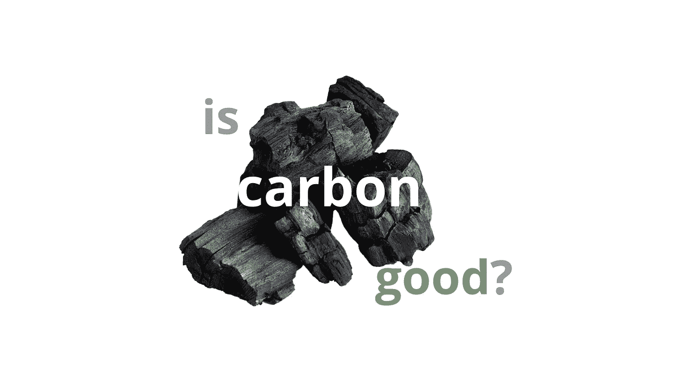

# 谷歌碳的快速介绍

> 原文：<https://medium.com/codex/a-swift-introduction-to-google-carbon-f09b6a3e87c1?source=collection_archive---------6----------------------->

## 用 Google Carbon——Google c++的继任者——写一些代码。

编程世界已经找到了一种全新的语言来与之竞争和合作，这种语言是谷歌的又一成果。这种编程语言自称是 C++的精神继承者，而且它肯定是一种很多编程社区都关注的语言…