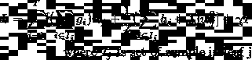
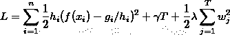

# XGBoost 的理论透视

> 原文：<https://medium.com/codex/a-theoretical-perspective-on-xgboost-d02735fd609b?source=collection_archive---------7----------------------->

[https://xkcd.com/1838/](https://xkcd.com/1838/)

梯度增强决策树(GBDT)是一种基于集成的方法，其中在损失函数的残差上按顺序训练树。GBDT 的主要开销是构建决策树，最耗时的部分是为每个节点寻找最佳分裂点。2016 年推出的 XGBoost 是解决这些挑战的有效实现，下面是它解决这些问题的方式。

损失函数是任何监督机器学习模型的核心，XGBoost 也不例外。从添加新树到拆分树中的单个节点，损失函数是驱动这一切的因素。由于每个新树都试图最小化剩余误差，所以算法在它们之间是相似的。

## 从损失函数到决策树

**损失函数和最优叶值:**考虑一个一般的树结构，其中我们有 **T** 个叶节点，每个节点作为权重/值 ***w*** 。通过对损失函数进行二阶近似，我们可以将其改写为以下形式。最后两项是正则项，分别惩罚叶子的数目和叶子的值。

正则化损失函数

***f(x)，g，*** 和 ***h*** 是数据集中每个样本 ***i*** 的树值、梯度和黑森。这些样本中的每一个都将在 **T** 叶节点中结束。将为该样本预测叶重。利用这一点，我们可以将损失函数改写成以下形式。

损失函数作为叶的总和

在这种形式中，损失函数变成二次函数的和，并且当和*即*叶的每个元素达到其最小值时，损失函数可以达到最小值。

树叶重量和树结构得分

损失函数值( **L*** )的最小值可以作为*分数*来判断树的结构，并根据这个度量来决定修剪树或选择分裂的阈值。

**分裂查找算法:**每个树从根节点开始，然后通过选择特征和分裂点将每个节点分裂成两个节点。XGBoost 使用一个*预排序算法*，该算法通过计算该特征的*加权百分位数*对特征进行排序并列出候选点，其中 Hessians 用作权重。每个样本的误差由该样本的 hessian 加权，并且可以通过以如下形式重写损失函数来看到:

作为加权和的损失函数

然后，每个节点可以在特征集及其候选分裂点上运行贪婪搜索，以选择在树得分中具有最大增益的一个。

## 驱动速度的因素

算法选择和系统设计都在加速中扮演着重要角色。一个因素是使用上面提到的预排序算法。其他的如下所述。

**处理稀疏数据:**由于一次性编码或缺少值，最终得到稀疏数据集的情况很常见。分裂查找算法仅考虑非缺失值，这降低了计算复杂度。对于缺失值，它可以向左或向右。对这两种情况进行评估，并选择具有最佳树分数的一种。

**用于并行学习的列块:**为了找到特征上的最佳分割，需要排序，这是最耗时的方面。每个特征以[压缩列(CSC)](https://en.wikipedia.org/wiki/Sparse_matrix#Compressed_sparse_column_(CSC_or_CCS)) 格式存储在内存单元或*块中。*由于 split-finding 算法适用于排序后的数据，因此可以将行分成多个块。每个块可以在不同的机器上(用于分布式学习),或者当数据太大而不适合内存时存储在磁盘上。使用这种排序结构，分位数查找步骤变成了对排序列的线性扫描。这对于频繁产生候选项的每个节点上的本地提议是有价值的。

**高速缓存感知访问:**块结构有助于优化分裂查找的计算复杂度，但是引入了另一个问题。每个已排序的要素现在的顺序与原始数据索引不同。以这种不连续的顺序访问它们的梯度统计数据，这在时间上引入了开销。为了在近似算法中解决这个问题，选择每个块中⁶样本的最佳大小。较大的块大小将导致缓存未命中，因为梯度统计数据不适合 CPU 缓存。

## 与 LightGBM 的比较

LightGBM 是由微软引入的，以缓解现有算法(如 XGBoost)对更大特征维度的不满意结果。XGBoost 需要扫描所有数据实例来检查所有特性的信息增益，这可能是一个瓶颈。引入了两种新技术来缓解这种情况:

**基于梯度的单侧采样(GOSS):** 这个概念用于对训练任何新决策树的数据实例的数量进行下采样。任何样品的梯度都是其重要性的有用指标。低梯度意味着该样本的训练误差很小，并且它已经被很好地训练。在算法中，这是通过仅使用具有最高梯度的顶部样本和低梯度样本的随机子集来使用的。仍然需要包含低梯度样本，否则会改变数据分布。尽管来自低梯度样本的信息增益减少了一个因子以保持其低重要性。

**排他性特征捆绑(EFB):** 在高维数据中，很多特征可以是稀疏的、互斥的(例如:一键编码)。这种排他性可用于将它们捆绑在一起，并通过减少特征尺寸来实现加速，而不会损害性能。

1.  陈，t .，& Guestrin，C. (2016 年 8 月)。Xgboost:一个可扩展的树提升系统。在*第 22 届 acm sigkdd 知识发现和数据挖掘国际会议论文集*(第 785–794 页)。
2.  柯国光，孟，陈，王，陈，马，刘天元(2017)。Lightgbm:一种高效的梯度推进决策树。*神经信息处理系统的进展*， *30* ，3146–3154。

***如果你有问题或者评论里有反馈，请告诉我。***