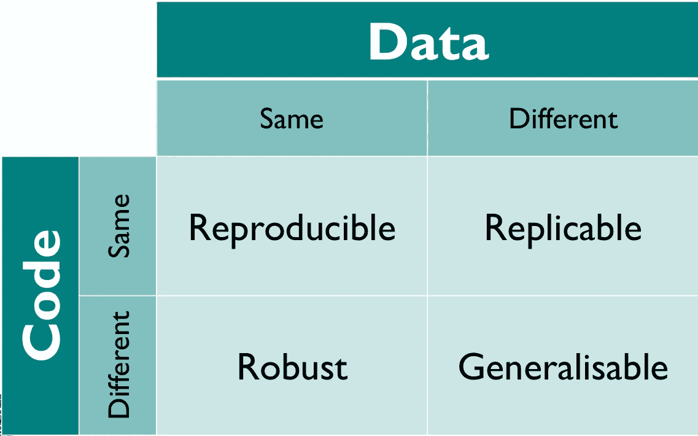

# 应用数据科学的一个棘手部分:选择偏差

> 原文：<https://medium.com/codex/a-tricky-part-of-applied-data-science-selection-bias-c1b7000a8d1e?source=collection_archive---------15----------------------->

## 商业用途中的分类模型

在商业用途上有很多种分类模式，客户维系、追债、交叉销售、向上销售……你说得出！

假设你的下一个模型已经准备好并开始运行了！当您召开验证和部署会议时，您急于将其投入生产。到目前为止一切顺利。

设计生态学家在 [Unsplash](https://unsplash.com?utm_source=medium&utm_medium=referral) 上拍摄的照片

在这一点上，利益相关者可能真的被你刚刚念出的那个令人费解的名字和*所打动，也可能增加了一点期望。有点像嗡嗡效应，伪装的嗡嗡杀声。*

# *流言传到了行动镇*

*消息传到业务部门，业务部门将利用这些预测做出决策并采取行动:*

*   *例如*、*、**最有可能流失的前 20%** 客户可以获得💘勿忘我特别优惠。*
*   *另一个例子是对潜在客户的选择，他们需要额外的推动来改变他们的观点并达成交易🤝。*

***现在，这是一个关键时刻。这种选择很可能会在未来困扰你。这是棘手的部分！***

*只是现在，在一轮会议之后，更多的燃料被添加到这个*期望之火上:公司业绩的提升可能来自部署这样的预测。**

## *因果关系假设*

*如果没有准备好智能部署实验，那么为生产开绿灯可能是可行的方法😕。随着预测开始被使用，前馈到生产，这可能会让人觉得这是一项出色的工作。*

*在几轮生产和事后数据之后，客户看到他们的业务指标比以往任何时候都提高了。令人费解的是，这样的进步被**认为**要归功于刚刚交付的一款车型。*

*这个假设至少揭示了两个重要的组成部分:一个是作者对自己作品的偏见，不管是好是坏。另一个是反事实的:如果它是一个不同的模型，甚至根本没有模型，那么业务指标会是什么？*

*换句话说，对“为什么这样的业务指标会改进？”经常被认为是:“由于生产中的更好的模型”。*

*因果关系学科。希望没有伤害，这可以被认为是一种情况，需要一个实验设计和一个因果关系方法的推理仔细评估。*

*但是请记住:“小心并不意味着没完没了！”。*

# *当心积雪！*

*一项业务如何依靠高频决策机或机器学习驱动的应用程序来帮助他们？*

*在制造低成本和可维护的软件，以增加实验驱动的策略在其上运行良好的信心方面，前面还有许多挑战💡不同的(新)数据。*

*💡 ***不同的*** 这里指的是用来训练你的模型以外的。*

**

*[https://fig share . com/articles/presentation/Barriers _ to _ reproducible _ research _ and _ how _ to _ comprise _ them _/5634136](https://figshare.com/articles/presentation/Barriers_to_reproducible_research_and_how_to_overcome_them_/5634136)*

*现在，漂移到底是什么？嗯，瓦列里奥·马吉奥演讲的第一部分有点致力于解释它。他还提供了对 Kirstie Whitaker 工作的参考，即上图的来源。*

*一旦你找到了一个成功的方法，如果你属于商业领域，你肯定会想要复制和推广它。*

*这往往是一个巨大的挑战，因为你在培训和验证(样本)**选择**中遗漏的许多东西，将来很可能对你来说是未知的。为什么*

## *你不知道你不知道什么*

*嗯，你肯定知道**上钩的那条鱼*的结果。你**不知道**不过，结果为鱼*谁* **没有上钩**。****

*💡销售变现，回收的钱，转化的客户，等等。这些是你知道的，因为你实际上记录了它。但是从未发生的销售呢？从未发生的恢复还是未实现的转换？*

***例如:**您预测一位顾客很可能会在这家网上鞋店购买一双鞋。你给他们贴上潜在购物者的标签。现在，事实证明他们甚至没有点击你的 ***【添加到卡片】*** 或 ***【查看更多】*** 等花哨按钮就离开了。*

*👉问题是:他们是在别处买的吗？也许，他们从来没有真正买过。*

*更糟糕的是，一些过程需要一系列的**选择，**创造出一系列不断增长的未知结果。现在，让我们集中在一个单一的选择。也就是说，对于一个给定的人群，你根据自己算法提出的规则，得到一个‘人’的样本。*

***所有这些都是为了说明这一点:**当你交付一个新的模型，做出决策以选择部分输入群体时，你很可能会成为 ***在你稍后将用来确认预测的数据中引入偏差*** 。根据它的定义。*

*如果一切按计划进行，你没有代表你想要预测的“人口”的数据。*

*💡下次你想直接跳到 *model.fit* (一个用于训练模型的流行命令名)，确保你 ***理解并找到方法解决你的数据经过*** 的选择过程中的偏差。*

*否则，你的下一个模型不会做得很好，而且很难解释为什么😔。*

*记住那些让你的老板印象深刻的好指标。其中一些可以是 AUC (ROC)、Precision、Recall 等等。它们将反映你实际上可以确认的人口比例的真实结果，因此它是服从同样的有偏见的过程。*

*在接下来的几行中，我将提供一些对我非常有用的资源。*

*让我知道你的想法，欢迎批评。*

> *关于实验设计的说明；*
> 
> *以利润为导向的公司很难同意完全随机的试验，所以在商业活动中尝试这样做是没有意义的。就是贴不住。*
> 
> *一个准备充分的实验者将会有一个帮助他们识别和理解可能导致观察结果的因素的设计。*

# *资源*

## *偏见和道德*

*Jaspreet 的这篇文章探讨了不同类型的偏见，包括歧视性偏见。这是一本必读的书。*

* [## 理解和减少机器学习中的偏差

### '..即使在观察了物体的频繁或持续的结合之后，我们也没有理由得出任何…

towardsdatascience.com](https://towardsdatascience.com/understanding-and-reducing-bias-in-machine-learning-6565e23900ac) 

## 种子和随机化

在这个演讲的最后，Maggio 展示了一种解决偏见的方法，使用种子固定和 [Sickit-learn 的 StratfiedKFold](https://scikit-learn.org/stable/modules/generated/sklearn.model_selection.StratifiedKFold.html) 。

## 倾向得分

卢卡斯·伯纳蒂提出的另一种方法建议你使用一个“等价的”目标变量来训练你的模型，并去除那些在等价模型中突出的变量。

在某种程度上，它可以减少模型的性能指标，好处是在开发、验证和生产集中有更少的不同指标。

> 有人可能会说我在这里混淆了因果关系和偏见，在某种程度上这是对的。但是我想先把重点放在偏见方面，把原因留到以后再说。

## 感谢阅读！*