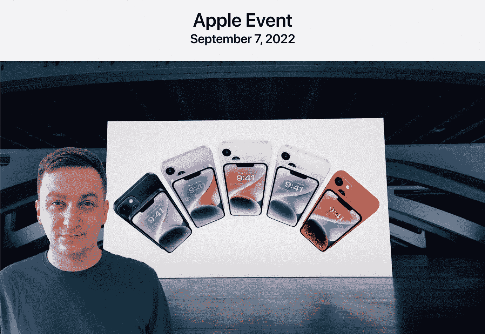

# 一首很贵的老歌。这就是基本款 iPhone 14 给我的印象

> 原文：<https://medium.com/codex/a-very-expensive-old-song-thats-how-the-basic-iphone-14-strikes-me-549bbd388788?source=collection_archive---------9----------------------->

## 由于没有什么新功能，价格上涨了。这种修复值得额外花费吗？

图片由作者提供(基于苹果:主题活动)

我有机会试用了基本款的 iPhone 14。一波又一波的批评在流传，说与上一代相比，它带来的新闻是多么少，苹果会让你为它付出多少…