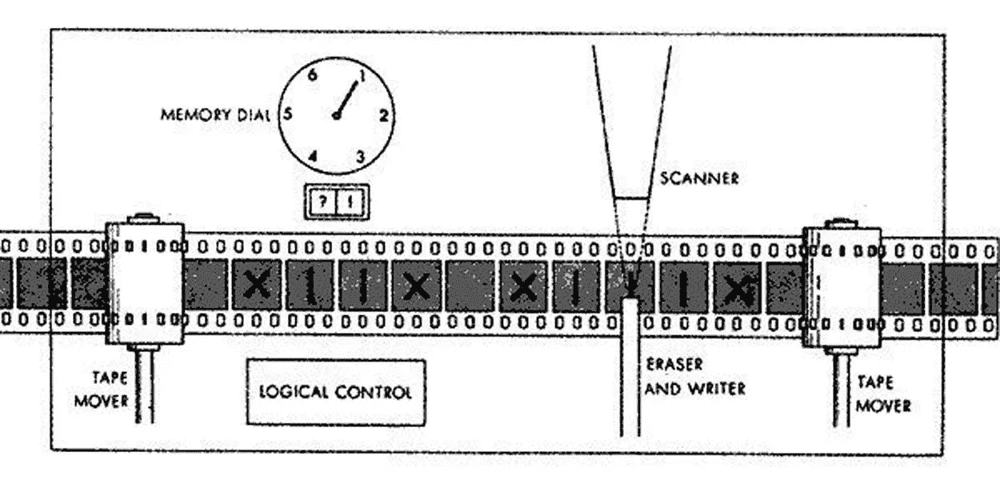

# 非常非常高级的计算理论方法— EP4

> 原文：<https://medium.com/codex/a-very-very-high-level-approach-to-computing-theory-ep4-861df0288c8e?source=collection_archive---------24----------------------->

你好读者，欢迎来到计算理论介绍系列的又一集。距离上一集已经过去了很长时间，所以在上一集[中，我们回顾了下推自动机和自由上下文语法的基础知识，在这一集中，是时候介绍:](https://kevin-da-silva.medium.com/a-very-very-high-level-approach-to-computing-theory-ep-iii-5b9cba794d43)



图片来自 [CS 理论](https://cstheory.stackexchange.com/questions/25757/source-of-turing-machine-illustration/25810)

# —图灵机

想象一个机器，它可以从一个无限长的符号串中读取，可以在字符串中前进和后退，也可以在字符串中写入。这是对图灵机的简要描述，但是图灵机可以拥有 DFA、NFA、下推自动机和自由上下文文法的所有能力。

例如，要识别 abc*后面的字符串序列

```
[a | b | c | a | b | c ]
 ^-reading
```

首先，我读取第一个符号，如果它是一个“a ”,然后我将“a”标记为已读，并转到下一个位置

```
[X | b | c | a | b | c ] 
     ^-reading
```

如果是“b ”,我会将“b”标记为已读，然后转到下一个位置

```
[X |X| c | a | b | c ] 
       ^-reading
```

如果是“c ”,我将“c”标记为已读，然后转到下一个位置，等等

```
[X |X| X| a | b | c ] 
          ^-reading
```

现在对于一个需要自由上下文替代方案来解决的问题，我们也可以使用图灵机，例如，一种要求我们有多个'('后跟相同数量的')'的语言

```
[( | M | )]
 ^- reading
```

如果第一个符号是'('，那么我标记'('符号，并在字符串中前进，直到我找到字符串中间的符号(M)

```
[X | M | )]
     ^- reading
```

一旦我找到了字符串的中间，我继续前进，直到我找到一个未标记的符号，一旦找到一个未标记的符号，我标记“)”符号

```
[X | M | X]
         ^- reading
```

然后，我转到字符串的开头，开始寻找一个无标记的'('符号我以' M '符号结束，我向前寻找一个')'符号如果我找不到任何')'符号字符串符合语法如果出现相反的情况，那么机器会拒绝它

但是，如果图灵机做的工作与 DFA、NFA、下推自动机和自由上下文文法一样，我们为什么还需要图灵机呢？

简单！有些语言问题是我们无法用上述方法解决的，著名的[递归可枚举语言问题，](https://en.wikipedia.org/wiki/Recursively_enumerable_language)其中一个问题是枚举给定语言的所有有效字符串。为了解决这个问题，我们需要图灵机的递归能力，能够在字符串上自由移动，以及结合所有先前的技术。

谈到图灵，我不能不提到不可思议的阿隆佐·邱奇和他的:

# —λ演算

数学上等同于图灵机，Lambda 演算是对递归可枚举语言问题的解决方案，由阿隆佐·邱奇创建，允许正式研究计算属性

你可以想象一个图灵机，更像是接收一个自动机或者一组组合自动机和一个无限字符串的机器。Church 的 lambda 微积分更像是一台机器，你给出一个数学函数和一个无限长的字符串，然后数学函数在字符串的顶部运行。

丘奇的λ演算对函数式语言的影响；

```
-- Haskell example
map (\value -> value+3) [1..]-- my machine (in this case as an example, is a map that receives:)
-- a lambda function \value -> value+3 that receives a numeric value and adds 3 to it
-- and an infinite list [1..]
-- outputting a result like [4, 5, 6, ..]
```

现在我们已经到了本系列第四集的结尾，在这里我们已经触及了计算理论的顶端。我坚持我的立场，认为计算理论是计算机科学中一个非常成熟的领域，在现实生活中有很多重要的应用，你一定要试一试。

如果我误解或没有正确解释，请在评论中提出您的建议，再次感谢您的关注，再见。