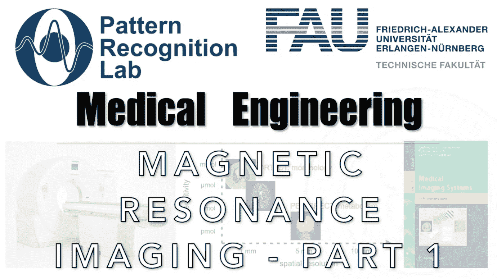

# 磁共振成像的可视化介绍—第一部分

> 原文：<https://medium.com/codex/a-visual-introduction-to-magnetic-resonance-imaging-part-1-812db1f8d95d?source=collection_archive---------7----------------------->

## 医学工程讲义

## 一项获得诺贝尔奖的技术

**这些是 FAU 的 YouTube 讲座** [**医学工程**](https://www.youtube.com/watch?v=vvftvjnXzsY&list=PLpOGQvPCDQzsgK1XuhUXO8r9M4WRqhvDf) **的讲义。这是与幻灯片匹配的讲座视频&的完整文本。该课程由相应的** [**开放存取书**](https://link.springer.com/book/10.1007/978-3-319-96520-8#about) **和开源** …