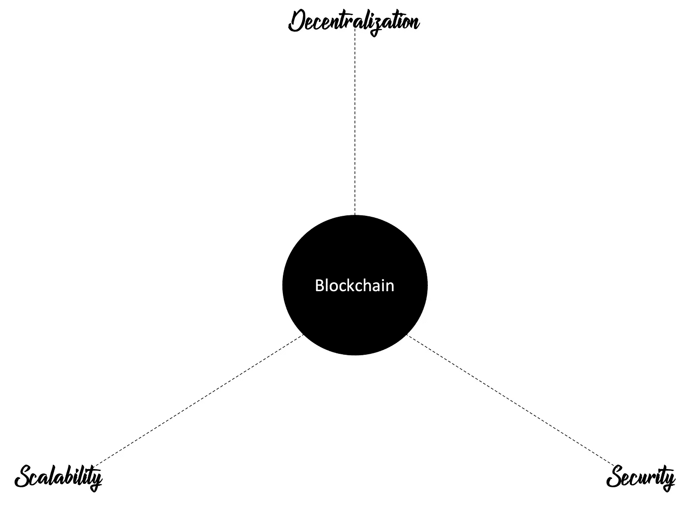

# 不堪重负的开发者的 Web 3.0 生存指南—第 1 部分

> 原文：<https://medium.com/codex/a-web-3-0-survival-guide-for-the-overwhelmed-dev-part-1-a155993cbb3e?source=collection_archive---------11----------------------->

对许多人来说，2021 年 10 月 28 日是一个特殊的日子。对于那些在“外面”的人，脸书将其名称改为 Meta，并宣布它将专注于将“元宇宙”带入生活。那些“内部”人士在 Reddit 等论坛上发泄了他们对这一声明的不满，声称大公司正试图摧毁 Web 3.0 的梦想。

我怀疑在这一点上，任何人都没有听说过加密货币或流行的 memecoins，如 Doge 或 Shiba Inu。你甚至可能被炒作所吸引，买了几袋这样的硬币。但是，这不是本文要讨论的内容。

最近，我的一个非常有才华的开发人员朋友问我如何接近 Web 3.0 世界。以下是我与他分享的关于他在指数增长的 Web3.0 世界中可以解决的当前问题领域的(更)有组织的版本。因此，如果你正在寻找技术本身的入门指南，而不是简单的交易硬币，这是给你的。

# **什么是 Web 3.0？**

Web 3.0 本质上是当前互联网的下一次演变。一个大的。Web 3.0 背后的理念是所有权和控制权从公司转移到个人。因此，在 Web 3.0 中，你将完全拥有你的数字身份、资金和信息，而不是像谷歌、Meta(脸书)和亚马逊这样的公司拥有你的数据并在数据隐私法中寻找漏洞。Web 3.0 的核心是 ***去中心化，*** 而这种去中心化是通过区块链技术实现的。

比特币、以太坊、索拉纳和卡尔达诺都是区块链技术的例子。除了比特币，所有这些区块链技术的真实情况是，他们试图为 Web 3.0 创建基础设施。所有这些技术都为用户提供了一种相互交互的方式，并将这些交互记录在分布式分类帐/数据库中，并通过共识机制进行验证，这反过来又使它们不可改变。这些技术的作用是在基础设施之上构建额外的逻辑，允许更复杂的交易发生。虽然不全是蝴蝶和彩虹。区块链的早期迭代遇到了一个持续至今的问题。

# **问题一:区块链三难**

分散性、可扩展性和安全性。创造区块链三元悖论的三重属性

分散性、可扩展性和安全性。挑两个，在第三个上妥协。乍一看，区块链的这三个方面似乎并不矛盾，但让我们更深入地研究一下。

区块链背后的主要概念之一。存在包含记录和交易的分类账，并且在不同的分布式节点中维护该分类账的精确副本。拥有该分类帐副本的节点或玩家越多，系统就越分散。参与节点通过所谓的共识协议对事务的有效性达成一致。这些算法大多试图解决与信息真实性和可靠性相关的问题，如拜占庭将军问题。一些最流行的共识算法有工作证明，股份证明，历史证明，还有一些更秘密的，如空间和时间的证明。网络越分散，就越不容易被破坏，存储在网络上的信息就越可靠。

**可伸缩性:**当可伸缩性出现时，问题就开始出现了。这里的可伸缩性是指区块链处理不断增长的交易量的能力。棘手的是，因为每个事务在提交到区块链之前需要所有或大多数节点同意其有效性，所以事务往往需要时间。允许更大的吞吐量将需要更少节点的同意，这降低了分散性和安全性。这是因为由少数玩家玩的游戏比由许多玩家玩的游戏更容易出错。作为参考，比特币目前处理约 5 笔交易/秒，以太坊约为 15 笔交易/秒。像万事达卡和维萨这样的集中支付提供商能够处理更大的吞吐量，许多区块链开发者希望有一天达到同样的数字。

**安全:**在这三个问题中，我想说这是最棘手的一个，因为有太多的因素在其中起作用。任何区块链都继承了编写它的语言和操纵它的脚本语言的弱点。用于比特币网络的脚本语言并不是图灵完整的，这使得它更加安全，但在可扩展性方面更加有限。另一方面，以太坊的稳固性是完全的，但早期智能合约代码中的一些漏洞允许资金的虹吸，就像 DAO 的情况一样。最终，盗窃被逆转，但代价是一些人认为区块链的完整性和不变性。确保更安全的链的另一种方法是让更多的节点参与共识，但这降低了可伸缩性，我们又回到了起点。

也就是说，创造一个新的区块链，在三难困境的三个要素之间建立不同的平衡，并不是唯一的解决方案。在本系列的下一部分中。我将深入探讨开发人员处理当前区块链的可伸缩性限制的有趣方式。

敬请期待！