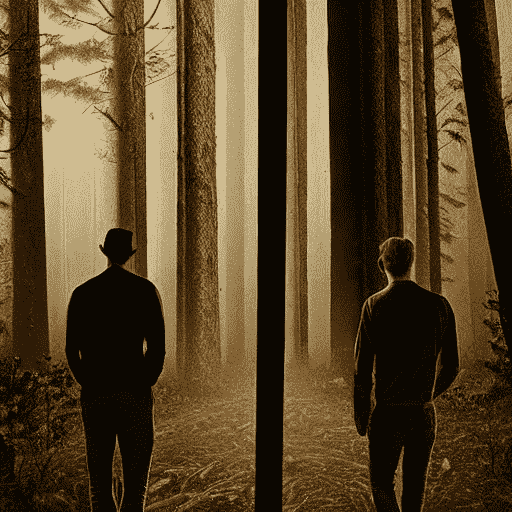

# 关于但丁、米开朗基罗和稳定扩散——用艾重新想象《神曲》

> 原文：<https://medium.com/codex/about-dante-michelangelo-and-stable-diffusion-reimagining-the-divine-comedy-with-ai-4f5f9ab69e04?source=collection_archive---------4----------------------->

一个现实的人工智能愿景的报价“我们的生活中最重要的是每一个人都有自己的风格”——[我的稳定传播创造](https://www.instagram.com/mystablediffusioncreations/)

## 就像米开朗基罗会做的那样，这就是艾如何重新想象但丁的名言。

每天，将文本转换为图像(和视频)的新人工智能算法都令我们震惊，但上周，随着 Stability.ai 宣布公开发布名为…