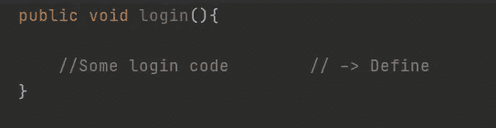

# Java 中的抽象

> 原文：<https://medium.com/codex/abstraction-in-java-1f392018d0c4?source=collection_archive---------10----------------------->

我想从我最喜欢的关于这个概念的比喻开始。例如，当我们使用咖啡机时，我们只需添加一些水和咖啡，然后按下按钮。我们只是接触到它的按钮功能，我们不需要知道它的其他功能(如加热水的功能)。而要使用那台咖啡机，我们不需要知道它的内部系统。它的工作原理是从我们这里抽象出来的。这同样适用于编程。

编程中的抽象意味着只显示对象的重要特征，而隐藏其他特征。因此，我们可以用一种更模块化的方式向用户(程序员)公开我们的对象。简单地说，抽象意味着只关注重要的东西，隐藏其余的。此外，使用抽象，我们不必担心方法的实现。因此，我们可以处理概念而不是它们的实现，这也是软件工程的最佳实践(声明和实现应该分开，我们应该通过接口进行交流)。总之，使用抽象我们可以实现模块化。

**封装和抽象的区别**

抽象->实现隐藏

封装->信息隐藏

```
interface IDog{public void bark();}class Dog implements IDog{private String name = “Max” -> using private is Encapsulation (Information hiding) this field cannot be accessed outside this class.@Overridepublic void bark(){//does stuff }}class Main{
public static void main(String[] args)
{
  IDog dog = new Dog();
  dog.bark()-> Abstraction (implementation hiding) we can just use   the method without knowing its internal implementation
}
```

**在 Java 中实现抽象的方法**

java 8 的接口(%100 抽象)->

抽象类(% 0–100 抽象(因为它们可以有具体的方法))

**界面**

接口是用户必须遵守的契约。我们可以在这里声明一个对象最基本的用法。它组织了一个类应该能够做什么，并确保它实现了这些行为。(否则编译器无法运行应用程序)

**接口的结构**

我们可以通过使用*接口*关键字来创建接口

接口可以有变量(虽然这并不常见),默认情况下它们是公共的、静态的和最终的。

**public** :它们是公共的，就像它们的方法一样，因为如果它们不是公共的，其他类就不能访问它们。

**静态**:它们是静态的，因为接口不能自己实例化。因此它们的值必须分配给静态上下文。

**final** :它们是最终的，因为它确保分配给接口变量的值不能被程序代码重新分配。

默认情况下，接口的方法是公共的和抽象的，它们不能被定义。(虽然在 JAVA 11 之后我们可以像填充抽象类一样填充它们，但这与 OOP 的逻辑相矛盾)。

**注意**:抽象方法是可以声明为未定义的方法。它们必须由使用它们的类来实现。还要注意，当我说声明和定义时，我的意思是:



**它们为什么有用？**

创建它们我们创建契约(必须实现的方法)并强迫它们实现它们。通过只使用最基本的方法创建一个对象并隐藏其余的方法，我们实现了抽象。在下面的代码中，你可以更好地理解它。

```
public interface ICoffeeMachine{
    void pressButton();
   //We need to declare method signatures here }public class CoffeeMachine implements ICoffeeMachine{

 @Override  
 void pressButton(){   //must be implemented -remember the contract-
  boil();
  mixCoffeeAndHotWater();
}void boil(){
//does stuff
}void mixCoffeeAndHotWater(){
//does stuff
}}class User{
public static void main(String[] args)
{
  ICoffeeMachine coffeeMachine = new CoffeeMachine();
  coffeMachine.pressButton(); -> programmer can only access press button function like it was supposed to be it doesn't need to access other methods. (supposed programmer only needs to use press button function)}
```

正如我们在上面使用接口所看到的，我们已经实现了完全的抽象。同样重要的是要注意，通过使用接口，我们也可以实现松散耦合的类。(希望在我的下一篇文章中，我会谈到这一点)。

**抽象类**

抽象类基本上是那些想要使用它的类的模板。它们是可以拥有类似于接口的抽象方法的类。因此它们不能被初始化。抽象类可以有抽象方法(需要由它的子类实现)和具体方法(像常规方法一样，可以被覆盖)

**抽象类的结构**

它可以像普通类一样创建任何变量和定义方法。但它也可以声明抽象方法，这使它不同于常规类。

**它们为什么有用？**

当我们想为相关类创建基类时，应该使用它们。我们可以为它们提供默认的方法实现(可以像常规方法一样被覆盖)。此外，我们可以定义抽象方法，每个类可以不同地实现这些方法。你可以在下面的代码中更好地理解它。

```
public abstract class Human{
    public void breath(){
      //same for all the humans
     } public abstract void speak(){
    //It is abstract because it can be different for every human and      also every human speaks so it must be implemented and it can be implemented differently for every human.
    }
}
public class Asian extends Human{@Override
public void speak(){
//speak chinese (assuming asian person is from china)
}}
class Main{
public static void main(String[] args)
{
  Human asian = new Asian();
  asian.breath(); //uses base class default method
  asian.speak(); //speaks chinese because it has been implemented in that way.
}
```

注意:抽象类的默认方法可以被它们的子类覆盖，就像普通类一样。抽象类不能有自己的对象，因为它们是抽象的，这意味着它们只是不完整的概念，因此不能被实例化。

**抽象类 vs 接口**

它们都可以有抽象方法，但是一个接口不能有具体方法，而抽象类可以。抽象类像常规类一样有各种各样的变量，而接口只能有公共静态和最终类型的变量。

接口只能有抽象方法，另一方面，抽象类可以有各种各样的方法。

一个类可以实现各种接口，而一个类只能扩展一个抽象类。

你应该为相关类使用抽象类。另一方面，您可以为不相关的类使用接口。