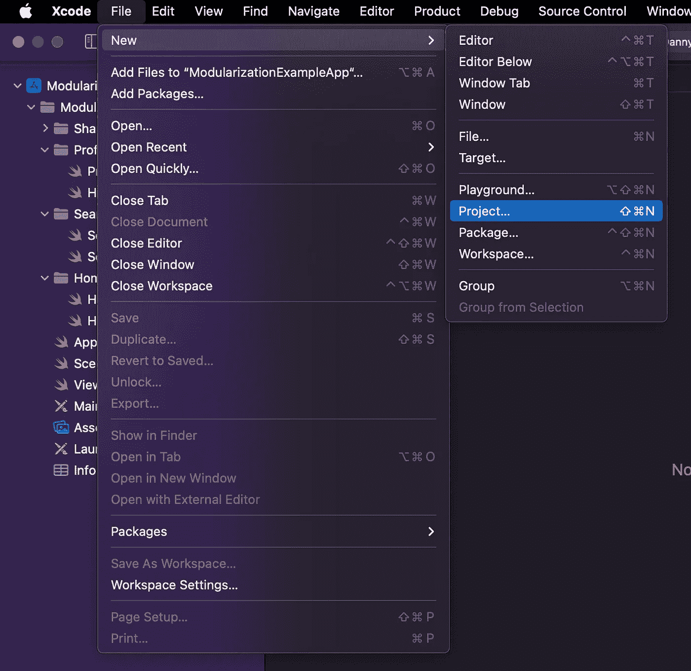

# 在 Xcode 中加速您的 iOS 构建时间过程

> 原文：<https://medium.com/codex/accelerate-your-ios-build-time-process-within-xcode-f1c94f41db55?source=collection_archive---------9----------------------->


照片由 [Unsplash](https://unsplash.com?utm_source=medium&utm_medium=referral) 上的[阿马尔·埃拉米尔](https://unsplash.com/@ammarelamir?utm_source=medium&utm_medium=referral)拍摄

当你在 Xcode 中构建你的 iOS 应用程序时，你是否一直想知道为什么你的 iOS 应用程序项目需要这么长时间？当你创建了一个小的改变，或者你只是想记录或打印你的一些代码，但当你再次构建它花了这么长时间？有没有什么解决方案可以加快我们的构建时间过程，从而提高我们的工作效率？

在这篇文章中，我将告诉你为什么你的 iOS 构建过程需要这么长时间，以及你如何加快你的构建时间过程。事不宜迟，我们进入正题。

通常，当您构建您的 iOS 应用程序项目时，Xcode 会运行许多进程来将您的代码转换为 iOS 应用程序，但有一些进程会决定您的应用程序的构建时间进程，我们也可以加速这些进程，这些进程会被编译和链接。

我写过一篇关于编译和链接过程的文章，这里就不多解释了，但是如果你想了解更多关于编译和链接过程的内容，可以参考这篇 [**链接**](https://danny-santoso.medium.com/how-xcode-work-when-we-build-the-ios-app-project-95fe95f0b17) 。

不同于任何编程语言(像 C++，Objective C，以及其他 C 语言)，swift 没有任何头文件，这也就成为了我们在构建自己的程序时(尤其是编译过程时)swift 编程语言耗时过长的原因之一。

头文件通常包含类、子例程、变量和其他标识符的前向声明。通常，开发人员会在多个源文件中声明标准化的标识符，并可以将这些标识符放在一个头文件中。只要需要头内容，其他代码就可以包含它。这用于分离接口和实现。

swift 等较新的编译编程语言不使用前向声明，标识符将在 Swift 源文件中被自动识别，并直接从动态库符号中读取。所以这就是 Swift 编程语言不需要不同于 Objective C 的头文件的原因。

在编译过程中，编译器会先读取头文件中的标识符，然后在链接过程中读取源文件中标识符的实现，所以当我们在头文件中声明了标识符，但在源文件中没有实现时，在链接过程中就会出错。例如，我在下面创建了两个 c++文件，其中一个头文件声明了将在这两个文件中使用的所有标识符。

*   **fileA.cpp**

*   **fileB.cpp**

*   **fileA.h**

如上例所示，我们可以运行这样的命令来编译和链接这些文件。

*   **编译**

```
g++ -c fileA.cppg++ -c fileB.cpp
```

在我们运行这些命令之后，编译器将创建一个新的 fileA.o 和 fileB.o，这些。o 文件是二进制文件，我们可以用下面的命令把它们链接成一个可执行文件。

*   **链接**

```
g++ fileA.o fileB.o -o executable.out
```

这个命令将生成一个新的可执行文件(executable.out ),允许我们运行。你可以使用这个命令`./executable.out`来运行这个可执行文件。

现在，让我们尝试在 fileB.cpp 文件中命令 haloB 函数，并重新运行编译和链接过程。当你运行编译过程时，它将成功创建一个新的二进制文件，但是当你链接这些二进制文件时，将显示如下未定义的符号错误。


这是因为当我们在头文件中声明所有的标识符时，编译器不会检查该标识符在源文件中的实现，编译器会忽略该标识符在源文件中的实现，而当涉及到链接过程时，链接器会检查该标识符在头文件中的实现是否与源文件中的实现一致。这就是为什么有头文件的编译编程语言比没有头文件的现代编程语言有更快的编译过程的原因，因为编译器会忽略标识符的实现，因为它是链接器任务。

那么我们如何在 iOS 开发中增强我们的 swift 编译呢？解决方案是我们可以用框架创建一个模块化的应用程序。因为当你将你的源代码作为一个框架进行分组或模块化时，它将创建一个新的库文件，无论它是静态库还是动态库，以及任何其他的扩展文件，比如。swiftdoc，。swiftmodule、. swiftsourceinfo .和中的。swiftmodule 文件它包含序列化的 ASTs(可能还有 SIL) —它基本上是一种二进制文件格式，相当于 C 框架或库的头文件。

所以，这就是为什么当你编译的时候，编译器会在。swiftmodule 文件，并将移动到链接器来检查实现，这样编译过程不会花费太长时间。

不仅如此，因为我们创建了一个框架，编译器间接地要求我们将源代码分组为一个模块，这是我们构建 iOS 应用程序时的优势，因为编译器不会再次编译所有框架，但它会编译刚刚做出更改的框架或库，这就是为什么当您创建模块化应用程序时，它会缩短构建时间。

我们如何在应用程序中使用框架来创建模块化？在这里，我将一步一步地指导你使用 Xcode 中的一个框架创建一个模块化的 app。

*   首先，打开你的。xcodeproj，然后创建一个新的工作空间，如下图所示。


*   创建完新的工作空间后，它将显示一个空文件，如下图所示。


*   接下来，你需要做的就是添加你以前的。xcodeproj 文件添加到您的工作区。


*   打开您的目录。xcodeproj 定位，然后将其添加到您的工作区。


*   在您添加您的。xcodeproj 到您的工作区，下一步是您需要创建一个新的框架，通过点击菜单栏中的文件菜单，然后选择一个新的项目。



*   之后，您可以选择创建框架。


*   在工作区文件的根级别或与。工作区文件中的 xcodeproj。


*   在你创建了你的新框架之后，它会如下图所示，然后你需要改变你的框架的库类型。在这里，你可以选择一个静态库作为你的 mach-o 类型的库。
*   你们中的一些人可能想知道静态库和动态库之间的区别，在这里我将简单地解释一下它们。
*   在静态库中，它只链接所有的二进制文件，因为所有的二进制文件都已经被预编译，而在静态库中，所有已经被编译的二进制文件都将被复制粘贴到可执行的 app 中。但是在动态库中它会创建一个引用，在动态库中它会在运行时运行一个链接器。


*   在您更改了库的 Mach-O 类型之后，您可以从主项目中复制您想要作为新模块分离的特性文件夹，并将其粘贴到您的框架模块中，并且不要忘记删除您想要在主项目中作为新模块分离的特性文件夹，因为我们已经将其复制到您的框架中。之后可以添加一个目标，选择如下图的 iOS App 模板。


*   最后，你有你的模块目标应用程序，如果你想创建你的微应用程序，你可以利用它来运行你的模块页面。


*   在你的新模块应用目标中，不要忘记添加你当前的框架。你可以在下图中我标记的部分点击+按钮。


*   然后您可以选择您在上一步中创建的框架。


*   现在，您将有您的框架链接到您的目标应用程序。


*   这是你的模块应用程序的整体外观，你已经从你的主应用程序中分离出来。


*   最后一件事，在你分离你的模块后，如果你复制粘贴你的特征到一个新的模块，如果你有一些 XIB 文件，不要忘记改变你的模块，如下图所示。


*   现在，您可以对所有想要分离为新模块的特性重复这些步骤。

如果你想在你的 iOS 应用程序项目中加快你的构建时间过程，这就是步骤。通过从主应用程序中分离出一个不同的模块，如果其中一个模块有任何更改，编译器只会重新编译有更改的模块，而不会重新编译所有代码，并且通过创建一个框架，它会有。swiftmodule 包含序列化的 ASTs，相当于旧的编译编程语言中的头文件，用于加快编译和链接过程，这就是为什么它会加快您的构建时间过程。