# 用 TigerGraph 增强 Kaggle 计算(第一部分):创建乐高图形

> 原文：<https://medium.com/codex/accelerating-your-kaggle-computations-with-tigergraph-part-i-creating-a-lego-graph-f2a43029f78f?source=collection_archive---------10----------------------->


[图片](https://pixabay.com/photos/lego-toys-figurines-crowd-many-1044891/)来自 [Pixabay](https://pixabay.com/) 作者[发言](https://pixabay.com/users/eak_kkk-907811/)

## 如何对 Kaggle 数据集使用 TigerGraph:使用 Kaggle 的 Lego 图形数据库创建图形

# 概观

[**Kaggle**](https://www.kaggle.com/) 是一个充满数据集、笔记本和竞赛的数据科学社区。 [**TigerGraph**](https://www.tigergraph.com/) 是企业唯一可扩展的数据库。总之，您可以利用 TigerGraph 提供的图形数据库和 Kaggle 的庞大数据集来创建对您的数据的独特见解，从可视化到运行图形算法等等。

这篇博客将是一系列解释如何通过其 API 使用 Kaggle 数据和 TigerGraph 的 pyTigerGraph 和 TigerGraph 云的第一篇博客，首先创建一个图表，然后对创建的图表进行分析。我们开始吧！

# 第一部分:在 TigerGraph 云上创建您的 TigerGraph 解决方案

要找到如何创建您的 TigerGraph 解决方案的详细概述以及关于 TigerGraph 云的所有信息，请查看此博客。现在，我将带您完成您需要完成的主要步骤。

首先，去[https://tgcloud.io/](https://tgcloud.io/.)登陆，如果你还没有登陆的话。接下来，导航至“我的解决方案”选项卡。在右上角，点击“创建解决方案”

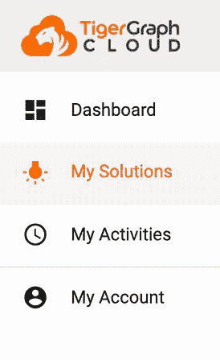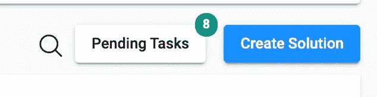

转到“我的解决方案”并点击“创建解决方案”

在第一页上，单击“空白”，然后继续。

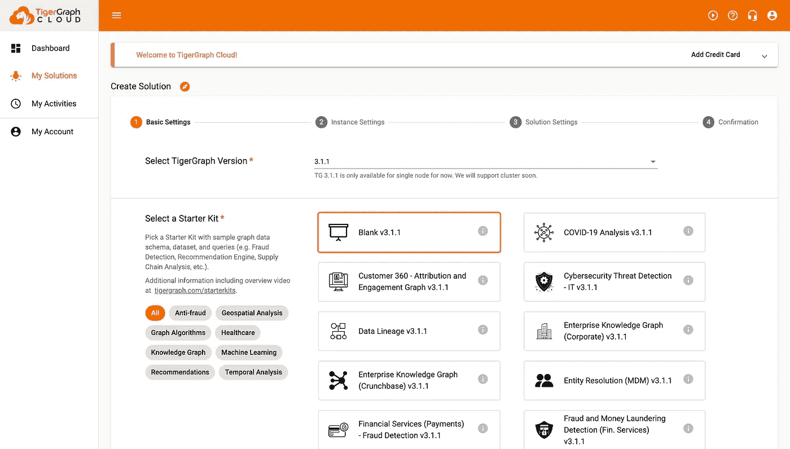

选择空白。

不要修改第二部分的任何设置。这将创建一个免费的 TigerGraph 实例。

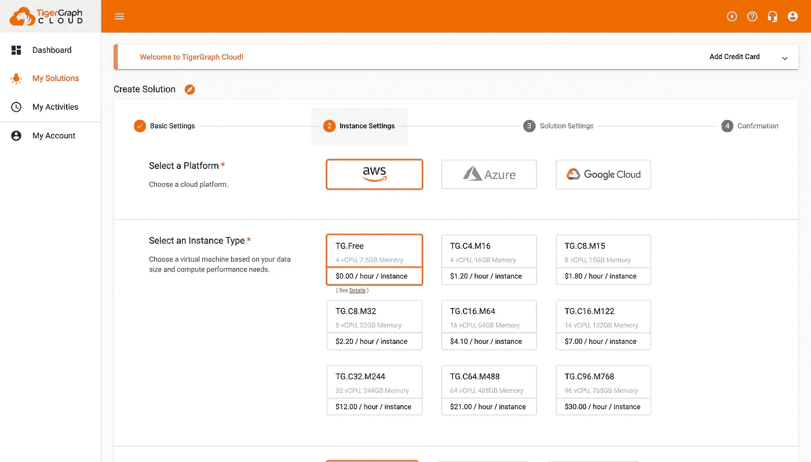

不要碰本页上的任何东西，按继续。

在第三部分，适当地更新凭证，并记下子域和密码，因为我们将在实验的 Python 部分中使用它们！

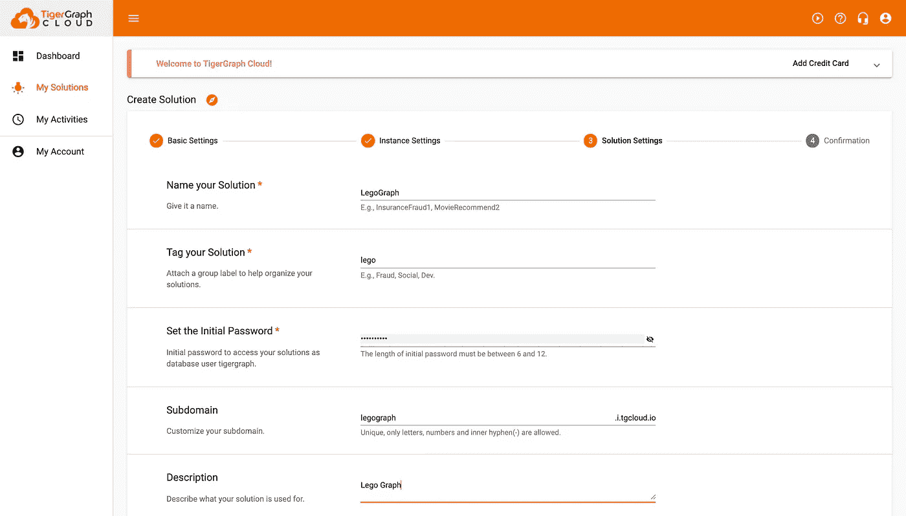

适当地修改它，并记下子域和密码。

最后，在最后一页，验证所有的细节都是正确的，然后点击提交。这可能需要几分钟才能完成。

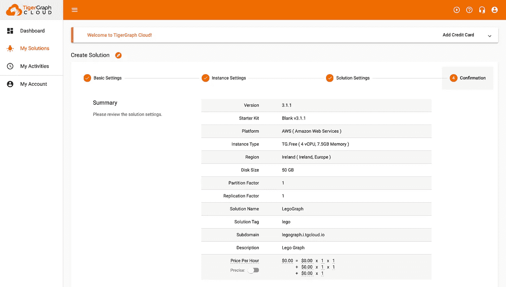

确认一切正常，然后点击“提交”

# 第二部分:连接到图并创建模式

首先，我们将通过连接到刚刚创建的解决方案来设置图表的结构，然后我们将在 GSQL 中编写模式。对于这个例子，我们将使用 Kaggle 的 [Lego 数据库。](https://www.kaggle.com/rtatman/lego-database)

## 第一步:安装并导入 pyTigerGraph，连接到 TG Cloud

打开一个 Colab 笔记本，我们将从安装和导入 pyTigerGraph 开始，这是一个用于连接 TG Cloud 的 Python 包装器。

```
!pip install pyTigerGraphimport pyTigerGraph as tg
```

接下来，我们将创建一个新的 TigerGraph 连接，以连接到我们刚刚创建的解决方案。这里，用您的子域替换子域，用您的密码替换密码。

```
conn = tg.TigerGraphConnection(host="https://SUBDOMAIN.i.tgcloud.io/", password="PASSWORD")
```

在我的例子中，假设我使用了默认的 TigerGraph 密码，我的 TigerGraphConnection 将如下所示:

```
conn = tg.TigerGraphConnection(host="https://legograph.i.tgcloud.io/", password="tigergraph")
```

太好了！现在我们已经连接好了，我们可以开始创建模式了。

## 第二步:创建模式和图表

创建模式的代码如下:

```
print(conn.gsql('''CREATE VERTEX Colour(PRIMARY_ID colour_id STRING, colour_name STRING, rgb STRING, transparent STRING)
CREATE VERTEX Inventory(PRIMARY_ID inventory_id STRING) WITH PRIMARY_ID_AS_ATTRIBUTE="true"
CREATE VERTEX Version(PRIMARY_ID version_id INT) WITH PRIMARY_ID_AS_ATTRIBUTE="true"
CREATE VERTEX Lego_Set(PRIMARY_ID set_num STRING, num_parts INT) WITH PRIMARY_ID_AS_ATTRIBUTE="true"
CREATE VERTEX Part(PRIMARY_ID part_num STRING, part_name STRING)
CREATE VERTEX Part_Category(PRIMARY_ID part_cat_num STRING, part_name STRING)
CREATE VERTEX Theme(PRIMARY_ID theme_id STRING, theme_name STRING, theme_number INT) WITH PRIMARY_ID_AS_ATTRIBUTE="true"
CREATE VERTEX Year(PRIMARY_ID year INT) WITH PRIMARY_ID_AS_ATTRIBUTE="true"CREATE UNDIRECTED EDGE INVENTORY_VERSION(FROM Inventory, TO Version)
CREATE UNDIRECTED EDGE INVENTORY_LEGO_SET(FROM Inventory, TO Lego_Set, quantity INT)
CREATE UNDIRECTED EDGE LEGO_SET_THEME(FROM Lego_Set, TO Theme)
CREATE UNDIRECTED EDGE LEGO_SET_YEAR(FROM Lego_Set, TO Year)
CREATE UNDIRECTED EDGE INVENTORY_PART(FROM Inventory, TO Part, quantity INT, spare STRING)
CREATE UNDIRECTED EDGE PART_COLOUR(FROM Part, TO Colour)
CREATE UNDIRECTED EDGE PART_CATEGORY_PART(FROM Part_Category, TO Part)
CREATE DIRECTED EDGE PARENT_THEME(FROM Theme, TO Theme)'''))
```

当创建一个模式时，我通常会记住一些事情。首先，想想你想从图表中得到什么。您想通过什么进行搜索？你会积累什么？关键特征是什么？通常，如果某个东西很重要，我可能想用它来搜索或过滤，比如年份，我会把它分解成自己的顶点。但是，如果该值更多地描述了一些东西，并且是我不一定要搜索的东西，它将是一个属性，就像部件的数量是乐高集合顶点的属性一样。

接下来，当决定边缘时，查看数据以了解边缘可以最合理地添加到哪里通常是有用的。例如，在 Lego 数据库中，有一个名为 [parts_categories.csv](https://www.kaggle.com/rtatman/lego-database?select=part_categories.csv) 的文件，因此，从逻辑上讲，在零件类别和零件之间包含一条边是有意义的。除了跟踪边的数据之外，尝试找到边可能对快速搜索有用的地方或者连接可能有用的地方。

使用这个逻辑，我创建了上面的模式。当在此基础上创建视觉效果或算法时，我会改变或添加一些属性，但模式会或多或少保持不变。

最后，使用 CREATE GRAPH 创建图表。我们称这个图为 LegoGraph，然后参数就是创建的顶点和边。

```
print(conn.gsql('''CREATE GRAPH LegoGraph(Colour, Inventory, Version, Lego_Set, Part, Part_Category, Theme, Year,INVENTORY_VERSION, INVENTORY_LEGO_SET, LEGO_SET_THEME, LEGO_SET_YEAR, INVENTORY_PART, PART_COLOUR, PART_CATEGORY_PART, PARENT_THEME)'''))
```

太棒了。如果您导航到 GraphStudio(转到 https://tgcloud.io/app/solutions 的[，然后单击 Actions 下的四个方块，并单击下拉列表中的“GraphStudio”)，您将能够看到我们创建的图表的模式！当你点击“全球视图”，你将能够找到我们刚刚创建的乐高积木。](https://tgcloud.io/app/solutions)

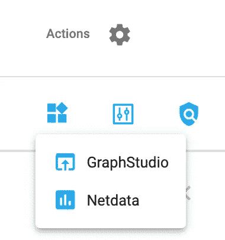

进入 TG 云->解决方案->操作->应用-> GraphStudio。

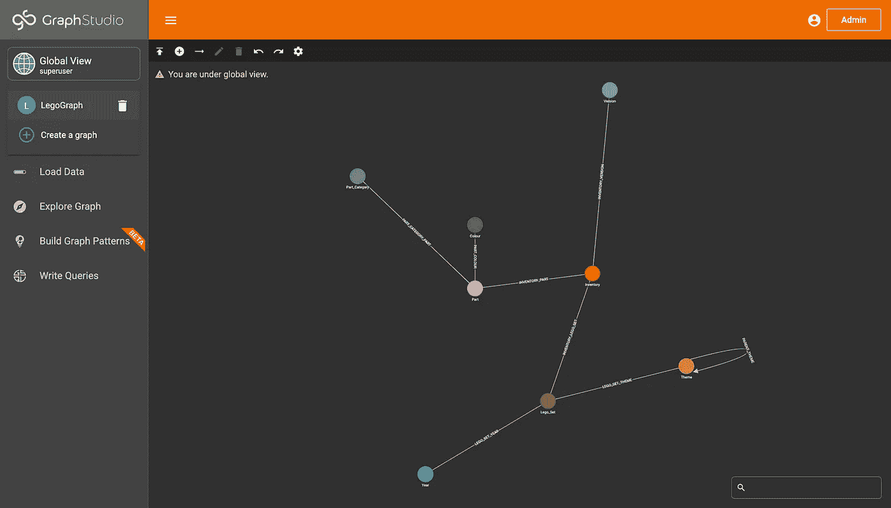

这是我们创建的图表！在下拉列表中，还有 LegoGraph！

## 第三步:更新图形凭证

太棒了。下一步是加载数据。但是首先，要加载数据，您需要更新连接凭证，添加图名并为 TigerGraph 创建一个 API 令牌。

```
conn.graphname = "LegoGraph"conn.apiToken = conn.getToken(conn.createSecret())
```

不错！现在让我们开始从 Kaggle 加载数据！

# 第三部分:从 Kaggle 加载数据

## 步骤 1:生成一个 Kaggle API 令牌

首先，我们需要一个 API 令牌。要得到这个，去[https://www.kaggle.com/](https://www.kaggle.com/)。接下来，点击右上角的个人资料图片，然后点击“帐户”

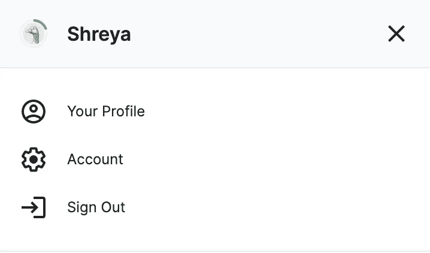

点击右上角的个人资料图片后，按“帐户”。

向下滚动到“API”，然后按“过期 API 令牌”，然后按“创建新的 API 令牌”

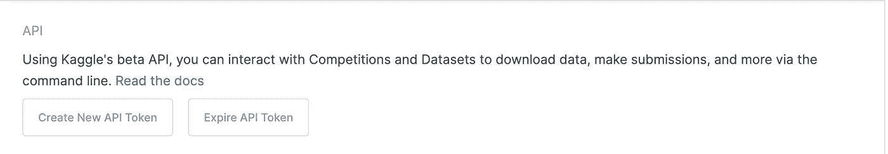

按使 API 令牌过期，然后创建新的 API 令牌。

这将下载一个名为 kaggle.json 的文件，我们将在笔记本中使用它。

## 第二步:在你的笔记本上连接 Kaggle

首先，在 Colab 笔记本中安装 Kaggle:

```
! pip install -q kaggle
```

接下来，将以下代码写入一个单元格，该单元格将提示您上传在上一步中下载的 kaggle.json 文件。

```
from google.colab import filesfiles.upload()
```

在笔记本上运行几个命令来设置 Kaggle。

```
! mkdir ~/.kaggle! cp kaggle.json ~/.kaggle/! chmod 600 ~/.kaggle/kaggle.json! kaggle datasets list
```

> 如果您得到一个 401 错误，您可能需要重复第一步，终止您的 Kaggle 令牌并创建一个新令牌。

最后，导入 Lego 数据集并解压缩文件，用 CSV 重命名文件夹以进行训练。

```
! kaggle datasets download -d rtatman/lego-database! unzip lego-database.zip -d train! ls train
```

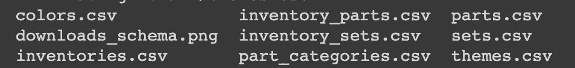

的结果！ls 列车。

如果你能在那里找到你所有的文件，你就准备好继续前进了！

# 第四部分:将 Kaggle 数据加载到 TigerGraph

## 第一步:创建数据框架

让我们通过将 Kaggle 数据加载到 TigerGraph 来整合所有内容！首先，我们将读取使用 Pandas 下载的 CSV 并创建数据帧。我们可以很容易地使用 DataFrames 将数据批量插入到 TigerGraph 中。

```
import pandas as pdcolours = pd.read_csv("train/colors.csv")
parts = pd.read_csv("train/parts.csv")
lego_sets = pd.read_csv("train/sets.csv")
themes = pd.read_csv("train/themes.csv")
inventories = pd.read_csv("train/inventories.csv")
inventory_parts = pd.read_csv("train/inventory_parts.csv")
inventory_sets = pd.read_csv("train/inventory_sets.csv")
part_categories = pd.read_csv("train/part_categories.csv")
```

## 第二步:将你的数据上传到 TigerGraph

最后，使用[upsertverteddataframe](https://pytigergraph.github.io/pyTigerGraph/DataFrame.html#upsertvertexdataframe)和 [upsertEdgeDataFrame](https://pytigergraph.github.io/pyTigerGraph/DataFrame.html#upsertedgedataframe) ，将你的数据帧上插到创建的顶点和边上。

```
conn.upsertVertexDataFrame(colours, "Colour", "id", attributes={"colour_name": "name", "rgb": "rgb", "transparent": "is_trans"})
conn.upsertVertexDataFrame(parts, "Part", "part_num", attributes={"part_name": "name"})
conn.upsertVertexDataFrame(lego_sets, "Lego_Set", "set_num", attributes={"set_num": "set_num", "num_parts": "num_parts"})
conn.upsertVertexDataFrame(themes, "Theme", "id", attributes={"theme_number": "id", "theme_name": "name"})
conn.upsertVertexDataFrame(lego_sets, "Year", "year", attributes={"year": "year"})
conn.upsertVertexDataFrame(inventories, "Inventory", "id", attributes={})
conn.upsertVertexDataFrame(inventories, "Version", "version", attributes={"version_id": "version"})
conn.upsertVertexDataFrame(part_categories, "Part_Category", "id", attributes={"part_name": "name"})conn.upsertEdgeDataFrame(inventories, "Inventory", "INVENTORY_VERSION", "Version", "id", "version", attributes={})
conn.upsertEdgeDataFrame(lego_sets, "Lego_Set", "LEGO_SET_THEME", "Theme", "set_num", "theme_id", attributes={})
conn.upsertEdgeDataFrame(parts, "Part_Category", "PART_CATEGORY_PART", "Part", from_id="part_cat_id", to_id="part_num", attributes={})
conn.upsertEdgeDataFrame(lego_sets, "Lego_Set", "LEGO_SET_YEAR", "Year", "set_num", "year", attributes={})
conn.upsertEdgeDataFrame(themes, "Theme", "PARENT_THEME", "Theme", "name", "parent_id", attributes={})
conn.upsertEdgeDataFrame(inventories, "Inventory", "INVENTORY_LEGO_SET", "Lego_Set", "id", "set_num", attributes={})
conn.upsertEdgeDataFrame(inventories, "Inventory", "INVENTORY_VERSION", "Version", "id", "version", attributes={})
conn.upsertEdgeDataFrame(inventory_parts, "Inventory", "INVENTORY_PART", "Part", "inventory_id", "part_num", attributes={"quantity": "quantity", "spare": "is_spare"})
conn.upsertEdgeDataFrame(inventory_parts, "Part", "PART_COLOUR", "Colour", "part_num", "color_id", attributes={})
conn.upsertEdgeDataFrame(inventory_sets, "Inventory", "INVENTORY_LEGO_SET", "Lego_Set", "inventory_id", "set_num", attributes={"quantity": "quantity"})
```

在 GraphStudio 中，点击“LegoGraph ”,然后点击“加载数据”,你会发现你所有的数据都已插入并准备就绪！

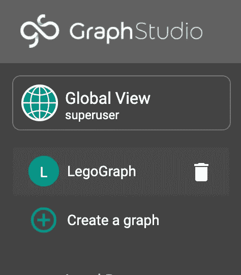

单击 LegoGraph。

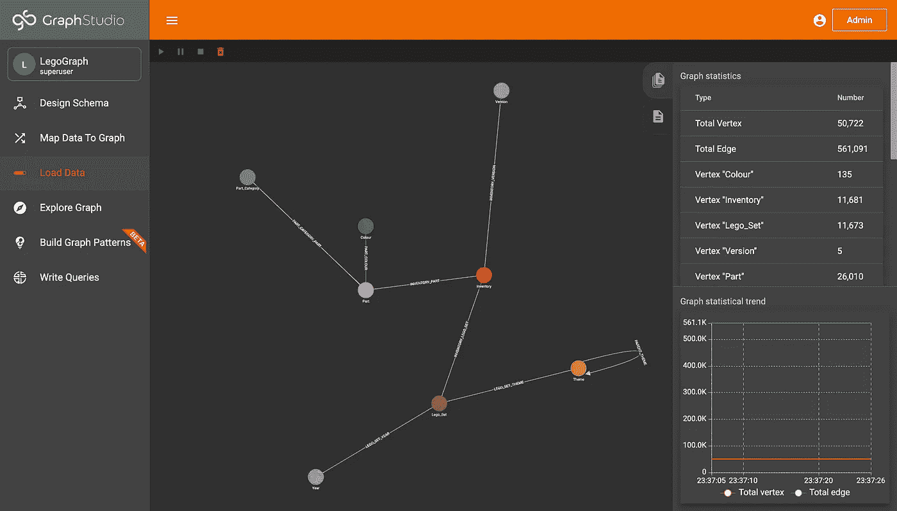

单击“加载数据”并检查您加载的数据。

现在数据在图表中，我们可以对其运行可视化和算法，您可以在创建预测或观察 Kaggle 数据时使用它们。

# 第五部分:最终挑战+资源

恭喜你完成这篇博客！现在你知道如何使用 Kaggle 用 TigerGraph 创建一个图了。在以后的博客中，我们将介绍如何在这个数据集上创建可视化和运行查询！

您的最后一个挑战是用不同的 Kaggle 数据集创建一个图形数据库！如果您需要任何帮助，或者您已经完成了挑战，请加入 TigerGraph Discord 继续前进:

[](https://discord.gg/gRHWBZNpxW) [## 加入 TigerGraph Discord 服务器！

### 查看 Discord 上的 TigerGraph 社区-与 584 名其他成员一起玩，享受免费的语音和文本聊天。

不和谐. gg](https://discord.gg/gRHWBZNpxW) 

您可以通过此处的笔记本了解本实验:

[](https://colab.research.google.com/drive/1u_ZbB3GeyjvLB22yL03q6cjMYbGVfZ-Y?usp=sharing) [## 谷歌联合实验室

### 编辑描述

colab.research.google.com](https://colab.research.google.com/drive/1u_ZbB3GeyjvLB22yL03q6cjMYbGVfZ-Y?usp=sharing) 

非常感谢，祝挑战好运！