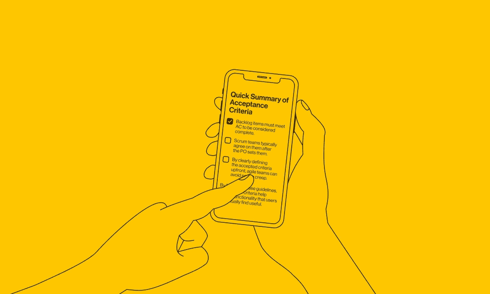
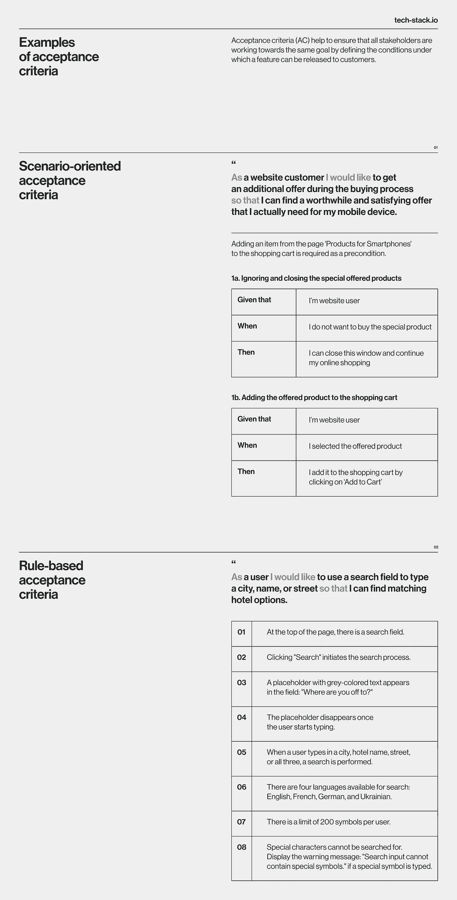

# 创作高性能用户故事的验收标准技巧和例子

> 原文：<https://medium.com/codex/acceptance-criteria-tips-and-examples-for-crafting-high-performing-user-stories-502ed1ee59ea?source=collection_archive---------3----------------------->

阻碍团队实现目标和开发产品的最大挑战之一是不一致。今天，团队试图建立自治文化和授权文化，而不仅仅是委派任务。然而，伴随自主而来的自由包括责任和结盟。在我们之前的文章中，我们描述了用户故事如何帮助团队在 SDLC 过程的所有参与者之间实现这种一致性。现在，让我们深入了解一个工具，它可以帮助用户故事保持整个团队在同一页面上。

未能满足最后期限和低质量的产品发布通常是由沟通不畅和不一致造成的。项目管理协会的[职业脉搏](https://www.pmi.org/learning/library/communication-method-content-in-project-9937)报告称，对于项目管理成熟度高的组织，27%的项目没有达到最初的目标和商业意图。相比之下，那些 PM 成熟度低的人超过了这个数字 47%。让我们来定义验收标准如何帮助解决这个问题，并帮助您的团队实现目标。

# 定义验收标准

有这么多可移动的部分，有一套每个人都同意的清晰简明的目标是很重要的。

验收标准(AC)通过定义一个软件产品应该满足什么样的条件来帮助确保所有的涉众朝着同一个目标努力，以便我们可以将它发布给客户。此外，AC 有助于在 SDLC 的早期识别潜在风险，从长远来看可以节省时间和金钱。无论你是有一个经验丰富的软件开发专家团队，还是刚刚起步，确保在你的下一个项目中包括他们，以获得成功的结果。AC 用于:

*   确定用户故事是否准备好发布；
*   在发布前评估该产品的质量水平；
*   确保产品满足客户的业务需求；
*   保持用户故事清晰、易懂、可实现。

AC 帮助验证用户故事是否满足所有必要的需求。如果 AC 中的任何一个没有被满足，特性应该在被接受和发布之前被改进。

敏捷也使用一个类似的工具——完成的定义——来衡量将要发布的特性的准备程度。它们之间的区别可能很难理解。然而，对于产品所有者来说，了解其中的区别是至关重要的。这样他们就不会为了按时完成任务而将一组需求误认为另一组需求，并在所有阶段保持质量标准。

根据 Scrum 指南，Done (DoD)的定义定义了每个产品增量在被认为完成之前必须满足的标准。DoD 和 AC 的区别在于前者适用于所有用户情景。然而，根据需要满足的需求，AC 对于每个用户场景都是不同的。

# Techstack 案例

> 在 Techstack，我们确保我们的敏捷流程帮助团队为产品提供最大价值。这有助于确保软件不仅能按预期运行，而且能满足顾客或客户的期望。通过对需要完成的任务有一个清晰和共同的理解，我们可以避免误解，并确保每个人都在同一页上。因此，国防部调整了团队，减少了对相同需求的不同解释的机会。

# 验收标准用于什么？

为了确保特性满足所有必要的需求，AC 对于任何项目都是必不可少的。它们提供了一个清晰、简洁、可度量的定义，定义了为了将产品特性标记为成功，需要交付什么。AC 应该在特性工作开始之前决定。它们可以被用来评估一个可交付物是否完整和适合目的，或者被用作项目中不同涉众之间交流的工具。

*   **期望管理。**可接受的 AC 应该有明确的界限，以便在解释时没有歧义。答案应该是“是/否”或“通过/失败”。
*   **范围变更管理。**范围变更是产品工程团队的主要风险。如果你从一开始就没有明确的目标，你的工作就很难保持在正轨上。这可能会导致意想不到的延迟或成本，从而打乱任何未来的计划。
*   **承诺文书。与客户达成共识是当务之急。如果他们觉得你没有履行你的所有承诺，记录良好的验收标准将解决任何可能存在的模糊之处。**
*   **估计优化。团队对任务的界限越明确，他们就越有可能准确估计每项任务需要多长时间。AC 有助于设置和对齐这些边界。**
*   **测试优化。** AC 帮助你编写测试用例，检查你的系统是否按预期执行，并提供改进或修改指南。

# 谁编写验收标准，何时编写？

通常，确保团队根据客户或最终用户的需求交付用户故事是产品负责人(POs)的责任，很少 Scrum 团队。因此，他们能够很好地确定应该满足什么样的 AC。

为了排除错误和低质量的开发，AC 应该在用户故事的开发工作开始之前创建，以便所有各方对剩余的交付有一个共同的理解。理想情况下，AC 应该在 sprint 开始之前被团队创建和理解。这确保了团队中的每个人都同意需要完成什么。

# 如何编写验收标准

AC 可用于在发布前测试产品。它们应该清晰、简明、易懂、可衡量，这样才有可能确定它们是否已经实现。它们还应该是可实现的，也就是说，在给定项目的资源和时间框架的情况下，它们是现实的。实际上，AC 主要由测试场景组成，这些场景旨在确认应用程序是否按预期工作。

在开发过程中，随着对产品了解的越来越多，可以重新访问和更新 AC。但是，对 AC 的所有更改在实施前都应得到 PO 和其他利益相关方的同意。

# 验收标准类型和结构

AC 可以是场景或规则。在极少数情况下，团队引入他们自己版本的 AC 结构来满足他们的特定需求。在这里，我们将深入探讨最流行的格式。

这两种类型都是确保功能对用户真正有用的关键。AC 场景有助于确保功能在真实环境中正常工作。相反，面向规则的方法有助于确保特性满足性能和可靠性的最低标准。

# 面向场景的验收标准

这种方法对于将以多种方式使用的复杂功能非常有用。这种类型的 AC 列表有助于确保最终产品将在各种场景中帮助用户。例如，如果开发团队正在开发一个新的搜索功能，面向场景的 AC 可能会指定该功能必须能够处理拼写错误，并从网站的不同部分返回结果。此外，它还可以帮助识别开发过程中的潜在问题，允许团队成员在产品发布之前进行更改。代表 AC 场景的常用公式如下:

使用这种方法，测试人员从为每个特性编写测试用例开始。然后，他们使用这些测试用例来驱动开发过程，确保每个特性都符合所需的标准。这种方法有很多好处，包括提高覆盖率和减少开发时间。

# 基于规则的验收标准格式

由于客观原因，一些 backlog 项目需要另一种方法来编写 AC，而不是 Given/When/Then。

*   系统级的需求(比如 beta 测试和 alpha 发布的易变数据集)不会从给定的/何时/然后结构中受益；
*   鉴于/何时/然后无法描述可能至关重要的 UX 细节；
*   没有必要向您的客户解释测试场景的细节。

与以前的规则不同，AC 规则旨在指定要满足的条件，以使特征被认为是完整的。对于搜索功能示例，AC 规则可能会确定它必须能够处理至少 10 个同时进行的搜索，并在 2 秒内返回结果。

# 验收标准示例

让我们检查几个 AC，以了解这些结构的不同之处，并选择最适合您的结构。(顺便说一句，为了学习如何最小化错过最后期限的可能性，请阅读我们的[撰写高价值用户故事指南](https://tech-stack.io/blog/a-guide-to-maximizing-value-of-user-stories/)博客。)

# 验收标准快速总结

阻碍团队实现业务目标和发展产品的挑战之一是不一致。没有 AC，就有故事被[很少理解或执行](https://tech-stack.io/services/development-consulting)的风险，导致双方的挫败感。然而，有了 AC，客户和 Scrum 团队都有信心产品会满足他们的需求。

*   待办事项必须满足 AC 才能被视为完成。
*   Scrum 团队通常在 PO 设定它们之后达成一致。
*   通过预先明确定义可接受的标准，敏捷团队可以避免范围蔓延和无法满足涉众期望。

通过遵循这些指导方针，AC 有助于交付用户实际会发现有用的产品功能。

# 常见问题解答

# 什么是 AC，何时适用？

术语“AC”指的是一个工作单元为了被发布而必须满足的需求。AC 帮助设置任务边界，并确保利益相关者之间的一致性。通过对需要完成的事情有一个一致的愿景，每个人都可以更有效地合作来创建一个成功的最终产品。

# 为什么交流积分对我的产品很重要？

如果没有对你想要达到的目标的清晰理解，你的团队很容易做出不符合目标的东西。这可能导致昂贵的返工和延误，以及双方的挫折感。相比之下，如果你花时间建立一个特性的固定点来预先调整，你可以确信你的团队会构建出满足你期望的东西，并且可以很容易地被测试。这反过来可以节省你的时间和金钱。所以，如果你想从你的产品中获得最大收益，一定要考虑一下你的空调。

# 拥有清晰的 AC 有什么好处？

错过最后期限是产品开发中常见的挫折。在许多情况下，这些问题可以追溯到缺乏明确的交流。通过设定期望和界限，AC 列表减少了变更和延期的需要。它们还优化了测试和评估过程，使早期识别潜在问题变得更加容易。企业可以为自己节省大量的时间，并减少未来的挫折。

*原载于 2022 年 9 月 23 日*[*https://tech-stack . io*](https://tech-stack.io/blog/how-to-craft-clear-acceptance-criteria/)*。*