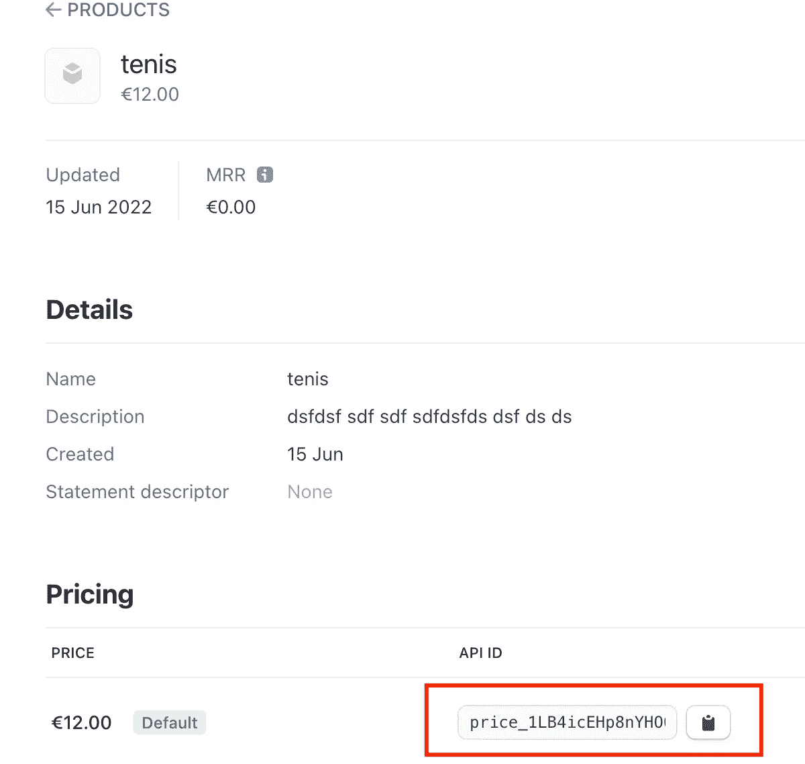
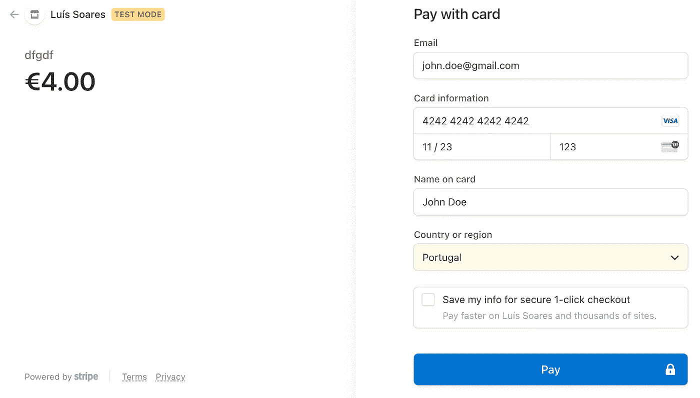

# 使用 Stripe (Kotlin/Javalin)接受付款

> 原文：<https://medium.com/codex/accepting-a-payment-using-stripe-kotlin-javalin-ea97035222c?source=collection_archive---------6----------------------->

## Stripe 是一种基于云的服务，支持向客户收取产品或服务费用。使用 Stripe API，您不会像管理信用卡那样管理敏感信息。让我们学习如何使用它。

# 1.设置

1.  [注册一个 Stripe 账户](https://dashboard.stripe.com/register)如果你还没有。
2.  [创建新的 Kotlin 项目。](https://lsoares.medium.com/kotlin-gradle-junit-starter-project-a113a2cc9cbb)

# 2.Web 处理程序

1.  将 Javalin (web 框架)和 Stripe client 添加到您的`build.gradle.kts`依赖关系中:

```
implementation(“com.stripe:stripe-java:20.+”)
implementation(“org.slf4j:slf4j-simple:1.+”)
implementation(“io.javalin:javalin:4.+”)
```

2.*我们需要设置 web 请求处理程序。*创建一个包含以下内容的`src/kotlin/Main.kt`:

请注意，您需要替换两个值:

*   `**STRIPE_API_KEY**`:确保你的[条纹仪表盘](https://dashboard.stripe.com/)处于“测试模式”(右上角)。前往“[开发者](https://dashboard.stripe.com/developers)”(右上)→“[API 密钥](https://dashboard.stripe.com/developers)”(左侧菜单)→“标准密钥”→“可发布密钥”(这是一个演示密钥)。注意，你应该用它来设置一个环境变量，而不是把它留在代码中，从而留在源代码控制中。
*   `**PRICE_ID**`:在[条纹仪表盘](https://dashboard.stripe.com/)中找到并点击[产品](https://dashboard.stripe.com/products?active=true)，然后创建一个新产品。确认产品创建，并在新创建的产品中，滚动到“定价”部分。在那里，您可以复制所需价格的“API ID”。



📝*您可以通过* `*Product.retrieve(PROD_ID)*` *获取产品详情(如标题、图片网址)。*

# 3.网页

我们需要用户将看到的 HTML 页面。在这个例子中，我们可以使用硬编码的 HTML。但是，让我们添加一个服务器端模板库，这样我们就可以显示从 Stripe API 获得的价格细节。增加 [jte](https://jte.gg/) 至`build.gradle.kts`:

```
implementation(“gg.jte:jte:1.+”)
```

我们需要一个结帐页面来表示购物车的结帐；它包含客户添加的所有产品。在我们的例子中，它包含单一产品。在实际情况下，它可能包含存储在会话中的产品。增加`src/main/jte/checkout.jte`，内容如下:

*我们需要一个成功的页面，代表支付成功时从条纹回调。*增加`src/main/jte/success.jte`，内容如下:

*取消页面处理用户取消支付。*增加`src/main/jte/cancel.jte`，内容如下:

# 4.测试付款

让我们在 localhost 中进行一次假支付:

1.  跑`Main.kt`，去`http://localhost:7000/checkout`。
2.  点击“结帐”按钮进入条纹支付页面。
3.  现在可以使用[的伪卡](https://stripe.com/docs/testing)T5(其余细节可以随意设置)。他的假卡号模拟了一次假的成功支付，这样你就可以测试整个流程。



# 了解更多信息

[](https://stripe.com/docs/payments/accept-a-payment?platform=web&ui=checkout) [## 接受付款

### 向您的网站添加一个结帐按钮，该按钮调用服务器端端点来创建结帐会话。结帐…

stripe.com](https://stripe.com/docs/payments/accept-a-payment?platform=web&ui=checkout) [](https://javalin.io/tutorials/jte) [## 在 Javalin - Javalin -一个轻量级 Java 和 Kotlin web 框架中呈现 jte 模板。创建…

### jte 是一个现代的、类型安全的模板引擎，它用尽可能少的额外语法将 HTML 和 Java 结合在一起。在这个…

javalin.io](https://javalin.io/tutorials/jte)