# 使用 Python 访问 1 密码—第 1 部分

> 原文：<https://medium.com/codex/access-1password-using-python-part-1-e5a9e8da07e6?source=collection_archive---------4----------------------->

**1 密码标志**

1 密码是什么？

密码管理器、数字金库、表单填充器和安全的数字钱包。

[了解更多详情。](https://1password.com/)

在这里，我们将使用 Python 从 1Password 中提取凭据。

**蟒蛇标志**

我们将此场景分为 4 个步骤:

1.  创建一个存储库。
2.  设置秘密自动化工作流程
3.  部署 1 密码连接服务器
4.  用于基本演示的 Python 脚本。

我们将讨论第一步。

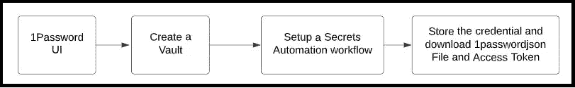

**创建保密自动化工作流环境的流程图**

## **创建保险库:**

转到主页，我们将看到 **"+ New Vault"** ，单击该按钮。它出现在下图的底部。

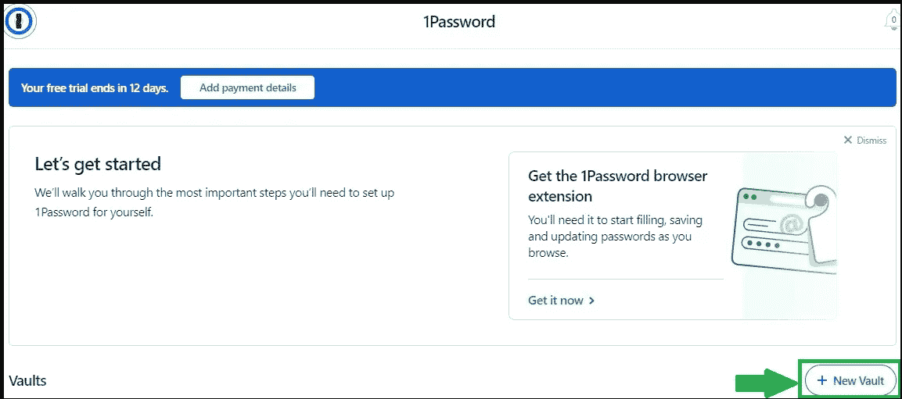

**1 密码主页**

点击后，我们只需给出保险库名称，然后点击**创建保险库。**创建保险库后，我们可以看到如下图所示的**保险库详情**。

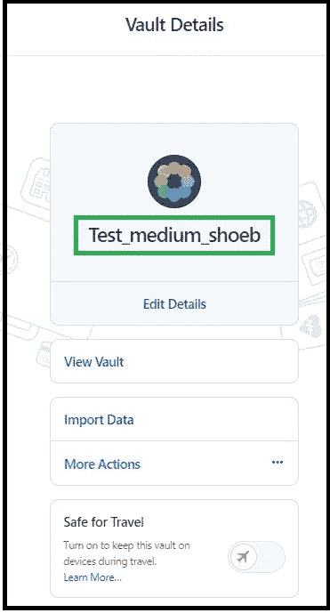

**保险库创建完成消息**

一旦你创建了**金库**，你需要 [**设置一个秘密自动化工作流程**](https://start.1password.com/integrations/connect) **。**您可以点击链接它会重定向到 [**设置一个保密自动化工作流程**](https://start.1password.com/integrations/connect) 页面。

或者，您可以访问 1 密码主页，然后单击主页右侧的集成，如下所示。

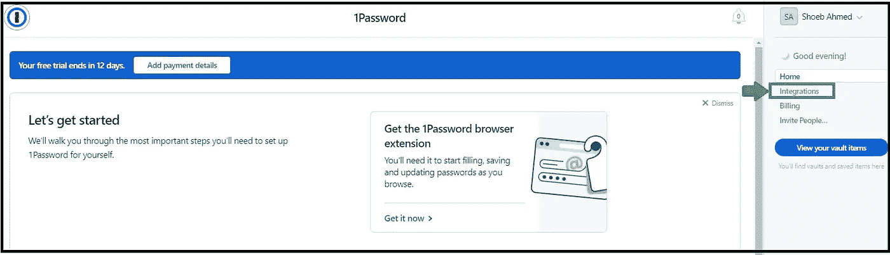

**首页**

通过单击集成，我们将转到集成目录页面，我们需要单击**“设置机密自动化”**。

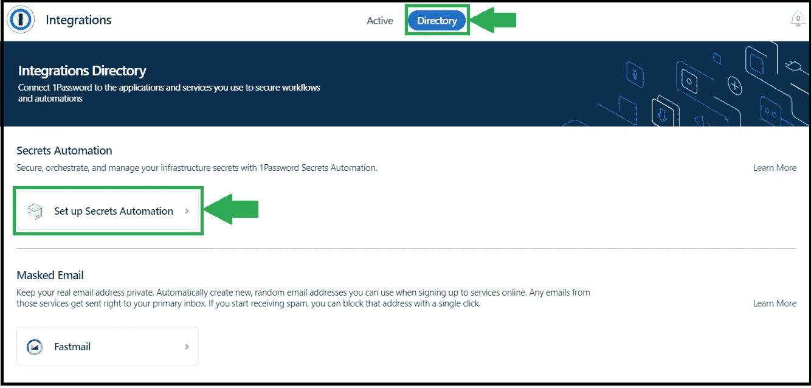

**集成目录**

点击**“设置秘密自动化”后，你**现在必须给**环境命名**和**选择金库。**我给环境起了个名字“测试 _ 介质 _ 应用”。

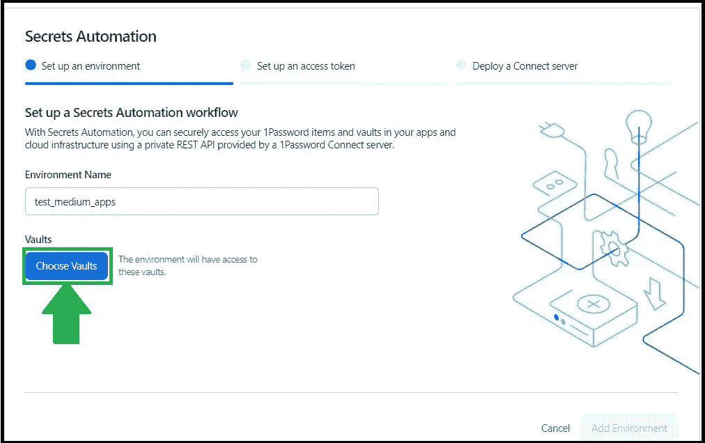

**环境的创建**

现在我们必须选择金库。我现在正在选择我创建的那些存储库。勾选复选框，然后单击“更新保管库”。

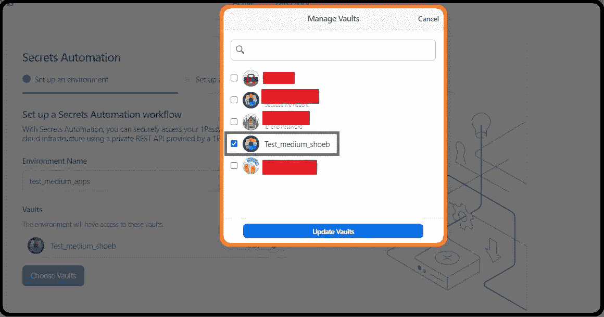

**金库的选择**

选择保险库后，点击**添加环境**

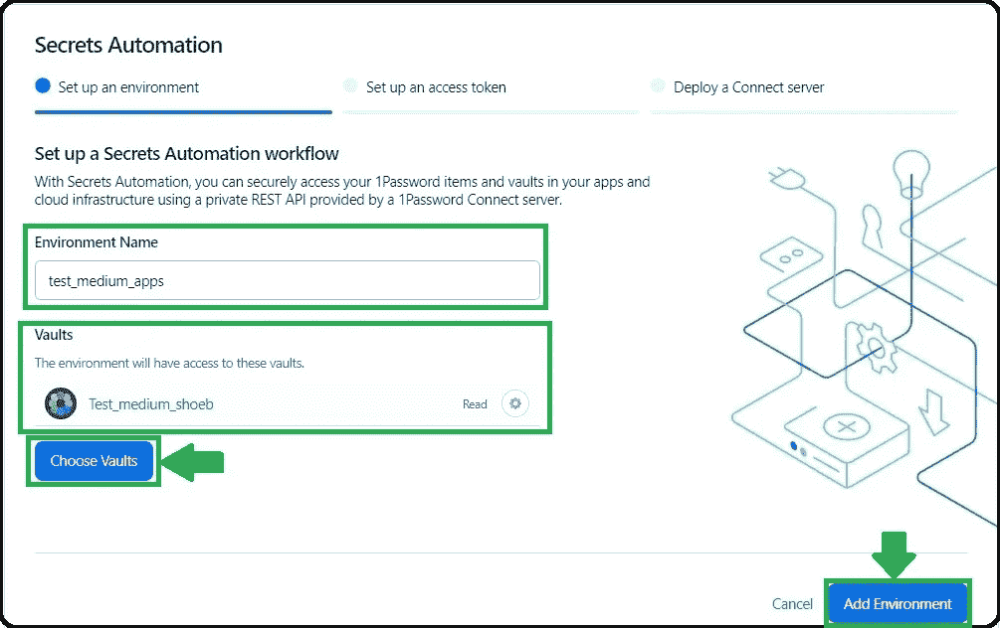

之后，我们需要给出您自己选择的令牌名称。

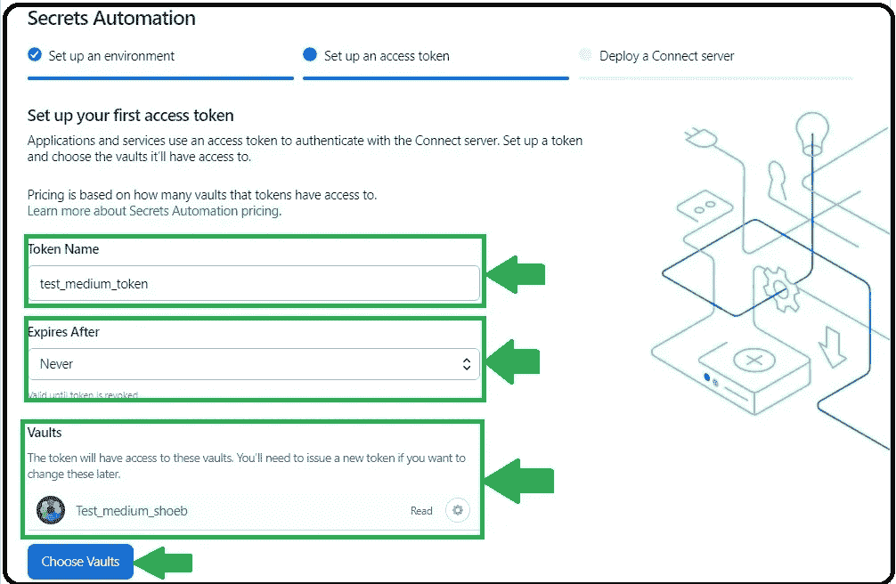

**访问令牌的创建**

输入访问令牌的所有详细信息后，单击“创建访问令牌”。生成令牌后，我们可以将其保存在任何存储区，也可以下载令牌。

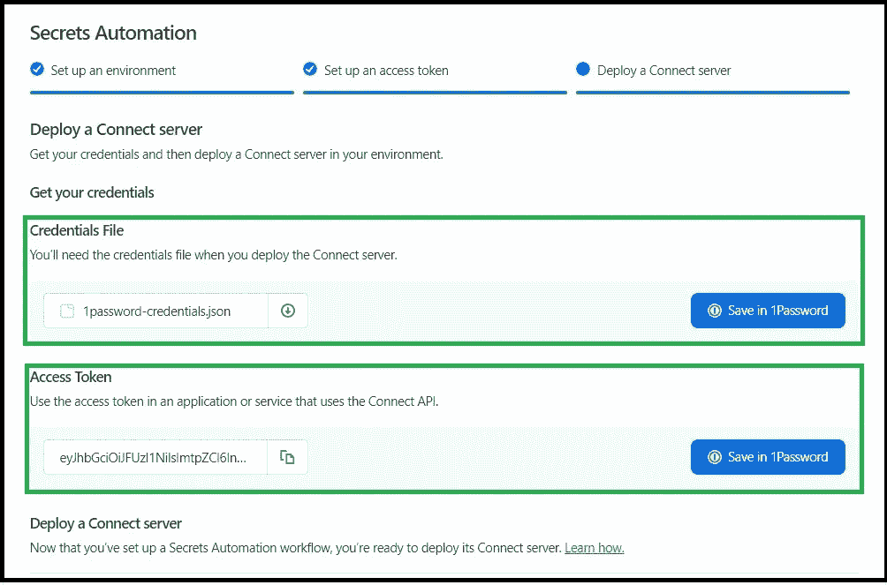

如何保存凭证文件和访问令牌，通过点击**“保存在 1 密码中”、**并点击下载凭证文件并将访问令牌保存在您的系统中**。之后，我们可以选择任何一个金库。一旦完成，它将显示你的**秘密自动化环境**的细节，如下所示。**

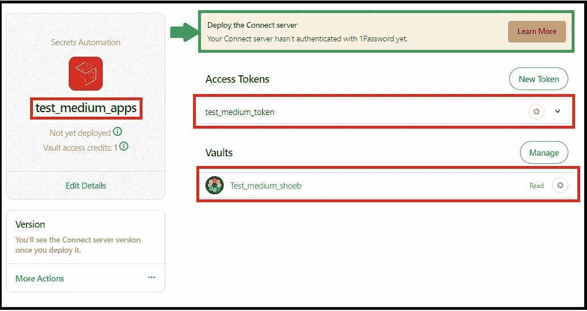

**环境细节**

在顶部，它显示“部署连接服务器”。这意味着我们需要建立一个连接环境。我将在第 2 部分演示。