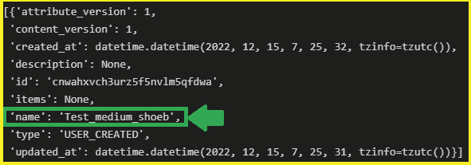
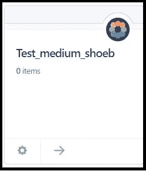
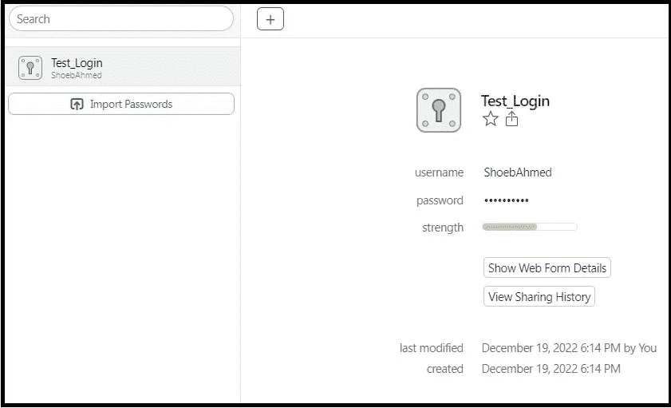
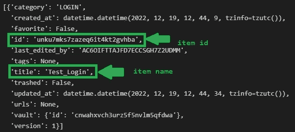
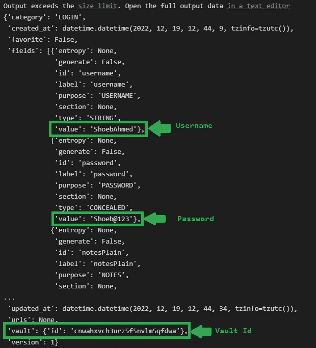
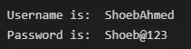

# 使用 Python 访问 1 密码—第 3 部分

> 原文：<https://medium.com/codex/access-1password-using-python-part-3-365fcf66670?source=collection_archive---------6----------------------->

当我们创建一个保险库时，Secret Automation 工作流环境和连接服务器。

现在，最后一步是编写 python 脚本，从 1 密码帐户中提取数据，即保险库的内容。


**1 密码标志**

我们将演示 1 密码 Python SDK 代码的部分代码。


**蟒蛇标志**

部署连接服务器后，您将开始编写 Python 脚本。

现在，我们将安装 1 密码 Python 包

```
pip install onepasswordconnectsdk
```

现在，我们编写一个脚本来提取我们的存储库列表。



**上面代码的输出:金库列表**

正如我们可以看到上述代码的输出，我们可以看到 Vault 的名称，它出现在我的 1 密码帐户中。



**1 密码账户上的金库**

因为我已经在 Vault 中创建了一个名为“测试登录”的项目



**我的金库**

我将通过书写提取所有项目。

```
Client.get_items(vault_id ='my_vault_id')
#Client.get_items(vault_id ='cnwahxvch3urz5f5nvlm5qfdwa')
```

您可以在上面代码的输出图“**中看到保险库 id:保险库列表**”，其中提到了字段 id。

我们将获得项目名称和项目 id，在项目 id 的帮助下，我将提取用户名和密码。



**项目清单**

```
#Command to extract the Credential from item -> Test_Login
Client.get_item("{item_id}", "{vault_id}")
#credentials = Client.get_item("unku7mks7zazeq6it4kt2gvhba", "cnwahxvch3urz5f5nvlm5qfdwa")
```

运行上述代码后，我们可以看到下面给出的输出:



**项目结果的输出。**

现在，我们将提取用户名和密码

```
#USERNAME
username = credentials.fields[0].value
#PASSWORD
password = credentials.fields[1].value
print("Username is: ", username)
print("Password is: ", password)
```



**凭证输出**